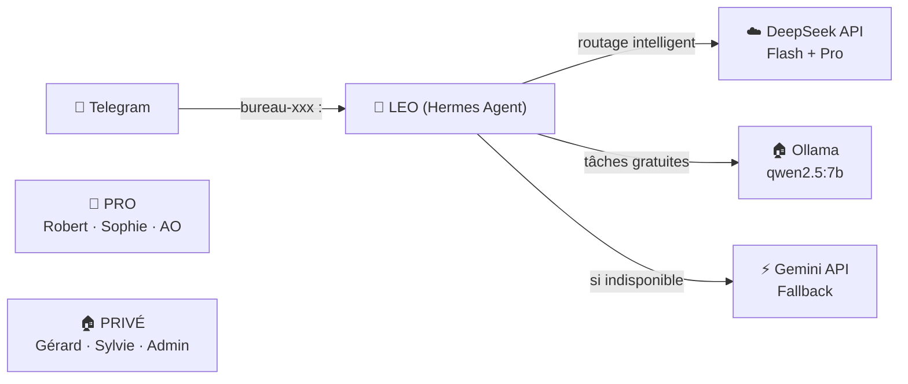

# 🏛️ BAVI LEO — Présentation

**BAVI LEO** — **B**ureau **A**gentique **V**irtuel **I**ntégré pour **L**EO — est un système de bureaux IA spécialisés, propulsé par [Hermes Agent](https://hermes-agent.nousresearch.com).

Chaque bureau est un expert autonome qui répond sur Telegram, utilise les modèles adaptés et produit sa documentation dans son propre wiki.

---

## 🎯 Vision

BAVI LEO est né du constat que les IA généralistes sont inefficaces sur des domaines spécialisés. La solution : **un bureau par domaine**, chacun avec ses propres règles, skills et modèles.

**Principes fondateurs :**
- **Spécialisation** — chaque bureau ne fait qu'un métier
- **PRO vs PRIVÉ** — distinction claire, isolation des données Solidaris
- **1 à N bureaux** — extensible : nouveau besoin = nouveau bureau
- **Wiki = base de connaissance** — documentation vivante évoluant avec chaque projet
- **Routage adaptatif** — le bon modèle pour chaque tâche (Flash, Pro, Ollama, Gemini)
- **LEO est l'orchestrateur** — tu parles à LEO, LEO aiguille vers le bureau compétent

---

## 🏢 Bureaux

### PRO — Solidaris

| Bureau | Domaine | Wiki |
|--------|---------|:----:|
| 🏛️ **Robert** | Conseil IT stratégique AO | [pro-wiki](https://christophedanhier-hash.github.io/pro-wiki/) |
| 💰 **Sophie** | Pilotage financier IT | [pro-wiki](https://christophedanhier-hash.github.io/pro-wiki/) |
| 🛡️ **Assurance Obligatoire** | Expertise AO | [pro-wiki](https://christophedanhier-hash.github.io/pro-wiki/) |

### PRIVÉ — Personnel

| Bureau | Domaine | Wiki |
|--------|---------|:----:|
| 📝 **Gérard** | Documentation télescope T600 | [oca-wiki](https://christophedanhier-hash.github.io/oca-wiki/) |
| 🧭 **Sylvie** | Roadbooks camping-car | [voyages-wiki](https://christophedanhier-hash.github.io/voyages-wiki/) |
| ⚙️ **LEO Admin** | Infrastructure Hermes, monitoring | [general-wiki](https://christophedanhier-hash.github.io/general-wiki/) |

---

## 🏗️ Architecture

---

## Routage intelligent

| Type de demande | Modèle | Usage |
|:---------------:|:-------|:------|
| Quotidien | **DeepSeek Flash** | Tâches simples, conversation |
| Analyse complexe | **DeepSeek Pro** | Installations, décisions techniques |
| Réflexion, tests | **Ollama (qwen2.5:7b)** | Tâches gratuites, prototypage |
| Fallback | **Gemini** | Si DeepSeek indisponible |

---

## Comment ça marche

1. Tu m'appelles sur Telegram avec une demande
2. Je détecte le bureau cible
3. Je charge le skill Hermes correspondant
4. Le skill définit mon rôle, mes sous-experts et mon workflow
5. Je produis le livrable
6. Le résultat est archivé dans le wiki

---

*Propulsé par Hermes Agent · 🦁*
