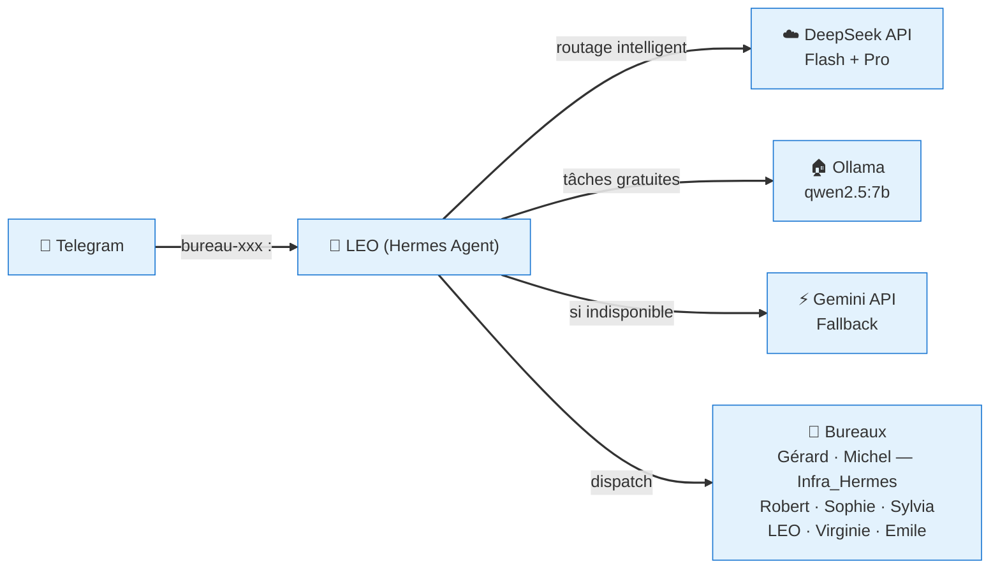
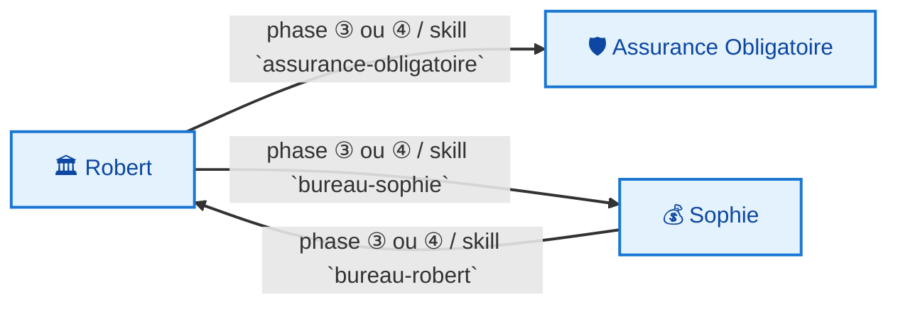
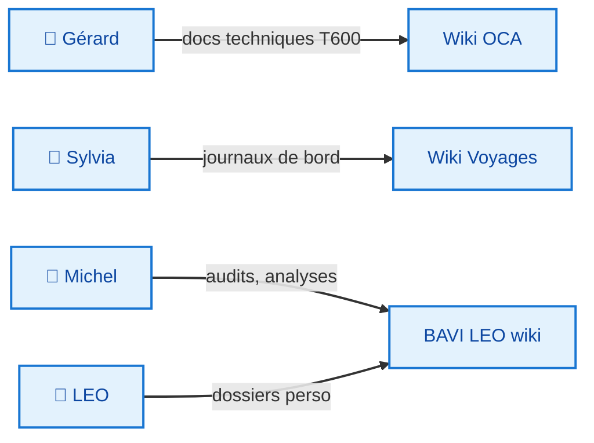

# 🏗️ BAVI LEO — Bureaux Agentiques Virtuels

**Propulsé par [Hermes Agent](https://hermes-agent.nousresearch.com) · 🦁 LEO**

> 23 crons Hermes automatisés · 5 crons hôte · 8 bureaux spécialisés · 1 dashboard central (4 onglets) · 4 bots Telegram · 🤖 Bureau LEO créé

---

## 🎯 Vision

BAVI LEO (Bureaux Agentiques Virtuels) est né du constat que les IA généralistes sont inefficaces sur des domaines spécialisés. La solution : **un bureau par domaine**, chacun avec ses propres règles, skills et modèles.

### Principes fondateurs

- **Spécialisation** — chaque bureau ne fait qu'un métier
- **Interopérabilité** — les bureaux collaborent via skills Hermes
- **Documentation vivante** — chaque bureau produit sa propre doc
- **Routage adaptatif** — le bon modèle pour chaque tâche (Flash, Pro, Ollama, Gemini)

---

## 🏢 Les Bureaux

| Bureau | Domaine | Catégorie | Statut |
|--------|---------|-----------|--------|
| 🏛️ **Robert** | Conseil IT stratégique Solidaris | PRO | 🏗️ Reconstruction |
| 💰 **Sophie** | Pilotage financier IT (TCO/ROI, business case) | PRO | 🏗️ Reconstruction |
| 🛡️ **Assurance Obligatoire** | Expertise AO (INAMI, BCSS, eHealth, MyCareNet) | PRO | 🏗️ Reconstruction |
| 📝 **Gérard** | Documentation télescope T600 | PRIVÉ | ✅ [Wiki OCA](https://christophedanhier-hash.github.io/wiki-oca/t600/) |
| 🧭 **Sylvia** | Agence de voyage complète — tous modes de transport | PRIVÉ | ✅ [Voyages](https://christophedanhier-hash.github.io/voyages-wiki/) |
| 🔧 **Michel — Infra_Hermes** | Infrastructure Hermes, code, système — **Michel** | PRIVÉ | ✅ Actif |
| 🩺 **Virginie** | Orchestration médicale — panel de médecins pour diagnostic | PRIVÉ | 🆕 Nouveau |
| 🎓 **Emile** | Assistant pédagogique — mémoire sciences de l'éducation | PRIVÉ | 🆕 Nouveau |
| 🤖 **LEO** | Dossiers & analyses personnelles | PRIVÉ | ✅ Actif |

---

## 🏗️ Architecture

### Architecture générale



### Routage intelligent

| Type de demande | Modèle | Usage |
|:---------------:|:-------|:------|
| Quotidien | **DeepSeek Flash** | Tâches simples, conversation |
| Analyse complexe | **DeepSeek Pro** | Installations, décisions techniques |
| Réflexion, tests | **Ollama (qwen2.5:7b)** | Tâches gratuites, prototypage |
| Fallback | **Gemini** | Si DeepSeek indisponible |

### Architecture technique

- **Hermes Agent** dans un conteneur Docker
- **Réseau** : `network_mode: host`
- **Tailscale** : 100.92.102.28
- **DeepSeek** : API cloud (Flash + Pro)
- **Ollama** : qwen2.5:7b sur `http://100.92.102.28:11434/v1`
- **Gemini** : fallback API
- **Stockage** : `/opt/data`
- **Domaine** : `*.github.io` (GitHub Pages)

---

## 📋 Workflow standardisé — 7 phases

Tous les bureaux suivent le même squelette :

```
① CADRAGE → ② DISPATCH → ③ PRODUCTION → ④ CROISEMENT → ⑤ SYNTHÈSE → ⑥ LIVRABLE → ⑦ ARCHIVAGE
```

### Variante par type de livrable

Le workflow 7 phases s'adapte au format du livrable. Le type est déterminé en phase ① (Cadrage).

| Format | Phases | Description |
|:-------|:------:|:------------|
| **📄 Analyse** | ①→③→⑤→⑥→⑦ | Pas de dispatch, pas de croisement |
| **📋 Rapport** | ①→②→③→④→⑤→⑥→⑦ | Complet, 7 phases |
| **📝 Note/Mémo** | ①→③→⑥ | Court, 3 phases |
| **📁 Dossier** | ①→②→③→④→⑤→⑥→⑦ | Complet + archivage renforcé |
| **🧠 Mémoire** | ①→②→③→④↺→⑤→⑥→⑦ | Croisement itératif |
| **📊 Dashboard** | Collecte→Traitement→Publication | Cron-driven, hors 7 phases |
| **🗺️ Roadbook** | ①→③→④→⑤→⑥→⑦ | Experts dédiés, pas de dispatch |

### Variantes par bureau

| Bureau | Particularité |
|--------|---------------|
| 🏛️ Robert | Dispatch parmi 7 experts (conditionnel) |
| 💰 Sophie | Production parallélisable Marché + Risques |
| 🛡️ AO | Workflow raccourci ①→③→⑥ (expert unique transverse) |
| 📝 Gérard | Croisement obligatoire Hardware ↔ Firmware |
| 🧭 Sylvia | Cartographie OSM en parallèle de l'itinéraire |
| 🔧 **Michel — Infra_Hermes** | Michel — Infrastructure Hermes, code, DeepSeek Pro |
| 🩺 **Virginie** | Orchestration médicale — dispatch spécialistes + croisement des diagnostics |
| 🎓 **Emile** | Assistant pédagogique — mémoire sciences éducation |
| 🤖 LEO | Cron-driven (collecte → analyse → livrable) |

---

## 🔗 Flux Inter-Bureaux

### 🧠 Analyses Agent Pro

Toutes les analyses produites par les bureaux sont indexées dans le **[Portail Agent Pro](wiki/agent-pro/index.md)** — accessible depuis le menu **🧠 Agent Pro**.

| Bureau | Rôle | Accès analyses |
|:-------|:-----|:---------------|
| 🩺 Virginie | Santé / Diagnostic médical | [Voir les analyses](wiki/agent-pro/bureau-virginie/index.md) |
| 🎓 Emile | Mémoire / Éducation | [Voir les analyses](wiki/agent-pro/bureau-emile/index.md) |
| 🤖 LEO | Dossiers & analyses LEO | [Voir les analyses](wiki/agent-pro/bureau-leo/index.md) |
| 📝 Gérard | Documentation T600 | [Voir les analyses](wiki/agent-pro/bureau-gerard/index.md) |
| 🏛️ Robert | Conseil Stratégique IT | [Voir les analyses](wiki/agent-pro/bureau-robert/index.md) |
| 💰 Sophie | Pilotage Économique & Financier | [Voir les analyses](wiki/agent-pro/bureau-sophie/index.md) |
| 🔧 Michel — Infra_Hermes | Infrastructure Hermes | [Voir les analyses](wiki/agent-pro/bureau-michel/index.md) |
| 🧭 Sylvia | Voyages | [Voir les analyses](wiki/agent-pro/bureau-sylvia/index.md) |

### Appels formels PRO



### Flux de livraison



### Règle de format des livrables

| Contexte | Format | Bureaux concernés |
|----------|--------|:-----------------:|
| 💻 Travail interne | `.md` — natif BAVI | Tous |
| 📄 Partage direction | **Google Docs** | 🏛️ Robert, 🛡️ AO |
| 📊 Modèle financier | **Google Sheets** | 💰 Sophie |
| 📽️ Présentation comité | **Google Slides** | 🏛️ Robert |
| 🏠 Projets personnels | `.md` — wiki | 📝 Gérard, 🧭 Sylvia, 🤖 LEO |

---

## 📚 Catalogue des Skills

### Skills PRO — Solidaris

| Skill | Bureau | Expertises | Vers. |
|-------|--------|-----------|:-----:|
| `bureau-robert` | 🏛️ Robert | Conseil IT stratégique, 7 experts dispatch | 2.0 |
| `bureau-sophie` | 💰 Sophie | Pilotage financier, TCO/ROI, 3 scenarii | 2.0 |
| `assurance-obligatoire` | 🛡️ AO | Lentille métier AO, expert transverse | 2.0 |
| `bureau-michel` | 🔧 Michel — Infra_Hermes | Michel — Infrastructure, code, système, DeepSeek Pro | ✅ Actif |

### Skills PRIVÉ — Personnel

| Skill | Bureau | Expertises | Vers. |
|-------|--------|-----------|:-----:|
| `bureau-gerard` | 📝 Gérard | Documentation T600, 6 agents + 2 supports | 2.0 |
| `bureau-sylvia` | 🧭 Sylvia | Voyages camping-car, 3 experts, carto OSM | 2.0 |
| `bureau-leo` | 🤖 LEO | Dossiers & analyses personnelles | ✅ Actif |
| `bureau-virginie` | 🩺 Virginie | Orchestration médicale, panel de médecins | 🆕 Nouveau |
| `bureau-emile` | 🎓 Emile | Assistant pédagogique, mémoire sciences éducation | 🆕 Nouveau |

### Infrastructure — Monitoring & Outils

| Skill | Rôle |
|-------|------|
| `budget-tracking` | Suivi budget DeepSeek |
| `machine-metrics` | Collecte CPU/RAM/Disk 3 machines |
| `dashboard-kpi` | Dashboard KPI Hermes |
| `system-management` | Gestion machines Tailscale |
| `leo-email-assistant` | Envoi emails Gmail OAuth2 |
| `deepseek-pro` | Analyses complexes DeepSeek Pro |

---

## 📊 En chiffres

| Métrique | Valeur |
|----------|-------:|
| **Bureaux** | 9 (3 PRO + 6 PRIVÉ) |
| **Dashboards temps réel** | 7 |
| **Crons Hermes** | 23 ✅ tous verts |
| **Crons hôte (crontab)** | 5 |
| **Sessions Hermes** | 90+ |
| **Messages échangés** | 4 651+ |
| **Skills installés** | 126 |
| **Modèles LLM** | 4 (DeepSeek V4 Flash, DeepSeek V4 Pro, Ollama qwen2.5:7b, Gemini 3.5 Flash) |
| **Coût DeepSeek** | Suivi dashboard (budget fr) |

---

## 💳 Tarification BAVI LEO

| Qui | Abonnement | Dossiers |
|:----|:----------:|:---------|
| 🧑‍✈️ **Christophe** | **0 €** — pas d'abonnement | Tokens IN/OUT réels uniquement |
| 👥 **Amis** (Pascal…) | **12 €/an** par personne | Tokens IN/OUT + **2,50 €** forfait par dossier |

> L'abonnement démarre le **1er du mois** du premier dossier. Chat illimité inclus.

---

## 🔍 Forces du système

| Aspect | Évaluation |
|--------|:----------:|
| Vitesse de réponse Telegram | ⚡ < 2s (Flash) |
| Qualité bureaux spécialisés | ✅ Dispatch conditionnel (−60% tokens) |
| Routage intelligent | ✅ Bon modèle pour chaque tâche |
| Documentation vivante | ✅ Wikis auto-déployés GH Pages |
| Distribution skills par profil | ✅ Chaque bot a ses compétences (Michel → infra, Sylvia → voyages) |
| Gestion des coûts API | ✅ Budget dashboard suivi |
| Fiabilité crons | ✅ 21 crons Hermes, tous verts, no_agent |
| Miroir Drive ↔ GitHub | ✅ Sync bidirectionnelle 18h |
| 📋 Suivi implémentations | ✅ [leo-tracker](https://github.com/christophedanhier-hash/leo-tracker) |

---

> 🕐 **Dernière mise en ligne : 15/07/2026 04:00**  
> *Document généré par LEO · 🦁*
