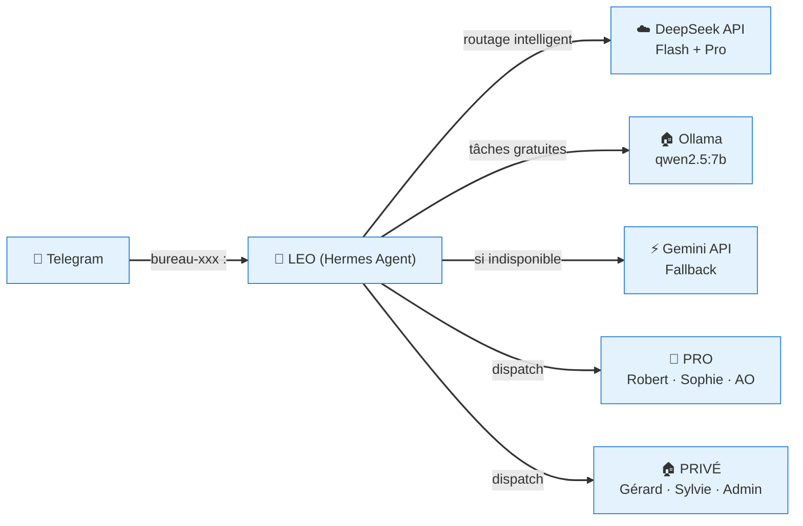
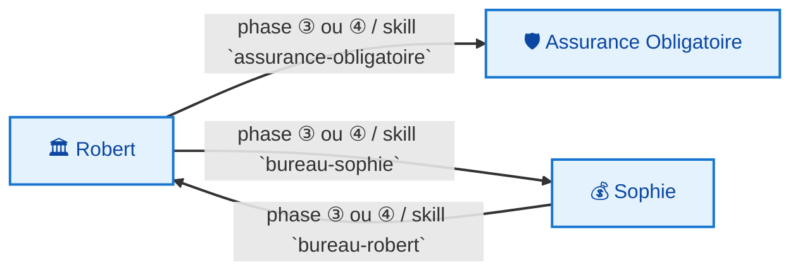
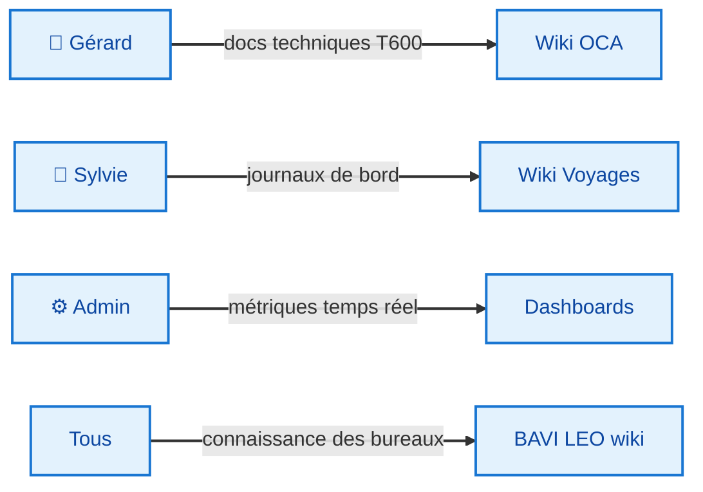

# 📖 Document Fondateur — BAVI LEO

**Version :** 1.0 (fusionné 13/06/2026)

---

## 1. 🎯 Vision

### Pourquoi BAVI LEO ?

BAVI LEO (Bureaux Agentiques Virtuels) est né du constat que les IA généralistes sont inefficaces sur des domaines spécialisés. La solution : **un bureau par domaine**, chacun avec ses propres règles, skills et modèles.

### Principes fondateurs

- **Spécialisation** — chaque bureau ne fait qu'un métier
- **Interopérabilité** — les bureaux peuvent collaborer via skills
- **Documentation vivante** — chaque bureau produit sa propre doc dans son wiki
- **Routage adaptatif** — le bon modèle pour chaque tâche (Flash, Pro, Ollama, Gemini)

### Les bureaux

| Bureau | Domaine | Wiki |
|--------|---------|:----:|
| 🏛️ **Robert** | Conseil IT stratégique Solidaris | [→](https://christophedanhier-hash.github.io/pro-wiki/) |
| 💰 **Sophie** | Pilotage financier IT | [→](https://christophedanhier-hash.github.io/pro-wiki/) |
| 🛡️ **Assurance Obligatoire** | Expertise AO | [→](https://christophedanhier-hash.github.io/pro-wiki/) |
| 📝 **Gérard** | Documentation télescope T600 | [→](https://christophedanhier-hash.github.io/wiki-oca/) |
| 🧭 **Sylvie** | Roadbooks camping-car | [→](https://christophedanhier-hash.github.io/voyages-wiki/) |
| ⚙️ **LEO Admin** | Infrastructure, monitoring | [→](https://christophedanhier-hash.github.io/general-wiki/) |

---

## 2. 🏗️ Architecture

### Architecture générale



### Routage intelligent

| Type de demande | Modèle | Usage |
|:---------------:|:-------|:------|
| Quotidien | **DeepSeek Flash** | Tâches simples, conversation |
| Analyse complexe | **DeepSeek Pro** | Installations, décisions techniques |
| Réflexion, tests | **Ollama (qwen2.5:7b)** | Tâches gratuites, prototypage |
| Fallback | **Gemini** | Si DeepSeek indisponible |

### Architecture technique

- **Hermes Agent** v0.16.0 dans un conteneur Docker
- **Réseau** : `network_mode: host` — partage pile réseau de l'hôte
- **Tailscale** : 100.92.102.28
- **Ollama** : qwen2.5:7b sur `http://100.92.102.28:11434/v1`
- **DeepSeek** : API cloud (Flash + Pro)
- **Gemini** : fallback API
- **Stockage** : `/opt/data` — 63G/457G utilisés (15%)
- **GitHub** : 5 repositories wikis + 4 dashboards
- **Domaine** : `*.github.io` (GitHub Pages)

### Flux inter-bureaux PRO



### Flux de livraison



### Workflow standardisé — 7 phases

Tous les bureaux suivent le même squelette :

```
① CADRAGE → ② DISPATCH → ③ PRODUCTION → ④ CROISEMENT → ⑤ SYNTHÈSE → ⑥ LIVRABLE → ⑦ ARCHIVAGE
```

---

## 3. 🔍 Audit & Analyse

### Forces du système

| Aspect | Évaluation |
|--------|:----------:|
| Vitesse de réponse Telegram | ⚡ < 2s (Flash) |
| Qualité bureaux spécialisés | ✅ Différence Robert vs Sophie claire |
| Routage intelligent | ✅ Bon modèle pour chaque tâche |
| Documentation vivante | ✅ Wikis auto-déployés |
| Gestion des coûts API | ✅ Budget v6 français suivi |
| Fiabilité crons | ✅ 17 crons, tous verts |

### Opportunités d'optimisation

*(Cette section a été retirée — contenu obsolète.)*

---

## 4. 📚 Skills

### Catalogue des skills par bureau

| Bureau | Skills |
|--------|--------|
| 🏛️ Robert | `bureau-robert` |
| 💰 Sophie | `bureau-sophie` |
| 🛡️ Assurance Obligatoire | `assurance-obligatoire` |
| 📝 Gérard | `bureau-gerard` |
| 🧭 Sylvie | `gif-search`, `maps`, `songwriting-and-ai-music` |
| ⚙️ LEO Admin | `budget-tracking`, `dashboard-kpi`, `machine-metrics`, `routage-llm` |
| 🧠 Agent Pro | `deepseek-pro` |

---

*Document généré par LEO · 🦁*
