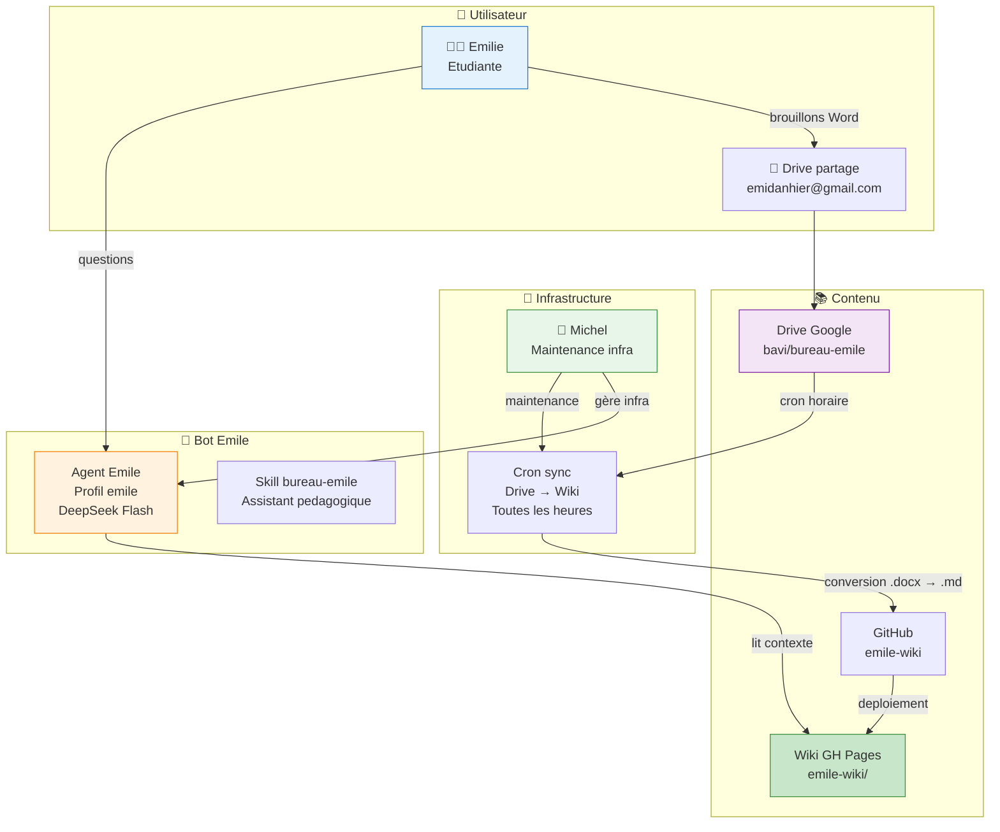
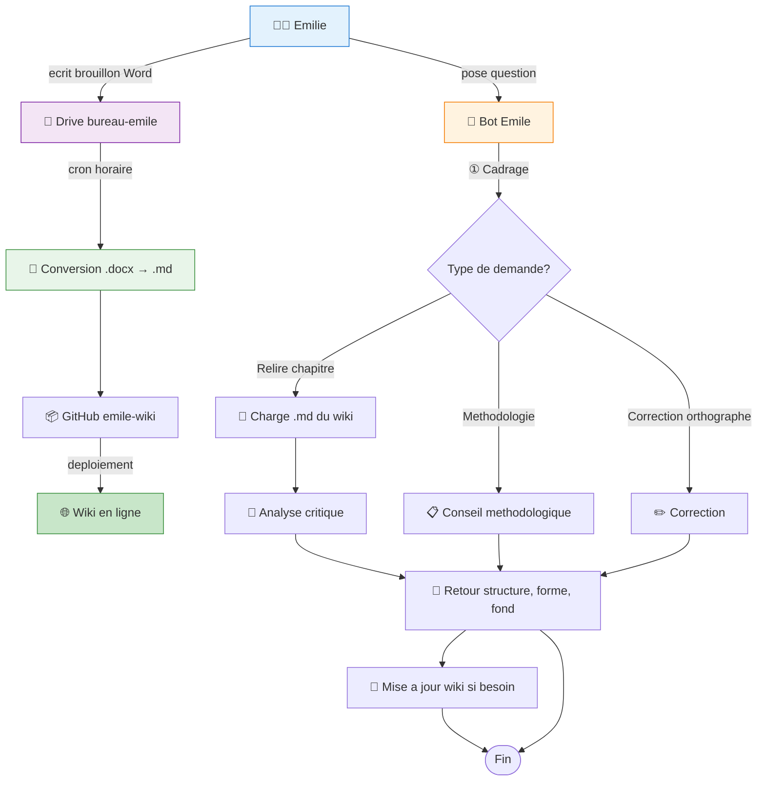
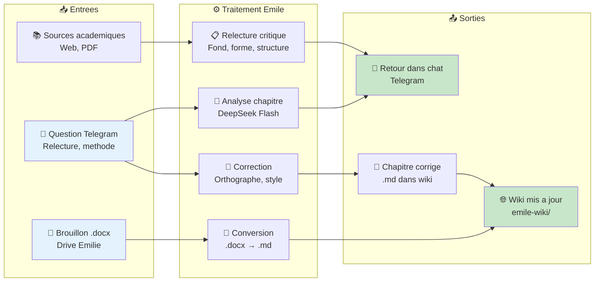
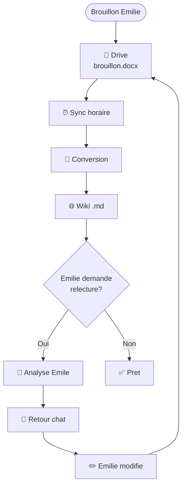
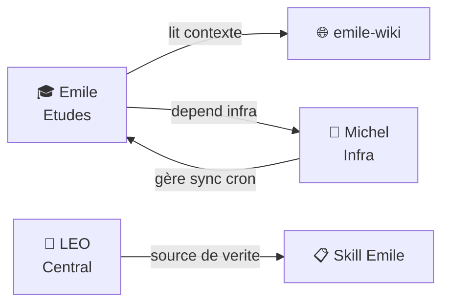

# 🎓 Analyse Business & Fonctionnelle — Bot Emile (Assistant Pédagogique)

> **Bureau :** 🏛️ Robert — Conseil Stratégique IT | **Date :** 27/06/2026
> **Sujet :** Analyse du bot Émile, assistant pédagogique pour mémoire de fin d'études

---

## 1. 🎯 Présentation

### 1.1 Contexte

**Émile** est un assistant pédagogique dédié à l'accompagnement d'Émilie (emidanhier@gmail.com) pour son **mémoire de fin d'études en sciences de l'éducation**. Accessible via un profil Hermes dédié (`emile`), il combine un wiki MkDocs, un Drive partagé et un bot Telegram pour offrir un environnement de travail complet.

### 1.2 Objectifs

| Objectif | Description |
|:---------|:------------|
| 📚 **Assister** la rédaction du mémoire de fin d'études |
| 📝 **Relire** et améliorer les chapitres (relecture critique) |
| 🔗 **Syncer** les brouillons Drive → Wiki (cron horaire) |
| 📖 **Publier** le wiki MkDocs sur GitHub Pages |
| 💬 **Répondre** aux questions sur le contenu, la méthodologie |

### 1.3 Public cible

| Utilisateur | Rôle | Accès |
|:------------|:-----|:------|
| 🧑‍🎓 **Émilie** (étudiante) | Rédactrice du mémoire | Bot Telegram + Drive partagé |
| 🧑‍✈️ **Christophe** | Superviseur, propriétaire | Bot Telegram + Drive owner |
| 🔧 **Michel** | Infrastructure (cron, sync) | Skill Emile + scripts |

### 1.4 Chiffres clés

| Indicateur | Valeur |
|:-----------|:------:|
| Modèle | DeepSeek V4 Flash |
| Fallback | Gemini 3.5 |
| Wiki | https://christophedanhier-hash.github.io/emile-wiki/ |
| Drive partagé | bavi/bureau-emile |
| Sync cron | Horaire (Drive → Wiki) |
| Utilisateur actif | 1 (Émilie) |
| Référent technique | Michel (Infra_Hermes) |

---

## 2. 🏗️ Architecture technique

### 2.1 Diagramme d'architecture

### 2.2 Stack technique

| Composant | Technologie | Rôle |
|:----------|:------------|:-----|
| **Agent** | Hermes Agent (profil `emile`) | Exécution du bot |
| **Modèle** | DeepSeek V4 Flash ($0,15/$0,60 M) | Inférence |
| **Fallback** | Gemini 3.5 | Si DeepSeek indisponible |
| **Transport** | Telegram API | Interface Émilie |
| **Wiki** | GitHub Pages (`emile-wiki`) | Publication du mémoire |
| **Stockage** | Google Drive (`bavi/bureau-emile`) | Brouillons, sources |
| **Sync** | Hermes cron (horaire) | Conversion Drive → Wiki |
| **Infra** | Michel (profil leo-copilot) | Maintenance, déploiement |

---

## 3. 🔄 Flux fonctionnels

### 3.1 Processus de travail — BPMN

### 3.2 Flux de données

### 3.3 Cycle de vie d'un chapitre

---

## 4. 💳 Modèle économique

### 4.1 Coûts de fonctionnement

| Poste | Coût | Fréquence |
|:------|:----:|:---------|
| **DeepSeek Flash** (inférence) | ~0,02 €/session | Hebdomadaire |
| **Gemini 3.5** (fallback) | **0 €** | Rare |
| **GitHub Pages** (wiki) | **0 €** | Continue |
| **Drive** (stockage) | **0 €** | Continue |
| **Sync cron** (conversion) | **0 €** | Horaire |
| **Total mensuel** | **~0,10 €** | |

### 4.2 Facturation

| Service | Tarif | Payé par |
|:--------|:-----:|:---------|
| Accès bot + wiki | **0 €** (accompagnement) | Émilie |
| Relecture chapitre | Inclus | Émilie |
| Infrastructure (sync, cron, hébergement) | **0 €** | Christophe (infra) |

> Le bot Emile est un service gratuit dans l'écosystème BAVI — l'infrastructure est mutualisée avec les autres bots.

---

## 5. 🚫 Périmètre fonctionnel

### 5.1 Ce que Emile fait

| Fonction | Statut | Détail |
|:---------|:------:|:-------|
| Relecture critique chapitres | ✅ Actif | Fond, forme, structure |
| Correction orthographe/style | ✅ Actif | Grammaire, syntaxe |
| Conseil méthodologique | ✅ Actif | Méthodologie mémoire |
| Sync Drive → Wiki | ✅ Actif | Cron horaire |
| Wiki à jour | ✅ Actif | GitHub Pages |

### 5.2 Ce que Emile ne fait pas

| Fonction | Raison | Qui le fait |
|:---------|:-------|:------------|
| Roadbooks voyage | Hors scope | 🧭 Sylvia |
| Analyse infra | Hors scope | 🔧 Michel |
| Conseil IT stratégique | Hors scope | 🏛️ Robert |
| Envoi emails | Hors scope | 🤖 LEO |

---

## 6. 📊 Indicateurs clés

| KPI | Valeur | Objectif |
|:----|:------:|:--------:|
| Chapitres relus | 0 | 5+ |
| Sync Drive → Wiki OK | ✅ Actif | 100 % |
| Temps de réponse | <5s | <10s |
| Uptime bot | ✅ Actif | >99 % |
| Wiki déployé | ✅ emile-wiki/ | Accessible |

---

## 7. 🔗 Relations avec les autres bots

---

## 8. 📈 Évolutions possibles

| Évolution | Impact | Complexité |
|:----------|:------:|:----------:|
| 🤖 Relecture automatique à chaque sync | Fort | Moyenne |
| 📊 Suivi d'avancement (chapitres relus) | Moyen | Faible |
| 🔍 Détection de plagiat (API externe) | Moyen | Élevée |
| 📝 Génération de bibliographie automatique | Moyen | Faible |
| 🗓️ Planning de rédaction | Faible | Faible |

---

## Versions

| Version | Date | Auteur | Description |
|:--------|:-----|:-------|:------------|
| v1 | 27/06/2026 | LEO + Robert | Version initiale — analyse business bot Emile |

---

*Analyse produite par 🏛️ Bureau Robert — BAVI LEO*

> 🤖 Dernier audit : 22 July 2026 à 07:40 (UTC+2)

