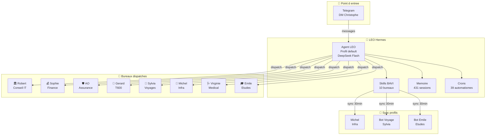
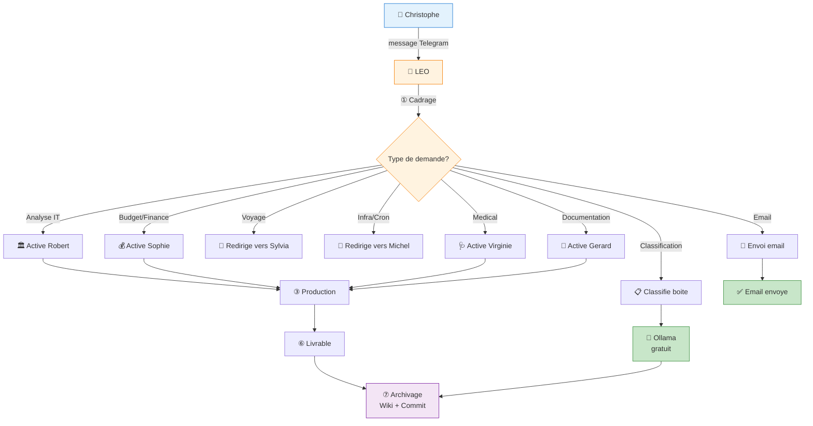
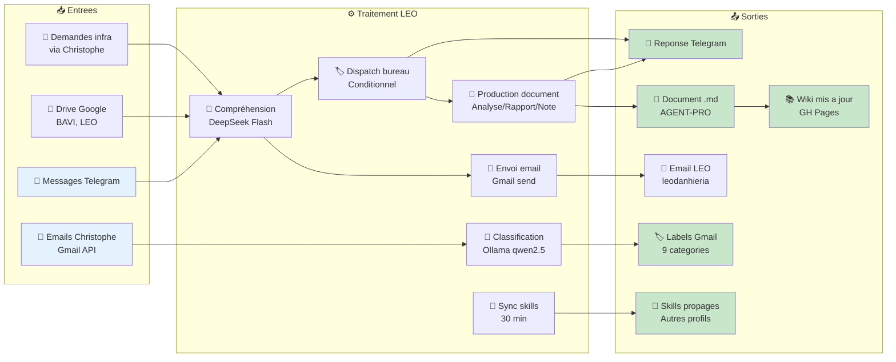
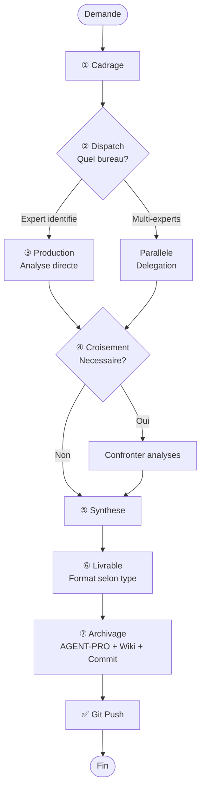
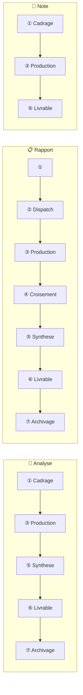
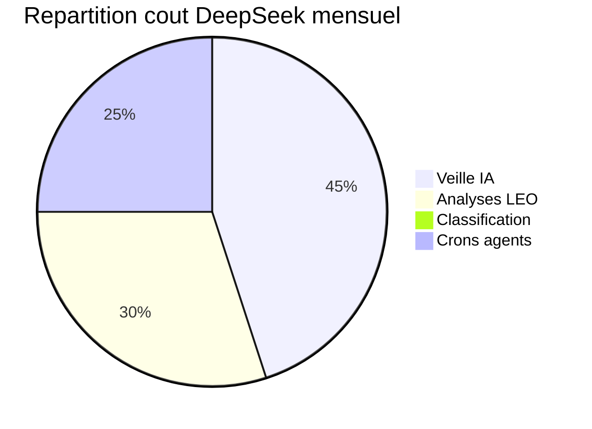
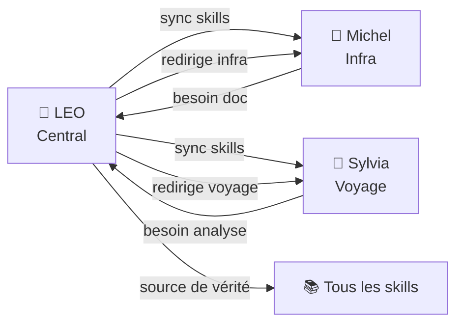

# 🤖 Analyse Business & Fonctionnelle — LEO (Bureau Central)

> **Bureau :** 🏛️ Robert — Conseil Stratégique IT | **Date :** 27/06/2026
> **Sujet :** Analyse du bot LEO Hermes, hub central BAVI, gouvernance des bureaux

---

## 1. 🎯 Présentation

### 1.1 Contexte

**LEO** est l'ensemble des profils agentiques centraux de l'écosystème BAVI (Bureaux Agentiques Virtuels). Il est le point d'entrée unique de **Christophe** pour tous les sujets : documentation, analyses, emails, classification, et gouvernance des bureaux.

Contrairement aux autres bots (Sylvia pour les voyages, Michel pour l'infra, Emile pour les études), LEO est **polyvalent** et **orchestrateur** — il ne fait pas un métier, il les coordonne tous.

### 1.2 Objectifs

| Objectif | Description |
|:---------|:------------|
| 🧠 **Orchestrer** les 10 bureaux BAVI (dispatch conditionnel) |
| 📝 **Produire** des analyses, rapports, notes et dossiers |
| 📧 **Gérer** les emails (envoi LEO, lecture Christophe) |
| 📋 **Classifier** les 3240 emails de la boîte Christophe (Ollama) |
| 🏗️ **Gouverner** les skills (source de vérité, sync copilot) |
| 📚 **Documenter** dans les wikis (BAVI, Hermes, OCA) |

### 1.3 Public cible

| Utilisateur | Interaction | Fréquence |
|:------------|:------------|:---------:|
| 🧑‍✈️ **Christophe** (propriétaire) | DM Telegram quotidien | 🔴 Quotidienne |
| 🤖 **leo-copilot** (bot orchestrateur) | Sync skills + mémoire (continu) | 🔴 Quotidienne |
| 🤖 **default** (bot par défaut) | Sync skills (30 min) | 🟡 Continue |
| 🤖 **bureau-robert** (bot conseil) | Sync skills (30 min) | 🟢 Continue |
| 🤖 **bavi-leo** (bot backup) | Sync skills (30 min) | 🟢 Continue |
| 🤖 **emile** (bot études) | Sync skills (30 min) | 🟢 Continue |

### 1.4 Chiffres clés

| Indicateur | Valeur |
|:-----------|:------:|
| Sessions totales | 431 |
| Messages échangés | 13 089 |
| Bureaux gérés | 10 |
| Skills installés | 112 |
| Crons automatisés | 39 |
| Emails classifiés | 3 240 |
| Modèle | DeepSeek Flash, Qwen 2.5 7B, Gemini 3.5 Flash |

---

## 2. 🏗️ Architecture technique

### 2.1 Diagramme d'architecture

### 2.2 Stack technique

| Composant | Technologie | Rôle |
|:----------|:------------|:-----|
| **Agent** | Hermes Agent (profil `default`) | Exécution centrale |
| **Modèle** | DeepSeek V4 Flash | Inférence quotidienne |
| **Fallback** | Gemini 3.5 Flash | Si DeepSeek indisponible |
| **Modèle local** | Ollama qwen2.5:7b | Classification emails (gratuit) |
| **Transport** | Telegram API | Interface Christophe |
| **Documentation** | GitHub Pages (BAVI_LEO, voyages-wiki, wiki-oca) | Wikis déployés |
| **Source de vérité** | hermes-christophe (GitHub + Drive) | AGENT-PRO, LEO |
| **Email** | Gmail API (2 comptes) | Envoi LEO, lecture Christophe |
| **Skills** | `/opt/data/skills/` + sync vers profils | 112 skills |

---

## 3. 🔄 Flux fonctionnels

### 3.1 Processus de travail — BPMN

### 3.2 Flux de données

### 3.3 Cycle de vie d'une analyse

### 3.4 Workflow par type de livrable (LEO)

---

## 4. 💳 Modèle économique

### 4.1 Coûts de fonctionnement

| Poste | Coût | Fréquence |
|:------|:----:|:---------|
| **DeepSeek V4 Flash** (inférence) | ~0,05 €/jour | Quotidien |
| **Ollama qwen2.5:7b** (classification) | **0 €** (local) | Continue |
| **GitHub Pages** (wikis) | **0 €** | Continue |
| **Gmail API** (emails) | **0 €** (quotas gratuits) | Quotidien |
| **Drive** (stockage) | **0 €** (15 Go gratuits) | Continue |
| **Total mensuel** | **~1,50 €** | |

### 4.2 Répartition du coût DeepSeek

### 4.3 Facturation (via LEO)

| Service | Tarif | Payé par |
|:--------|:-----:|:---------|
| Analyses LEO pour Christophe | Tokens IN/OUT uniquement | Christophe |
| Travaux via Robert (Conseil IT) | 2,50 € forfait | Christophe |
| Travaux via Sophie (Finance) | 2,50 € forfait | Christophe |
| Veille IA quotidienne | ~0,05 €/jour | Christophe |
| Classification emails | **0 €** (Ollama) | Christophe |

---

## 5. 🚫 Périmètre fonctionnel

### 5.1 Ce que LEO fait

| Fonction | Statut | Bureau utilisé |
|:---------|:------:|:---------------|
| Analyse stratégique IT | ✅ Actif | 🏛️ Robert |
| Analyse financière/TCO | ✅ Actif | 💰 Sophie |
| Consultation médicale | ✅ Actif | 🩺 Virginie |
| Documentation T600 | ✅ Actif | 📝 Gérard |
| Envoi emails (LEO) | ✅ Actif | Direct |
| Classification emails | ✅ Actif | Ollama + Gmail |
| Roadbooks voyage | ⏭️ Redirige | 🧭 Sylvia |
| Infrastructure/crons | ⏭️ Redirige | 🔧 Michel |
| Études/mémoire | ⏭️ Redirige | 🎓 Emile |

### 5.2 Ce que LEO ne fait pas

| Fonction | Raison | Qui le fait |
|:---------|:-------|:------------|
| Infrastructure Hermes | Spécialisation | 🔧 Michel |
| Roadbooks camping-car | Spécialisation | 🧭 Sylvia |
| Assistance mémoire | Spécialisation | 🎓 Emile |
| Maintenance Hermes | Spécialisation | 🔧 Michel |
| Bot voyage autonome | Profil dédié | 🤖 @bavi_leo_voyages_bot |

---

## 6. 📊 Indicateurs clés

| KPI | Valeur | Objectif |
|:----|:------:|:--------:|
| Sessions / mois | ~130 | >100 |
| Taux de réponse < 5s | >95 % | >90 % |
| Documents produits | 15+ | 10/mois |
| Emails classifiés | 3 240/3 240 | 100 % |
| Crons actifs | 30/30 | 100 % verts |
| Skills (source de vérité) | 112 | À jour |
| Bureaux fonctionnels | 10 | 10 |
| Temps indisponibilité | 0 (depuis v0.17.0) | <1h/mois |

---

## 7. 🔗 Relations avec les autres bots

---

## 8. 📈 Évolutions possibles

| Évolution | Impact | Complexité |
|:----------|:------:|:----------:|
| 🤖 Agent vocal (reconnaissance vocale) | Fort | Élevée |
| 📊 Dashboard temps réel LEO | Moyen | Moyenne |
| 🌍 Support anglais | Moyen | Faible |
| 🔌 Plugin calendrier (Google Calendar) | Moyen | Moyenne |
| 🧠 Fine-tuning du modèle | Fort | Élevée |

---

## Versions

| Version | Date | Auteur | Description |
|:--------|:-----|:-------|:------------|
| v1 | 27/06/2026 | LEO + Robert | Version initiale — analyse business LEO bot central |

---

*Analyse produite par 🏛️ Bureau Robert — BAVI LEO*

> 🤖 Dernier audit : 23/07/2026 à 05:00 (UTC+2)

