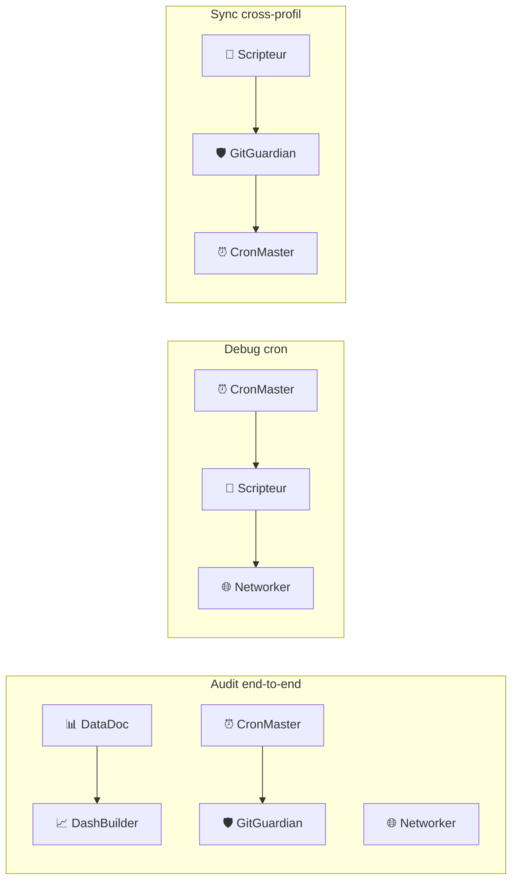
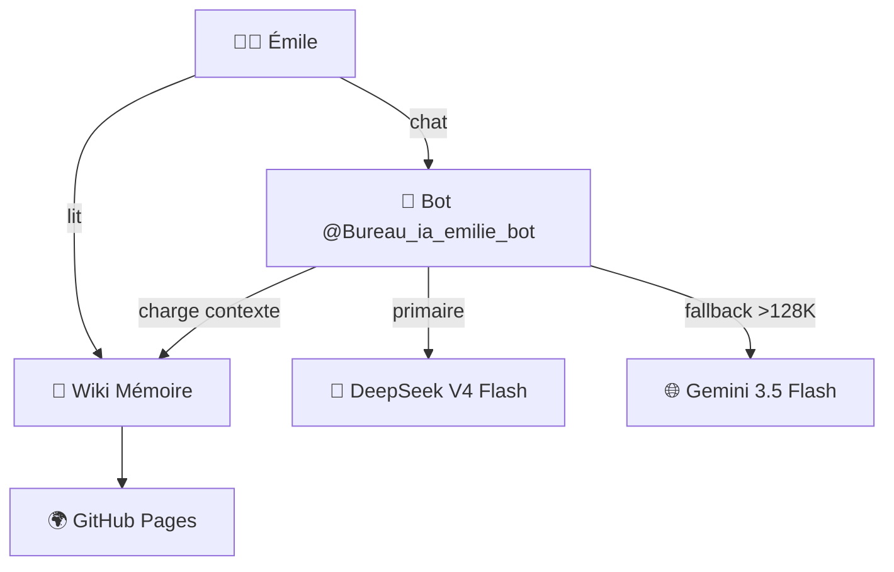
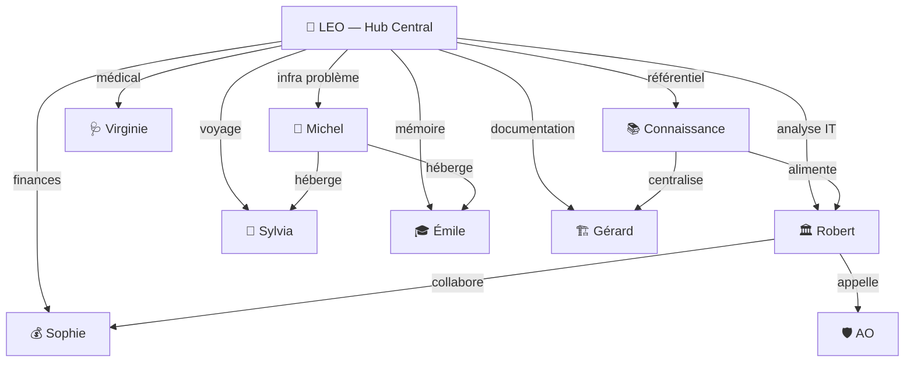

> **Dernière mise à jour rédactionnelle :** 18/07/2026 à 13:00 — Léo 🦁
> **Dernier commit :** `f6da9c7` — 18/07/2026 à 12:18

# Partie III — Les Bureaux BAVI 🏢

---

Au cœur de LEO se trouve un concept unique : **les bureaux BAVI** (Bureaux Agentiques Virtuels — Intelligence). Chaque bureau est un dossier intelligent spécialisé dans un domaine, avec ses propres règles, ses experts et ses modèles.

---

## Chapitre 12 — Architecture bureaux : le système de dossiers intelligents

### Le constat de départ

Un assistant IA généraliste sait tout faire, mais il ne sait rien faire parfaitement. Quand vous lui demandez à la fois un calcul de budget et un roadbook camping-car, le résultat est moyen sur les deux.

La solution de LEO : **découper l'intelligence en bureaux spécialisés**.

```
Assistant généraliste
├── Parle un peu de tout
├── Mélange les contextes
└── Résultat = moyen partout

vs

10 bureaux spécialisés
├── Chacun son métier
├── Chacun ses modèles
├── Chacun ses règles
└── Résultat = excellent partout
```

### Les 10 bureaux LEO

| Bureau | Rôle | Statut |
|:-------|:-----|:------:|
| 🔧 **Michel** | Infrastructure — crons, dashboards, système, budget | ✅ Actif |
| 🤖 **LEO** | Hub central — analyses, dossiers personnels, emails | ✅ Actif |
| 🧭 **Sylvia** | Voyages — roadbooks camping-car, itinéraires | ✅ Actif |
| 🎓 **Émile** | Pédagogie — assistant mémoire universitaire | ✅ Actif |
| 🏛️ **Robert** | Conseil stratégique IT — architectures, recommandations | ✅ Actif |
| 💰 **Sophie** | Pilotage financier — TCO, ROI, business cases | 📝 En reconstruction |
| 🏗️ **Gérard** | Documentation T600 — télescope automatisé | ✅ Actif |
| 🩺 **Virginie** | Médical — consultations pluridisciplinaires | ✅ Actif |
| 🛡️ **AO** | Assurance obligatoire — INAMI, eHealth, MyCareNet | 📝 Structure prête |
| 📚 **Connaissance** | Base de connaissance centralisée — bibliothèque cas IA, référentiels | ✅ Actif |

### Comment fonctionne un bureau

#### 1. Un dossier dédié

Chaque bureau a son propre dossier dans `AGENT-PRO` :

```bash
BAVI/AGENT-PRO/
├── bureau-michel/        ← 🔧 Infrastructure
│   ├── index.md          ← Tableau de bord généré automatiquement
│   ├── analyse-*.md      ← Analyses produites
│   └── archive/          ← Anciennes analyses
├── bureau-leo/           ← 🤖 Hub central
├── bureau-sylvia/        ← 🧭 Voyages
└── ...
```

#### 2. Des experts spécialisés

Chaque bureau peut faire appel à des sous-experts. Par exemple, le Bureau Michel a 8 experts :

```
Bureau Michel
├── 🔧 SysAdmin      — Administration du serveur
├── 🐳 DevOps        — Déploiement Docker
├── 📜 Scripteur     — Scripts Python/Bash
├── 📊 DataDoc       — Documentation et archives
├── 🌐 Networker     — Nginx, Cloudflare, DNS
├── 📈 DashBuilder   — Dashboards Chart.js
├── ⏰ CronMaster    — Crons Hermes (staggering)
└── 🛡️ GitGuardian   — Git, sync, clean trees
```

Et le Bureau Robert compte **16 experts** (détail au Chapitre 14).

#### 3. Des dispatch patterns

Les experts ne travaillent pas toujours seuls. Selon la tâche, le bureau active plusieurs experts en parallèle ou en séquence :



#### 4. Des modèles adaptés

Chaque bureau utilise le modèle le plus adapté à son travail :

| Bureau | Modèle principal | Pourquoi |
|:-------|:-----------------|:---------|
| Michel | DeepSeek V4 Pro | Analyses complexes, décisions techniques |
| Sylvia | DeepSeek V4 Flash | Création de contenu, roadbooks |
| Robert | DeepSeek V4 Pro | Conseil stratégique, recommandations |
| Gérard | DeepSeek V4 Pro | Documentation technique, schémas |
| Émile | DeepSeek V4 Flash + Gemini (fallback) | Longs contextes, pédagogie |
| LEO | DeepSeek V4 Flash | Usage quotidien, polyvalent |

### Le cycle de production

Chaque analyse suit un workflow standardisé en **7 étapes** :

```
① Cadrage
   │  Comprendre la demande, définir le périmètre
   ▼
② Dispatch
   │  Quel bureau ? Quels experts ?
   ▼
③ Production
   │  Rédaction de l'analyse
   ▼
④ Croisement (si multi-experts)
   │  Confronter les analyses de plusieurs experts
   ▼
⑤ Synthèse
   │  Résumé, conclusions, recommandations
   ▼
⑥ Livrable
   │  Format final : analyse, rapport, note
   ▼
⑦ Archivage
   │  Sauvegarde dans AGENT-PRO + commit Git + publication wiki
```

#### Variantes selon le type de livrable

| Type | Étapes | Description |
|:-----|:-------|:------------|
| **Analyse** | ①→③→⑤→⑥→⑦ | Analyse directe, pas de dispatch |
| **Rapport** | ①→②→③→④→⑤→⑥→⑦ | Cycle complet avec croisement |
| **Note** | ①→③→⑥ | Rapide, pas de dispatch ni synthèse |
| **Dossier** | ①→②→③→④→⑤→⑥→⑦ + archivage renforcé | Document complet |
| **Mémoire** | ①→②→③→④↔④↔④→⑤→⑥→⑦ | Croisement itératif (allers-retours) |

### Frontmatter standard

Chaque analyse a un en-tête YAML qui permet son indexation automatique :

```yaml
---
date: 2026-06-28
bureau: bureau-michel
version: v2
modele: deepseek-v4-pro
tags: [analyse, infrastructure, crons]
statut: archive
type: analyse
---
```

Ces métadonnées permettent au script `agent-pro-index.py` de générer automatiquement des tableaux de bord consolidés.

### Pourquoi ça marche

1. **Spécialisation** — chaque bureau ne fait qu'un métier, il le fait mieux
2. **Réutilisabilité** — une analyse peut être reprise par un autre bureau
3. **Traçabilité** — chaque document a une date, une version, un auteur
4. **Évolutivité** — on peut ajouter un bureau sans casser les autres
5. **Automatisation** — l'index des analyses est généré, pas écrit à la main

### Voir aussi

- **Ch.13** : Bureau Michel — l'infrastructure en détail
- **Ch.14** : Bureau Sylvia — les voyages
- **Ch.15** : Bureau Émile — la pédagogie
- **Ch.16** : Bureau Robert — le conseil stratégique
- **Ch.17** : Bureau LEO et les autres bureaux

---

## Chapitre 13 — Bureau Michel : l'infrastructure

Le Bureau Michel est le bureau technique de LEO. Porté par **Michel** (profil `leo-copilot`), il gère tout ce qui touche au fonctionnement de l'infrastructure : crons, dashboards, Google APIs, Git, budget, serveur, sécurité.

C'est le padron de la machine — il a accès root complet (`sudo` sans restriction).

### Son rôle

```
Bureau Michel = l'ingénieur système de LEO
├── 🔧 38 crons automatisés (+6 hôte)
├── 📊 1 dashboard central (4 onglets)
├── 🌐 Nginx + Cloudflare Tunnel
├── 🔒 UFW + SSL + DNS
├── 💰 Suivi du budget DeepSeek
├── 🖥️ Monitoring ressources serveur
└── 🔑 Accès root complet (sudo)
```

### Les experts du bureau

| Expert | Compétence | Activer quand... |
|:-------|:-----------|:-----------------|
| 🔧 **SysAdmin** | Administration serveur (Nginx, UFW, Docker) | Installation service, config système |
| 🐳 **DevOps** | Déploiement conteneurs, CI/CD | Nouveau déploiement, mise à jour |
| 📜 **Scripteur** | Scripts Python/Bash, automation | Création de script, correction bug |
| 📊 **DataDoc** | Documentation, rapports, archives | Archivage analyse, production doc |
| 🌐 **Networker** | Cloudflare, DNS, ports, tunnels | Configuration réseau, problème DNS |
| 📈 **DashBuilder** | Dashboards Chart.js, GitHub Pages | Création dashboard, debug HTML |
| ⏰ **CronMaster** | Crons Hermes, staggering, scheduling | Création cron, erreur récurrente |
| 🛡️ **GitGuardian** | Git, sync Drive↔GitHub, clean trees | Dirty files, sync cross-repo |

### Infrastructure gérée

#### Serveur LEO

```yaml
OS: Ubuntu 26.04 (resolute)
Kernel: 7.0.0
CPU: i7-7700K
RAM: 22.94 Go
GPU: Aucun (Ollama sur CPU)
SSD: 465 Go (/dev/sda2)
HDD: 1 To (/dev/sdb2 → /mnt/data)
```

#### Conteneurs Docker

| Conteneur | Image | Rôle | Port |
|:----------|:------|:-----|:----:|
| `hermes-agent` | nousresearch/hermes-agent | Agent IA principal | — |
| `ollama` | ollama/ollama | LLM local (qwen2.5:7b) | 11434 |
| *(code-server)* | code-server | VS Code web | 8081 |

Le conteneur Hermes a des **pleins pouvoirs** :
- Socket Docker monté en RW (`/var/run/docker.sock`)
- Filesystem hôte monté en RW (`/host`)
- Mode réseau `--network host` (accès direct à tous les ports)

#### Nginx + Cloudflare

```
Utilisateur ──→ tofdan.be ──→ Cloudflare ──→ Tunnel ──→ Nginx (port 80)
                                                                  │
                                                                  ▼
                                                            /var/www/
                                                            ├── tofdan.be/
                                                            └── astro/
```

- **Nginx** : sert les sites statiques sur le port 80 seulement
- **Cloudflare** : gère le HTTPS (mode Flexible), le tunnel et le DNS
- **UFW** : ports ouverts 80, 443, 11434, 3389, 7844

### Les 38 crons (+ 6 hôte)

Les crons sont le cœur de l'automatisation. 14 tâches planifiées tournent 24/7, complétées par un **auto-fix-daemon** `*/15` qui assure la détection rapide :

#### Crons horaires (métriques + dashboard)

```yaml
- Nom: Budget Check
  Horaire: 08:00, 20:00
  Action: Vérifie solde DeepSeek, alerte si < 10€
  Coût: 0€ (no_agent)

- Nom: Dashboard LEO
  Horaire: Toutes les heures
  Action: Collecte métriques → met à jour dashboard KPI
  Coût: 0€ (no_agent)

- Nom: Dashboard Machines
  Horaire: Toutes les heures
  Action: CPU/RAM/disque des machines
  Coût: 0€ (no_agent)

- Nom: Dashboard Crons
  Horaire: Toutes les heures
  Action: Statut des crons
  Coût: 0€ (no_agent)
```

#### Crons quotidiens

```yaml
- Nom: Backup → GDrive
  Horaire: 04:00
  Action: Archive tous les profils + config → Google Drive
  Rétention: 7 jours
  Coût: 0€ (no_agent)

- Nom: Veille IA
  Horaire: 07:00
  Action: Collecte 15 sources RSS → analyse DeepSeek → email
  Coût: ~0,05 €/jour

- Nom: Sync Drive → GitHub
  Horaire: 18:00
  Action: Miroir bidirectionnel Drive ↔ GitHub
  Coût: 0€ (no_agent)

- Nom: Classifieur Gmail
  Horaire: Toutes les 15 min
  Action: Nouveaux emails → classification Ollama (9 labels)
  Coût: 0€ (Ollama local)
```

#### Pourquoi "no_agent" ?

La plupart des crons utilisent le mode `no_agent = true`. Cela signifie qu'ils exécutent un script **sans LLM**, ce qui les rend totalement gratuits :

```yaml
# Cron avec LLM : coûte de l'argent à chaque exécution (~0,05 €)
cron-veille:
  no_agent: false  # DeepSeek analyse les articles

# Cron sans LLM : 0 € à chaque exécution
cron-metrics:
  no_agent: true   # Simple script bash/python
  script: collect-metrics.sh
```

Sur 38 crons Hermes, la plupart sont en **no_agent** (0$ LLM) — seuls quelques crons (veille IA, audit) utilisent un LLM. Le coût total des crons est d'environ **quelques centimes par jour**.

### Le dashboard central (4 onglets)

| Dashboard | URL | Contenu |
|:----------|:----|:--------|
| **LEO Dashboard** | `christophedanhier-hash.github.io/leo-dashboard/` | Synthèse, Analyses, Infra, BAVI (20 KPI, 4 charts) |

Tous les indicateurs sont dans **un seul dashboard HTML statique** avec 4 onglets :
1. Un script collecte les données → JSON
2. Un template Chart.js génère le HTML
3. Push sur GitHub Pages → site en ligne

### Budget DeepSeek

Le Bureau Michel suit le budget en continu via le dashboard LEO. Plutôt que de donner des chiffres précis (qui changent chaque jour), voici les **principes généraux** :

| Principe | Détail |
|:---------|:-------|
| **Provider principal** | DeepSeek Flash pour le quotidien |
| **Provider complexe** | DeepSeek Pro pour analyses ponctuelles |
| **Provider gratuit** | Ollama (local, CPU) pour classification et batch |
| **Fallback** | Gemini (gratuit, cloud) si DeepSeek indisponible |
| **Veille IA** | ~5-10 centimes/jour (DeepSeek Flash) |
| **Crons no_agent** | 0 € — 13 sur 14 |
| **Total mensuel estimé** | **~1-3 €/mois** |

#### DeepSeek V4 — Tarifs de référence (juillet 2026)

| Modèle | Prix standard (M tokens) | Heures pleines ×2 |
|:-------|:------------------------:|:------------------:|
| **Flash** | $0.14 in / $0.28 out | UTC 01-04 et 06-10 |
| **Pro** | $0.435 in / $0.87 out | UTC 01-04 et 06-10 |

> ⚠️ Les tarifs DeepSeek peuvent évoluer. Consultez [platform.deepseek.com](https://platform.deepseek.com) pour les prix à jour.

#### Résilience post-crash (30 juin 2026)

Le 30 juin, un crash système a vidé les sessions des 4 bots et cassé les gateways. Leçons :
- **Backup automatisé** → GDrive toutes les 24h
- **auto-fix-daemon** `*/5` → remplace 3 crons monitoring
- **Mémoire partagée** par symlinks → plus de perte de contexte entre profils
- **collect-v2** → collecteur unifié (8 sources, JSON, 0 alerte) remplace des scripts disparates

### n8n — 📦 Historique (déprécié)

> **📦 HISTORIQUE — Déprécié le 13/07/2026.** n8n a été remplacé par des scripts Python et l'auto-heal natif de Hermes. Les watchdogs et l'auto-heal fonctionnent désormais sans dépendance n8n.

n8n était utilisé pour les workflows qui nécessitent des webhooks ou des intégrations API :
- **n8n v2.26.8 Docker** — 3 workflows, **2 actifs** (remplacés)
- **3 credentials** (Google, GitHub, n8n) — désormais gérés par les scripts Hermes
- Accès via Tailscale uniquement (`100.92.102.28:5678`)
- **Base SQLite** dans un volume Docker dédié
- **Workflow emblématique : LEO Ping** — endpoint `GET /webhook/ping` → `{"response":"pong"}`

> **Consolidation post-crash** : passé de 6 à 3 workflows (2 actifs). Les workflows redondants ont été supprimés pour plus de stabilité.

### Auto-heal et watchdogs

Le système ne se contente pas de tourner — il se surveille :

```yaml
Auto-heal (toutes les 30-60 min, + auto-fix-daemon */5 min):
  ✅ Crons: 14/14 OK
  ✅ Ollama: UP (qwen2.5:7b responsive)
  ✅ Docker: 3/3 conteneurs up
  ✅ Disque: 21% utilisé (345 Go libre)
  ✅ Token LEO Google: OK
  ✅ collect-v2 → leo-unified.json: 8 sources, 0 alertes
  ✅ Mémoire partagée: symlinks default ↔ leo-copilot (temps réel)
  ✅ 4 gateways UP: default, leo-copilot, bavi-leo (Sylvia), emile
```

Les watchdogs surveillent en continu : code-server, dashboards, tunnels. Depuis le crash du 30 juin, un **auto-fix-daemon** (`*/5`) remplace 3 crons monitoring pour une détection infra-minute.

### En résumé

| Composant | Quantité | Coût mensuel |
|:----------|:--------:|:------------:|
| Crons | 38 (+6 hôte) | ~0 €/j (13 no_agent) |
| Dashboards | 1 central (4 onglets) | 0 € (GitHub Pages) |
| Machine hôte | 1 | 0 € (serveur local) |
| DeepSeek API | Flash + Pro | ~1-3 €/mois |
| **Total** | | **~1-3 €/mois** |

### Voir aussi

- **05-dashboards-crons.md** : Dashboards et monitoring (Partie V)
- **06-partie-des-dix.md** : Astuces et commandes

---

## Chapitre 14 — Bureau Sylvia : les voyages

Le Bureau Sylvia est le spécialiste des **roadbooks camping-car**. Accessible via le bot Telegram [@bavi_leo_voyages_bot](https://t.me/bavi_leo_voyages_bot), il produit des itinéraires complets avec cartes interactives, budgets et conseils pratiques.

### Son rôle

Sylvia ne planifie pas seulement des itinéraires — elle construit des **carnets de voyage complets** qui servent de guide pendant le trajet.

```
Bureau Sylvia = votre agence de voyage IA
├── 🗺️ Roadbooks détaillés (étapes, distances, campings)
├── 📏 Calcul Haversine (distances à vol d'oiseau)
├── 🗺️ Cartes OSM interactives (folium + leaflet)
├── 💰 Budget prévisionnel (péages, carburant, campings)
├── 🏕️ Campings et hébergements
└── 💡 Astuces camping-car (ZTL, hauteur, aires)
```

### Les experts du bureau

| Expert | Rôle |
|:-------|:-----|
| 🧭 **Curateur d'Expériences** | Conception de l'itinéraire, choix des étapes |
| 🚐 **Navigateur Camping-Car** | Distances, routes, aires, contraintes CC |
| 📝 **Journaliste de Bord** | Rédaction du carnet de voyage |

### Structure d'un roadbook

Chaque roadbook suit un format strict, testé sur des dizaines de voyages :

#### 1. Header + Contexte

```markdown
# 🇮🇹 Voyage Italie — Septembre/Octobre 2026

> 🗓️ 15/09/2026 → 05/10/2026 | 🚐 21 jours | 📏 ~3 500 km

## 👥 Contexte du voyage
|               |                                |
|:--------------|:-------------------------------|
| **Voyageurs** | Christophe, Sylvie + 🐕 Nala  |
| **Véhicule**  | Camping-car 8m × 2.3m (h: 3m) |
| **Équipement**| 2 vélos électriques           |
```

#### 2. Coût du service

| Métrique | Valeur |
|:---------|------:|
| Sessions IA | 12 |
| Tokens consommés | 240K IN / 78K OUT |
| Coût DeepSeek réel | ~0,06 € |
| Frais de service | 2,50 € |
| **Total facturé** | **2,56 €** |

#### 3. Itinéraire détaillé

| Jour | Date | Étape | Distance | KM cumulé | Nuit | Camping | Coût |
|:----:|:----:|:------|:--------:|:---------:|:----:|:--------|:----:|
| 1 | 15/09 | Sombreffe → Reims | 180 km | 180 km | 1 | Camping Reims | 30 € |

#### 4. Distances Haversine

| Trajet | Distance vol d'oiseau |
|:-------|:--------------------:|
| Sombreffe → Reims | 165 km |
| Reims → Dijon | 210 km |
| **Total** | **~2 800 km** |

#### 5. Carte interactive

Chaque roadbook inclut une carte OSM tracée avec folium :

```python
import folium

stops = [(50.5, 4.5, "Sombreffe"), (49.25, 4.03, "Reims"), ...]
m = folium.Map(location=[47.0, 6.0], zoom_start=6, tiles="OpenStreetMap")

# Tracé du parcours
route = [(s[0], s[1]) for s in stops]
folium.PolyLine(route, color="#e63946", weight=4, opacity=0.8).add_to(m)

# Marqueurs
for lat, lon, label in stops:
    folium.Marker([lat, lon], popup=label, 
                  icon=folium.Icon(color="red", icon="info-sign")).add_to(m)

m.save("docs/italie/carte-italie.html")
```

#### 6-9. Campings, Budget, Notes, Résumé

Les sections suivantes détaillent les hébergements, le budget par poste, les astuces pratiques et un tableau récapitulatif.

### Publication

Les roadbooks sont publiés sur le **wiki Voyages** :

```
📦 github.com/christophedanhier-hash/voyages-wiki
🌐 https://christophedanhier-hash.github.io/voyages-wiki/
📁 /opt/data/voyages-wiki/docs/
```

Le workflow de publication est automatisé :

```bash
cd /opt/data/voyages-wiki
git add docs/NOM-DU-VOYAGE/
git commit -m "Ajout roadbook [destination] — [dates]"
git push origin main
# ~1 min → GitHub Pages déploie automatiquement
```

### Roadbooks existants

| Destination | Période | Statut |
|:------------|:-------:|:------:|
| 🇮🇹 **Italie** | Septembre/Octobre 2026 | 📝 En préparation |
| 🇻🇳🇱🇦🇰🇭 **Vietnam-Laos-Cambodge** | Janvier/Février 2027 | 📝 En préparation |
| 🇳🇴 **Scandinavie** | Août-Octobre 2026 | 📝 En préparation |
| 🇪🇸 **Andalousie** | Septembre-Octobre 2026 | 📝 En préparation |
| 🇫🇷 **Canet** | Juin 2026 | 📝 En préparation |

### Règles strictes

1. **Pas de Google Maps** — uniquement OpenStreetMap
2. **Pas de photos** dans le wiki — restent sur Polarsteps
3. **Distances Haversine** obligatoires entre chaque étape
4. **Dates belges** — format JJ/MM/AAAA
5. **Chaque modif** = mise à jour de la section coûts
6. **ZTL et hauteurs** — vérification obligatoire pour camping-car

### Voir aussi

- **Ch.13** : Bureau Michel (hébergement et publication)
- **05-dashboards-crons.md** : Crons de synchronisation
- **08-guide-rapide.md** : Guide démarrage rapide

---

## Chapitre 15 — Bureau Émile : la pédagogie

Le Bureau Émile est un assistant pédagogique dédié à l'accompagnement d'Émilie pour son **mémoire de fin d'études en sciences de l'éducation**. C'est le plus jeune bureau de LEO, créé le 25 juin 2026.

### Son rôle

Émile n'est pas un correcteur automatique — c'est un **partenaire de rédaction** qui suit l'étudiante tout au long de son travail.

```
Bureau Émile = votre directeur de mémoire IA
├── 📖 Relecture et amélioration des chapitres
├── 📚 Bibliographie et références
├── 📝 Structure et plan du mémoire
├── 🔄 Versionning (brouillons → versions finales)
├── 💡 Suggestions d'amélioration
└── ✅ Vérification orthographe et style académique
```

### Architecture



- **Modèle principal** : DeepSeek V4 Flash (contexte 128K tokens)
- **Fallback** : Gemini 3.5 Flash (contexte 1M tokens — gratuit)
- **Bot Telegram** : [@Bureau_ia_emilie_bot](https://t.me/Bureau_ia_emilie_bot)
- **Wiki** : [emile-wiki](https://christophedanhier-hash.github.io/emile-wiki/)

#### Pourquoi deux modèles ?

Le mémoire d'Émilie peut faire 50 à 150 pages. Si le contexte dépasse 128K tokens (la limite de DeepSeek), le bot bascule automatiquement sur Gemini qui accepte jusqu'à 1 million de tokens — gratuitement.

```python
if contexte_tokens < 128_000:
    utiliser("deepseek-v4-flash")   # Payant mais meilleur
else:
    utiliser("gemini-3.5-flash")   # Gratuit, contexte géant
```

### Sources de connaissance

Le bot s'alimente à plusieurs sources :

| Source | Description | Comment |
|:-------|:------------|:--------|
| **Wiki** | Documentation structurée | Lecture automatique |
| **Drive** | Brouillons, notes, documents | Sync horaire → Wiki |
| **Conversation** | Historique Telegram | Mémoire de session |

#### Contenu du wiki

Le wiki Émile contient déjà :
- **Plan du mémoire** — structure validée par le directeur
- **Chapitres** — brouillons en cours d'écriture
- **Bibliographie** — sources et références
- **Notes de recherche** — réflexions personnelles
- **Retours du directeur** — annotations et corrections

### Workflow typique

```
1. Émile écrit un brouillon dans Google Docs
2. Sauvegarde dans le dossier Drive partagé "bureau-emile"
3. La sync horaire convertit le .docx en .md → Wiki
4. Émile demande : "Peux-tu relire mon chapitre 2 ?"
5. Le bot charge le chapitre depuis le Wiki
6. Analyse : structure, style, orthographe, références
7. Retour avec suggestions d'amélioration
```

### Règles pédagogiques

1. **Bienveillance** — toujours encourageant et constructif
2. **Structure** — chaque retour a : points forts, suggestions, questions
3. **Exemples** — illustrer les corrections avec des exemples concrets
4. **Progression** — célébrer les améliorations d'une version à l'autre
5. **Autonomie** — ne jamais réécrire à la place d'Émilie, guider

### Intégration avec les autres bureaux

| Bureau | Interaction |
|:-------|:------------|
| 🔧 **Michel** | Héberge le bot, gère le cron de sync Drive→Wiki |
| 🤖 **LEO** | Point d'entrée : redirige les demandes pédagogiques |
| 🏛️ **Robert** | Pourrait faire une analyse qualité du mémoire |

### Comparaison avec Sylvia

Le Bureau Émile est inspiré du Bureau Sylvia (voyages) — même pattern, adapté à l'académique :

| Aspect | Sylvia (voyages) | Émile (mémoire) |
|:-------|:----------------:|:----------------:|
| **Utilisateur** | Christophe + amis | Émilie |
| **Livrable** | Roadbook | Mémoire |
| **Wiki** | `voyages-wiki` | `emile-wiki` |
| **Sync** | Drive → GitHub (docs voyages) | Drive → GitHub (brouillons) |
| **Modèle** | DeepSeek V4 Flash | DeepSeek Flash + Gemini fallback |
| **Création** | 03/06/2026 | 25/06/2026 |

### Voir aussi

- **Ch.7** : Multi-bots — comment créer un profil dédié
- **Ch.11** : Mémoire persistante

---

## Chapitre 16 — Bureau Robert : le conseil stratégique

Le Bureau Robert est le **consultant IT** de l'équipe. Il produit des analyses stratégiques, des recommandations d'architecture et des études comparatives. Quand un sujet dépasse le cadre technique pour toucher à la stratégie, Robert prend la main.

### Son rôle

Robert n'installe pas de serveurs et ne rédige pas de roadbooks — il **réfléchit**, **compare**, **recommande**.

```
Bureau Robert = votre consultant IT personnel
├── 🏛️ Architecture et choix techniques
├── 📊 Analyses comparatives (DeepSeek vs Gemini vs Ollama)
├── 💡 Recommandations stratégiques
├── 🔮 Roadmaps et évolutions
└── 📋 Rapports et documentations
```

### Les 16 experts du bureau

| Expert | Compétence |
|:-------|:-----------|
| 🏛️ **Architecte** | Conception de systèmes, choix techniques |
| 🔒 **Sécurité** | Audit, conformité, risques |
| 📊 **Data** | Analyse de données, métriques, KPIs |
| 📋 **Gouvernance** | Processus, documentation, standards |
| 🔮 **Vision Stratégique** | Roadmap, évolutions, tendances |
| 📐 **Projet & Programme** | Planification, suivi, livrables |
| 🛡️ **Assurance Obligatoire** | INAMI, BCSS, eHealth, MyCareNet |
| *(et 9 autres experts spécialisés)* | |

### Types d'analyses

Robert peut produire plusieurs formats selon le besoin :

| Type | Description | Exemple concret |
|:-----|:------------|:----------------|
| **Analyse stratégique** | Étude complète avec recommandations | "Quel LLM pour remplacer DeepSeek Flash ?" |
| **Benchmark** | Comparaison multi-critères | "Gemma 4 vs Qwen 3 vs Llama 4" |
| **Étude de faisabilité** | Options techniques + coûts | "Installer un GPU local pour l'IA" |
| **Audit** | Évaluation d'un existant | "Audit sécurité du serveur LEO" |

### Le processus de conseil

```
Demande ──→ Dispatch expert ──→ Production ──→ Croisement (si multi-experts)
                                                │
                                                ▼
                                          Synthèse ──→ Livrable ──→ Archivage
```

Pour les sujets complexes, plusieurs experts travaillent en parallèle :

```
"Quel LLM choisir pour mon serveur ?"
├── 📊 Data     : benchmark des modèles disponibles
├── 💰 Sophie   : analyse des coûts (TCO)
├── 🔒 Sécurité : données sensibles, vie privée
└── 🏛️ Synthèse : recommandation finale
```

### Exemple réel : remplacer DeepSeek Flash par du local

Le Bureau Robert a produit une **analyse comparative de 5 modèles open-source** pour remplacer DeepSeek Flash par un LLM local :

| Modèle | VRAM Q8 | Qualité estimée | Vitesse |
|:-------|:-------:|:---------------:|:-------:|
| **Gemma 4 26B MoE** ⭐ | 30 GB | ~85% | 🚀 80+ tok/s |
| Gemma 4 31B | 34 GB ❌ | ~90% | ~35 tok/s |
| Llama 4 Scout | 22 GB | ~75% | ~50 tok/s |
| Qwen 3 32B | 34 GB ❌ | ~80% | ~40 tok/s |

**Recommandation** : Gemma 4 26B MoE en Q8 sur RTX 3090 (32 GB total).

### Collaboration avec Sophie

Robert travaille main dans la main avec le **Bureau Sophie** (pilotage financier) :

```yaml
Projet: "Remplacer DeepSeek API par un LLM local"
Robert (technique):
  - Gemma 4 26B MoE Q8 = meilleur rapport qualité/VRAM
  - ~85% de la qualité DeepSeek Flash

Sophie (financier):
  - Coût actuel DeepSeek: ~720 €/an
  - Investissement GPU: ~800 € (RTX 3090)
  - ROI: 14 mois
  - Économie: ~600 €/an après ROI
  - 3 scenarii : pessimiste, réaliste, optimiste
```

### Voir aussi

- **Ch.12** : Architecture des bureaux
- **Ch.13** : Bureau Michel (implémente les recommandations)
- **Ch.17** : Bureau Sophie (pilotage financier)

---

## Chapitre 17 — Bureau LEO et les autres bureaux

Le Bureau LEO est le **hub central** de l'écosystème — votre point d'entrée unique pour tout ce qui ne rentre pas dans les bureaux spécialisés. Et il y a quelques autres bureaux plus discrets mais tout aussi utiles.

### Bureau LEO : le fourre-tout personnel

LEO (le bureau, pas le bot) gère tout ce qui est **personnel, transversal ou ponctuel** : analyses générales, dossiers, études de marché, documentation.

```
Bureau LEO = votre assistant personnel
├── 📝 Analyses et dossiers
├── 📧 Emails (envoi + lecture + classification)
├── 📚 Documentation wikis
├── 🏷️ Classification Gmail (9 catégories)
└── 🗂️ Archives et notes
```

#### Chiffres clés

| Métrique | Valeur |
|:---------|:------:|
| Sessions totales | 431 |
| Messages échangés | 13 089 |
| Emails classifiés | 3 240 |
| Skills installés | 126 |
| Wikis gérés | 5 |

#### La classification Gmail

LEO classifie automatiquement les emails entrants en 9 catégories via Ollama (modèle local, gratuit) :

| Catégorie | Type |
|:----------|:-----|
| 👑 **VIP** | Christophe, famille, chefs |
| ⚙️ **Admin** | Factures, administrations |
| 💰 **Finances** | Banques, assurances, impôts |
| 🤖 **IA & Tech** | Infos techniques, newsletters |
| 🧭 **Voyages** | Réservations, billets |
| 🛒 **Achats** | Commandes, livraisons |
| 🏠 **Maison** | Énergie, travaux, voisinage |
| 👨‍👩‍👧‍👦 **Famille** | Émilie, Camille, amis |
| 🔭 **Astro** | Observatoire, astronomie |

Règle d'or : **les labels ne sont appliqués qu'une fois**. Pas de re-classification en masse.

### Bureau Sophie : le pilotage financier

Sophie est l'**analyste financière** de l'équipe. Elle calcule des TCO, des ROI, des business cases.

```
Bureau Sophie
├── 💰 TCO/ROI des projets IT
├── 📊 Analyse de rentabilité
├── 📈 3 scenarii (pessimiste/réaliste/optimiste)
└── 📋 Business cases

Experts : Analyste Marché, Modélisateur Financier, Risques & Conformité
```

Actuellement en reconstruction — Sophie reprendra du service quand un nouveau projet financier arrivera.

### Bureau Connaissance : la base centralisée

Le Bureau Connaissance est la **bibliothèque de cas** et le **référentiel central** de l'écosystème LEO. Il stocke et organise :

- Les cas d'usage IA documentés
- Les patterns réutilisables (architectures, workflows)
- Les référentiels de connaissances partagés entre bureaux
- Les décisions architecturales et leur justification

Il sert de **source de vérité** pour les autres bureaux : plutôt que de recréer une analyse existante, un bureau peut consulter la Connaissance pour trouver des précédents.

### Bureau Gérard : la documentation T600

Gérard documente le **télescope T600** (600mm d'ouverture) de l'Observatoire Centre Ardennes. Il a 6 sous-experts :

```
Bureau Gérard
├── 🔭 Spécialiste Astro-optique
├── 🔧 Expert Hardware (IPX800, Pléiades, Arduino)
├── 💾 Expert Firmware (steppers, drivers TB67H303HC)
├── 📝 Rédacteur Technique
├── 👨‍🏫 Formateur
└── 🌍 Ethnographe
```

Documents produits :
- **Document de Référence T600** — architecture complète du télescope
- **Formation Opérateur T600** — guide utilisateur
- **Analyse des Risques T600** — sécurité et maintenance

### Bureau Virginie : le médical

Virginie est une **orchestratrice de consultations médicales**. Elle réunit des spécialistes pour un diagnostic pluridisciplinaire.

Une consultation produite à ce jour : **Sylvie Michaux** (v2, finalisée).

Son workflow : dispatch des spécialistes → croisement des diagnostics → synthèse.

### Bureau AO : l'assurance obligatoire

Bureau spécialisé dans le domaine de l'**Assurance Obligatoire** (INAMI, BCSS, eHealth, MyCareNet). Peut fonctionner comme sous-agent de Robert ou en skill autonome.

En attente de missions.

### Bureau Versioning

Gère les **versions et releases** des documents et analyses. Structure prête, pas encore de contenu. Intégré au Bureau Connaissance pour la gestion documentaire.

### La gouvernance des bureaux



### En résumé

| Bureau | Rôle | Priorité |
|:-------|:-----|:--------:|
| **LEO** | Hub central, analyses, emails | 🔴 Quotidien |
| **Michel** | Infrastructure technique | 🔴 Quotidien |
| **Sylvia** | Voyages camping-car | 🟡 Hebdomadaire |
| **Robert** | Conseil stratégique IT | 🟡 Hebdomadaire |
| **Connaissance** | Base centralisée, référentiels | 🟡 Hebdomadaire |
| **Gérard** | Documentation T600 | 🟢 Mensuel |
| **Émile** | Assistant pédagogique | 🟢 Mensuel |
| **Virginie** | Consultations médicales | 🟢 Ponctuel |
| **Sophie** | Pilotage financier | 📝 En attente |
| **AO** | Assurance obligatoire | 📝 En attente |

### Voir aussi

- **Ch.12** : Architecture des bureaux (concept et workflow 7 étapes)
- **Ch.13** : Bureau Michel (infrastructure)
- **Ch.14** : Bureau Sylvia (voyages)
- **Ch.15** : Bureau Émile (pédagogie)
- **Ch.16** : Bureau Robert (conseil stratégique)

---

**[Chapitre suivant → Partie IV : La Puissance des Skills](04-skills.md)**

---

*Document mis à jour le 18/07/2026 à 13:00 — Léo 🦁 | v5.0*
