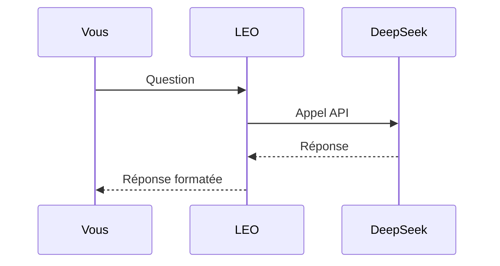
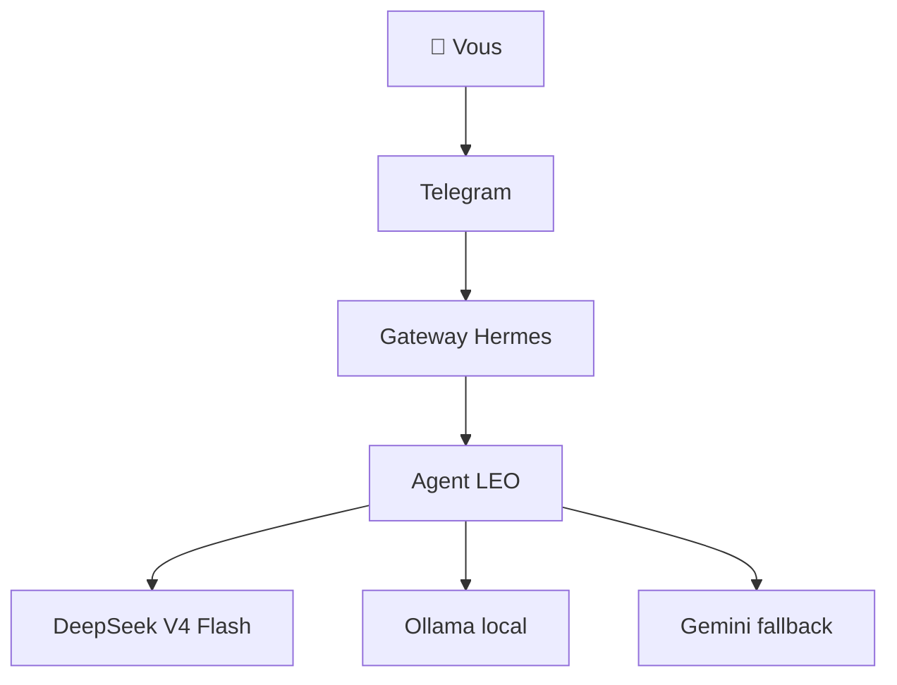
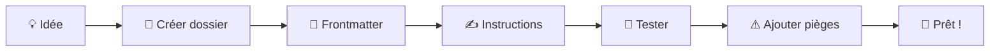

> **Dernière mise à jour rédactionnelle :** 18/07/2026 — Léo 🦁
> **Partie IV — La Puissance des Skills :** exploiter 117 skills prêts à l'emploi et créer les vôtres | **Audit rédactionnel :** ✅ conforme

# Partie IV — La Puissance des Skills

Les skills sont le cœur battant d'Hermes. Ce sont eux qui transforment votre assistant d'un simple chatbot en un véritable agent autonome capable d'exécuter des tâches complexes. Cette partie couvre les skills système, les skills de productivité, les skills DevOps, les skills créatifs, les skills de recherche, et surtout — comment créer les vôtres.

---

## hermes-agent : le méta-skill

Le skill `hermes-agent` est le **mode d'emploi d'Hermes par Hermes**. Quand vous demandez "comment ajouter un provider ?" ou "comment créer un profil ?", Hermes charge ce skill pour répondre.

Il couvre :

| Sujet | Exemple d'utilisation |
|:------|:----------------------|
| Configuration | Modifier config.yaml, ajouter un provider |
| Profils | Créer, lister, supprimer un profil |
| Gateway | Démarrer/arrêter un gateway, connecter Telegram |
| Mémoire | Consulter, modifier MEMORY.md et USER.md |
| Skills | Installer, créer, lister les skills |
| Crons | Planifier des tâches, mode no_agent |

### Exemple : configurer un nouveau provider

```bash
hermes config set model.default gemini-3.5-flash
hermes config set model.provider gemini
# Ajouter la clé API dans .env
echo "GEMINI_API_KEY=***" >> .env
```

### Exemple : créer un profil

```bash
hermes profile create mon-profil
# Configurer le profil
hermes -p mon-profil config set model.default deepseek-v4-flash
# Démarrer le gateway
hermes -p mon-profil gateway run
```

## Gateway : le pont vers les plateformes

Le skill `gateway` dans `hermes-agent` gère la connexion aux plateformes de messagerie.

### Telegram (le plus courant)

```yaml
# Dans le .env du profil
TELEGRAM_BOT_TOKEN=***
TELEGRAM_ALLOWED_USERS=8718957859
```

```bash
# Démarrer le gateway
hermes gateway run

# Avec un profil spécifique
hermes -p leo-copilot gateway run

# Remplacer un gateway existant
hermes gateway run --replace
```

### Architecture du gateway

Quand vous lancez `hermes gateway run`, Hermes :

1. Lit la configuration du profil
2. Connecte chaque plateforme activée (Telegram, Discord, etc.)
3. Écoute les messages entrants
4. Pour chaque message : charge le contexte, appelle le LLM, exécute les outils, renvoie la réponse
5. Gère le cycle de vie : reconnexion, heartbeat, shutdown

```text
Message entrant
     │
     ▼
  Gateway ──→ Session ──→ Agent ──→ LLM
     │
     ▼
  Réponse envoyée
```

### Plusieurs gateways, plusieurs bots

Chaque profil peut avoir son propre gateway avec son propre token Telegram :

```bash
# Terminal 1 : Léo (default)
hermes gateway run

# Terminal 2 : Michel
hermes -p leo-copilot gateway run

# Terminal 3 : Sylvia
hermes -p bavi-leo gateway run
```

## Profils : l'isolation par design

Le skill `profils` documente comment organiser des instances Hermes indépendantes.

### Cas d'usage typiques

| Profil | Usage | Provider | Token Telegram |
|:-------|:------|:---------|:---------------|
| `default` | Assistant principal | DeepSeek V4 Flash | `881242...` |
| `leo-copilot` | Infrastructure | DeepSeek V4 Pro | `899720...` |
| `bavi-leo` | Voyages | DeepSeek V4 Flash | `885780...` |
| `emile` | Pédagogie | DeepSeek Flash + Gemini | `890688...` |

### Structure d'un profil

```bash
~/.hermes/profiles/mon-profil/
├── config.yaml     # Configuration du profil
├── .env            # Variables d'environnement (tokens, clés API)
├── SOUL.md         # Personnalité et règles
├── memories/       # Mémoire persistante
├── skills/         # Skills synchronisés
├── cron/           # Tâches planifiées
└── sessions/       # Historique des conversations
```

### Synchronisation entre profils

Les skills peuvent être synchronisés d'un profil source vers d'autres profils :

```yaml
# Dans le profil source (default)
skills:
  sync_to:
    - leo-copilot
    - bavi-leo
    - emile
```

## Mémoire : le skill qui retient tout

Le sous-skill `memory` permet de lire et écrire dans la mémoire persistante.

### Lire la mémoire

```bash
# Voir la mémoire système
cat ~/.hermes/memories/MEMORY.md

# Voir le profil utilisateur
cat ~/.hermes/memories/USER.md
```

### Écrire dans la mémoire

```bash
# Ajouter une information
hermes memory add "Le serveur est à Bruxelles" --target memory

# Ajouter une préférence utilisateur
hermes memory add "Christophe préfère les réponses concises" --target user
```

### Partage de mémoire entre profils

```bash
# Créer un lien symbolique pour partager
ln -s ~/.hermes/memories/MEMORY.md ~/.hermes/profiles/leo-copilot/memories/MEMORY.md
ln -s ~/.hermes/memories/USER.md ~/.hermes/profiles/leo-copilot/memories/USER.md
```

Ainsi, quand un profil apprend quelque chose, les autres en bénéficient immédiatement.

## Crons : l'automatisation sans surveillance

Le skill `cron` documente la planification de tâches.

### Créer un cron simple (script only, 0€)

```bash
hermes cron create \
  --name "Vérification disque" \
  --schedule "0 8 * * *" \
  --script ~/.hermes/profiles/leo-copilot/scripts/check-disk.sh \
  --no-agent
```

Le flag `--no-agent` exécute le script **sans LLM** → coût 0€.

### Créer un cron avec agent (LLM)

```bash
hermes cron create \
  --name "Résumé veille" \
  --schedule "0 7 * * *" \
  --prompt "Analyse les articles dans /data/veille/ et fais un résumé"
```

### Lister et gérer les crons

```bash
hermes cron list
hermes cron pause <id>
hermes cron resume <id>
hermes cron remove <id>
hermes cron run <id>    # Exécution immédiate
```

### En résumé

| Skill | À retenir |
|:------|:----------|
| **hermes-agent** | Le mode d'emploi d'Hermes par Hermes |
| **Gateway** | Pont vers Telegram, Discord, etc. |
| **Profil** | Instance isolée avec sa propre config |
| **Mémoire** | Persistance cross-session |
| **Cron** | Tâches planifiées (no_agent = 0€) |

### Voir aussi

- **Ch.5** : Gateway et profils (configuration détaillée)
- **Ch.9** : Mémoire persistante
- **Ch.26** : Crons avancés
- **Annexe B** : Guide de démarrage rapide

---

# Skills productivité : dashboards, wikis, email, budget

Au-delà des skills système, Hermes embarque des skills prêts à l'emploi qui transforment votre assistant en outil de productivité. Voici les plus utiles de l'écosystème LEO.

## Dashboards : visualiser sans backend

Le skill `dashboards` (catégorie productivity) gère la création et le déploiement de tableaux de bord HTML statiques.

### Principe

Un dashboard Hermes est un fichier HTML autonome (zéro JavaScript serveur, zéro backend) :

```python
# 1. Collecter les données → JSON
# 2. Générer un HTML avec Chart.js
# 3. Push sur GitHub Pages → site en ligne
```

Ce fonctionnement minimaliste a un avantage décisif : **tout est gratuit**. GitHub Pages ne coûte rien, les scripts de collecte sont en no_agent.

### Exemple : dashboard KPI

```python
import json, subprocess
from datetime import datetime

# Collecte
sessions = len(json.loads(subprocess.run(
    ["cat", "~/Projets_Dev/sessions/sessions.json"],
    capture_output=True, text=True).output).get("sessions", []))

# Génération HTML
html = f"""<!DOCTYPE html>
<html>
<head><title>LEO KPI</title>
<script src="https://cdn.jsdelivr.net/npm/chart.js"></script></head>
<body>
<h1>📊 LEO — KPIs</h1>
<p>Sessions : {sessions}</p>
<canvas id="chart"></canvas>
<script>
new Chart(document.getElementById('chart'), {{
    type: 'bar',
    data: {{ labels: ['Sessions'], datasets: [{{ data: [{sessions}] }}] }}
}});
</script></body></html>"""

with open("/tmp/dashboard.html", "w") as f:
    f.write(html)
```

### Les dashboards de LEO (1 central, 4 onglets)

| Dashboard | Contenu | URL |
|:----------|:--------|:----|
| **LEO Dashboard** | Synthèse, Analyses, Infra, BAVI — 20 KPI, 4 charts | `leo-dashboard/` |

### Déploiement automatisé

```bash
# Script de collecte + génération
python3 ~/.hermes/profiles/leo-copilot/scripts/update_budget_kpi.py

# Push sur GitHub Pages
cd ~/Projets_Dev/leo-dashboard && git add -A && git commit -m "màj dashboard" && git push
```

## Wikis : la documentation vivante

Le skill `mkdocs-wiki` permet de créer et maintenir des wikis MkDocs déployés sur GitHub Pages.

### Créer un wiki

```bash
# 1. Créer le dépôt sur GitHub
# 2. Cloner en local
git clone https://github.com/christophedanhier-hash/mon-wiki.git
cd mon-wiki

# 3. Initialiser MkDocs
pip install mkdocs mkdocs-material
mkdocs new .

# 4. Configurer le thème
cat > mkdocs.yml << EOF
site_name: Mon Wiki
theme: material
EOF

# 5. Écrire les pages
# docs/index.md, docs/sujet1.md, ...

# 6. Déployer
mkdocs gh-deploy
```

### Les 5 wikis de LEO

| Wiki | Contenu | URL |
|:-----|:--------|:----|
| **BAVI_LEO** | Documentation des bureaux | `christophedanhier-hash.github.io/BAVI_LEO/` |
| **Hermès** | Documentation Hermes Agent | `christophedanhier-hash.github.io/hermes-wiki/` |
| **Voyages** | Roadbooks camping-car | `christophedanhier-hash.github.io/voyages-wiki/` |
| **Émile** | Mémoire universitaire | `christophedanhier-hash.github.io/emile-wiki/` |
| **OCA** | Télescope T600 | `christophedanhier-hash.github.io/wiki-oca/` |

### Synchronisation Drive → Wiki

Un cron transforme automatiquement les documents Google Docs en pages de wiki :

```bash
# Script de sync (toutes les 6h)
python3 ~/.hermes/profiles/leo-copilot/scripts/drive-sync.sh
# Convertit les .docx en .md
# Commit + push sur le wiki GitHub
```

## Email : la classification inbox zéro

Le skill `gmail-inbox-zero` automatise la classification des emails entrants via Ollama (modèle local, gratuit).

### Fonctionnement

```yaml
1. Toutes les 15 minutes, le cron scanne les emails NON LUS
2. Pour chaque email, Ollama le classe en 9 catégories
3. Un label Gmail est appliqué automatiquement
4. Les emails lus depuis > 2 jours sont archivés
```

### Les 9 catégories

| Catégorie | Label Gmail | Type |
|:----------|:------------|:------|
| 👑 **VIP** | `CAT_VIP` | Christophe, famille, direction |
| ⚙️ **Admin** | `CAT_Admin` | Factures, administrations |
| 💰 **Finances** | `CAT_Finances` | Banques, assurances, impôts |
| 🤖 **IA & Tech** | `CAT_IA-Tech` | News tech, newsletters |
| 🧭 **Voyages** | `CAT_Voyages` | Réservations, billets |
| 🛒 **Achats** | `CAT_Achats` | Commandes, livraisons |
| 🏠 **Maison** | `CAT_Maison` | Énergie, travaux |
| 👨‍👩‍👧‍👦 **Famille** | `CAT_Famille` | Filles, amis |
| 🔭 **Astro** | `CAT_Astro` | Observatoire |

### Règle d'or

Les labels ne sont **appliqués qu'une seule fois**. Pas de re-classification en masse. Une fois qu'un email a son label, il reste dans la boîte de réception jusqu'à ce qu'il soit lu, puis archivé après 2 jours.

```python
# Ne JAMAIS réappliquer les labels en masse
if email.label_ids:
    pass  # Déjà classifié, on ne touche pas
```

### Configuration

```bash
# Clé API Google (OAuth)
# Dans .env
GOOGLE_TOKEN_PATH=~/Projets_Dev/google_token.json

# Le cron est déjà configuré dans le profil leo-copilot
# Exécution : toutes les 15 minutes
```

## Budget : le suivi des coûts DeepSeek

Le skill `deepseek-budget` suit la consommation de l'API DeepSeek en temps réel.

### Dashboard budget

```bash
# Exécution : 08:00 et 20:00 (cron)
python3 ~/.hermes/profiles/leo-copilot/scripts/diag_budget.py

# Alerte si solde < 10€
# Push sur le dashboard LEO
```

### Chiffres LEO

| Métrique | Valeur |
|:---------|:------:|
| Provider principal | DeepSeek Flash (économique) |
| Coût mensuel estimé | ~1-3 € |
| Crons | 44 (38+6, 13 no_agent = 0 €) |
| Veille IA | ~5-10 cts/jour |

Le secret de ce coût ridicule : classification avec Ollama (0€), crons en no_agent (0€), et DeepSeek Flash pour l'essentiel (quelques centimes/jour).

### Alertes automatiques

```yaml
Conditions d'alerte:
  - Solde < 10€ → notification Telegram
  - Dépense > 1€/jour → check anomaly
  - Erreur API DeepSeek → fallback Gemini
```

### En résumé

| Skill | Utilité | Coût |
|:------|:--------|:----:|
| **Dashboards** | Visualisation temps réel | 0€ (GH Pages) |
| **Wikis** | Documentation MkDocs | 0€ (GH Pages) |
| **Gmail classifier** | Inbox zéro automatique | 0€ (Ollama) |
| **Budget** | Suivi coûts DeepSeek | 0€ (no_agent) |

### Voir aussi

- **Ch.22** : Dashboards et monitoring (Partie V)
- **Ch.26** : Crons — automatisation (Partie VI)
- **Annexe A** : Glossaire

---

# Skills DevOps : déploiement, backup, monitoring

Les skills DevOps sont ceux qui font tourner LEO 24h/24 sans intervention humaine. Déploiement, sauvegarde, surveillance — tout est automatisé.

## Déploiement : installer un service en un clic

Le skill `deployment` (catégorie infrastructure) documente le déploiement des services sur le serveur LEO.

### Déploiement Docker

```bash
# Lancer un nouveau conteneur
docker run -d --name mon-service \
  --restart unless-stopped \
  --network host \
  mon-image:latest

# Vérifier
docker ps | grep mon-service
docker logs mon-service --tail 20
```

### Déploiement n8n (⚠️ historique)

> **Note :** n8n est conservé en l'état (workflows existants) mais marqué **déprécié** depuis juillet 2026. Toute nouvelle automatisation se fait via les crons Hermes. Voir `CHANGELOG.md` v5.0.

```bash
# Script de déploiement (maintenu pour héritage)
bash ~/.hermes/profiles/leo-copilot/scripts/run-n8n.sh

# Mise à jour
bash ~/.hermes/profiles/leo-copilot/scripts/update-n8n.sh
```

Le script `run-n8n.sh` configure automatiquement :
- Le réseau en mode `host` (évite le bug de login 401 du proxy Docker)
- La base SQLite dans un volume persistant
- Les variables d'environnement (clés API, tokens)

### Déploiement Nginx + Cloudflare

```bash
# Configurer un nouveau site
sudo nano /etc/nginx/sites-available/mon-site.be
sudo ln -s /etc/nginx/sites-available/mon-site.be /etc/nginx/sites-enabled/
sudo nginx -t && sudo systemctl reload nginx

# Configurer le tunnel Cloudflare
cloudflared tunnel create mon-tunnel
cloudflared tunnel route dns mon-tunnel mon-site.be
```

### Déploiement de dashboard

```bash
# 1. Générer le HTML
python3 ~/.hermes/profiles/leo-copilot/scripts/update_mon_dashboard.py

# 2. Push sur GitHub Pages
cd ~/Projets_Dev/mon-dashboard
git add -A && git commit -m "màj $(date +%Y-%m-%d)" && git push

# 3. Vérifier
curl -s -o /dev/null -w "%{http_code}" https://user.github.io/mon-dashboard/
200 ✅
```

## Backup : ne jamais rien perdre

Le skill `backup` (catégorie infrastructure) couvre la stratégie de sauvegarde de LEO : **3 couches** pour une sécurité maximale.

### Couche 1 — Snapshots quotidiens (automatisé)

```bash
# Tous les jours à 04:00
python3 ~/.hermes/profiles/leo-copilot/scripts/hermes-backup.py

# Ce script archive :
# - Tous les profils (default, leo-copilot, bavi-leo, emile)
# - La mémoire (MEMORY.md, USER.md)
# - Les scripts customs
# - Les sessions et configurations
# - Les tokens (.env, credentials_vault.json)

# Destination : local + Google Drive (Hermes_Christophe/backups/)
# Rétention : 7 jours
```

### Couche 2 — Recovery Kit (manuel)

```bash
# Kit de récupération d'urgence
~/Projets_Dev/recovery-kit/
├── rebuild.sh          # Script de reconstruction
├── docker-commands.md  # Commandes Docker essentielles
└── secrets.b64         # Tokens chiffrés

# Temps de récupération : ~30 minutes
```

### Couche 3 — Image système (hebdomadaire)

```bash
# Image complète du disque système
# Exécution : dimanche 03:00
fsarchiver savefs /mnt/data/recovery/couche3/leo-root.fs /dev/sda2

# Taille : ~30-40 Go
# Temps de récupération : ~1-2 heures
```

### Vérifier un backup

```bash
# Lister les backups locaux
ls -la ~/.hermes/backups/

# Vérifier le contenu d'un backup
tar -tzf ~/.hermes/backups/leo-backup-YYYY-MM-DD.tar.gz | head -20

# Vérifier les backups GDrive
# Via le dashboard ou le script
python3 ~/.hermes/profiles/leo-copilot/scripts/hermes-backup.py --check
```

## Monitoring : savoir avant que ça casse

Le skill `monitoring` (catégorie infrastructure) regroupe tous les outils de surveillance de LEO.

### Audit rédactionnel unifié (quotidien)

Depuis juillet 2026, un cron quotidien (`hermes cron run`) analyse l'ensemble des pages du wiki à 6h00. Il vérifie :

- **Cohérence des dates** — footers, en-têtes de mise à jour
- **Pages manquantes** — liens brisés, fichiers orphelins
- **Frontmatter YAML** — validité des méta-données
- **Navigation** — chemins existants dans mkdocs.yml
- **Doublons** — sections redondantes entre pages

Le rapport est livré dans le wiki en tant qu'analyse du jour (`aujourdhui-YYYY-MM-DD.md`). La **carte documentaire** (`documentation-map.md`) sert de référentiel maître pour cet audit.

### Auto-heal (toutes les 30 minutes)

```bash
# Vérifie automatiquement :
# ✅ Crons : 44/44 OK ?
# ✅ Ollama : UP ?
# ✅ n8n : healthz 200 ?
# ✅ Docker : 3/3 conteneurs up ?
# ✅ Disque : < 80% utilisé ?
# ✅ Tokens Google : OK ?
# ❌ Si problème → tentative de correction automatique
# ❌ Si pas de correction possible → issue GitHub (label auto-heal)
```

### Watchdogs (en continu)

```bash
# Scripts watchdogs
~/.hermes/profiles/leo-copilot/scripts/run-all-watchdogs.sh
# Surveille en continu :
# - code-server (VS Code web)
# - code-server-tunnel
# - n8n-healthcheck
# - n8n-dashboard
# - dashboard-watch (vérifie tous les dashboards)
```

### Vérification manuelle

```bash
# Statut des conteneurs
docker ps

# Logs Hermes
tail -f ~/Projets_Dev/logs/agent.log
tail -f ~/Projets_Dev/logs/gateway.log

# Logs crons
tail -f ~/.hermes/profiles/leo-copilot/logs/agent.log

# Dashboard de monitoring
# → https://user.github.io/leo-global-dashboard/
```

### Les 1 dashboard (4 onglets) de monitoring

| Dashboard | Fréquence | Vérifie |
|:----------|:---------:|:--------|
| **LEO Dashboard** | */15 | Synthèse, Analyses, Infra, BAVI — 20 KPI, 4 charts |

### La règle d'or

```yaml
Vérification AVANT livraison:
  - curl -s -o /dev/null -w "%{http_code}" <url>  # → 200
  - grep "valeur" <fichier>                         # → trouvé
  - dashboard-watch --check                         # → all green
```

Ne jamais dire "c'est fait" sans avoir vérifié que ça marche.

### En résumé

| Tâche | Skill | Automatisation |
|:------|:------|:---------------|
| Installer un service | `deployment` | Manuel + scripts |
| Sauvegarder | `backup` | Quotidien (04:00) |
| Surveiller | `monitoring` | Continue (auto-heal) |
| Vérifier | `curl` + `grep` | Avant chaque livraison |

### Voir aussi

- **Ch.11** : Bureau Michel (infrastructure)
- **Ch.22** : Dashboards et monitoring
- **Ch.26** : Crons d'automatisation
- **Ch.29** : Watchdogs et alertes

---

# Skills créatifs : ASCII art, designs, schémas

Hermes peut aussi faire preuve de créativité. Plusieurs skills transforment votre assistant en artiste numérique, designer ou illustrateur technique.

## ASCII Art : du texte qui dessine

Le skill `ascii-art` génère des œuvres d'art à partir de caractères texte.

```bash
# Bannière avec pyfiglet
python3 -c "import pyfiglet; print(pyfiglet.figlet_format('LEO', font='slant'))"
```

```text
   __     __   ____
  / /    / /  / __ \
 / /    / /  / / / /
/ /___ / /_ / /_/ /
\____/ \__/ \____/
```

### Cas d'usage

- Bannières pour les dashboards
- Logos pour les wikis
- Illustrations techniques dans la documentation
- Invitations de commande personnalisées

```bash
# Avec boxes (encadré)
python3 -c "import pyfiglet; print(pyfiglet.figlet_format('SYSTEM OK', font='bubble'))"
```

## Excalidraw : des schémas main-levée

Le skill `excalidraw` permet de créer des diagrammes et schémas au style "tableau blanc".

### Utilisation

```bash
# Générer un schéma Excalidraw
python3 ~/.hermes/profiles/leo-copilot/scripts/upload.py mon-schema.excalidraw
```

### Exemple : architecture simple

```text
┌─────────────┐     ┌─────────────┐     ┌─────────────┐
│  Telegram   │────▶│  Hermes     │────▶│  DeepSeek   │
│  (vous)     │     │  Gateway    │     │  API        │
└─────────────┘     └─────────────┘     └─────────────┘
       │                                           │
       │                                           ▼
       │                                    ┌─────────────┐
       └────────────────────────────────────│  Réponse    │
                                            └─────────────┘
```

Les schémas Excalidraw sont au format JSON et peuvent être intégrés dans les wikis MkDocs.

## Diagrammes Mermaid

Mermaid est un langage de diagrammes textuels. Hermes peut générer des diagrammes Mermaid dynamiquement.

### Exemple : diagramme de séquence



### Exemple : diagramme d'architecture



Les diagrammes Mermaid sont supportés nativement par GitHub et MkDocs.

## p5.js : des animations interactives

Le skill `p5js` génère des sketches p5.js pour créer des visualisations interactives, des générateurs d'art, ou des simulations.

```javascript
function setup() {
  createCanvas(400, 400);
  background(220);
}

function draw() {
  fill(random(255), random(255), random(255));
  circle(random(width), random(height), 20);
}
```

### Cas d'usage
- Génération d'art procédural
- Visualisations interactives
- Démonstrations techniques
- Fond d'écran de dashboard

## Manim : des vidéos d'explication

Le skill `manim-video` utilise Manim (le moteur d'animation de 3Blue1Brown) pour créer des vidéos explicatives.

```python
from manim import *

class Introduction(Scene):
    def construct(self):
        title = Text("Comment fonctionne Hermes ?")
        self.play(Write(title))
        self.wait(2)
```

### Formats supportés
- Vidéos MP4
- GIFs animés
- Tutoriels pas à pas

## Design de pages web

Le skill `sketch` crée des maquettes HTML/CSS rapidement pour visualiser une interface avant de la coder.

```html
<!DOCTYPE html>
<html>
<head>
<style>
body { font-family: sans-serif; max-width: 800px; margin: auto; }
.header { background: #2c3e50; color: white; padding: 2rem; }
.card { border: 1px solid #ddd; padding: 1rem; margin: 1rem 0; }
</style>
</head>
<body>
<div class="header"><h1>Dashboard LEO</h1></div>
<div class="card">Sessions: 431</div>
<div class="card">Budget: $60.31</div>
</body>
</html>
```

## Quand utiliser quel skill créatif

| Besoin | Skill | Format |
|:-------|:------|:-------|
| Bannière / logo | `ascii-art` | Texte |
| Schéma rapide | `excalidraw` | JSON SVG |
| Diagramme technique | Mermaid | Markdown |
| Animation / vidéo | `manim-video` | MP4 / GIF |
| Maquette web | `sketch` | HTML |
| Art génératif | `p5js` | JavaScript |

### Voir aussi

- **Ch.10** : Architecture des bureaux (schémas Mermaid)
- **Ch.22** : Dashboards (intégration de graphiques)
- **Annexe A** : Glossaire

---

# Skills recherche et veille : AI Tech Watch, arxiv

Hermes peut surveiller l'actualité, chercher des articles scientifiques et produire des rapports de veille automatiques. C'est ce que fait LEO chaque matin.

## AI Tech Watch : la veille IA quotidienne

Le skill `ai-tech-watch` est le plus sophistiqué des skills de veille. Chaque matin, il collecte, analyse et résume l'actualité IA.

### Fonctionnement

```text
06:00 — Collecte RSS (15 sources)
   │
   ▼
07:00 — Analyse DeepSeek (Phase 1)
   │
   ▼
08:00 — Synthèse + Email (Phase 2)
```

### Sources surveillées

```yaml
# 15 sources RSS
- The Verge (AI)
- TechCrunch (AI)
- Ars Technica (AI)
- Hugging Face Blog
- Google AI Blog
- DeepMind Blog
- Meta AI Blog
- Anthropic Blog
- OpenAI Blog
- Microsoft Research (AI)
- NVIDIA Blog (AI)
- MIT News (AI)
- Stanford AI (HAI)
- Papers With Code
- Arxiv (AI)
```

### Format du rapport

Chaque rapport suit le format "Cowork Copilote" :

```markdown
# 🧠 Veille IA — 28/06/2026

Ce matin dans l'IA : [résumé 2-3 lignes des tendances clés]

## 🤖 IA Générale
- **Titre article** (source) — ALERTE
  Analyse : Contexte, annonce, signification, impact DSI...

## 🔒 Cyber
- ...

## ☁️ Cloud & Infra
- ...

## 📋 Régulation
- ...
```

### Tags utilisés

| Tag | Signification |
|:----|:--------------|
| 🔴 ALERTE | Information majeure, action possible |
| 🟡 NOUVEAU | Nouveauté intéressante |
| 🟢 À SUIVRE | Tendances émergentes |
| 🔵 CONFORMITÉ | Impact réglementaire |
| 🟣 MENACE | Risque sécurité/compétitivité |
| ⚪ PATCH | Mise à jour corrective |
| 🔶 TENDANCE | Signal faible |

### Coût

```yaml
Coût quotidien: ~0,05 € (DeepSeek Flash)
Nombre d'articles analysés: 15-30
Temps de traitement: ~2 minutes
```

## Arxiv : la recherche académique

Le skill `arxiv` permet de chercher des articles scientifiques sur Arxiv.

### Recherche par mot-clé

```bash
python3 ~/.hermes/profiles/leo-copilot/scripts/search_arxiv.py --query "hermes agent LLM" --max 5
```

### Recherche par auteur

```bash
python3 ~/.hermes/profiles/leo-copilot/scripts/search_arxiv.py --author "danhier" --max 10
```

### Recherche par catégorie

```bash
python3 ~/.hermes/profiles/leo-copilot/scripts/search_arxiv.py --category cs.AI --sort date --max 20
```

### Format des résultats

```markdown
| Titre | Auteurs | Date | Catégorie | Lien |
|:------|:--------|:----:|:----------|:----|
| Titre de l'article | Auteur 1, Auteur 2 | 2026-06 | cs.AI | [PDF](url) |
```

## BlogWatcher : surveiller les blogs

Le skill `blogwatcher` surveille les flux RSS et Atom des blogs techniques.

### Ajouter une source

```bash
blogwatcher add https://blog.example.com/feed.xml
```

### Lister les sources

```bash
blogwatcher list
```

### Voir les nouveaux articles

```bash
blogwatcher recent --days 1
```

## LLM Wiki : base de connaissance locale

Le skill `llm-wiki` crée une base de connaissance interrogeable à partir de fichiers Markdown.

```bash
# Indexer le wiki
python3 ~/.hermes/profiles/leo-copilot/scripts/index_wiki.py ~/Projets_Dev/BAVI_LEO/docs/

# Interroger
python3 ~/.hermes/profiles/leo-copilot/scripts/query_wiki.py "Comment configurer un gateway ?"
```

Utile pour que Hermes puisse chercher dans sa propre documentation sans avoir tout en contexte.

## Polymarket : les marchés de prédiction

Le skill `polymarket` interroge les marchés de prédiction Polymarket (blockchain).

```bash
# Derniers marchés
python3 ~/.hermes/profiles/leo-copilot/scripts/polymarket.py --trending

# Prix d'un marché spécifique
python3 ~/.hermes/profiles/leo-copilot/scripts/polymarket.py --slug "will-agi-exist-by-2030"
```

## YouTube : analyser des vidéos

Le skill `youtube-content` extrait et analyse les transcripts de vidéos YouTube.

```bash
# Extraire le transcript
python3 ~/.hermes/profiles/leo-copilot/scripts/fetch_transcript.py https://youtu.be/VIDEO_ID

# Analyser le contenu
# → Résumé, points clés, transcript complet
```

Utile pour les conférences techniques, les tutoriels ou les annonces de produits.

### En résumé

| Skill | Usage | Fréquence | Coût |
|:------|:------|:---------:|:----:|
| **AI Tech Watch** | Veille IA quotidienne | Quotidien | ~0,05 €/j |
| **Arxiv** | Recherche académique | À la demande | 0€ |
| **BlogWatcher** | Surveillance blogs | Continue | 0€ |
| **LLM Wiki** | Base de connaissance | Continue | 0€ |
| **Polymarket** | Marchés prédiction | À la demande | 0€ |
| **YouTube** | Analyse vidéos | À la demande | 0€ |

### Voir aussi

- **Ch.17** : Skills productivité (email, wikis)
- **Ch.26** : Crons — tâches planifiées
- **Annexe A** : Glossaire

---

# Écrire ses propres skills

Le vrai pouvoir d'Hermes, c'est que vous pouvez **créer vos propres skills**. Pas besoin d'être développeur — un skill est juste un fichier Markdown bien structuré.

## Anatomie d'un skill

### Structure minimale

```markdown
---
name: mon-skill
description: Ce que fait mon skill
---

# Mon Skill

Instructions pas à pas pour accomplir la tâche.
```

### Structure complète

```bash
mon-skill/
├── SKILL.md         ← Instructions principales
├── references/      ← Documentation complémentaire
│   └── api.md
├── templates/       ← Modèles de sortie
│   └── rapport.md
└── scripts/         ← Scripts exécutables
    └── collect.py
```

### Frontmatter (en-tête YAML)

Le frontmatter est obligatoire. Il décrit le skill pour Hermes :

```yaml
---
name: backup-gdrive
description: Backup des profils Hermes vers Google Drive
category: infrastructure
metadata:
  hermes:
    tags: [backup, gdrive, hermes]
    workflows: [deploiement-n8n]
---
```

| Champ | Obligatoire | Description |
|:------|:-----------:|:------------|
| `name` | ✅ | Identifiant unique du skill |
| `description` | ✅ | Résumé en une phrase |
| `category` | ✅ | Groupe de skills |
| `metadata.hermes.tags` | ❌ | Mots-clés pour la recherche |
| `metadata.hermes.workflows` | ❌ | Workflows associés |

## Exemple pas à pas

Créons un skill "Vérification disque" pour LEO.

### 1. Créer le dossier

```bash
mkdir -p ~/.hermes/skills/infrastructure/check-disk
cd ~/.hermes/skills/infrastructure/check-disk
```

### 2. Écrire SKILL.md

```markdown
---
name: check-disk
description: Vérifier l'espace disque et alerter si < 20%
category: infrastructure
---

# Vérification disque

## Contexte
Vérifie l'espace disque du serveur LEO et alerte si l'utilisation
dépasse 80%.

## Étapes
1. Exécuter : `df -h / | tail -1`
2. Extraire le pourcentage d'utilisation (colonne 5)
3. Si > 80% → alerte Telegram + issue GitHub
4. Si < 80% → OK, rien à faire

## Vérification
- `df -h /opt/data` : confirmer l'espace libre
- Le cron tourne-t-il bien ? `hermes cron list`

## Pièges
- Le disque `/dev/sda2` est le SSD système
- Le disque `/dev/sdb2` est le HDD data (monté sur /mnt/data)
- Les alertes sont envoyées via le skill `notify`
```

### 3. Ajouter un script (optionnel)

```python
# scripts/check-disk.py
import subprocess, json

result = subprocess.run(
    ["df", "-h", "/"], capture_output=True, text=True
)
usage = result.stdout.strip().split("\n")[-1].split()[4].replace("%", "")

status = "OK" if int(usage) < 80 else "ALERTE"
print(json.dumps({"usage": f"{usage}%", "status": status}))
```

### 4. Tester le skill

```bash
# Demander à Hermes
"Vérifie l'espace disque"

# Ou utiliser le mode skill directement
hermes skill run check-disk
```

## Les 21 pièges à éviter

Basés sur l'expérience réelle de LEO :

| # | Piège | Solution |
|:-:|:------|:---------|
| 1 | `hermes` pas dans PATH | Utiliser `/opt/hermes/.venv/bin/hermes` |
| 2 | Symlinks dans `scripts/` refusés | Copier les fichiers, pas de liens |
| 3 | Contexte DeepSeek limité à 128K | Fallback Gemini (1M tokens) |
| 4 | `s6-svstat DOWN` = faux négatif | Vérifier les processus, pas le flag |
| 5 | Budget DeepSeek à mesurer en delta | Triple ventilation : IN/OUT/cache |
| 6 | Labels Gmail : ne pas réappliquer | Une seule classification par email |
| 7 | Migration Hermes → rebuild Docker | Script `rebuild.sh` dans recovery-kit |
| 8 | Tokens .env corrompus par le redact | Écrire via base64 |
| 9 | sshpass → `~/Projets_Dev/bin/` pas `/tmp/` | Binaire dédié |
| 10 | Config v30 → migration nécessaire | `hermes config migrate` |

## Où stocker ses skills

### Skills locaux (profil courant)

```bash
~/.hermes/skills/<categorie>/<nom>/SKILL.md
```

### Skills partagés entre profils

```bash
~/Projets_Dev/skills/<categorie>/<nom>/SKILL.md
```

### Skills synchronisés

Le profil `default` (source de vérité) synchronise ses skills vers les autres profils toutes les 30 minutes :

```yaml
# config.yaml du profil source
curator:
  enabled: true
  sync_to:
    - leo-copilot
    - bavi-leo
    - emile
```

## Bonnes pratiques

```yaml
Règles d'or:
  - ✅ Un skill = une tâche
  - ✅ Frontmatter complet et précis
  - ✅ Pitfalls documentés (au moins 3)
  - ✅ Étape de vérification incluse
  - ✅ Testé avant publication
  - ❌ Pas de fourre-tout
  - ❌ Pas de chemins en dur (utiliser des variables)
  - ❌ Pas de secrets dans le skill (utiliser .env)
```

## Exemples de skills LEO

| Skill | Fichier | Lignes |
|:------|:--------|:------:|
| `bureau-michel` | `SKILL.md` | 106 |
| `gmail-inbox-zero` | `references/classifier-script.md` | ~200 |
| `voyages-wiki` | `SKILL.md` | ~150 |
| `deployment` | Procédures Nginx, Docker | ~80 |

### En résumé



### Voir aussi

- **Ch.8** : Skills — concepts généraux
- **Ch.10** : Architecture des bureaux
- **Annexe A** : Glossaire
- **Annexe B** : Guide démarrage rapide

---

> *Partie IV terminée — Prochaine étape : [Partie V — Dashboards et Monitoring](05-dashboards-crons.md)*

---

*Document mis à jour le 18/07/2026 à 13:00 — Léo 🦁 | v5.0*

> 🤖 Dernier audit : 22 July 2026 à 07:40 (UTC+2)

