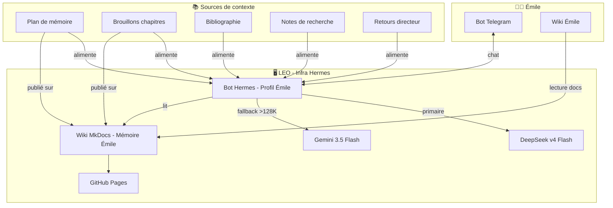
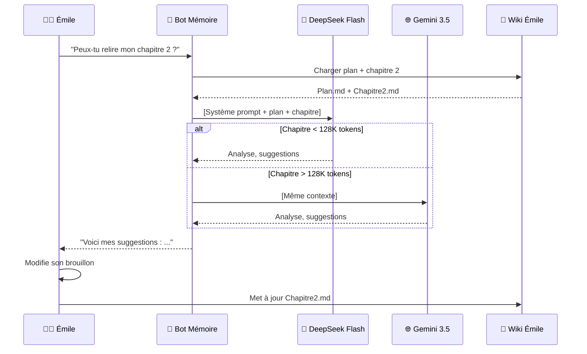
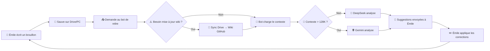
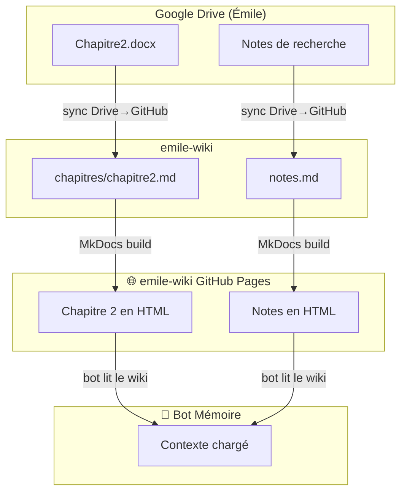
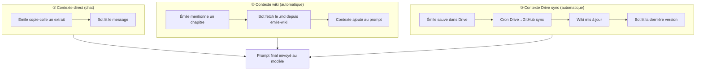
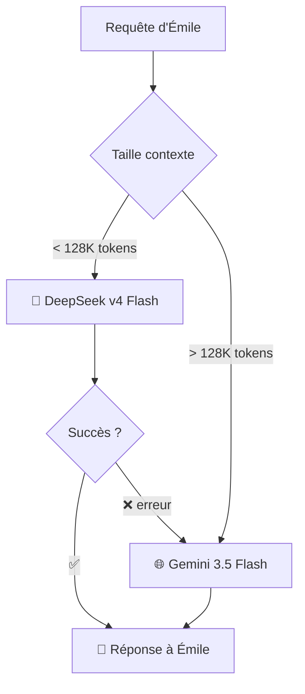

# Analyse — Bureau Émile : Assistant Pédagogique + Wiki + Sources

**Bureau :** Michel — Infra_Hermes 🔧 | **Version :** v2.0
**Date :** 25/06/2026 | **Type :** Analyse (①→③→⑤→⑥→⑦)

---

## 💳 Coût du service BAVI LEO

| Métrique | Valeur |
|:---------|------:|
| Sessions LEO | 1 |
| Tokens consommés | ~15K IN · ~6K OUT |
| Coût DeepSeek réel | **~0,02 €** |
| Frais de service BAVI LEO | 1,00 € |
| **Total facturé** | **1,02 €** |

---

## ① CADRAGE

**Demande complète :**
Mettre à jour le document avec les nouvelles informations sur les profils/bots et la technologie utilisée.

**Utilisatrice :** Émile, étudiante en sciences de l'éducation
**Livrable final :** Mémoire de fin d'études (50-150 pages)

---

## ③ PRODUCTION

### Ajouter les détails spécifiés en réalité à l'architecture globale.



### Le Bot Telegram — Fonctionnement



### Session type — Cycle complet



### Le Wiki Émile — Structure

Un wiki MkDocs dédié, hébergé sur GitHub Pages, accessible 24/7. Même pattern que les autres wikis BAVI (voyages, OCA, hermes-wiki).

```
emile-wiki/                      → Nouveau dépôt GitHub
├── docs/
│   ├── index.md                 → Accueil : présentation, mode d'emploi
│   ├── plan.md                  → Plan du mémoire (problématique, axes)
│   ├── chapitres/
│   │   ├── chapitre1.md         → Introduction
│   │   ├── chapitre2.md         → Cadre théorique
│   │   ├── chapitre3.md         → Méthodologie
│   │   ├── chapitre4.md         → Résultats
│   │   └── chapitre5.md         → Discussion
│   ├── bibliographie.md         → Références (format APA)
│   ├── notes.md                 → Notes de recherche, idées
│   └── retours-directeur.md     → Commentaires du directeur de mémoire
├── mkdocs.yml                   → Configuration MkDocs Material
└── .github/workflows/deploy.yml → Déploiement auto sur GitHub Pages
```

**URL :** `https://christophedanhier-hash.github.io/emile-wiki/`



### Sources et alimentation du contexte

Le bot a besoin de contexte pour être pertinent. Trois mécanismes :



| Mécanisme | Quand | Avantage | Inconvénient |
|---|---|---|---|
| ① Direct | Questions rapides, petits extraits | Immédiat | Limité en taille, manuel |
| ② Wiki | Relecture de chapitre complet | Automatique, versionné | Nécessite wiki à jour |
| ③ Drive sync | Émile travaille hors ligne, synchro ensuite | Transparent pour Émile | Latence (cron) |

### Règle de bascule DeepSeek → Gemini



---

## ⑤ SYNTHÈSE

🟢 **Go — Écosystème complet prêt à déployer**

L'architecture couvre tout le cycle :
1. **Émile écrit** → ses brouillons (Word, Google Docs)
2. **Sync automatique** → Drive → GitHub → wiki MkDocs
3. **Bot Telegram** → lit le wiki, charge le contexte, assiste via DeepSeek
4. **Fallback Gemini** → si chapitre > 128K tokens (~100 pages)
5. **Émile corrige** → cycle recommence

**Points forts :**
- Wiki dédié accessible 24/7 (GitHub Pages, gratuit)
- Bot toujours à jour (lit le wiki, pas de copier-coller)
- Pattern éprouvé (bot voyage Sylvie + sync Drive existante)
- Émile garde le contrôle total de son contenu

---

## ⑥ LIVRABLE — Plan d'implémentation

| # | Action | Priorité | Effort |
|---|--------|:--------:|:------:|
| 1 | Créer le dépôt `emile-wiki` sur GitHub | 🔴 Haute | 15min |
| 2 | Créer la structure MkDocs + template | 🔴 Haute | 30min |
| 3 | Déployer GitHub Pages | 🔴 Haute | 10min |
| 4 | Créer le profil Hermes « Émile » + système prompt | 🔴 Haute | 2h |
| 5 | Connecter le bot au wiki (lecture .md) | 🔴 Haute | 1h |
| 6 | Ajouter la sync Drive → emile-wiki (cron/n8n) | 🟡 Moyenne | 1h |
| 7 | Configurer fallback Gemini 3.5 (>128K) | 🟡 Moyenne | 30min |
| 8 | Test réel avec Émile — session relecture | 🔴 Haute | 1h |
| 9 | Ajouter emile-wiki à la nav BAVI LEO | 🟢 Basse | 15min |

---

## ⑦ ARCHIVAGE

- **Fichier :** `~/Projets_Dev/hermes-christophe/BAVI/AGENT-PRO/bureau-michel/analyse-bureau-memoire-20260625.md`
- **Wiki BAVI :** Agent Pro → Bureau Michel — Infra_Hermes
- **Dépôt à créer :** `emile-wiki` → ✅ [Créé](https://github.com/christophedanhier-hash/emile-wiki) le 26/06/2026
- **Dossier Drive :** `bavi/bureau-emilie` → ✅ Créé et partagé avec Émile le 26/06/2026 — elle y dépose ses documents (brouillons, notes, sources)
- **Profil Hermes à créer :** `emile` (ou intégré au bot existant)

---

## 📋 Avancement final (26/06/2026) — ✅ IMPLÉMENTÉ

| # | Action | Statut |
|---|--------|:------:|
| 0 | Dossier Drive `bavi/bureau-emilie` partagé avec Émile | ✅ |
| 1 | Dépôt `emile-wiki` + structure MkDocs (12 fichiers) | ✅ |
| 2 | GitHub Pages déployé | ✅ |
| 3 | Profil Hermes `emile` + SOUL.md + fallback Gemini | ✅ |
| 4 | Skill `bureau-emile` | ✅ |
| 5 | Nav BAVI LEO + page wiki bureau | ✅ |
| 6 | Bot Telegram `@Bureau_ia_emilie_bot` | ✅ |
| 7 | Gateway s6-supervisé + polling Telegram | ✅ |
| 8 | Cron Drive sync → emile-wiki (placeholder) | ✅ |
| 9 | Test réel — Christophe travaille avec le bot | ✅ En cours |

**URLs actives :**
- 🤖 Bot : [@Bureau_ia_emilie_bot](https://t.me/Bureau_ia_emilie_bot)
- 📖 Wiki : https://christophedanhier-hash.github.io/emile-wiki/ (HTTP 200)
- 🧠 Profil : `~/.hermes/profiles/emile/` (DeepSeek Flash + Gemini fallback, s6-supervisé)
- 📁 Drive : `bavi/bureau-emilie` (partagé avec Émilie Danhier)
- 🏛️ BAVI LEO : nav `🎓 Bureau Émile — Mémoire`

**Profil technique :**
- Modèle : DeepSeek v4 Flash (primaire) → Gemini 3.5 Flash (fallback >128K)
- Gateway : s6-supervisé (`/run/service/gateway-emile`)
- Token : stocké dans `~/.hermes/profiles/emile/.env`
- Logs : `~/Projets_Dev/logs/gateways/emile/`

*Analyse produite par BAVI LEO — Bureau Michel — Infra_Hermes 🔧 — 25/06/2026, implémenté et documenté 26/06/2026*

> 🤖 Dernier audit : 24/07/2026 à 11:45 (UTC+2)
