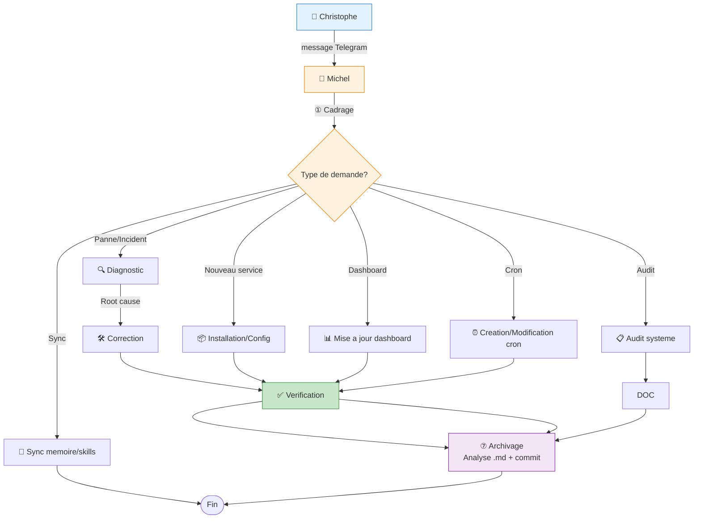
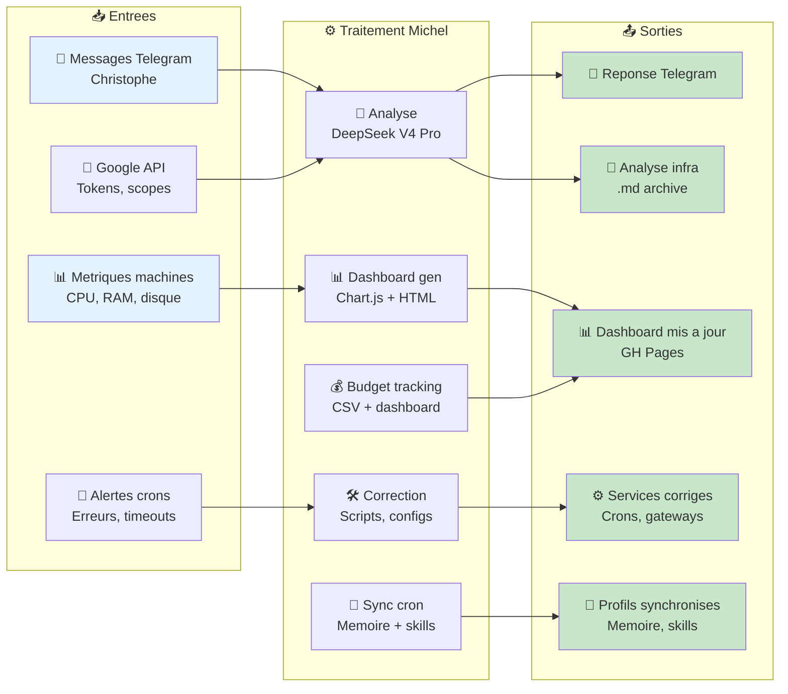
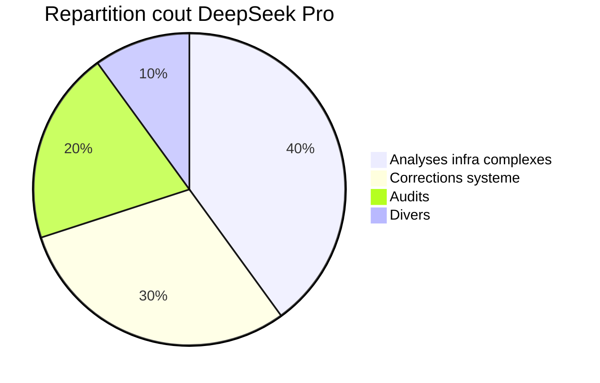
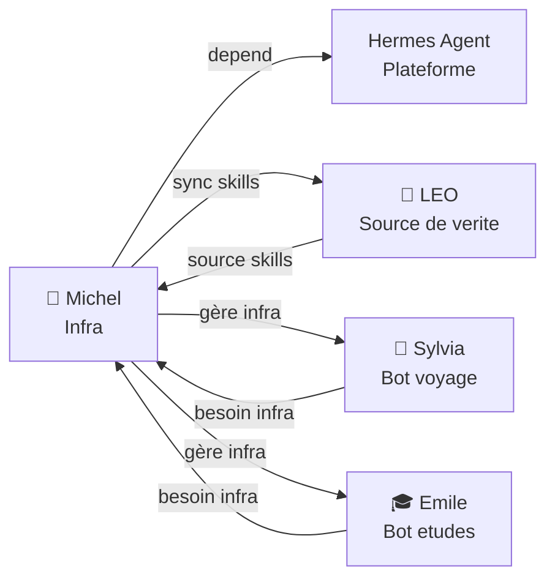

# 🔧 Analyse Business & Fonctionnelle — Michel (Infra_Hermes)

> **Bureau :** 🏛️ Robert — Conseil Stratégique IT | **Date :** 27/06/2026
> **Sujet :** Analyse du bot Michel, infrastructure Hermes, maintenance système

---

## 1. 🎯 Présentation

### 1.1 Contexte

**Michel** (profil `leo-copilot`) est le bot **infrastructure** de l'écosystème BAVI. Il porte le bureau **Michel — Infra_Hermes** et gère tout ce qui touche au fonctionnement technique de la plateforme Hermes Agent : crons, dashboards, Google APIs, Git, skills, budget, machines, réseau.

|Contrairement à LEO (polyvalent/documentation) et Sylvia (voyage), Michel a un scope **purement technique** — il ne fait ni analyses business, ni roadbooks, ni consultations. Michel utilise plusieurs modèles d'IA (DeepSeek, OpenAI, Gemini, Grok, Anthropic) et un modèle local Ollama qwen2.5:7b, selon les besoins.

> 🔑 **Changement majeur (v2)** : Michel dispose désormais de l'**accès root complet** sur la machine LEO (`sudo` sans restriction). Il est devenu le **padron de la machine** et peut tout faire : installation système, configuration Nginx, pare-feu (UFW), DNS, certificats SSL, tunnels Cloudflare, ports réseau — sans dépendre de CodeWhale. L'ère CodeWhale est révolue pour LEO.

### 1.2 Objectifs

| Objectif | Description |
|:---------|:------------|
| 🏗️ **Installer & maintenir** les services système (Nginx, Cloudflare, DNS, SSL, UFW) | CodeWhale remplacé ✅ |
| ⚙️ **Maintenir** l'infrastructure Hermes (39 crons, 8 dashboards) |
| 🛠️ **Dépanner** les services (gateways, conteneurs, SSH, tunnels) |
| 📊 **Surveiller** les machines (LEO, Yoga, Penguin — CPU, RAM, disque) |
| 💰 **Suivre** le budget DeepSeek ($19,46 solde, suivi horaire) |
| 🤖 **Gérer** les bots Telegram (gateways, profils) |
| 🔄 **Synchroniser** les skills et la mémoire entre profils |
| 📋 **Orchestrer** n8n (6 workflows, API REST) |

### 1.3 Public cible

| Utilisateur | Interaction | Fréquence |
|:------------|:------------|:---------:|
| 🧑‍✈️ **Christophe** | Demandes via DM Telegram | Hebdomadaire |
| 🤖 **LEO** (bot central) | Sync skills (30 min) | Continue |
| 🧭 **Sylvia** (bot voyage) | Sync skills (30 min) | Continue |
| 🎓 **Emile** (bot études) | Sync skills (30 min) | Continue |

### 1.4 Chiffres clés

| Indicateur | Valeur |
|:-----------|:------:|
| Modèle | DeepSeek V4 Pro ($2/$8 M tokens) |
| Fallback | Gemini 2.5 Flash |
| Crons gérés | 30 (tous verts) |
| Dashboards | 8 temps réel |
| Machines surveillées | 3 (LEO, Yoga, Penguin) |
| Accès système | `sudo` root complet 🔑 |
| Services système | Nginx, Cloudflare, UFW, SSL, DNS |
| n8n workflows | 6 |
| Skills BAVI | 4 (Michel, Emile, governance, versioning) |
| Budget DeepSeek | $19,46 (dashboard) |

---

## 2. 🏗️ Architecture technique

### 2.1 Diagramme d'architecture

```mermaid
graph TB
    subgraph "📱 Point d entree"
        TG[Telegram<br/>DM Christophe]
    end

    subgraph "🔧 Michel"
        LC[Agent Michel<br/>Profil leo-copilot<br/>DeepSeek V4 Pro]
        SK[Skills<br/>Michel + Emile + governance]
        MB[Memoire sessions]
    end

    subgraph "⚙️ Infrastructure gérée"
        CR[Crons<br/>30 automatismes]
        DB[Dashboards<br/>8 tableaux de bord]
        N8N[n8n<br/>6 workflows]
        GW[Gateways<br/>3 profils Hermes]
    end

    subgraph "🔌 Services système (root access)"
        NG[Nginx<br/>Sites, configs]
        CF[Cloudflare Tunnel<br/>DNS, ingress]
        UF[UFW<br/>Pare-feu ports]
        SS[SSL/Certbot<br/>Certificats TLS]
        PORT[Ports<br/>80, 443, 8081]
    end

    subgraph "🖥️ Machines"
        L[LEO server<br/>457 Go, 20% disque]
        Y[Yoga<br/>Monitoring CPU/RAM]
        P[Penguin<br/>Monitoring CPU/RAM]
    end

    subgraph "🔌 Services"
        OL[Ollama<br/>qwen2.5:7b local]
        CS[Code-server<br/>VS Code web]
        SSH[Tunnels SSH<br/>Conteneur → Host]
        TL[Tailscale<br/>Réseau prive]
    end

    subgraph "🔄 Sync"
        MEM[Sync mémoire<br/>30 min]
        SKL[Sync skills<br/>30 min]
        GA[Google APIs<br/>Gmail, Drive, Sheets]
    end

    TG --> LC
    LC --> CR
    LC --> DB
    LC --> N8N
    LC --> GW
    LC --> NG
    LC --> CF
    LC --> UF
    LC --> SS
    LC --> PORT
    LC --> L
    LC --> Y
    LC --> P
    LC --> OL
    LC --> CS
    LC --> SSH
    LC --> TL
    LC --> MEM
    LC --> SKL
    LC --> GA
```

### 2.2 Stack technique

| Composant | Technologie | Rôle |
|:----------|:------------|:-----|
| **Agent** | Hermes Agent (profil `leo-copilot`) | Exécution infra |
| **Modèle** | DeepSeek V4 Pro ($2/M IN, $8/M OUT) | Inférence complexe |
| **Fallback** | Gemini 2.5 Flash | Si DeepSeek rate-limit |
| **Modèle local** | Ollama qwen2.5:7b | Classification emails (gratuit) |
| **Transport** | Telegram API (bot `@hermes_leo_copilot_bot`) | Interface Christophe |
| **n8n** | API REST locale | Workflows notification |
| **Code** | Code-Server (VS Code web, port 8081) | Développement distant |
| **Réseau** | Tailscale (100.92.102.28) | Accès privé machines |
| **Budget** | Dashboard Hermes (port 9119) | Suivi temps réel |
| **Accès système** | `sudo` root complet | Padron machine — remplace CodeWhale ✅ |
| **Skills source** | Sync depuis LEO (profil default) | 30 min |

---

## 3. 🔄 Flux fonctionnels

### 3.1 Processus de travail — BPMN

### 3.2 Flux de données

### 3.3 Workflow par type de livrable

```mermaid
flowchart TD
    subgraph "📄 Analyse infra"
        A1[① Cadrage] --> A3[③ Production]
        A3 --> A5[⑤ Synthese]
        A5 --> A6[⑥ Livrable]
        A6 --> A7[⑦ Archive .md]
    end
    
    subgraph "📊 Dashboard"
        C1[Collecte metriques] --> T1[Traitement Python]
        T1 --> P1[Publication GH Pages]
    end
    
    subgraph "🛠️ Correction"
        D1[Diagnostic] --> D2[Script correction]
        D2 --> D3[Verification]
        D3 --> D4[Documentation]
    end
```

---

## 4. 💳 Modèle économique

### 4.1 Coûts de fonctionnement

| Poste | Coût | Fréquence |
|:------|:----:|:---------|
| **DeepSeek V4 Pro** (inférence) | ~0,10 €/tâche complexe | Hebdomadaire |
| **Gemini Flash** (fallback) | **0 €** (cap 100 €/mois offert) | Rare |
| **Ollama** (classification) | **0 €** (local) | Continue |
| **n8n** (workflows) | **0 €** (self-hosted) | Continue |
| **Code-Server** (VS Code) | **0 €** (local) | Continue |
| **Total mensuel** | **~2-5 €** | |

### 4.2 Répartition du coût DeepSeek Pro

### 4.3 Facturation

| Service | Tarif | Note |
|:--------|:-----:|:-----|
| Correction infra (panne, cron, gateway) | Inclus | Maintenance courante |
| Audit système complet | 5,00 € | Forfait BAVI |
| Mise à jour dashboard | Inclus | Maintenance courante |
| Ajout nouveau service | 5,00 € | Installation + config |
| Sync memory/skills | **0 €** | Automatisé (cron) |

---

## 5. 🚫 Périmètre fonctionnel

### 5.1 Ce que Michel fait

| Fonction | Statut | Détail |
|:---------|:------:|:-------|
| **🚀 Services système** | ✅ Nouveau (v2) | Installation Nginx, Cloudflare Tunnel, DNS, UFW, SSL — remplace CodeWhale |
| Maintenance crons (30) | ✅ Actif | Création, debug, staggering |
| Dashboards temps réel | ✅ Actif | 8 dashboards Chart.js |
| n8n workflows | ✅ Actif | 6 workflows, API REST |
| Google APIs | ✅ Actif | Gmail, Drive, Sheets, tokens |
| Git repos (10) | ✅ Actif | Clean trees, sync, push |
| Hermes config | ✅ Actif | Profils, version, gateways |
| Sync mémoire/skills | ✅ Actif | Cross-profil (30 min) |
| Budget tracking | ✅ Actif | DeepSeek credits |
| Machines monitoring | ✅ Actif | CPU, RAM, disque (3 machines) |
| Ollama local | ✅ Actif | qwen2.5:7b classification |
| Code-Server | ✅ Actif | VS Code web, port 8081 |
| Tunnels SSH | ✅ Actif | Conteneur → Host |
| Réseau Tailscale | ✅ Actif | Connectivité privée |

### 5.2 Ce que Michel ne fait pas

| Fonction | Raison | Qui le fait |
|:---------|:-------|:------------|
| Rédaction documents voyage | Hors scope | 🧭 Sylvia |
| Analyses stratégiques IT | Hors scope | 🏛️ Robert/LEO |
| Consultations médicales | Hors scope | 🩺 Virginie |
| Documentation T600 | Hors scope | 📝 Gérard |
| Envoi emails personnels | Hors scope | 🤖 LEO |
| Mise à jour documentation wiki | Hors scope | 🤖 LEO |

---

## 6. 📊 Indicateurs clés

| KPI | Valeur | Objectif |
|:----|:------:|:--------:|
| Crons verts | 30/30 | 100 % |
| Dashboards répondant | 8/8 | 100 % |
| Temps moyen correction incident | <30 min | <1h |
| Uptime gateways | 100 % (depuis v0.17.0) | >99,5 % |
| Sync skills OK | 4/4 | 100 % |
| Budget DeepSeek | $19,46 | >$10 toujours |
| Disque LEO | 83 Go/457 Go (20%) | <80 % |
| Tunnels SSH actifs | 1 | 1 |

---

## 7. 🔗 Relations avec les autres bots

---

## 8. 📈 Évolutions possibles

| Évolution | Impact | Complexité |
|:----------|:------:|:----------:|
| 🔔 Système d'alertes temps réel (webhook) | Fort | Moyenne |
| 📊 Dashboard unique consolidé | Moyen | Faible |
| 🤖 Auto-heal des crons (déjà partiel) | Fort | Élevée |
| 🐳 Gestion complète des services système (Nginx, Cloudflare, UFW) | ✅ **Fait (v2)** | Remplace CodeWhale |
| 🌐 API status publique | Moyen | Faible |
| 📱 App mobile monitoring | Faible | Élevée |

---

## Versions

| Version | Date | Auteur | Description |
|:--------|:-----|:-------|:------------|
| v1 | 27/06/2026 | LEO + Robert | Version initiale — analyse business Michel |
| v2 | 28/06/2026 | LEO + Robert | 🚀 Michel devient padron machine — accès root complet, plus de dépendance CodeWhale |

---

*Analyse produite par 🏛️ Bureau Robert — BAVI LEO*

> 🤖 Dernier audit : 20 July 2026 à 09:15 (UTC+2)

