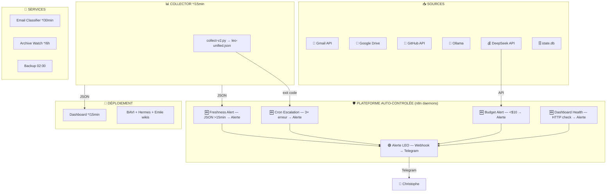
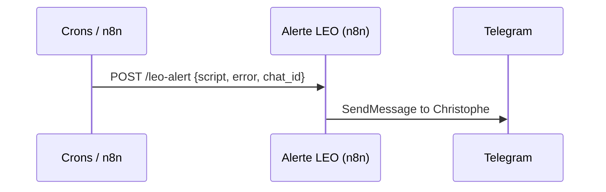

# 🏗️ Architecture des Processus — Bureau Michel

> Analyse BPMN v2 — 01/07/2026 19:15 — 14 crons + 3→5 workflows n8n
> **Statut réel : 15/15 tests OK** (test-all-processes.py)

## 🩺 Diagnostic n8n (01/07 — 19:00)

| Finding | Impact | Correction |
|---|---|---|
| Token GitHub expiré dans credential | 12/14 échecs (85.7%) sur Drive→Issue | Token mis à jour → test OK |
| Alerte LEO inactif | Aucune alerte Telegram depuis le crash | Réactivé |
| Gardien du Drive OK | 2/2 succès | RAS |

## 🔄 Vue d'ensemble — Data Flows v2



## 🛡️ Daemons n8n — Plateforme auto-contrôlée

La couche de contrôle est désormais dans **n8n** (pas de tokens LLM, tracing natif, exécutions traçables) :

| # | Daemon | Trigger | Action |
|---|---|---|---|
| 1 | **Alerte LEO** | Webhook `/leo-alert` | Forward vers Telegram |
| 2 | **Data Freshness** | Schedule */5min | Si leo-unified.json > 15min → POST Alerte LEO |
| 3 | **Budget Alert** | Schedule 2×/jour | Si balance < $10 → POST Alerte LEO |
| 4 | **Cron Error Escalation** | Schedule */15min | Si cron en erreur 3× consécutives → POST Alerte LEO |
| 5 | **Dashboard Health** | Schedule */5min | Si dashboard HTTP ≠ 200 → POST Alerte LEO |

## ⏱️ Chronogramme

```mermaid
gantt
    title Cycles d'exécution (1h)
    dateFormat mm
    axisFormat %M min
    
    section Data (crons)
    Collector v2 (LLM)    :00, 15, 30, 45, 1min
    
    section Deploy (crons)
    Dashboard              :02, 17, 32, 47, 1min
    
    section Monitoring (n8n)
    Freshness Alert        :00, 05, 10, 15, 20, 25, 30, 35, 40, 45, 50, 55, 1min
    Dashboard Health       :00, 05, 10, 15, 20, 25, 30, 35, 40, 45, 50, 55, 1min
    Cron Escalation        :00, 15, 30, 45, 1min
    Budget Alert           :crit, 08:00, 1min
    
    section Services (crons)
    Email Classifier       :00, 30, 1min
    Archive Watch          :6h, crit,
```

## 🔗 Alerte LEO — Point d'entrée unique



Toutes les alertes passent par ce webhook. Un seul point de contrôle, une seule config Telegram.

## 🧪 Suite de tests — 15/15 OK

```bash
python3 /opt/data/scripts/test-all-processes.py
# ✅ 15/15 tests OK — infra, data, monitoring, services
```

| Couche | Tests | Statut |
|---|---|---|
| Infra | Docker, n8n, Ollama, Gateway, Disk, RAM | 7/7 ✅ |
| Data | Collector, Freshness, Dashboard | 3/3 ✅ |
| Monitoring | Crons, Builds, Archives | 3/3 ✅ |
| Services | Email, BAVI wiki | 2/2 ✅ |
