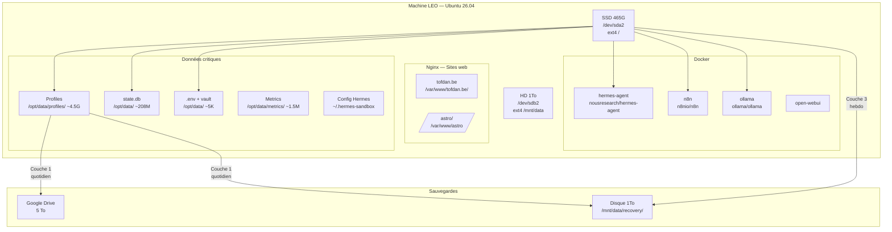
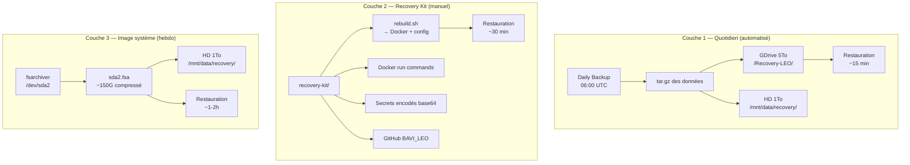
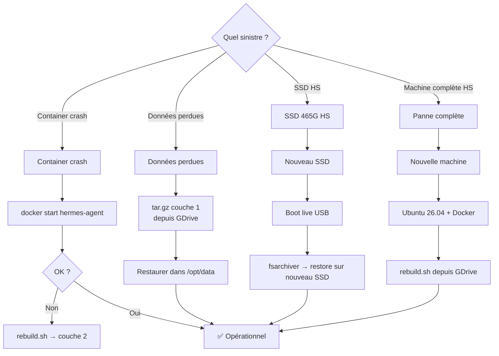

# 🛡️ Plan de Reprise d'Activité (PRA) — LEO Infrastructure

> **Machine** : LEO (`tofdan-System-Product-Name`) · Ubuntu 26.04
> **Disques** : SSD 465G (`/dev/sda2`) + HD 1To (`/dev/sdb2 → /mnt/data`)
> **Stockage distant** : Google Drive 5To
> **Dernière mise à jour** : 2026-06-29

---

## 📋 Sommaire

1. [Architecture physique](#-architecture-physique)
2. [Analyse des risques](#-analyse-des-risques)
3. [Stratégie 3 couches](#-stratégie-3-couches)
   - [Couche 1 — Snapshots quotidiens (automatisé)](#couche-1--snapshots-quotidiens-automatisé)
   - [Couche 2 — Recovery Kit](#couche-2--recovery-kit)
   - [Couche 3 — Image système](#couche-3--image-système)
4. [Arbre de décision — Que faire selon le sinistre](#-arbre-de-décision)
5. [Commandes détaillées](#-commandes-détaillées)
6. [Fichiers & structure des sauvegardes](#-fichiers--structure-des-sauvegardes)

---

## 🖥️ Architecture physique



---

## ⚠️ Analyse des risques

| Scénario | Probabilité | Impact | Solution |
|----------|-------------|--------|----------|
| Container arrêté | Faible | Moyen — session perdue | `docker start hermes-agent` ou `rebuild.sh` |
| Nginx arrêté | Faible | Moyen — tofdan.be down | `nsenter -t 1 -m -u -i -n -p -- nginx -s reload` |
| Données corrompues | Moyenne | Élevé — profils, db, secrets | **Couche 1** — restauration depuis tar.gz |
| SSD 465G HS | Faible | Critique — tout perdu | **Couche 3** — image système sur /mnt/data |
| Panne complète machine | Faible | Critique | **Couche 1** (GDrive) → nouvelle install → rebuild |
| Site web tofdan.be corrompu | Faible | Bas — site public | `git pull` depuis `tofdan-site` repo |
| Erreur humaine | Moyenne | Variable | **Couche 1** — retour arrière possible |

---

## 🎯 Stratégie 3 couches



---

### Couche 1 — Snapshots quotidiens (automatisé)

**Fréquence** : quotidien (06:00 UTC via cron `7bf35cc1d5d8`)

**Contenu du snapshot** (`leo-recovery-YYYY-MM-DD.tar.gz`):

```
/opt/data/
├── profiles/              ← configs, skills, memory
├── .env                   ← secrets DeepSeek, Google
├── credentials_vault.json ← tokens
├── metrics/               ← budget, dashboards data
├── state.db              ← sessions Hermes
└── logs/                  ← auto-heal, cron

/home/tofdan/.hermes-sandbox/  ← config hôte

Nginx — sites web :
├── /etc/nginx/sites-available/tofdan.be  ← config site
└── /var/www/tofdan.be/                   ← fichiers statiques (repo git)

Docker inspect de :
├── hermes-agent
├── n8n
├── ollama
└── open-webui
```

**Commandes de backup** :

```bash
#!/bin/bash
# backup-couche1.sh — Snapshot quotidien
# À exécuter depuis le conteneur hermes-agent

DATE=$(date +%Y-%m-%d)
BACKUP_DIR="/host/mnt/data/recovery/couche1"
GDRIVE_FOLDER="Recovery-LEO"

mkdir -p "$BACKUP_DIR"

# 1. Exporter les configs Docker
docker inspect hermes-agent n8n ollama > "$BACKUP_DIR/docker-inspect-$DATE.json"

# 2. Créer l'archive compressée
tar czf "$BACKUP_DIR/leo-recovery-$DATE.tar.gz" \
    -C /opt/data .env credentials_vault.json \
    -C /opt/data profiles metrics state.db \
    -C /host/home/tofdan .hermes-sandbox

# 3. Copier sur le disque 1T
cp "$BACKUP_DIR/leo-recovery-$DATE.tar.gz" "$BACKUP_DIR/couche1-latest.tar.gz"

# 4. Uploader sur GDrive (via Google API)
GAPI="/opt/hermes/.venv/bin/python /opt/data/profiles/leo-copilot/skills/productivity/google-workspace/scripts/google_api.py"
$GAPI drive upload "$BACKUP_DIR/leo-recovery-$DATE.tar.gz" \
    --name "leo-recovery-$DATE.tar.gz" \
    --parent "1un0n5TYA6K14p-YtAnBGIOcpxoxbrGWZ/Recovery-LEO"

# 5. Nettoyer les snapshots > 30 jours
find "$BACKUP_DIR" -name "leo-recovery-*.tar.gz" -mtime +30 -delete
```

**Restauration** :

```bash
# Depuis GDrive ou disque 1T
GAPI drive download FILE_ID --output /tmp/leo-recovery.tar.gz
# ou
cp /host/mnt/data/recovery/couche1/leo-recovery-latest.tar.gz /tmp/

# Restaurer
tar xzf /tmp/leo-recovery.tar.gz -C /opt/data/
# Renouveler les permissions
chown -R hermes:hermes /opt/data/profiles /opt/data/state.db /opt/data/.env
```

---

### Couche 2 — Recovery Kit

**Emplacement** : `/home/tofdan/.hermes-sandbox/recovery-kit/`

**Structure** :

```
recovery-kit/
├── README.md               ← Ce document
├── rebuild.sh              ← Script de reconstruction
├── docker-commands.md      ← Commandes d'exécution
├── secrets.env.b64         ← Secrets encodés en base64
└── checksums.sha256        ← Sommes de contrôle
```

#### Fichier `docker-commands.md`

```markdown
# Docker — Commandes de reconstruction

## hermes-agent (principal)

```bash
docker run -d \
  --name hermes-agent \
  --restart unless-stopped \
  --network host \
  --privileged \
  -v /:/host \
  -v /home/tofdan/.hermes-sandbox:/home/hermes/.hermes \
  -v hermes_data:/opt/data \
  -v /var/run/docker.sock:/var/run/docker.sock \
  nousresearch/hermes-agent:latest \
  sleep infinity
```

## n8n

```bash
docker run -d \
  --name n8n \
  --restart unless-stopped \
  --network host \
  -v n8n_data:/home/node/.n8n \
  n8nio/n8n:latest
```

## ollama

```bash
docker run -d \
  --name ollama \
  --restart unless-stopped \
  --network host \
  -v ollama_data:/root/.ollama \
  ollama/ollama:latest
```
```

#### Sites web — Nginx

**Service** : `nginx` (sur l'hôte, pas dans Docker)

**Site** : `tofdan.be` — astrophotographie statique

| Élément | Valeur |
|---------|--------|
| Serveur | nginx sur l'hôte LEO |
| Domaine | tofdan.be + www.tofdan.be |
| Port | 80 (HTTP) — pas de SSL |
| Racine | `/var/www/tofdan.be/` |
| Sous-dossier | `/astro/ → /var/www/astro/` |
| Config | `/etc/nginx/sites-available/tofdan.be` |
| Source | GitHub `christophedanhier-hash/tofdan-site` |
| Logs | `/var/log/nginx/tofdan.be_*.log` |

**Déploiement** :

```bash
# Depuis le conteneur Hermes
bash /opt/data/scripts/deploy-tofdan.sh

# = git pull + scp vers hôte + chown + nginx reload
```

**Redémarrage** :

```bash
# Depuis le conteneur Hermes (via nsenter)
nsenter -t 1 -m -u -i -n -p -- systemctl reload nginx
# ou directement sur l'hôte
sudo systemctl reload nginx
```

**Restauration complète** :

```bash
# 1. Installer nginx
apt-get install -y nginx

# 2. Copier la config
cp /mnt/data/recovery/couche1/nginx-tofdan.be.conf /etc/nginx/sites-available/tofdan.be
ln -s /etc/nginx/sites-available/tofdan.be /etc/nginx/sites-enabled/

# 3. Restaurer les fichiers du site
git clone https://github.com/christophedanhier-hash/tofdan-site.git /var/www/tofdan.be/
# ou depuis le backup
cp -r /mnt/data/recovery/couche1/tofdan-site/ /var/www/tofdan.be/

# 4. Permissions + reload
chown -R www-data:www-data /var/www/tofdan.be/
systemctl reload nginx
```

**Note sécurité** : tofdan.be n'est **pas en HTTPS**. La config SSL n'est pas activée (pas de certificat Let's Encrypt). Si la conformité HTTPS est nécessaire, ajouter un certificat via Certbot. Pour l'instant Cloudflare peut faire office de terminaison SSL si le domaine passe par leur proxy DNS.

#### Fichier `rebuild.sh`

```bash
#!/bin/bash
# rebuild.sh — Reconstruction complète de LEO
set -e

echo "=== LEO Recovery — Rebuild ==="

# 1. Restaurer les données
echo "[1/5] Restauration des données..."
tar xzf /mnt/data/recovery/couche1/leo-recovery-latest.tar.gz -C /

# 2. Lancer les conteneurs Docker
echo "[2/5] Démarrage des conteneurs..."
docker start hermes-agent n8n ollama 2>/dev/null || {
    echo "Création des conteneurs..."
    # Voir docker-commands.md pour les commandes exactes
}

# 3. Restaurer nginx
echo "[3/6] Restauration nginx..."
if [ -f /mnt/data/recovery/couche1/nginx-tofdan.be.conf ]; then
    cp /mnt/data/recovery/couche1/nginx-tofdan.be.conf /etc/nginx/sites-available/tofdan.be
    ln -sf /etc/nginx/sites-available/tofdan.be /etc/nginx/sites-enabled/
    git clone https://github.com/christophedanhier-hash/tofdan-site.git /var/www/tofdan.be/ 2>/dev/null || true
    chown -R www-data:www-data /var/www/tofdan.be/ 2>/dev/null || true
    systemctl reload nginx 2>/dev/null || nginx -s reload 2>/dev/null || true
    echo "  ✅ tofdan.be restauré"
fi

# 4. Restaurer les secrets
echo "[3/5] Restauration des secrets..."
if [ -f /mnt/data/recovery/kit/secrets.env.b64 ]; then
    base64 -d /mnt/data/recovery/kit/secrets.env.b64 > /opt/data/.env
    chmod 600 /opt/data/.env
fi

# 4. Vérifier les services
echo "[4/5] Vérification des services..."
docker ps | grep -E "hermes-agent|n8n|ollama"
curl -s http://localhost:11434/api/tags > /dev/null && echo "  ✅ Ollama"
curl -s http://localhost:5678/healthz > /dev/null && echo "  ✅ n8n"

# 5. Lancer Hermes
echo "[5/5] Redémarrage Hermes..."
export HERMES_HOME=/opt/data/profiles/leo-copilot
/opt/hermes/.venv/bin/hermes gateway start

echo "=== Rebuild terminé ==="
```

---

### Couche 3 — Image système

**Fréquence** : hebdomadaire (dimanche 03:00)

**Outil** : `fsarchiver` (léger, lent mais fiable)

```bash
#!/bin/bash
# backup-couche3.sh — Image système hebdomadaire

DATE=$(date +%Y-%m-%d)
BACKUP_FILE="/mnt/data/recovery/couche3/leo-sda2-$DATE.fsa"
LATEST_LINK="/mnt/data/recovery/couche3/leo-sda2-latest.fsa"

# Installer fsarchiver si absent
which fsarchiver || apt-get install -y fsarchiver

# Créer l'image du disque système (compressée)
# Attention : la partition ne doit PAS être montée en écriture
# On utilise /proc/mounts pour vérifier
if mount | grep -q "/dev/sda2.*rw"; then
    echo "⚠️ Partition montée en rw — image non cohérente garantie"
    echo "   Pour un snapshot cohérent : arrêter Docker d'abord"
fi

# Création de l'image (compressée, multi-threads)
fsarchiver savefs "$BACKUP_FILE" \
    /dev/sda2 \
    --compress=9 \
    --threads=4 \
    --jobs=4

# Vérifier l'intégrité
fsarchiver archinfo "$BACKUP_FILE" | head -10

# Lien symbolique "latest"
ln -sf "$BACKUP_FILE" "$LATEST_LINK"

echo "✅ Image créée : $BACKUP_FILE"
ls -lh "$BACKUP_FILE"
```

**Restauration** :

```bash
# Remplacer le disque système
# Booter sur un live USB → monter le disque 1T → restaurer
fsarchiver restfs /mnt/data/recovery/couche3/leo-sda2-latest.fsa \
    id=0,dest=/dev/sda2
```

---

## 🌳 Arbre de décision



---

## 💾 Fichiers & structure des sauvegardes

### Sur le disque 1To (/mnt/data)

```
/mnt/data/recovery/
├── couche1/                         ← Snapshots quotidiens
│   ├── leo-recovery-2026-06-29.tar.gz
│   ├── leo-recovery-2026-06-28.tar.gz
│   ├── leo-recovery-latest.tar.gz   ← lien symbolique
│   ├── docker-inspect-2026-06-29.json
│   └── nginx-tofdan.be.conf         ← config nginx exportée
│
├── couche2/                         ← Recovery Kit
│   ├── rebuild.sh
│   ├── docker-commands.md
│   ├── secrets.env.b64
│   └── checksums.sha256
│
├── couche3/                         ← Images système
│   ├── leo-sda2-2026-06-29.fsa
│   ├── leo-sda2-2026-06-22.fsa
│   └── leo-sda2-latest.fsa          ← lien symbolique
│
└── README.md                        ← Ce document
```

### Sur Google Drive

```
Recovery-LEO/
├── leo-recovery-2026-06-29.tar.gz
├── leo-recovery-2026-06-28.tar.gz
├── recovery-kit/
│   ├── rebuild.sh
│   └── docker-commands.md
└── README.md
```

---

## 📊 Estimation des temps de récupération

| Sinistre | Temps | Complexité | Dégradation max |
|----------|-------|------------|-----------------|
| Container arrêté | 1 min | 🟢 Très facile | Session en cours |
| Données corrompues | 15 min | 🟢 Facile | 24h (dernier snapshot) |
| SSD HS | 2h | 🟡 Moyen | 7j (dernière image) |
| Panne machine complète | 1h30 | 🟡 Moyen | 24h + temps install |

---

## ⚡ Actions recommandées immédiatement

1. **Monter le disque 1T** dans le conteneur pour y accéder depuis `/opt` (via bind mount)
2. **Activer le backup quotidien** en couche 1 (renforcer le cron existant)
3. **Créer le recovery-kit** (couche 2) → push sur GitHub
4. **Première image système** (couche 3) → fsarchiver du sda2
5. **Tester la restauration** sur un container de test avant mise en production

> **Note** : L'image système n'est pas une garantie absolue — une reconstruction complète via couche 1 + 2 est plus fiable et plus rapide qu'une restauration d'image. La couche 3 est une sécurité supplémentaire pour le cas où le SSD physique lâche.

> 🤖 Dernier audit : 24/07/2026 à 07:59 (UTC+2)
