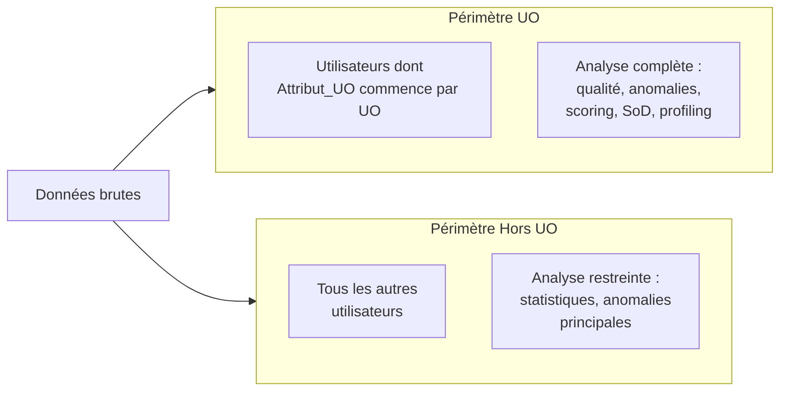
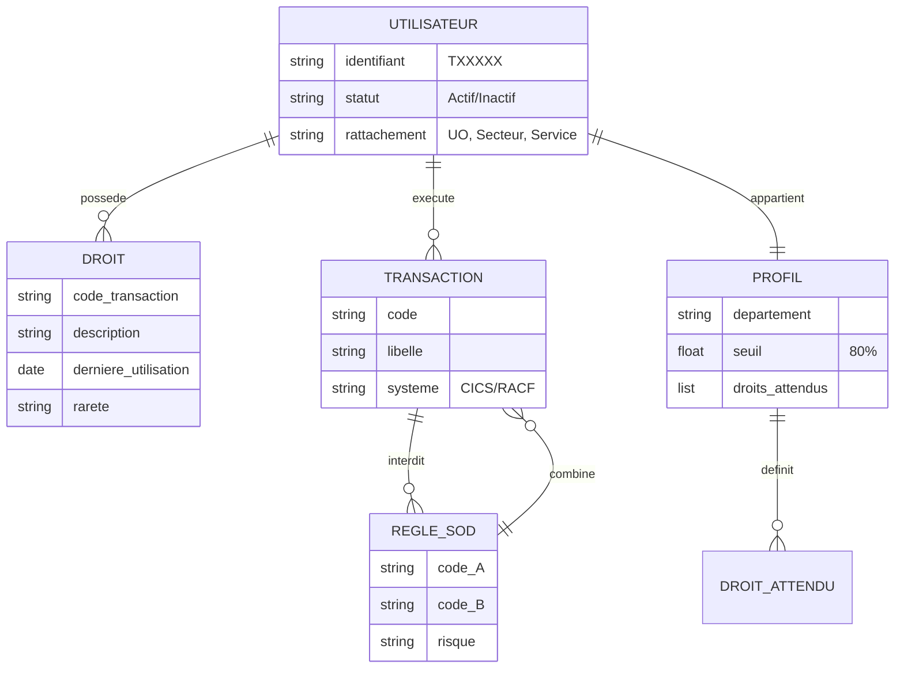
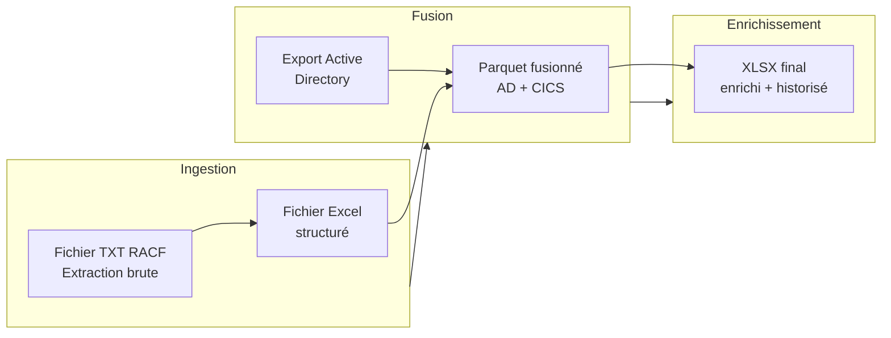
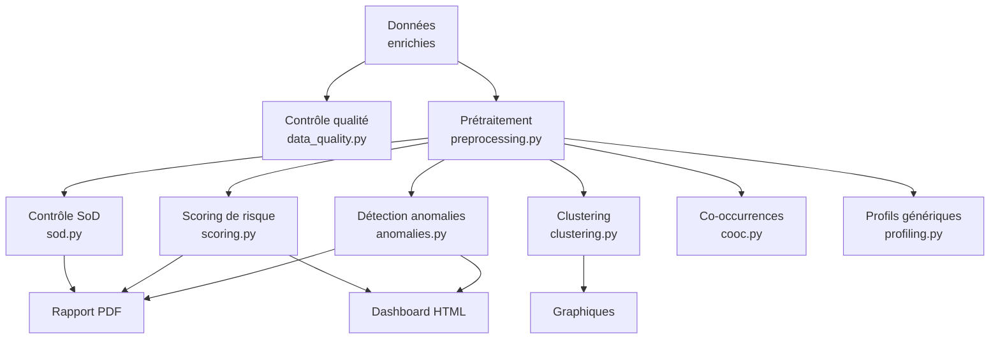
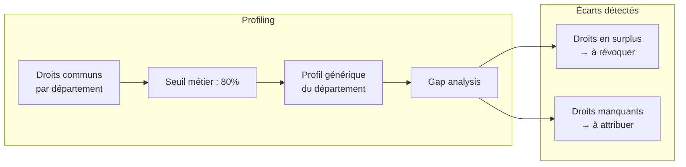
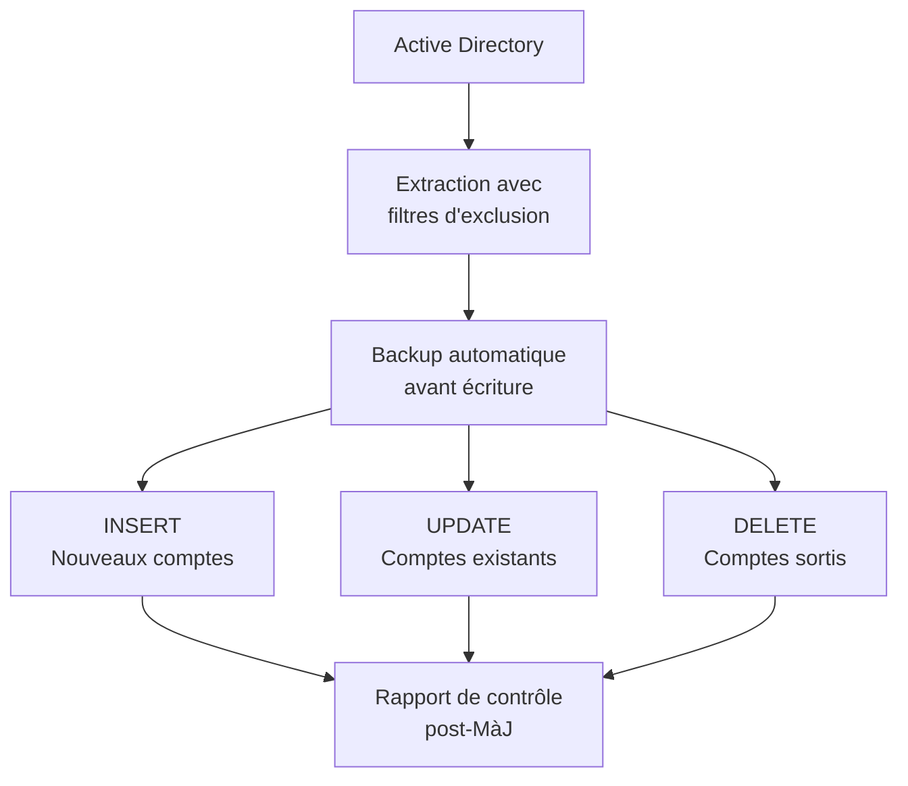
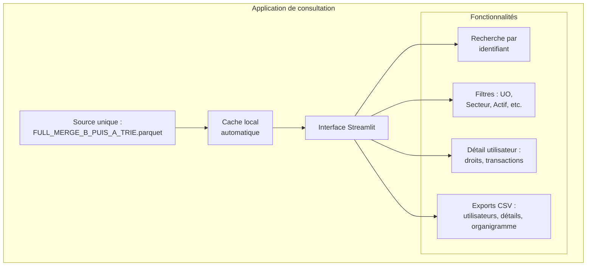
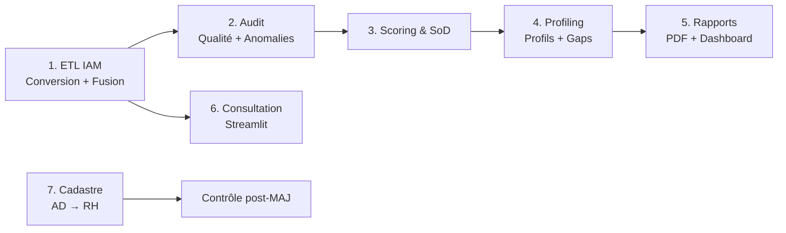

# 📐 Analyse Métier & Fonctionnelle — AUDIT IAM ETL SOLIDARIS

> **Projet :** Audit IAM — Identity & Access Management Solidaris
> **Version document :** v1 — Refonte des documents BUSINESS_ANALYSIS.md + FUNCTIONAL_ANALYSIS.md
> **Date :** 21/07/2026

---

## 1. Finalité métier

Le projet vise à **maîtriser les accès IAM** en rapprochant les données RH (Active Directory), les accès techniques (CICS/RACF) et les règles de contrôle interne Solidaris.

### Objectifs stratégiques

| Objectif | Description | Bénéfice |
|:---------|:------------|:---------|
| 🎯 **Identifier** qui accède à quoi | Cartographie complète des droits par utilisateur | Visibilité transverse |
| ⚠️ **Détecter** les anomalies et comptes à risque | Scoring, SoD, inactifs avec droits | Réduction des risques |
| 📊 **Produire** des livrables auditables | PDF, dashboard HTML, exports CSV/XLSX | Conformité et traçabilité |
| 📋 **Maintenir** un cadastre RH aligné sur l'AD | Synchronisation AD → cadastre | Référentiel fiable |

---

## 2. Périmètres d'analyse



| Périmètre | Critère | Traitement |
|:----------|:--------|:-----------|
| **UO** | Attribut_UO commence par "UO" | Analyse complète (qualité, anomalies, scoring, SoD, clustering, profiling, rapports) |
| **Hors UO** | Tous les autres | Analyse restreinte (statistiques, anomalies principales) |

---

## 3. Entités du domaine



### Entités principales

| Entité | Définition | Source |
|:-------|:-----------|:-------|
| **Utilisateur** | Personne identifiée par un matricule TXXXXX | AD + RACF |
| **Code transaction** | Droit technique accordé à un utilisateur | RACF (CICS) |
| **Usage** | Dernière utilisation d'un code transaction | Logs CICS |
| **Profil générique** | Droits standards attendus par département | Calculé (seuil 80%) |
| **Règle SoD** | Combinaisons de droits incompatibles | Configuration (`sod_rules.json`) |

---

## 4. Modules fonctionnels

### 4.1 ETL IAM — Pipeline de données



**3 scripts :**
1. `Convertir_TXT_en_Excel_1.py` — Conversion du TXT RACF brut en table exploitable
2. `Merge_A_et_B_Step_1.py` — Jointure AD + CICS, production du Parquet de fusion
3. `Merge_Step_2.py` — Enrichissement par transactions + historisation

**Sorties intermédiaires :**
- `data/etl/FULL_MERGE_B_PUIS_A_TRIE.parquet` — Source pour l'application de consultation
- `data/processed/FULL_MERGE_STEP_2.xlsx` — Source pour l'audit et le profiling

---

### 4.2 Audit & Data Science — Moteur d'analyse



**Modules :**

| Module | Rôle | Algorithme / Méthode |
|:-------|:-----|:---------------------|
| **data_quality.py** | Audit qualité des données | Statistiques descriptives, taux de nullité, doublons |
| **anomalies.py** | Détection d'anomalies d'accès | Écarts interquartiles, seuils dynamiques |
| **scoring.py** | Score de risque combiné | Volume + rareté + malus inactifs |
| **sod.py** | Séparation des tâches | Détection de couples interdits (via `sod_rules.json`) |
| **clustering.py** | K-Means + optimisation Silhouette | Segmentation des profils d'accès |
| **cooc.py** | Co-occurrences + graphe NetworkX | Analyse des paires de droits fréquentes |
| **profiling.py** | Profils génériques + gap analysis | Droits communs par département (seuil 80%) + écarts |

### 4.3 Profiling métier — Génération de profils

Le profiling identifie les **droits attendus** par département et les **écarts** (surplus et manquants) :



### 4.4 ETL Cadastre — Synchronisation RH



**Filtres d'exclusion sur l'extraction AD :**
- Types de comptes non pertinents
- Attributs techniques exclus
- Companies autorisées uniquement

**3 scripts :**
1. `MAJ_Cadastre_AD.py` — Synchronisation AD → cadastre (INSERT/UPDATE/DELETE)
2. `MAJ_Cadastre_UO.py` — Mise à jour ciblée des étiquettes UO
3. `Controle_Cadastre.py` — Rapport de contrôle post-mise à jour

### 4.5 Consultation Streamlit — Application de bureau



**Mécanisme de résolution du chemin de la source Parquet :**

```
1. parquet_path_candidates (config.json)
2. parquet_path (config.json)
3. IAM_DATA_PARQUET (variable d'environnement)
4. Chemins locaux relatifs (fallback)
```

**Cache local :**
- Copie locale si source distante accessible
- Réutilisation si signature inchangée
- Rafraîchissement automatique sinon
- Boutons de forçage : « Forcer le rafraîchissement » / « Remettre le cache à zéro »

---

## 5. Règles métier

### 5.1 Scoring de risque

Le score combine 3 facteurs :

```
Score = volume_droits × rareté × malus_inactif
```

| Facteur | Pondération | Description |
|:--------|:-----------:|:------------|
| **Volume de droits** | Pondéré | Plus un utilisateur a de droits, plus le score est élevé |
| **Rareté des droits** | Pondéré | Les droits peu attribués augmentent le score |
| **Malus inactif** | Multiplicatif | Compte inactif avec droits → score x2 |

### 5.2 Séparation des tâches (SoD)

Le moteur vérifie les **couples de transactions interdits** définis dans `data/config/sod_rules.json`. Si un utilisateur possède les deux transactions d'un couple, il est signalé.

Fichier de règles : `data/config/sod_rules.json`

```json
{
  "sod_rules": [
    {"code_A": "TRANS01", "code_B": "TRANS02", "risque": "Élevé"},
    {"code_A": "TRANS03", "code_B": "TRANS04", "risque": "Moyen"}
  ]
}
```

### 5.3 Profil générique

Le profil d'un département est dérivé des droits communs avec un **seuil métier de 80%** : un droit fait partie du profil si au moins 80% des utilisateurs du département le possèdent.

### 5.4 Cadastre AD

La mise à jour du cadastre applique :
1. **Filtres d'exclusion** sur l'extraction AD (types de comptes, attributs techniques, companies autorisées)
2. **Opérations** : INSERT (nouveaux), UPDATE (existants), DELETE (sortis)
3. **Backup automatique** avant chaque écriture

---

## 6. Flux complet de bout en bout



---

*Document refactoré par Robert 🏛️ — Pool Développement (D4 Analyste + D1 Architecte)*
*Sources : BUSINESS_ANALYSIS.md + FUNCTIONAL_ANALYSIS.md du dépôt GitHub*
*Juillet 2026*

> 🤖 Dernier audit : 24/07/2026 à 12:00 (UTC+2)
