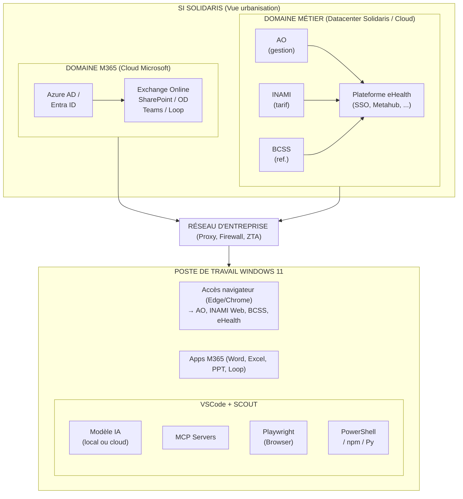
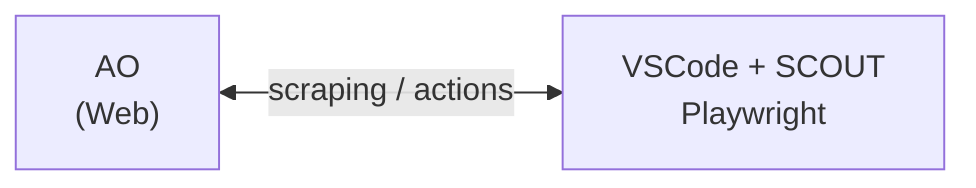
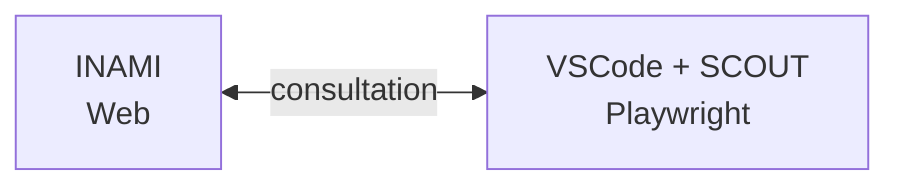
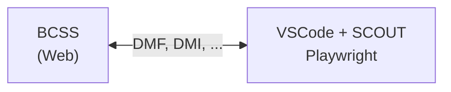
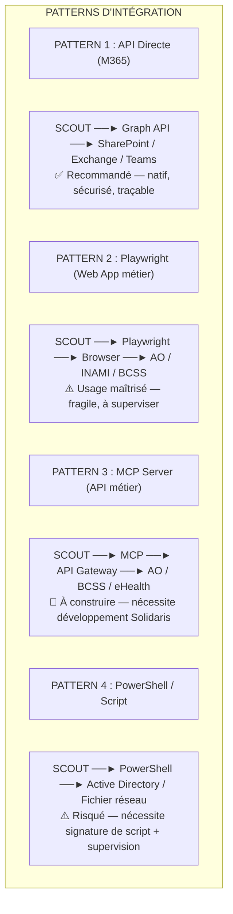
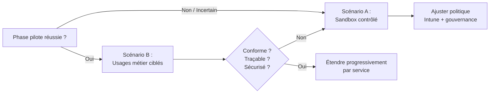
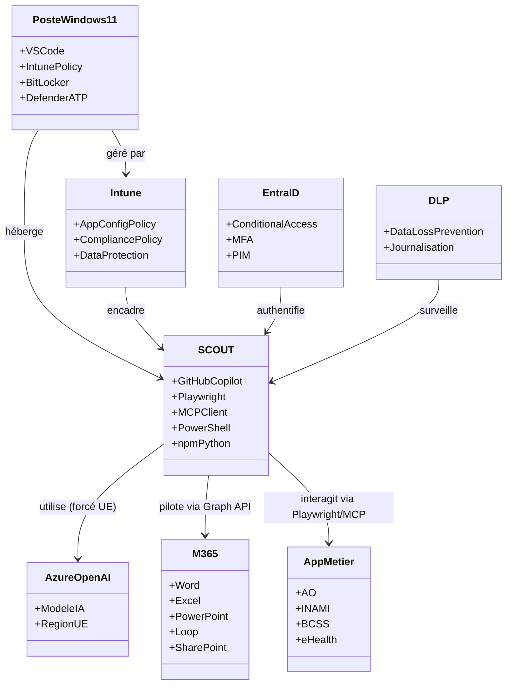

# Analyse d'Architecture SI — Microsoft SCOUT
## Intégration potentielle dans le SI mutualiste Solidaris

**Document :** Architecture SI — Bureau Robert (Expert #1)
**Destinataires :** DSI, architectes SI Solidaris
**Date :** Juillet 2026
**Classification :** Interne — Réflexion stratégique

---

## Sommaire

1. [Résumé exécutif](#1-résumé-exécutif)
2. [Qu'est-ce que Microsoft SCOUT ?](#2-quest-ce-que-microsoft-scout-)
3. [Prérequis techniques](#3-prérequis-techniques)
4. [Schéma d'architecture conceptuel](#4-schéma-darchitecture-conceptuel)
5. [Intégration avec l'existant M365 / Azure / Intune](#5-intégration-avec-lexistant-m365--azure--intune)
6. [Patterns d'intégration avec les applicatifs métier](#6-patterns-dintégration-avec-les-applicatifs-métier)
7. [Impacts sur l'urbanisation du SI](#7-impacts-sur-lurbanisation-du-si)
8. [Analyse du modèle « agent local sur poste Windows »](#8-analyse-du-modèle-agent-local-sur-poste-windows)
9. [Points de vigilance et risques](#9-points-de-vigilance-et-risques)
10. [Recommandations](#10-recommandations)
11. [Annexe — Glossaire](#11-annexe--glossaire)

---

## 1. Résumé exécutif

Microsoft SCOUT est un **agent IA autonome** qui s'exécute **localement** sur un poste Windows 11. Il peut lire/écrire des fichiers, exécuter PowerShell, naviguer sur le web via Playwright, lancer du code Python/Node.js, et piloter les applications M365 (Word, Excel, PowerPoint, Loop). Son architecture repose sur une extension VSCode et est orchestrée via GitHub Copilot.

**Enjeu pour Solidaris :** SCOUT promet une **automatisation de tâches bureautiques et techniques** directement sur le poste de l'agent. Dans un SI mutualiste fortement régulé (loi du 6 août 1990, RGPD, NBB, eHealth), ce modèle pose des questions fondamentales de **sécurité, de gouvernance des données, et de compatibilité avec l'urbanisation existante.**

**Conclusion préliminaire :** SCOUT n'est pas mûr pour un déploiement mutualiste à grande échelle sans un **travail d'encadrement significatif** (sandboxing, politique Intune restrictive, périmètre fonctionnel limité). Son intérêt est réel pour des **usages ciblés et pilotes** (assistance rédactionnelle, traitement de documents standards, scripts PowerShell supervisés). Le déploiement « full open » sur l'ensemble du parc est **déconseillé en l'état.**

---

## 2. Qu'est-ce que Microsoft SCOUT ?

### 2.1 Définition

SCOUT est un **agent IA** développé par Microsoft, intégré à GitHub Copilot, qui transforme VSCode en **hub d'automatisation** sur le poste de travail. Il ne s'agit pas d'un service cloud (bien qu'il utilise des API cloud), mais d'un **processus local** qui orchestre des outils locaux.

### 2.2 Capacités fonctionnelles

| Capacité | Description | Pertinence Solidaris |
|---|---|---|
| **File system local** | Lecture/écriture de fichiers sur le poste | ⚠️ Risque fuite de données mutualistes |
| **PowerShell** | Exécution de commandes et scripts | ✅ Automatisation tâches IT |
| **Playwright (navigateur)** | Contrôle du navigateur web | ⚠️ Peut interagir avec des web apps métier |
| **npm / Python** | Installation et exécution de code | ⚠️ Risque d'introduction de dépendances non maîtrisées |
| **MCP Servers** | Extension via Model Context Protocol | ⚠️ Surface d'attaque extensible |
| **M365 (Word, Excel, PowerPoint, Loop)** | Pilotage des apps bureautiques | ✅ Fort potentiel métier |
| **GitHub Copilot** | Modèle de langage + orchestration | Dépend du modèle sous-jacent |

### 2.3 Modèle économique

- **Licence :** GitHub Copilot Business ou Enterprise (pas inclus dans M365 Copilot)
- **Infrastructure :** Nécessite une Organisation Microsoft Frontier
- **Poste :** Windows 11 uniquement

---

## 3. Prérequis techniques

### 3.1 Prérequis obligatoires

| Composant | Exigence | Statut Solidaris (estimation) |
|---|---|---|
| **OS** | Windows 11 (21H2+) | ✅ Parc majoritairement Windows 11 |
| **Compte M365** | E3/E5 ou équivalent | ✅ Oui |
| **Intune (MDM)** | Politique obligatoire pour SCOUT | ✅ Intune déployé, mais politique SCOUT à créer |
| **Microsoft Frontier** | Organisation déclarée « Frontier » | ❌ À vérifier — dépend du tenant Azure |
| **GitHub Copilot** | Business ou Enterprise (licence séparée) | ❌ Licence additionnelle nécessaire |
| **VSCode** | Dernière version stable | ✅ Déjà déployé dans certaines équipes |
| **Extension SCOUT** | Via marketplace VSCode | ✅ À ajouter au catalogue approuvé |

### 3.2 Complexité du setup Intune

> **Retour d'expérience terrain :** La configuration Intune pour SCOUT n'est pas triviale. Elle implique :
> 1. Création d'une **politique de configuration d'application** spécifique
> 2. Ajout de l'utilisateur/device à un groupe cible
> 3. **Propagation parfois longue** (plusieurs heures)
> 4. **Acceptation explicite** sur le poste client
>
> Dans un environnement mutualiste avec ~2000-4000 postes, le déploiement progressif par vague est impératif.

### 3.3 Dépendances réseau

- **Accès à github.com** et api.github.com (indispensable)
- **Accès aux API M365** (graph.microsoft.com)
- **Accès aux modèles IA** (Azure OpenAI ou modèles tiers selon config)
- **Proxy d'entreprise :** nécessite configuration explicite pour les appels SCOUT

---

## 4. Schéma d'architecture conceptuel



### 4.1 Flux de données SCOUT

```mermaid
flowchart LR
    U[Utilisateur] --> SCOUT[SCOUT (VSCode)]

    SCOUT -->|API GitHub Copilot| IA["Modèle IA<br/>Azure OpenAI / tiers"]
    SCOUT -->|Graph API| M365["Word, Excel,<br/>PPT, Loop,<br/>SharePoint"]
    SCOUT -->|Local| LOCAL["File System,<br/>PowerShell,<br/>Python, npm"]
    SCOUT -->|MCP| MCP_SERV[MCP Servers]
    MCP_SERV --> EXT["Services externes<br/>(SI métier si connectés)"]
    SCOUT -->|Playwright| BROWSER[Navigateur]
    BROWSER --> WEB["Web apps<br/>AO, INAMI,<br/>BCSS, eHealth"]
```

---

## 5. Intégration avec l'existant M365 / Azure / Intune

### 5.1 Azure AD / Entra ID

| Élément | Impact SCOUT |
|---|---|
| **Authentification** | SCOUT utilise le token M365 de l'utilisateur connecté dans VSCode |
| **Conditional Access** | Applicable — peut restreindre SCOUT à certains segments réseau |
| **MFA** | Respecte les politiques MFA existantes via le token |
| **PIM / Privileged Identity** | SCOUT hérite des droits de l'utilisateur — attention aux rôles élevés |

**⚠️ Risque :** Si un utilisateur avec des droits élevés (admin local, délégation) utilise SCOUT, l'agent hérite de ces droits. **Principe de moindre privilège impératif.**

### 5.2 Microsoft Intune

SCOUT nécessite une politique Intune spécifique. Voici ce qu'elle doit encadrer :

| Politique Intune | Recommandation Solidaris |
|---|---|
| **App Configuration Policy** | Créer une politique SCOUT avec paramètres restrictifs |
| **Managed Browser Policy** | Forcer Edge Managed si Playwright utilisé |
| **Data Protection** | Empêcher copie de données mutualistes hors périmètre |
| **Compliance Policy** | Exiger Windows 11 à jour, Defender ATP, BitLocker |
| **Custom Profile** | Bloquer l'exécution de code non signé via SCOUT |

### 5.3 M365 Apps (Word, Excel, PowerPoint, Loop)

C'est le **cas d'usage le plus prometteur** : SCOUT peut :
- Générer un **courrier standardisé** (Word) à partir de données AO
- Mettre à jour un **tableau de suivi** (Excel) avec des données INAMI
- Créer une **présentation** (PowerPoint) pour un comité de gestion
- Orchestrer un **workflow Loop** entre agents solidaris

**Potentiel immédiat :** Automatisation de la production documentaire mutualiste.

---

## 6. Patterns d'intégration avec les applicatifs métier

### 6.1 AO (Application de Gestion des Dossiers — Solidaris)



- **Pattern recommandé :** RPA léger via Playwright (connexion, extraction, mise à jour)
- **Risque :** Le scraping d'AO est fragile — toute évolution de l'UI casse le script
- **Alternative plus robuste :** API AO si disponible (via MCP Server dédié)

### 6.2 INAMI (tarification, attestations)



- **Usage :** Consultation d'attestations, vérification de tarifs
- **Contrainte :** INAMI Web nécessite eHealth / ItsMe — compatible via navigateur contrôlé
- **Limitation :** SCOUT ne gère **pas les identifiants** — le gestionnaire de mots de passe d'entreprise reste nécessaire

### 6.3 BCSS (Banque Carrefour Sécurité Sociale)



- **Usage :** Déclarations DMFA, consultation de données sociales
- **⚠️ Critique :** Les données BCSS sont **hautement sensibles** (RGPD, loi du 15/01/1990). Toute interaction SCOUT doit être **journalisée et tracée.**

### 6.4 eHealth (Plateforme SSO)

| Service eHealth | Intégration SCOUT |
|---|---|
| **Metahub** | Possible via navigateur — authentification eHealth |
| **Recip-e** | Consultation d'historique médicamenteux (⚠️ sensible) |
| **Vitalink** | Partage de données de santé (⚠️ très sensible) |

### 6.5 Schéma récapitulatif des patterns



---

## 7. Impacts sur l'urbanisation du SI

### 7.1 Poste de travail

| Domaine | Impact |
|---|---|
| **OS** | Windows 11 obligatoire — pas de support Windows 10 |
| **VSCode** | Devient un outil de productivité généraliste (plus que simple IDE) |
| **Agent IA permanent** | Processus résident — impact mémoire/CPU à mesurer |
| **Extensions** | SCOUT + MCP = nouvelles extensions à gérer dans le catalogue |
| **Signature de code** | Les scripts Python/npm exécutés par SCOUT doivent-ils être signés ? |
| **Droits utilisateur** | Réévaluation nécessaire — SCOUT ne devrait pas tourner avec des droits admin |

### 7.2 Réseau

| Flux réseau | Impact |
|---|---|
| **github.com** | Nouveau flux sortant — à autoriser au proxy/firewall |
| **api.github.com** | Essentiel pour le fonctionnement de SCOUT |
| **Modèles IA** | Azure OpenAI (recommandé) vs modèles tiers (Gemini, etc.) |
| **MCP externes** | Nouveaux flux potentiels vers des services tiers |
| **Latence** | SCOUT est sensible à la latence API — proxy performant requis |

### 7.3 Sécurité

#### 7.3.1 Gouvernance des données

> **Point critique :** SCOUT peut lire/écrire **n'importe quel fichier** accessible par l'utilisateur sur le poste. Dans un contexte mutualiste, cela inclut :
> - Fichiers contenant des données de santé (RGPD art. 9)
> - Fichiers contenant des données de sécurité sociale (loi 1990)
> - Correspondances sensibles
> - Identifiants et mots de passe (⚠️ SCOUT n'est PAS un password manager mais peut y accéder)

**Recommandation :** Mettre en place une **DLP (Data Loss Prevention)** côté Microsoft 365 pour surveiller les actions SCOUT.

#### 7.3.2 Modèle de menace

| Menace | Probabilité | Impact | Atténuation |
|---|---|---|---|
| Fuite de données via modèle IA tiers | Moyenne | Critique | Forcer Azure OpenAI, pas de modèles externes |
| Exécution de code malveillant via MCP | Faible | Élevé | Politique Intune restrictive, whitelist MCP |
| Détournement de Playwright pour accès non autorisé | Moyenne | Élevé | Désactiver Playwright ou limiter aux URLs approuvées |
| Exfiltration via npm/Python | Faible | Critique | Désactiver installation de packages non approuvés |
| Escalade de privilèges via SCOUT | Faible | Élevé | Principe de moindre privilège |

### 7.4 Journalisation et traçabilité

**Recommandation forte :** Toute action SCOUT sur des données métier doit être :
1. **Journalisée** dans les logs Windows (EventID à définir)
2. **Corrélée** avec le SIEM (Sentinel ou équivalent)
3. **Traçable** jusqu'à l'utilisateur et l'action spécifique
4. **Horodatée** avec précision (obligation légale)

---

## 8. Analyse du modèle « agent local sur poste Windows »

### 8.1 Compatibilité avec un SI mutualiste

| Critère | Analyse | Score |
|---|---|---|
| **Sécurité des données** | L'agent tourne en local — les données ne quittent pas le poste *sauf* si le modèle IA les envoie au cloud. Si Azure OpenAI : données restent dans le périmètre Microsoft (mais pas forcément UE). | ⚠️ |
| **Conformité RGPD** | Possible si : modèle Azure OpenAI région UE + données pseudonymisées + pas de données de santé dans les prompts | ⚠️ |
| **Traçabilité** | Insuffisante en l'état — nécessite ajout de logging applicatif | ❌ |
| **Maintien en condition opérationnelle** | SCOUT évolue vite — les scripts et workflows peuvent casser sans préavis | ⚠️ |
| **Support utilisateur** | Nouveau type d'outil — les utilisateurs auront besoin d'accompagnement | ⚠️ |
| **Gouvernance** | Pas de console d'administration centralisée SCOUT — tout passe par Intune/GitHub | ❌ |

### 8.2 Contraintes identifiées

1. **Pas de « safety bubble » pour les modèles tiers** — si SCOUT est configuré pour utiliser Gemini ou d'autres modèles, les données sortent du périmètre Microsoft
2. **Pas de gestion des identifiants** — SCOUT ne doit pas gérer les mots de passe métier
3. **Licence séparée GitHub Copilot** — pas dans M365 Copilot, coût additionnel à prévoir
4. **Windows 11 uniquement** — pas de support Windows 10 (fin de vie 2025) ni macOS
5. **Pas de console d'administration** — la gouvernance est indirecte (Intune + politiques)

### 8.3 Scénarios de déploiement possibles

```mermaid
flowchart TB
    subgraph SCENARIO_A["Scénario A : " Sandbox contrôlé " (Recommandé pour phase pilote)"]
        A1["Périmètre : 10-20 utilisateurs pilotes (DSI, IT, experts)"]
        A2["Postes : Windows 11, VM ou postes dédiés (pas de production)"]
        A3["SCOUT activé : Oui"]
        A4["Playwright : Désactivé (sauf URLs approuvées)"]
        A5["MCP : Désactivé"]
        A6["Modèle : Azure OpenAI UE uniquement"]
        A7["npm/Python : Désactivé"]
        A8["PowerShell : Limitée aux scripts signés"]
        A9["DLP : Active"]
        A10["Journalisation : Complète (Event Viewer + Sentinel)"]
    end

    subgraph SCENARIO_B["Scénario B : " Usages métier ciblés " (Mise en production prudente)"]
        B1["Périmètre : Par service (déploiement progressif)"]
        B2["Postes : Windows 11 standard, politique Intune dédiée"]
        B3["Usages : Production de documents M365 uniquement"]
        B4["Playwright : Activé pour AO uniquement (URL whitelist)"]
        B5["MCP : MCP serveur interne Solidaris uniquement"]
        B6["Modèle : Azure OpenAI UE"]
        B7["npm/Python : Désactivé"]
        B8["PowerShell : Scripts signés + approuvés"]
    end

    subgraph SCENARIO_C["Scénario C : " Full open " (Déconseillé à ce stade)"]
        C1["Périmètre : Tout le parc"]
        C2["Toutes capacités activées"]
        C3["❌ Risques : fuite de données, exécution non maîtrisée,<br/>non-conformité RGPD, impossibilité de tracer"]
    end
```

---

## 9. Points de vigilance et risques

### 9.1 Risques critiques

| # | Risque | Niveau | Action requise |
|---|---|---|---|
| R1 | **Données de santé exfiltrées** via modèle IA tiers | 🔴 Critique | Forcer Azure OpenAI UE, pas de modèles externes |
| R2 | **Non-conformité RGPD** si les données ne sont pas pseudonymisées dans les prompts | 🔴 Critique | Définir une politique de prompt safe, audit |
| R3 | **Impossibilité de tracer** les actions SCOUT rétroactivement | 🟠 Élevé | Développer un module de logging SCOUT avant déploiement |
| R4 | **Dépendance à l'écosystème GitHub** indisponible | 🟠 Élevé | Prévoir un fallback, SCOUT ne fonctionne pas offline |
| R5 | **Introduction de vulnérabilités** via dépendances npm/Python | 🟠 Élevé | Désactiver l'installation de packages non approuvés |

### 9.2 Questions en suspens pour Microsoft

1. **Où sont exactement traitées les données** lorsque SCOUT utilise Azure OpenAI ? Région UE garantie ?
2. **Quelle est la roadmap** de SCOUT — va-t-il fusionner avec M365 Copilot ? Produit pérenne ?
3. **Comment auditer** les actions d'un agent SCOUT a posteriori ?
4. **Quel modèle de support** Microsoft propose-t-il pour SCOUT en entreprise ?
5. **Y a-t-il un SOC** dédié chez Microsoft pour détecter les abus SCOUT ?

### 9.3 Comparatif : SCOUT vs solutions alternatives

| Critère | SCOUT | Power Automate | RPA traditionnel (UiPath/AA) | Script manuel |
|---|---|---|---|---|
| **Autonomie** | Élevée (IA) | Moyenne (règles) | Élevée | Faible |
| **Facilité de déploiement** | Moyenne | Élevée | Faible | Élevée |
| **Traçabilité** | Faible | Élevée | Élevée | Moyenne |
| **Sécurité** | À encadrer | Bonne | Bonne | Variable |
| **Coût licence** | Moyen (GH Copilot) | Moyen (M365) | Élevé | Nul |
| **Flexibilité** | Très élevée | Moyenne | Élevée | Très élevée |
| **Maturité SI mutualiste** | Faible (nouveau) | Bonne (connu) | Bonne (testé) | Élevée (historique) |

---

## 10. Recommandations

### 10.1 Recommandations immédiates (avant tout déploiement)

1. **🔴 Auditer le périmètre réglementaire**
   - Valider avec le **Délégué à la Protection des Données (DPD)** l'utilisation d'un agent IA local
   - Vérifier la **conformité avec la loi du 6 août 1990** relative aux mutualités
   - Consulter l'**INAMI** sur l'utilisation d'agents IA pour les interactions avec leurs services

2. **🔴 Définir une politique de sécurité SCOUT**
   - Forcer le modèle Azure OpenAI **région UE** (France ou Pays-Bas)
   - **Désactiver les modèles tiers** (Gemini, etc.)
   - Interdire l'installation de **packages npm/Python non approuvés**
   - **Whitelist d'URLs** pour Playwright (AO, INAMI, BCSS, eHealth uniquement)

3. **🟠 Créer une politique Intune dédiée**
   - Ne pas réutiliser les politiques génériques
   - Tester la propagation sur un groupe pilote avant généralisation

### 10.2 Recommandations à court terme (phase pilote — 3 mois)

1. **Lancer un pilote de 10 utilisateurs maximum :**
   - Équipe DSI et référents métier
   - Périmètre : production documentaire M365 uniquement
   - Pas d'accès aux applicatifs métier (Playwright désactivé)
   - Durée : 8 semaines minimum
   - Indicateurs : productivité, incidents, conformité

2. **Développer un MCP Server interne Solidaris**
   - Alternative sécurisée à Playwright pour l'accès aux données métier
   - Interface contrôlée avec AO, BCSS, eHealth
   - Journalisation intégrée

3. **Former les utilisateurs pilotes**
   - Sensibilisation aux risques de sécurité
   - Bonnes pratiques de prompt engineering
   - Procédure de signalement d'incidents

### 10.3 Recommandations à moyen terme (6-12 mois)

1. **Évaluer l'intégration avec M365 Copilot**
   - SCOUT + Copilot = combinaison puissante mais redondante
   - Attendre la roadmap Microsoft pour savoir si SCOUT sera absorbé par M365 Copilot

2. **Étendre progressivement si le pilote est concluant**
   - Par service, en commençant par les équipes administratives
   - Avec un accompagnement utilisateur renforcé
   - En maintenant une politique de sécurité stricte

3. **Mettre en place une gouvernance SCOUT**
   - Comité de validation des cas d'usage
   - Revue trimestrielle des incidents
   - Mise à jour des politiques Intune

### 10.4 Déconseillé à ce stade



❌ **Déploiement généralisé** sur l'ensemble du parc Solidaris
❌ **Playwright ouvert** vers tous les sites web
❌ **Exécution de code non signé** via PowerShell/Python/npm
❌ **Utilisation de modèles IA hors périmètre UE**
❌ **Utilisation de MCP serveurs non contrôlés par Solidaris**
❌ **SCOUT sur des postes manipulant des données de santé sans DLP actif**

---

## 11. Annexe — Glossaire

| Terme | Définition |
|---|---|
| **SCOUT** | Agent IA autonome Microsoft, extension VSCode, orchestré par GitHub Copilot |
| **MCP** | Model Context Protocol — protocole d'extension de SCOUT vers des services externes |
| **Playwright** | Bibliothèque de contrôle de navigateur web (Microsoft) |
| **Azure OpenAI** | Service d'IA générative Microsoft hébergé sur Azure |
| **Intune** | MDM (Mobile Device Management) Microsoft pour la gestion des postes |
| **Frontier** | Organisation Microsoft avec les dernières fonctionnalités AI |
| **DLP** | Data Loss Prevention — prévention de perte de données |
| **AO** | Application de Gestion des dossiers Solidaris |
| **INAMI** | Institut National d'Assurance Maladie-Invalidité |
| **BCSS** | Banque Carrefour de la Sécurité Sociale |
| **eHealth** | Plateforme électronique des soins de santé belge |
| **ZTA** | Zero Trust Architecture — modèle de sécurité « ne jamais faire confiance, toujours vérifier » |
| **RGPD** | Règlement Général sur la Protection des Données (UE 2016/679) |

### 11.1 Diagramme de classes — Écosystème SCOUT / SI Solidaris



---

*Document produit par le Bureau Robert — Architecture SI (Expert #1)*
*Pour le compte de la DSI Solidaris — Juillet 2026*
