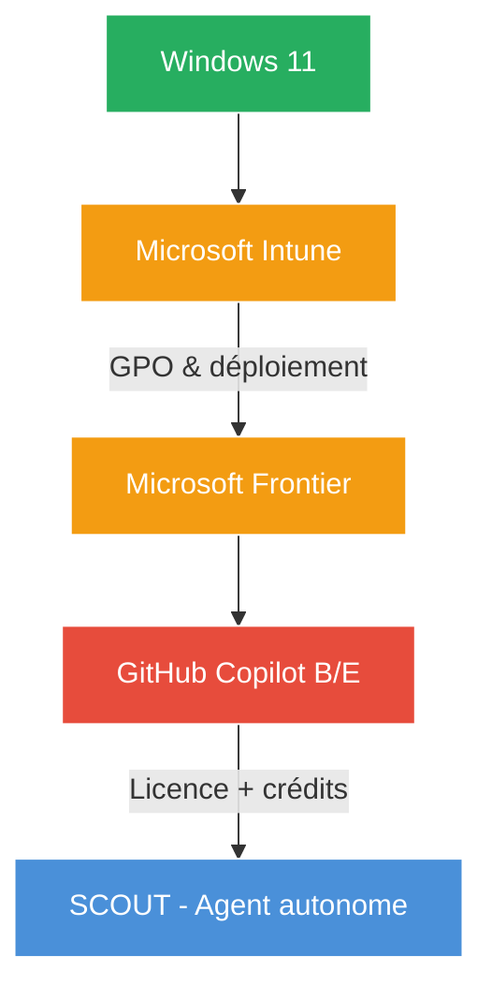
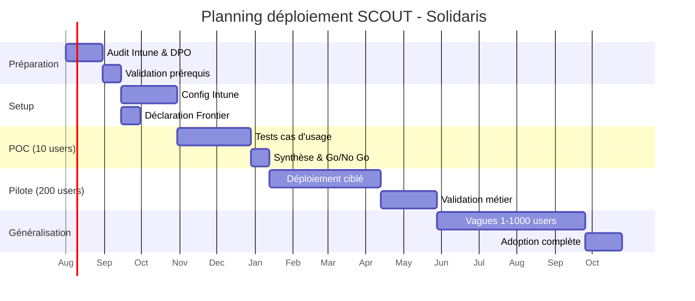

# 🚀 Analyse Projet & Programme — Microsoft SCOUT
## Déploiement dans un contexte mutualiste (Solidaris / taille moyenne)

**Expert #6 — Bureau Robert | Audience : PMO, Direction Projets, Responsable Budgétaire**

---

## 1. Synthèse exécutive

Microsoft **SCOUT** (System Configuration and Orchestration Unified Toolkit) est l'agent autonome Microsoft qui exécute des tâches sur le poste de travail Windows 11. Il s'interface avec les applications locales, le système de fichiers, et le navigateur via un agent autonome orchestré depuis **GitHub Copilot**.

**Constats clés :**
- **Pas inclus dans M365 Copilot** — nécessite GitHub Copilot Business ($19/user/mois) ou Enterprise ($39/user/mois)
- **Prérequis bloquant :** Windows 11 + Intune + GitHub Copilot + Microsoft Frontier (organisation)
- **ROI potentiel** : automatisation de processus métier mutualistes à fort volume (gestion des dossiers, extraction de documents, répondre aux mails usagers, suivi BCSS/eHealth)
- **Risque majeur :** produit encore **frontier** — documentation limitée (1 vidéo détaillée), API/produit susceptible de changer
- **Recommandation :** Attendre la maturation du produit. Si déploiement, commencer par une **Proof of Concept (POC)** ciblée (5-10 utilisateurs) sans engagement pluriannuel.

---

## 2. Contexte Mutualiste (Solidaris — taille moyenne)

| Élément | Valeur |
|:--------|:-------|
| Type d'organisation | Mutualité (Solidaris — taille moyenne belge) |
| SI cible | ~1 000 à 3 000 postes Windows |
| Infrastructure existante | Windows 11 (probablement déployé partiellement), M365 E3/E5, Intune (partiel ou en déploiement) |
| Environnement métier | INAMI, BCSS, eHealth, MyCareNet, Intermutualité |
| Profils utilisateurs | Gestionnaires de dossiers, conseillers, service RH, service informatique |
| Niveau de maturité IT | Moyen (orga Microsoft Frontier probablement en place ou en cours) |

---

## 3. Architecture et Prérequis Techniques

### 3.1 Chaîne de dépendances

### 3.2 Prérequis détaillés

| # | Prérequis | Statut estimé (Solidaris) | Effort |
|:-:|:----------|:--------------------------|:-------|
| 1 | Windows 11 sur TOUS les postes cibles | ⚠️ Partiel — migration probablement en cours | Moyen |
| 2 | Microsoft Intune déployé et configuré | ⚠️ Partiel — configuration GPO/politiques nécessaire | **Élevé** |
| 3 | Organisation Microsoft Frontier | ✅ Probablement déjà existant (M365 E3/E5) | Faible |
| 4 | GitHub Copilot Business ou Enterprise | ❌ À souscrire | Nouveau budget |
| 5 | Formulaire de consentement utilisateur | ❌ À créer + validation juridique (RGPD, CCT) | Moyen |
| 6 | Formation utilisateurs | ❌ À concevoir — concept nouveau (agent autonome vs chat) | Moyen |

### 3.3 Modèle de crédits SCOUT

SCOUT fonctionne sur un système de **crédits** :
- Chaque chat, heartbeat, et automation consomme des crédits
- Les modèles ont des coûts différents :

| Modèle | Coût crédits | Usage recommandé |
|:-------|:-------------|:-----------------|
| **Opus 4.7** | ⚠️ **Élevé** | Tâches complexes, critique |
| **Sonic 4.6** | Moyen | Tâches standards |
| **GPT 4.1** | **Faible (éco)** | Tâches simples, automation |

> ⚠️ **Attention :** Un heartbeat 24/7 peut épuiser les crédits très rapidement. Il est impératif de choisir le modèle adapté à chaque tâche.

---

## 4. Modèle de Licence et Coûts

### 4.1 Coûts de licence annuels (base 1 000 utilisateurs)

| Composant | Unité | Coût unitaire/mois | Nb utilisateurs | Coût annuel |
|:----------|:------|:------------------:|:---------------:|:-----------:|
| **GitHub Copilot Business** | Utilisateur | $19 | 200 (pilote) | **$45 600** |
| **GitHub Copilot Enterprise** | Utilisateur | $39 | 200 (pilote) | **$93 600** |
| **Crédits SCOUT** | Variable | Inclus dans Env. / selon consommation | — | **Variable** |

> ℹ️ Les crédits sont inclus dans GitHub Copilot mais avec un plafond. En cas de dépassement, coûts supplémentaires non documentés à ce stade.

### 4.2 Scénarios de dimensionnement

| Scénario | Nb users | Licence | Coût licence/an | Crédits estimés/an | Total estimé/an |
|:---------|:--------:|:--------|:--------------:|:------------------:|:--------------:|
| **POC** | 10 | Business | $2 280 | Faible | **~$3 000** |
| **Pilote** | 200 | Business | $45 600 | $5 000 — $15 000 | **~$55 000** |
| **Production (1 000)** | 1 000 | Business | $228 000 | $25 000 — $75 000 | **~$280 000** |
| **Production (1 000)** | 1 000 | Enterprise | $468 000 | $25 000 — $75 000 | **~$520 000** |

### 4.3 Options Enterprise vs Business

| Critère | Business ($19) | Enterprise ($39) |
|:--------|:--------------:|:----------------:|
| SCOUT agent | ✅ Oui | ✅ Oui |
| Crédits inclus | ✅ Oui | ✅ Oui |
| Modèles personnalisés | ❌ Non | ✅ Oui |
| SAML/SSO | ✅ Basique | ✅ Avancé |
| Audit & compliance | ❌ Non | ✅ Oui (logs, policies) |
| **Recommandation mutualité** | ❌ | **✅ Recommandé** pour conformité RGPD |

---

## 5. TCO (Total Cost of Ownership) — Périmètre Complet

### 5.1 TCO Année 1 — Déploiement partiel (200 users pilote → 1 000 users)

| Poste | Détail | Année 1 (Pilote 200) | Année 2 (Prod 1 000) |
|:------|:-------|:--------------------:|:--------------------:|
| **Licence GitHub Copilot Enterprise** | $39/user/mois | $93 600 | $468 000 |
| **Crédits SCOUT** | Selon consommation | $15 000 | $75 000 |
| **Microsoft Intune** | Déjà en place ou coût additionnel | $0 — $5 000 | $0 — $5 000 |
| **Support technique** | 15% des licences | $14 040 | $70 200 |
| **Formation utilisateurs** | ½ journée par user (x2 sessions) | $20 000 | $30 000 |
| **Formation formateurs IT** | 5 jours | $7 500 | $0 |
| **Pilotage / Chef de projet** | 0,5 ETP CDI | $45 000 | $45 000 |
| **Intégration Intune (packaging SCOUT)** | Prestation externe ou régie | $15 000 | $5 000 |
| **Révision juridique RGPD + CCT** | Consentement SCOUT, DPA | $5 000 | $0 |
| **Communication / conduite du changement** | Interne | $10 000 | $5 000 |

| **TOTAL ESTIMÉ** | | **~$225 140** | **~$698 200** |
|:-----------------|:---------------:|:--------------:|:--------------:|

### 5.2 TCO par utilisateur

| Période | Coût total | Nb users | Coût/user/an |
|:--------|:----------:|:--------:|:------------:|
| Année 1 (pilote) | ~$225 140 | 200 | **~$1 126** |
| Année 2 (production) | ~$698 200 | 1 000 | **~$698** |
| Année 3 (régime stable) | ~$650 000 | 1 000 | **~$650** |

---

## 6. ROI Potentiel — Processus Métier Automatisables

### 6.1 Matrice d'opportunité mutualiste

| Processus métier | Volume estimé | Automatable SCOUT | Gain attendu | Priorité |
|:-----------------|:-------------:|:-----------------:|:------------:|:--------:|
| **Traitement des dossiers usagers** (récurrents) | Haut | ✅ Extraction, résumé, mise à jour | 30-40% temps agent | 🥇 **Haute** |
| **Réponse aux mails usagers standards** | Très haut | ✅ Rédaction, qualification, routage | 40-60% temps agent | 🥇 **Haute** |
| **Suivi des flux BCSS/eHealth/MyCareNet** | Moyen | ✅ Vérification, alerte, mise à jour | 25-35% temps agent | 🥇 **Haute** |
| **Extraction données des documents** (DMIs, attestations) | Haut | ✅ OCR + structuration automatique | 50-70% temps administratif | 🥇 **Haute** |
| **Mise à jour des dossiers Intermutualité** | Moyen | ✅ Automation heartbeat | 20-30% temps | 🥈 **Moyenne** |
| **Génération de rapports périodiques** | Bas | ✅ Compilation automatique | 60-80% temps analyste | 🥈 **Moyenne** |
| **Tâches RH (demandes congés, notes de frais)** | Moyen | ✅ Orchestration formulaires | 15-25% temps RH | 🥉 **Faible** |
| **Support IT N1** | Haut | ✅ Diagnostic, résolution, escalade | 30-50% temps IT | 🥇 **Haute** |

### 6.2 Estimation ROI (scénario prudent)

| Horizon | Investissement total | Gains estimés (temps libéré) | ROI |
|:--------|:-------------------:|:---------------------------:|:---:|
| Année 1 (POC/Pilote) | ~$225 000 | ~$100 000 (5 ETP * $50k) | **-55%** |
| Année 2 (Prod ramp-up) | ~$698 000 | ~$500 000 (25 ETP * $50k) | **-28%** |
| Année 3 (Régime stable) | ~$650 000 | ~$1 000 000 (50 ETP * $50k) | **+54%** |

> ⚠️ ROI négatif les 2 premières années. Retour sur investissement à partir de l'année 3 si adoption massive et pérennité du produit.

---

## 7. Risques Projet

### 7.1 Matrice des risques

| # | Risque | Probabilité | Impact | Niveau | Mitigation |
|:-:|:-------|:-----------:|:-----:|:------:|:-----------|
| **R1** | **Dépendance Intune** — Si Intune n'est pas stabilisé, SCOUT est bloqué | **Haute** | **Critique** | 🔴 **20** | Audit Intune préalable ; n'engager SCOUT qu'après validation Intune |
| **R2** | **Dépendance Microsoft Frontier** — Organisation nécessaire au déploiement | **Moyenne** | **Élevé** | 🟠 **12** | Vérifier Organisation Frontier existante ; plan B : temporiser |
| **R3** | **Dépendance format Frontier** — Le format/fonctionnalités SCOUT est instable | **Haute** | **Élevé** | 🟠 **16** | Produit en version précoce ; prévoir clauses de sortie dans le contrat |
| **R4** | **Documentation insuffisante** — 1 seule vidéo (Shane Young), doc Microsoft encore « frontier » | **Haute** | **Moyen** | 🟠 **12** | Allouer du temps d'exploration ; réseau early adopters ; MVP contenu |
| **R5** | **Consommation excessive de crédits** — Heartbeat 24/7 épuise le quota | **Moyenne** | **Élevé** | 🟠 **12** | Politique d'usage : heartbeat limité, modèle éco pour tâches simples |
| **R6** | **Faible adoption utilisateurs** — Concept d'agent autonome mal compris | **Moyenne** | **Élevé** | 🟠 **12** | Formation obligatoire ½ journée ; cas d'usage concrets métier |
| **R7** | **Évolution du produit** — SCOUT peut changer, voire disparaître (produit frontier MS) | **Basse** | **Critique** | 🟠 **10** | Clause de résiliation sans pénalité dans le contrat Microsoft |
| **R8** | **Conformité RGPD** — Agent autonome accédant aux données des dossiers mutualistes | **Haute** | **Critique** | 🔴 **20** | DPO en amont ; registre traitement mis à jour ; consentement utilisateur ; limitation périmètre données |
| **R9** | **Dépendance à un seul modèle** — Pas d'alternative à l'agent SCOUT propriétaire | **Haute** | **Moyen** | 🟠 **12** | Garder une veille sur des solutions alternatives open source ; ne pas verrouiller l'architecture |

### 7.2 Risques résiduels non mitigeables

1. **Produit Microsoft « frontier »** — SCOUT n'est pas un produit mature. Microsoft peut en changer les termes, l'API, ou le modèle économique.
2. **Verrouillage Intune** — Une fois SCOUT déployé, le coût de sortie d'Intune est élevé. C'est un choix d'infrastructure à long terme.

---

## 8. Scénarios de Déploiement

### 8.1 Scénario A — POC uniquement (Recommandé court terme)

| Élément | Détail |
|:--------|:-------|
| **Périmètre** | 5-10 utilisateurs IT + 5 utilisateurs métier pilotes |
| **Durée** | 6-8 semaines |
| **Coût** | ~$3 000 — $5 000 |
| **Objectif** | Valider le concept, identifier les cas d'usage, tester la consommation crédits |
| **Livrables** | Rapport d'évaluation technique + business case élargi |
| **Décision** | Go/No Go pour Pilote |

### 8.2 Scénario B — Pilote contrôlé (Recommandé si POC OK)

| Élément | Détail |
|:--------|:-------|
| **Périmètre** | 200 utilisateurs (50 IT, 100 gestionnaires, 50 RH/finances) |
| **Durée** | 4-6 mois |
| **Coût** | ~$225 000 |
| **Objectif** | Mesurer le ROI réel, valider la conformité RGPD, former les relais |
| **Livrables** | Bilan ROI, guide d'usage, retour d'expérience utilisateurs |
| **Décision** | Go/No Go pour Généralisation |

### 8.3 Scénario C — Généralisation production

| Élément | Détail |
|:--------|:-------|
| **Périmètre** | 1 000 utilisateurs (déploiement par vagues de 200) |
| **Durée** | 6-9 mois post-pilote |
| **Coût** | ~$698 000 (année de transition) |
| **Objectif** | Déploiement complet, automation des processus identifiés |
| **Rythme** | Vague 1 : 200 → Vague 2 : +300 → Vague 3 : +500 |

---

## 9. Planning Estimé

### 9.1 Macro-Planning (18 mois)

### 9.2 Détail par phase

#### Phase ① — Préparation (Mois 1-2)

| Tâche | Responsable | Durée | Dépendances |
|:------|:------------|:-----:|:-----------|
| Audit parc Windows 11 | Équipe IT | 2 sem. | — |
| Audit Intune (déploiement, politiques, packaging) | Équipe IT | 3 sem. | — |
| Vérification Organisation Microsoft Frontier | Équipe IT | 1 sem. | — |
| Consultation DPO (conformité RGPD, registre, AIPD) | DPO | 3 sem. | — |
| Élaboration budget + validation comité de direction | PMO/Robert | 3 sem. | Audit préalable |
| Négociation contrat Microsoft (GitHub Copilot Enterprise) | Achats | 4 sem. | Budget validé |
| **Jalon : Décision de lancement POC** | Comité | — | Toutes tâches ci-dessus |

#### Phase ② — Setup Infrastructure (Mois 3-4)

| Tâche | Responsable | Durée | Dépendances |
|:------|:------------|:-----:|:-----------|
| Mise à niveau Windows 11 (si postes non conformes) | Équipe IT | 4 sem. | Audit parc |
| Configuration Intune (GPO, packaging SCOUT) | Équipe IT | **4 sem. (goulot)** | Intune disponible |
| Création Organisation Frontier SCOUT | Équipe IT | 1 sem. | Frontier OK |
| Déploiement GitHub Copilot Enterprise (10 comptes POC) | Équipe IT | 1 sem. | Contrat signé |
| Rédaction formulaire consentement utilisateur | DPO/RH | 2 sem. | DPO consulté |
| **Jalon : Infrastructure prête pour POC** | PMO | — | Tout ci-dessus |

#### Phase ③ — POC (Mois 5-8)

| Tâche | Responsable | Durée | Dépendances |
|:------|:------------|:-----:|:-----------|
| Identification des cas d'usage (3-5 processus) | Métier + PMO | 2 sem. | — |
| Déploiement SCOUT (10 users IT + 5 métier) | Équipe IT | 1 sem. | Infrastructure prête |
| Tests heartbeat, automation, chat | Équipe IT | 2 sem. | Déploiement |
| Mesure consommation crédits par modèle | Équipe IT | 4 sem. | Tests |
| Évaluation RGPD sur cas réels | DPO | 3 sem. | Usage réel |
| Rédaction rapport POC | PMO | 2 sem. | Tous les tests |
| **Jalon : Go/No Go Pilote** | Comité | — | Rapport POC |

#### Phase ④ — Pilote (Mois 9-14)

| Tâche | Responsable | Durée | Dépendances |
|:------|:------------|:-----:|:-----------|
| Déploiement SCOUT (200 users) par vagues de 50 | Équipe IT | 4 sem. | POC validé |
| Formation utilisateurs (½ journée, 10 sessions) | Formateurs IT | 6 sem. | Support formé |
| Création guide d'usage SCOUT (cas d'usage métier) | PMO + Métier | 4 sem. | Retour POC |
| Suivi adoption + consommation crédits | Équipe IT | 12 sem. | Déploiement |
| Mesure ROI sur processus automatisés | PMO | 8 sem. | 2 mois d'usage |
| Bilan conformité RGPD + audit intermédiaire | DPO | 4 sem. | 3 mois d'usage |
| **Jalon : Go/No Go Généralisation** | Comité | — | Bilan pilote + ROI |

#### Phase ⑤ — Généralisation (Mois 15-18)

| Tâche | Responsable | Durée | Dépendances |
|:------|:------------|:-----:|:-----------|
| Vague 1 : 200 users supplémentaires | Équipe IT | 4 sem. | Pilote validé |
| Vague 2 : 300 users supplémentaires | Équipe IT | 4 sem. | Vague 1 OK |
| Vague 3 : 500 users supplémentaires (full scale) | Équipe IT | 6 sem. | Vague 2 OK |
| Conduite du changement (communication, FAQ, support) | PMO/COM | 12 sem. | Tout le déploiement |
| Bilan post-déploiement + ajustements | PMO | 4 sem. | Généralisation complète |

---

## 10. Gouvernance Projet

### 10.1 Organisation

| Rôle | Persona | Missions |
|:-----|:--------|:---------|
| **Sponsor** | Direction Générale | Validation budgétaire, arbitrage |
| **Chef de Projet** | PMO Bureau Robert | Coordination, planning, reporting |
| **Expert Métier** | Bureau Robert (#6 Projet & Programme) | Analyse d'impact, TCO, risques |
| **Expert IT** | DSI Solidaris | Intune, Windows 11, packaging SCOUT |
| **DPO** | DPO Solidaris | Conformité RGPD, AIPD, consentement |
| **Référent Utilisateurs** | 1 par service pilote | Relais terrain, feedback |

### 10.2 Comités de décision

| Comité | Fréquence | Participants | Décisions |
|:-------|:---------:|:------------|:----------|
| **Comité de Pilotage (COPIL)** | Mensuel | Sponsor, PMO, DSI, DPO | Budget, périmètre, Go/No Go |
| **Comité Technique (COTECH)** | Bimensuel | PMO, Équipe IT, Référents | Intune, planning, incidents |
| **Comité Utilisateurs** | Mensuel | Référents, PMO, Formateur | Adoption, retours, ajustements |

---

## 11. Recommandation au Comité de Direction

### Positionnement

**Microsoft SCOUT est un produit innovant mais immature.** Il présente un potentiel réel pour l'automatisation des processus mutualistes, mais les risques sont significatifs :

🔴 **Risques bloquants (année 1) :**
- Dépendance Intune non stabilisée dans beaucoup d'orga
- Produit frontier vulnérable aux changements
- Documentation insuffisante (dépendance à 1 vidéo)
- Conformité RGPD à valider (agent autonome sur données mutualistes)

🟢 **Opportunités réelles :**
- Automatisation des dossiers usagers (30-70% de gain)
- Extraction et structuration de documents
- Support IT N1 automatisé

### Recommandation

| # | Recommandation | Horizon |
|:-:|:---------------|:-------:|
| 1 | **Auditer Intune d'abord** — sans Intune stable, SCOUT est impossible | Mois 1-2 |
| 2 | **POC limité (10 users)** — coût faible (~$5k), validation rapide | Mois 5-8 |
| 3 | **Ne PAS signer d'engagement pluriannuel** — clause de sortie obligatoire | Contrat |
| 4 | **Ne PAS étendre avant validation RGPD** — AIPD obligatoire avec DPO | DPO/Année 1 |
| 5 | **Former des relais internes** — concept d'agent autonome à expliquer | Pilote |
| 6 | **Garder une veille alternative** — ne pas verrouiller l'architecture sur SCOUT | Permanent |
| 7 | **Si POC concluant** → Pilote 200 users avec mesure ROI stricte | Mois 9-14 |

### Décision attendue du Comité

> **Proposition :** Valider le lancement de la **Phase ① (Préparation)** pour un audit Intune et une consultation DPO, avec un budget d'investigation de **€15 000 — €20 000** (ressources internes). La décision de lancer le POC sera prise sur la base des résultats de cet audit.
>
> **N'engager aucun budget licence GitHub Copilot / SCOUT avant la fin de l'audit préalable.**

---

## 12. Documents de Référence

| Document | Source | Utilité |
|:---------|:-------|:--------|
| Shane Young — SCOUT Demo (vidéo unique disponible) | YouTube | Source technique principale (1 seule vidéo détaillée) |
| Documentation Microsoft SCOUT (frontier) | Microsoft Learn | Documentation officielle (encore frontier) |
| Guide déploiement Intune | Microsoft | Prérequis n°1 |
| GitHub Copilot licensing guide | GitHub Docs | Modèle de licence |
| RGPD — Registre des traitements | DPO Solidaris | Conformité |

---

## 13. Versions

| Version | Date | Description | Auteur |
|:--------|:-----|:------------|:-------|
| v1 | 2026-07-09 | Version initiale — Analyse Projet & Programme SCOUT | Bureau Robert (Expert #6) |

---

<!-- AUTO:FOOTER -->
*Analyse produite par le **Bureau Robert — Expert #6 Projet & Programme** — Modèle : **deepseek-chat** — Date : **2026-07-09**
Dernière mise à jour : 2026-07-09*
<!-- AUTO:FOOTER:END -->
