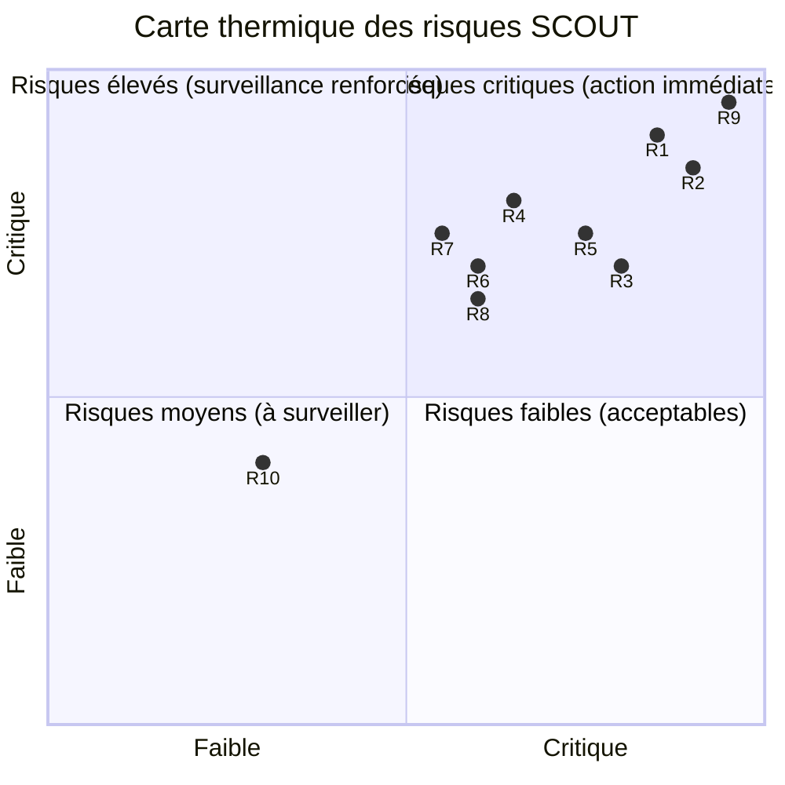
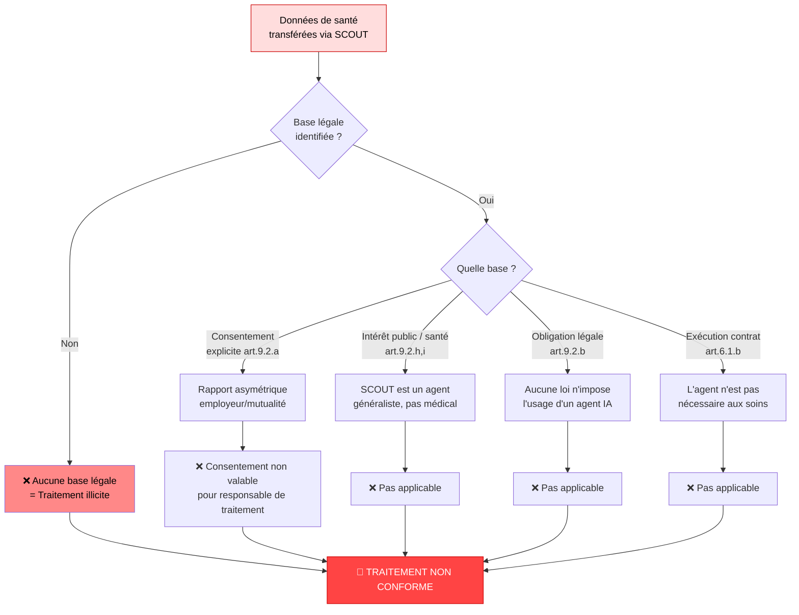
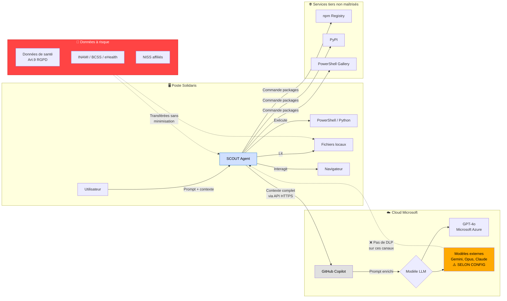
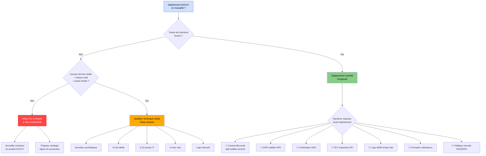
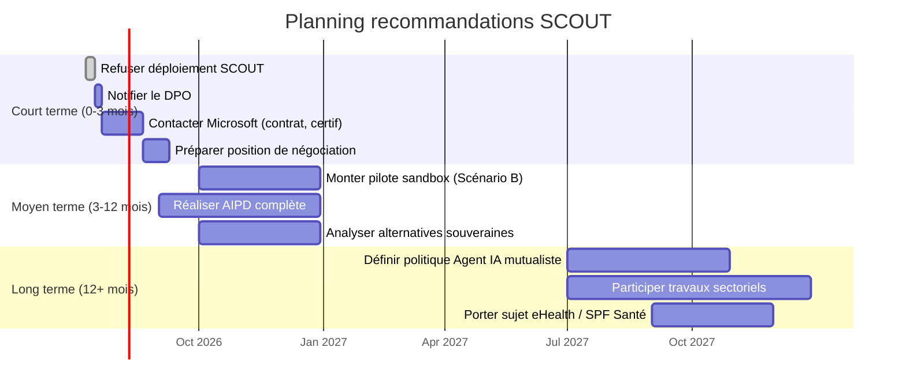

# Analyse Sécurité — Microsoft SCOUT en contexte Solidaris (Mutualité, Assurance Obligatoire)

**Destinataires :** RSSI, DPO, Direction Sécurité  
**Rédacteur :** Bureau Robert — Expert Sécurité (Expert #2)  
**Date :** 9 juillet 2026  
**Classification :** CONFIDENTIEL — Usage interne Solidaris

---

## 1. Résumé Exécutif

Microsoft SCOUT est un agent IA desktop profondément intégré à Windows (PowerShell, Python, navigateur, exécution de code local, installation de packages). Pour une mutualité comme Solidaris, qui traite des **données de santé relevant de l'article 9 RGPD** (catégories particulières), SCOUT présente des **risques graves et multiples** que les garde-fous techniques actuels (Intune, permissions granulaires) ne couvrent pas complètement.

**Jugement global : NON acceptable en l'état** pour un déploiement généralisé sur le périmètre mutualiste. Un déploiement sandbox très restreint (pilote technique, pas de données réelles) est le seul scénario envisageable à court terme.

---

## 2. Matrice des Risques

| # | Risque | Gravité | Probabilité | Criticité | Description |
|---|--------|---------|-------------|-----------|-------------|
| R1 | Exfiltration données de santé vers modèles tiers (Gemini, Opus via Copilot) | **Critique (5)** | **Élevée (4)** | **20 — CRITIQUE** | Le consentement utilisateur ne couvre pas les données de santé (art. 9 RGPD). Les données Solidaris (INAMI, BCSS, eHealth) peuvent transiter par GitHub Copilot configuré sur des modèles externes. |
| R2 | Exécution de code arbitraire local (PowerShell, Python) | **Critique (5)** | **Élevée (4)** | **20 — CRITIQUE** | SCOUT exécute du code avec les droits de l'utilisateur. En cas de compromission du prompt ou d'une skill malveillante, escalade de privilèges possible. |
| R3 | Supply chain — installation de packages npm, Python non vérifiés | **Élevée (4)** | **Élevée (4)** | **16 — ÉLEVÉ** | SCOUT peut installer des dépendances depuis des registres publics. Risque de dependency confusion, package malveillant, ou version vulnérable. |
| R4 | Interaction non supervisée avec le navigateur | **Élevée (4)** | **Moyenne (3)** | **12 — ÉLEVÉ** | SCOUT peut lire et manipuler le contenu du navigateur. Exfiltration de sessions web, accès à eHealth/BCSS, modification de formulaires. |
| R5 | Non-respect de la minimisation des données | **Élevée (4)** | **Élevée (4)** | **16 — ÉLEVÉ** | L'architecture de SCOUT nécessite d'envoyer le contexte (prompt, code, fichiers) à des LLMs. Pas de garantie de minimisation. |
| R6 | Absence de traçabilité complète des actions IA | **Moyenne (3)** | **Élevée (4)** | **12 — ÉLEVÉ** | Les logs SCOUT sont immatures. Impossible de garantir une piste d'audit complète pour les autorités de contrôle (APD, INAMI). |
| R7 | Violation du principe d'intégrité des traitements mutualistes | **Élevée (4)** | **Moyenne (3)** | **12 — ÉLEVÉ** | Un agent IA modifiant des fichiers ou exécutant des scripts peut altérer des traitements réglementés (statistiques INAMI, remboursements). |
| R8 | Non-conformité NIS2 — Sécurité des réseaux et SI | **Élevée (4)** | **Moyenne (3)** | **12 — ÉLEVÉ** | SCOUT crée des canaux de communication non maîtrisés (LLM cloud, registres packages) qui contournent les contrôles réseau traditionnels. |
| R9 | Consentement insuffisant au sens RGPD | **Critique (5)** | **Très élevée (5)** | **25 — CRITIQUE** | Le formulaire de consentement SCOUT ne distingue pas les données de santé. Le consentement n'est pas une base légale valide pour le traitement de données de santé par un responsable de traitement mutualiste. |
| R10 | Dépendance à GitHub Copilot comme unique backend LLM | **Moyenne (3)** | **Faible (2)** | **6 — MOYEN** | Si Copilot est bridé aux modèles Microsoft (GPT-4o), le risque est moindre. Mais la configuration "modèles externes" est un risque immédiat. |

### Carte thermique

---

## 3. Analyse RGPD Approfondie

### 3.1 Licéité du traitement (Art. 6 + Art. 9)

**Arbre de décision des bases légales :**

Solidaris traite des **catégories particulières de données** (art. 9 RGPD) :
- Données de santé des affiliés
- Données INAMI (remboursements, statuts)
- Données BCSS (mutualité, affiliation)
- Données eHealth (DMG, dossier médical global)

**Problème fondamental :** SCOUT, par conception, envoie le contexte de la requête à un LLM distant (via GitHub Copilot). La base légale pour ce transfert est :
- ❌ **Consentement explicite** (art. 9(2)(a)) — Pas valable pour un responsable de traitement mutualiste dans le cadre de ses missions, rapport asymétrique
- ❌ **Intérêt public / santé** (art. 9(2)(h,i)) — Non applicable à un agent généraliste
- ❌ **Obligation légale** (art. 9(2)(b)) — Non
- ❌ **Nécessité contractuelle** (art. 6(1)(b)) — L'agent n'est pas nécessaire à l'exécution des soins

**Conclusion : Aucune base légale identifiée pour le transfert de données de santé vers des LLMs cloud via SCOUT.**

### 3.2 Minimisation (Art. 5(1)(c))

SCOUT transmet tout le contexte nécessaire à l'exécution de la tâche. Dans un environnement mutualiste, ce contexte inclut quasi-systématiquement des données à caractère personnel (nom, NISS, numéro d'affiliation, code INAMI). La **minimisation est structurellement impossible**.

### 3.3 DPO et Registre (Art. 30, 35, 37)

- **AIPD obligatoire** (Art. 35) : Un déploiement SCOUT nécessite une Analyse d'Impact relative à la Protection des Données. Le risque pour les droits et libertés est manifestement élevé.
- **Registre** : Chaque interaction SCOUT génère un traitement qui doit figurer au registre — impraticable à l'échelle.

### 3.4 Transferts hors UE (Art. 44-49)

Si GitHub Copilot ou les modèles externes sont hébergés hors EEE :
- **Data Privacy Framework** (US) : Insuffisant pour des données de santé
- **Clauses Contractuelles Types** : À vérifier avec Microsoft — ne couvrent pas les modèles tiers
- **Décision d'adéquation** : Aucune pour les données de santé vers les US

**Diagramme de flux de données SCOUT :**

### 3.5 Droit des personnes (Art. 12-23)

- **Droit à l'information** : Comment expliquer à un affilié Solidaris que ses données transitent par un LLM non déterminé ?
- **Droit d'opposition / effacement** : Impossible si les données ont été utilisées pour l'entraînement d'un modèle (bien que OpenAI/Microsoft affirment le contraire, l'auditabilité est nulle)

---

## 4. Analyse NIS2

Solidaris, comme mutualité d'assurance obligatoire, est probablement une **entité essentielle** au sens de NIS2 (secteur santé, seuil > 50 employés ou CA > 10M€).

### 4.1 Exigences impactées par SCOUT

| Exigence NIS2 | Impact | Analyse |
|--------------|--------|---------|
| **Art. 21(2)(c) — Sécurité des RH** | **Rouge** | Les utilisateurs peuvent consentir à des traitements qu'ils ne maîtrisent pas, hors politique de sécurité |
| **Art. 21(2)(d) — Sécurité des accès** | **Orange** | SCOUT contourne les contrôles GPO classiques par son modèle "Allow/Deny" géré par l'utilisateur |
| **Art. 21(2)(g) — Cryptographie** | **Vert** | Chiffrement natif Microsoft, mais les données sont déchiffrées avant envoi au LLM |
| **Art. 21(2)(i) — Gestion des incidents** | **Rouge** | Un incident SCOUT (exfiltration) est indétectable par les EDR classiques |
| **Art. 23 — Reporting incidents** | **Rouge** | Impossible de qualifier un incident dans les délais NIS2 (24h pour les entités essentielles) |
| **Art. 21(2)(j) — Tests de sécurité** | **Orange** | SCOUT nécessite une nouvelle surface d'attaque à tester, non couverte par les pentests classiques |
| **Art. 24 — Usage de technologies certifiées** | **Orange** | Aucune certification cybersécurité (EUCS, SOC 2) spécifique pour SCOUT connu à ce jour |

### 4.2 Risque de sanction

- Entité essentielle : amende jusqu'à 10M€ ou 2% du chiffre d'affaires annuel mondial
- Rupture d'obligation de notification d'incident : risque de sanction majoré

---

## 5. Analyse ISO 27001

| Contrôle | Statut SCOUT | Risque |
|---------|-------------|--------|
| A.5.14 — Transfert d'information | Non conforme | Toutes les données partent vers le LLM |
| A.6.7 — Télétravail | Étendu | SCOUT aggrave les risques en mobilité |
| A.8.10 — Suppression d'information | Non garanti | Données potentiellement persistées dans les logs LLM |
| A.8.12 — Prévention de fuite de données | Non conforme | Aucun DLP n'intercepte les appels API vers Copilot |
| A.8.16 — Activités de surveillance | Insuffisant | Logs SCOUT limités vs exigences d'audit |
| A.10.2 — Dépendances fournisseur | Critique | Dépendance à GitHub Copilot + modèles externes |
| A.14.2 — Sécurité du développement | Hors scope | SCOUT installe des packages non audités |

---

## 6. Comparaison avec l'Existant (Poste Verrouillé + GPO + EDR)

| Critère | Situation Actuelle (Solidaris) | Avec SCOUT | Évolution du risque |
|---------|-------------------------------|------------|-------------------|
| **Surface d'attaque** | Poste verrouillé, GPO restrictives, exécution restreinte | Exécution illimitée Python/PowerShell + installations packages | ⬆️ **CRITIQUE** |
| **DLP / Exfiltration** | Proxy, DLP réseau, blocage USB/applications cloud | Canal HTTPS direct vers GitHub Copilot + modèles tiers | ⬆️ **CRITIQUE** |
| **Audit / Logs** | Logs Windows, EDR (Defender/ Sentinel) | Logs SCOUT propriétaires, non intégrés au SIEM central | ⬆️ **ÉLEVÉ** |
| **Contrôle des permissions** | GPO + AD + RBAC strictes | Permissions SCOUT gérées par Intune + consentement utilisateur | ⬆️ **ÉLEVÉ** |
| **Supply chain** | Catalogue approuvé (SCCM/Intune) | npm, PyPI, PowerShell Gallery — aucun contrôle | ⬆️ **CRITIQUE** |
| **Sécurité navigateur** | Proxy + GPO Chrome/Edge restreint | SCOUT peut interagir avec le navigateur | ⬆️ **ÉLEVÉ** |
| **Gestion des identités** | PIV/SSO, MFA obligatoire | SCOUT ne gère PAS les mots de passe — bon point | ➡️ **NEUTRE** |
| **Mobilité** | VPN + device compliance | SCOUT mobile non contrôlé | ⬆️ **ÉLEVÉ** |

---

## 7. Analyse des Garde-Fous Proposés (Intune, Permissions Granulaires)

### 7.1 Politique Intune obligatoire

✅ **Points positifs :**
- Impose une configuration minimale de sécurité
- Peut bloquer SCOUT sur les devices non conformes
- Permet le déploiement sélectif (groupes de test)

❌ **Limites :**
- Intune ne contrôle pas ce que fait SCOUT, seulement la configuration du device
- Aucun contrôle sur le contenu envoyé au LLM
- BYOD/MDM partiel = trou dans la raquette
- Les politiques Intune sont contournables si le device est compromis

### 7.2 Permissions granulaires (Allow/Deny/Allow always)

✅ **Points positifs :**
- Chaque action sensible déclenche une demande explicite
- L'admin IT peut centraliser les permissions par automation
- Permet un blocage fin des actions à risque (ex: installer un package, écrire dans le système)

❌ **Limites :**
- **Fatigue de consentement :** L'utilisateur finit par cliquer "Allow always" par habitude
- **Pas de distinction données de santé :** Le modèle Allow/Deny ne sait pas si le fichier ouvert contient des données de santé
- **Pas de contexte réglementaire :** SCOUT ne peut pas décider de ce qui est RGPD-compatible
- **L'utilisateur peut autoriser une action dangereuse** en toute bonne foi

### 7.3 Formulaire de consentement "Données hors safe bubble Microsoft"

❌ **Problème critique :**
- Le consentement utilisateur ne couvre pas les données de santé (art. 9 RGPD)
- L'utilisateur d'une mutualité n'est pas habilité à consentir pour le compte de l'organisation ni des affiliés
- Le formulaire crée une **fausse sécurité juridique**

### 7.4 Contrôle des endpoints via Intune + Defender for Endpoint

✅ **Potentiel :**
- Blocage des exécutables non signés
- ASR rules (Attack Surface Reduction) pour bloquer les comportements suspects
- File Indicator pour bloquer les packages non approuvés

❌ **Limites :**
- Les scripts PowerShell signés par Microsoft peuvent être autorisés par défaut
- Les packages npm/Python sont rarement signés — difficile à bloquer sans casser le workflow
- Defender n'inspecte pas le contenu envoyé au LLM

---

## 8. Scénarios de Déploiement

**Arbre de décision :**

### Scénario A : Refus Pur et Simple ⚠️ RECOMMANDÉ

| Critère | Évaluation |
|---------|-----------|
| **Risque global** | Acceptable (risque évité) |
| **Conformité** | Garantie |
| **Cohérence avec l'existant** | Parfaite |
| **Coût** | Aucun |
| **Innovation** | Perdue |

**Arguments :**
- Les risques critiques (R1, R2, R9) ne peuvent pas être atténués techniquement
- Aucune base légale RGPD pour le transfert de données de santé
- NIS2 non compatible
- **Recommandation :** Refuser le déploiement. Surveiller l'évolution de SCOUT (notamment un éventuel modèle privé on-premise).

### Scénario B : Sandbox Technique Isolée ⚠️ PILOTE RESTREINT

| Critère | Évaluation |
|---------|-----------|
| **Risque global** | Acceptable avec contrôles stricts |
| **Conformité** | Sous condition (pas de données réelles) |
| **Cohérence avec l'existant** | Silotée |
| **Coût** | Moyen (infra + supervision) |
| **Innovation** | Partielle (test technique sans valeur métier) |

**Conditions strictes :**
1. **Aucune donnée réelle** — données synthétiques uniquement
2. **Mise en réseau isolée** (VLAN dédié, pas d'accès aux applicatifs métier, proxy bloqué vers les domaines métier)
3. **Comptes de test dédiés** (pas de comptes réels Solidaris)
4. **GitHub Copilot bridé aux modèles Microsoft uniquement** (vérification contractuelle)
5. **Journalisation intensive** (network logs + process logs + SCOUT logs)
6. **Durée limitée** (3 mois, revue avant extension)
7. **Périmètre** : 5-10 postes, service IT uniquement (pas de métier)

**Objectif du pilote :**
- Tester la maturité des logs SCOUT
- Valider ou infirmer les capacités de blocage Intune
- Cartographier les canaux d'exfiltration réels
- Évaluer le comportement des utilisateurs face à Allow/Deny

### Scénario C : Déploiement Contrôlé Progressif ⚠️ NON RECOMMANDÉ À CE STADE

| Critère | Évaluation |
|---------|-----------|
| **Risque global** | Élevé |
| **Conformité** | Non garantie |
| **Cohérence avec l'existant** | Difficile |
| **Coût** | Élevé (Intune + formation + audit + DPO) |
| **Innovation** | Maximale |

**Barrières avant d'envisager ce scénario :**
☐ Négociation contractuelle Microsoft pour garantir le **traitement exclusif dans le safe bubble Azure** (pas de modèles tiers)
☐ **AIPD validée** par l'APD (délais 6-12 mois)
☐ **Certification** SOC 2 + HDS pour SCOUT + GitHub Copilot
☐ **Chiffrement de bout en bout** des données envoyées au LLM (homomorphique ou à défaut TLS + clé client)
☐ **DLP** capable d'inspecter les appels API Copilot
☐ **Logs SCOUT intégrés au SIEM** avec alertes en temps réel
☐ **Formation obligatoire** de tous les utilisateurs (avec test de non-régression)
☐ **Politique de sécurité SCOUT** validée par le RSSI, le DPO et la Direction
☐ **Garantie contractuelle** d'absence de réutilisation des données pour l'entraînement

Tant que ces barrières ne sont pas toutes levées → **Scénario A ou B uniquement.**

---

## 9. Recommandations au RSSI

**Calendrier de mise en œuvre :**

### Court terme (0-3 mois)

1. **Refuser le déploiement** de SCOUT sur le périmètre mutualiste dans sa forme actuelle
2. **Notifier le DPO** pour ouverture d'une fiche d'analyse préliminaire
3. **Contacter Microsoft** pour obtenir :
   - Le contrat spécifique Solidaris (indicateurs de sécurité, SLA, engagement de non-réutilisation)
   - La confirmation écrite que GitHub Copilot peut être bridé aux modèles Microsoft uniquement
   - Les certifications en vigueur pour SCOUT (SOC 2, HDS, EUCS)
4. **Préparer une position de négociation** : refus sauf garanties contractuelles fermes sur :
   - Safe bubble exclusif (Azure OpenAI, pas de modèle tiers)
   - Absence de réutilisation des données
   - Auditabilités des logs
   - Clause résolutoire en cas de non-conformité

### Moyen terme (3-12 mois)

5. **Monter un pilote sandbox** (Scénario B) si les conditions de sécurité sont réunies
6. **Réaliser une AIPD** complète en vue d'un éventuel déploiement futur
7. **Analyser les alternatives** :
   - Modèle on-premise (GPT-Next, Mistral Large auto-hébergé)
   - Agents IA open-source avec données locales (Hermes Agent, LangChain)
   - Partenariat avec un éditeur HDS (Health Data Hosting français)

### Long terme (12+ mois)

8. **Définir une politique « Agent IA pour mutualiste »** intégrant :
   - Classification des données autorisées / interdites pour les agents
   - Principe de minimisation automatique (anonymisation avant envoi LLM)
   - Traçabilité obligatoire (logs, preuves de non-rétention)
   - Procédure de réponse à incident spécifique aux agents IA
9. **Participer aux travaux sectoriels** (Mutualité chrétienne, UNMS, UCM) pour une position commune
10. **Porter le sujet au niveau eHealth / SPF Santé** : les agents IA dans les mutualités sont un enjeu sectoriel

---

## 10. Synthèse Décisionnelle

| Décision | Faisabilité technique | Conformité RGPD | Conformité NIS2 | Sécurité | Coût | Recommandation |
|----------|----------------------|-----------------|-----------------|----------|------|---------------|
| **Refus** | Immédiate | ✅ Garantie | ✅ Garantie | ✅ Maximale | Aucun | 🥇 **PRIVILÉGIÉE** |
| **Sandbox test** | 2-4 semaines | ⚠️ Sous conditions (données synthétiques) | ⚠️ Acceptable | ⚠️ Acceptable | €€ | 🥈 Acceptable |
| **Déploiement contrôlé** | 6-12 mois | ❌ Non garantie | ❌ Non conforme | ❌ Élevé | €€€€ | 🥉 NON |

**Conclusion :** Microsoft SCOUT, dans son architecture actuelle (modèle cloud, exécution de code, packages externes, consentement utilisateur), n'est pas compatible avec les exigences réglementaires et de sécurité d'une mutualité d'assurance obligatoire traitant des données de santé. **Recommandation ferme : refuser le déploiement, surveiller l'évolution du produit, et préparer une stratégie « Agent IA mutualiste » souveraine.**

---

## Annexes

### Annexe A — Références

- RGPD : Règlement (UE) 2016/679, articles 5, 6, 9, 30, 35, 44-49
- NIS2 : Directive (UE) 2022/2555, articles 21, 23, 24
- ISO 27001:2022 — Annexes A.5, A.6, A.8, A.10, A.14
- Loi belge du 30 juillet 2018 relative à la protection des personnes physiques
- Loi coordonnée du 14 juillet 1994 relative à l'assurance obligatoire soins de santé
- Avis CNIL / APD belge sur les agents IA et données de santé

### Annexe B — Glossaire

| Terme | Définition |
|-------|-----------|
| BCSS | Banque Carrefour de la Sécurité Sociale |
| eHealth | Plateforme belge d'échange de données de santé |
| INAMI | Institut National d'Assurance Maladie-Invalidité |
| DMG | Dossier Médical Global |
| HDS | Hébergeur de Données de Santé (agrément français) |
| EUCS | European Union Cybersecurity Certification Scheme |
| Safe bubble | Périmètre de confiance Microsoft (Azure + Microsoft 365) |
| NISS | Numéro d'Identification de la Sécurité Sociale |
| APD | Autorité de Protection des Données (belge) |
