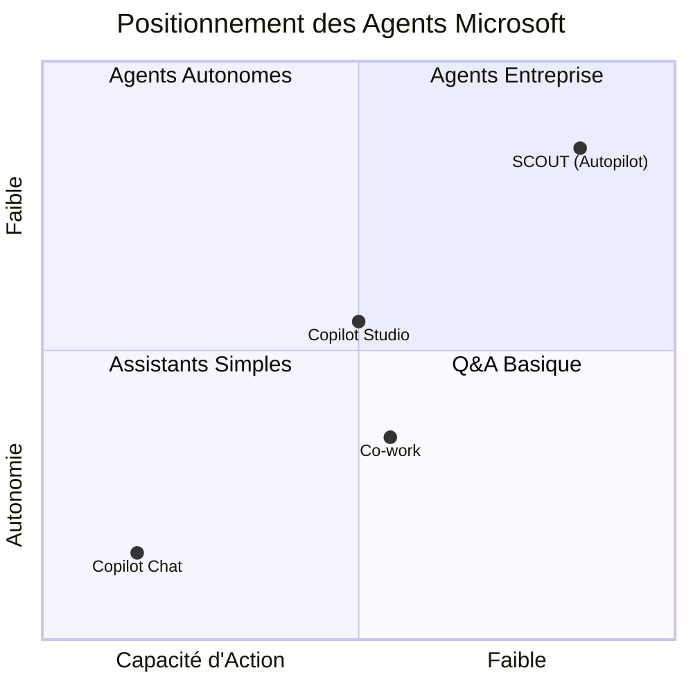
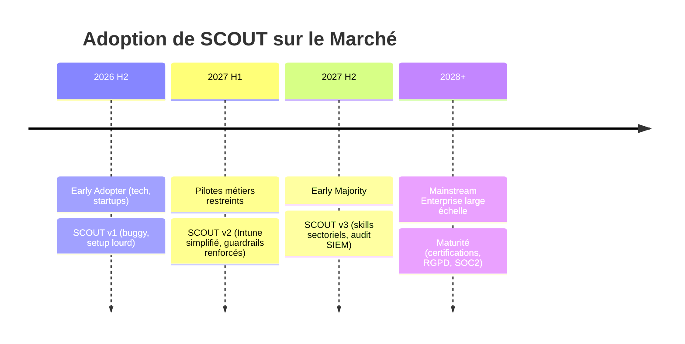
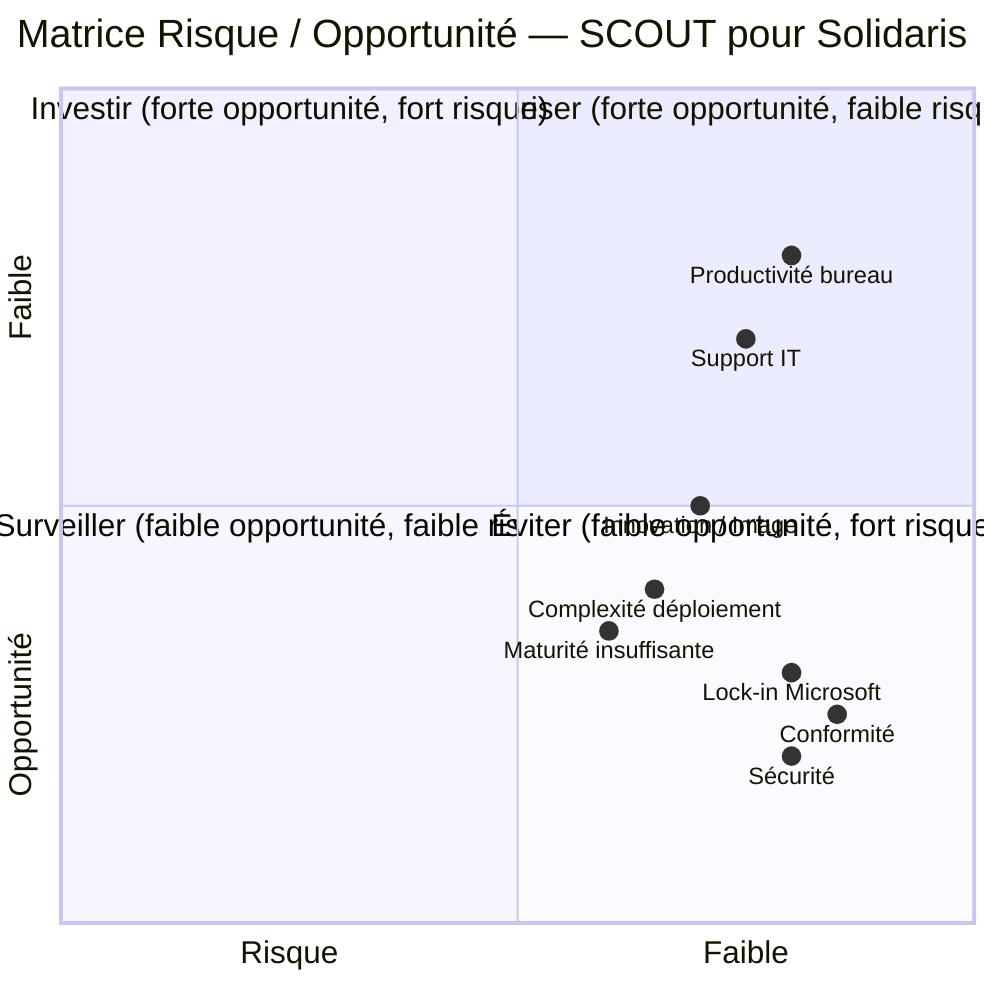
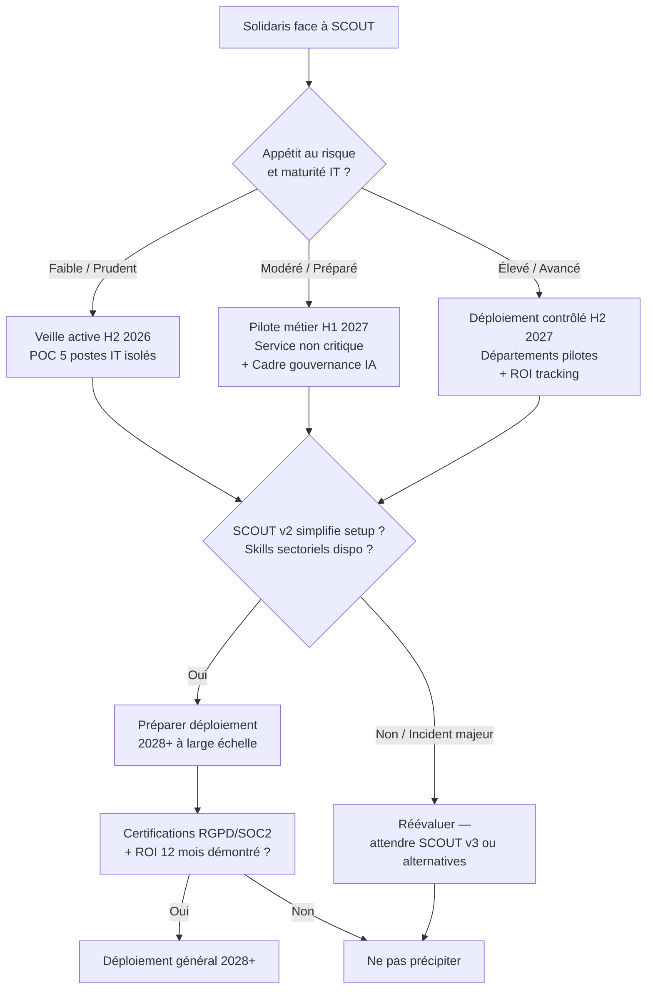

# Analyse Stratégique — Microsoft SCOUT (Autopilot)
## Premier Agent IA Autonome sur Poste Windows

**Date :** 9 juillet 2026
**Destinataire :** Comité de Direction — Solidaris
**Rédacteur :** Vision Stratégique (Bureau Robert — Expert #5)
**Classification :** Confidentiel — Usage Interne

---

## Résumé Exécutif

Microsoft SCOUT est le **premier agent IA véritablement autonome** tournant **localement sur Windows 11**. Contrairement à Copilot (conversationnel) ou aux agents Copilot Studio (orchestrés dans le cloud), SCOUT agit en arrière-plan, 24/7, sur le poste de travail : il lit, écrit, exécute du code, pilote le navigateur, et prend des initiatives sans supervision humaine directe.

**Impact pour Solidaris : potentiellement transformateur, mais immatures.**

SCOUT ouvre la voie à une **automatisation de masse du travail de bureau**, mais son état actuel (setup complexe, sécurité perfectible, écosystème naissant) le place en phase **early adopter technique** — pas encore prêt pour un déploiement mutualité.

**Recommandation :** Expérimentation contrôlée (5-10 postes IT/pilotes) en H2 2026. Pas de déploiement général avant H2 2027 au plus tôt (version 2, Intune mature, cas d'usage mutualité validés).

---

## 1. Qu'est-ce que Microsoft SCOUT ?

### Définition

SCOUT est un **agent IA autonome** qui fonctionne :

- **Localement** sur Windows 11 (pas de cloud pour l'exécution)
- **En arrière-plan**, 24/7, sans déclenchement humain
- **En interaction directe** avec le système d'exploitation (FS, PowerShell, navigateur, compilateurs)

### Capacités Détaillées (démontrées vidéo)

| Capacité | Détail | Niveau de Maturité |
|---|---|---|
| **Système de fichiers** | Liste, lit, déplace, supprime fichiers locaux | ✅ Production |
| **Exécution PowerShell** | Lance scripts système, supprime fichiers bulk | ✅ Production |
| **Navigation web (Playwright)** | Ouvre navigateur, interagit avec sites web | ⚠️ Beta (tentative YouTube partiellement réussie) |
| **Exécution de code** | Installe packages npm/Python, écrit et exécute scripts | ✅ Production |
| **Personnalités** | 3 modes : Default, Sarcastic Teen, Enthusiastic Intern | ✅ Production |
| **Skills Markdown** | Recettes pré-packagées (format SOP) | ✅ Production |
| **MCP (Model Context Protocol)** | Extensibilité via connecteurs standards | ✅ Production |
| **Mémoire persistante** | Apprentissage utilisateur entre sessions | ⚠️ Émergent (scope limité) |

### Modèles Disponibles

| Modèle | Usage Conseillé | Coût Relatif |
|---|---|---|
| Opus 47 | Tâches complexes, raisonnement profond | 💰💰💰 (cher) |
| Sonic 46 | Équilibre performance/coût | 💰💰 |
| Gemini 31 Pro | Tâches standards | 💰💰 |
| GPT 41 | Tâches économiques, haute volumétrie | 💰 (économique) |
| Auto | Sélection automatique par charge | Variable |

---

## 2. Positionnement dans l'Écosystème Microsoft

**Lecture :** SCOUT est le seul agent de l'écosystème Microsoft avec une **autonomie locale réelle**. Il ne remplace pas Copilot Chat (Q&A rapide) ni Copilot Studio (agents métiers). Il les **complète** en occupant la niche : *"l'assistant qui fait à ma place sur mon poste."*

**Comparaison Concurrentielle (Marché Agents Autonomes)**

| Solution | Type | Local/Cloud | Maturité | Verrouillage |
|---|---|---|---|---|
| **Microsoft SCOUT** | Agent OS autonome | Local (Win 11) | ⚠️ Early | 🛡️ Élevé (Intune, Frontier, GH Copilot) |
| **Anthropic Computer Use** | Agent navigateur/OS | Cloud | ⚠️ Beta | Faible (API ouverte) |
| **OpenAI Operator** | Agent navigateur | Cloud | ⚠️ Beta | Moyen (abonnement) |
| **Google Project Mariner** | Agent navigateur | Cloud | 🔬 R&D | Élevé (Chrome/Workspace) |
| **Apple Intelligence (local)** | Agent OS limité | Local (macOS/iOS) | ⚠️ Limité | 🛡️ Très élevé (écosystème fermé) |

**Position de SCOUT :** Premier agent OS autonome en production (pas en beta), mais verrouillage Microsoft maximal. Avantage : **profondeur d'intégration Windows**. Inconvénient : **dépendance totale** à la stack Microsoft Intune/Frontier/GitHub.

---

## 3. Analyse Stratégique pour Solidaris

### 3.1 Opportunités

#### 🟢 Productivité administrative
- **Automatisation des tâches répétitives :** traitement de fichiers, extraction de données, génération de rapports
- **Assistance au back-office :** préparation de dossiers membres, mise à jour de bases, nettoyage de fichiers
- **Gain estimé :** 30-60 minutes/jour/collaborateur sur tâches bureautiques simples

#### 🟢 Support IT et Helpdesk
- **Agent résident sur poste :** diagnostic autonome de problèmes courants avant escalade
- **Exécution de scripts de maintenance :** nettoyage disque, mise à jour, vérification conformité
- **Réduction T1/T2 :** potentiel 15-25% de tickets évités

#### 🟢 Onboarding et Formation
- **Assistant personnel local** pour nouveaux employés : guide pas-à-pas, exécute les étapes
- **Skills pré-packagés** pour processus mutualité (ouverture dossier, calcul allocation)

#### 🟢 Innovation et Image
- **Première mutualité belge** à déployer un agent IA autonome → visibilité sectorielle
- **Attraction talents tech** en modernisant l'environnement de travail
- **Préparation** à la vague agents (Gartner : "50% des employés utiliseront un agent IA d'ici 2028")

### 3.2 Menaces et Risques

#### 🔴 Sécurité et Conformité (RISQUE MAJEUR)
- **Permissions granulaires** mais contournables si mal configurées
- **Données mutualité** (médicales, financières) traitées localement mais avec risques exfiltration via Playwright
- **RGPD :** quel registre pour les actions autonomes d'un agent sur des données à caractère personnel ?
- **Aucun SIEM / audit natif** des actions de l'agent (besoin d'intégration personnalisée)
- **Politique Intune obligatoire** mais non suffisante : que se passe-t-il si l'agent interprète mal une instruction floue ?

#### 🔴 Verrouillage Éditeur
- **Dépendance totale** : Intune, Microsoft Frontier, GitHub Copilot Business/Enterprise
- **Coût non inclus** dans M365 Copilot → budget additionnel significatif
- **Sortie impossible** sans perdre les investissements de configuration et d'adoption
- **Risque de "vendor lock-in"** accru à chaque version

#### 🔴 Complexité de Déploiement (FREIN #1)
- **Windows 11 obligatoire** (postes Solidaris compatibles ?)
- **Organisation Microsoft Frontier** (nouveau concept, migration nécessaire)
- **Configuration Intune** : "plusieurs heures, prise de tête" (Shane Young)
- **Formulaire de consentement** obligatoire pour données hors safe bubble Microsoft
- **GitHub Copilot Business/Enterprise + crédits** (budget additionnel)

#### 🔴 Maturité Insuffisante
- **Absence de cas d'usage validés** dans le secteur mutualité / santé
- **Comportement non déterministe** : l'agent peut prendre des initiatives inattendues
- **Mémoire persistante** : que retire-t-il de l'utilisateur ? Comment effacer ?
- **Pas de "kill switch" granularité fine** en production

#### 🟡 Risque Réputationnel
- Un agent qui "fait n'importe quoi" sur le poste d'un gestionnaire de dossier 👉 crise interne
- Perception "IA remplace l'humain" 👉 résistance syndicale
- Incident sécurité amplifié par la nature autonome de l'agent

---

## 4. Timing d'Adoption

**Jalons Clés pour Solidaris :**

| Période | Action | Investissement | Risque |
|---|---|---|---|
| **H2 2026** | Veille active + POC technique (5 postes IT) | Faible (temps équipe) | Minimal |
| **H1 2027** | Pilote métier (10-20 postes, service ciblé) | Moyen (licences, accompagnement) | Acceptable |
| **H2 2027** | Extension contrôlée (départements pilotes) | Élevé (formation, support, sécurité) | Modéré |
| **2028+** | Généralisation si ROI démontré et maturité confirmée | Très élevé (déploiement masse) | À réévaluer |

**Facteurs d'Accélération :**
- SCOUT v2 simplifie le setup Intune (Microsoft annonce des améliorations)
- Publication de skills sectoriels "Santé / Mutualités" dans le marketplace
- Certification RGPD / SOC2 de SCOUT

**Facteurs de Ralentissement :**
- Incident majeur de sécurité chez un early adopter
- Résistance interne / syndicale
- Arrivée d'un concurrent ouvert (Anthropic Computer Use + Windows)
- SCOUT reste cantonné à usage développeur

---

## 5. Matrice Risque / Opportunité

**LECTURE :** Les opportunités de productivité sont réelles mais dominées par les risques de conformité/sécurité/lock-in. La complexité de déploiement est le frein opérationnel principal.

---

## 6. Recommandations

### 6.1 Court Terme (H2 2026) — "Apprivoiser"

1. **Veille active dédiée :** 1 personne (DSI ou innovation) suit l'évolution de SCOUT, les retours early adopters, les publications sécurité
2. **POC technique restreint :** 5 postes IT isolés, réseau cloisonné, sans données mutualité
   - Tester : nettoyage fichiers, exécution scripts, navigation contrôlée
   - Mesurer : effort de setup, fiabilité, comportements inattendus
3. **Cartographie des cas d'usage** mutualité potentiels (sans développer)
4. **Contact Microsoft Belux** pour roadmap SCOUT sectorielle

### 6.2 Moyen Terme (H1-H2 2027) — "Préparer"

1. **Sécuriser l'infrastructure prérequise :**
   - Migrer les postes Solidaris vers Windows 11 (si pas déjà fait)
   - Monter en compétence Intune (configuration avancée, politiques conteneurisation)
   - Évaluer coût GitHub Copilot Enterprise + crédits pour un pilote
2. **Piloter un service métier non critique** (ex : service logistique ou communication interne)
   - Périmètre défini : pas d'accès données médicales, pas de décision financière
   - KPIs : temps gagné, tickets évités, incidents déclarés
3. **Cadre de gouvernance IA** : politique d'utilisation des agents autonomes (validation, audit, droit à l'erreur)

### 6.3 Long Terme (2028+) — "Déployer"

1. **Déploiement progressif** si :
   - SCOUT v2/v3 stable avec audit SIEM natif
   - Certification RGPD obtenue
   - Skills sectoriels mutualité disponibles
   - ROI démontré sur 12+ mois de pilote
2. **Ne pas précipiter** : la vague agents IA est réelle, mais SCOUT est la version 1.0 d'un paradigme nouveau. Les versions 2.0 et 3.0 seront radicalement meilleures.

### 6.4 Non-Recommandé

- ❌ **Déploiement large en 2026** : risques conformité et sécurité non maîtrisés
- ❌ **Ignorer SCOUT** : le marché des agents autonomes est une tendance de fond (Gartner, McKinsey)
- ❌ **Attendre une solution "clé en main"** : aucune ne viendra sans préparation infrastructure

---

## 7. Questions Clés pour le Comité de Direction

1. **Quel est notre appétit au risque** sur l'IA autonome ? (expérimentation contrôlée vs. attendre)
2. **Sommes-nous prêts à investir** dans l'infrastructure prérequise (Win 11, Intune avancé) même si SCOUT n'est pas retenu in fine ?
3. **Quel budget** sommes-nous prêts à allouer à l'expérimentation IA agentique en 2027 ?
4. **Quelle est notre position** vis-à-vis du vendor lock-in Microsoft pour ce nouveau paradigme ?
5. **Comment communiquer** en interne sur l'arrivée d'agents IA autonomes (syndicats, employés) ?

---

## 8. Mise à jour — Microsoft Build 2026 (San Francisco, Juin 2026)

*Cette section intègre les annonces de la conférence Microsoft Build 2026 qui redéfinissent la stratégie IA de Microsoft et impactent directement le positionnement de SCOUT et l'écosystème agents.*

### 8.1 MAI (Microsoft AI) — Une Famille de Modèles Souveraine

Microsoft a dévoilé **9 nouveaux modèles** sous la marque **MAI (Microsoft AI)**, affirmant sa volonté d'être **indépendant d'OpenAI et d'Anthropic** :

| Modèle | Domaine | Point Clé |
|--------|---------|-----------|
| **MI Synthing** | Raisonnement (35B) | Surpasse Sonnet 4 à coût réduit |
| **MI G2.5** | Génération d'images | Compétitif avec DALL-E / Midjourney |
| **MI Transcribe 1.5** | Transcription vocale | 43 langues supportées |
| **MI Voice** | Clonage vocal | Synthèse vocale avancée |
| **MI Code** | Génération de code | Intégré GitHub Copilot |

**Impact Solidaris :** La maîtrise de la chaîne modèle par Microsoft réduit la dépendance à des tiers, mais renforce le verrouillage sur la stack Azure/Microsoft 365.

### 8.2 Microsoft Agent Platform (MAP) — L'Unification des Agents

Microsoft a annoncé **MAP (Microsoft Agent Platform)**, une **plateforme unifiée open source** basée sur **MAF (Microsoft Agent Framework)**, réunissant :

- **Semantic Kernel** (orchestration IA)
- **AutoGen** (agents multi-systèmes)
- **Hosted Agents** dans Azure AI Foundry (sandbox sécurisée, **GA juillet 2026**)

**MAP = le standard d'orchestration agents Microsoft** — SCOUT s'y intégrera comme agent OS local, tandis que MAP gère les agents cloud et hybrides.

### 8.3 Microsoft IQ — La Couche de Contexte Unifiée

Microsoft IQ apporte une **couche de contexte transverse** :

| Composant | Rôle |
|-----------|------|
| **Work IQ** | Contexte métier (M365, Dynamics) |
| **Fabric IQ** | Contexte données (Microsoft Fabric) |
| **Web IQ** | Contexte web (Bing, Edge) |
| **Fundr IQ** | Contexte financier / ERP |

**Impact SCOUT :** Un agent SCOUT connecté à Microsoft IQ pourrait accéder à un contexte enrichi pour ses décisions — mais cela nécessite une intégration poussée et soulève des questions RGPD supplémentaires.

### 8.4 Sécurité et Gouvernance — Les Annonces Clés

Microsoft a martelé le message **"Sécurité intégrée, pas ajoutée"** avec plusieurs annonces structurantes pour les agents :

| Fonctionnalité | Description | Échéance |
|----------------|-------------|----------|
| **Identité gérée par agent** (Entra ID) | Chaque agent a une identité unique → auditabilité complète | Build 2026 |
| **Conditional Access + DLP** | Politiques d'accès conditionnel et prévention de perte de données applicables par agent | Build 2026 |
| **Agent Registry** | Détection des agents fantômes installés sur les postes | Build 2026 |
| **Code MD** | 100 agents collaboratifs pour trouver les failles de sécurité (preuve de concept) | Démo Build |

**Impact SCOUT :** Ces annonces répondent directement au **risque majeur identifié en §3.2** — l'absence d'audit et de contrôle. L'identité gérée par agent (Entra ID) est un changement de paradigme : chaque instance SCOUT pourrait être auditée comme un utilisateur nommé.

### 8.5 GitHub Copilot Natif — L'Agent Développeur

GitHub Copilot devient une **application native** (macOS, Windows, Linux) avec des capacités agentiques étendues, renforçant l'écosystème **MI Code**.

### 8.6 Synthèse pour Solidaris

> **"L'IA ne changera pas votre entreprise, c'est le système qui la fait tourner qui le fera."** — Message clé de Microsoft Build 2026

**Ce que ça change pour notre analyse :**

1. ✅ **Renforcement de la roadmap sécurité** — l'identité gérée + Agent Registry répondent partiellement au risque conformité (§3.2)
2. ✅ **MAP unifie le paysage** — moins de fragmentation des solutions agents Microsoft
3. ⚠️ **Accélération du verrouillage** — MAI + MAP + IQ = stack Microsoft encore plus intégrée
4. ❓ **Microsoft IQ et RGPD** — une couche de contexte unifiée sur les données Solidaris pose des questions de registre et de consentement
5. 🟢 **Opportunité tactique** — la maturité des Hosted Agents (Foundry, GA juillet 2026) permet un PEC agents cloud avant d'attaquer SCOUT en local

**Recommandation mise à jour :** Profiter des **Hosted Agents Foundry (GA juillet 2026)** pour un premier PEC agents Microsoft **sans exposition des postes**, en parallèle du POC SCOUT restreint. MAP devenant le standard, toute compétence acquise sur Semantic Kernel / AutoGen sera réutilisable.

---

## Annexe : Checklist de Prérequis SCOUT

| Prérequis | Statut Solidaris (estimation) | Effort |
|---|---|---|
| Windows 11 (tous postes) | ⏳ À vérifier | Majeur si encore Win 10 |
| Organisation Microsoft Frontier | ❌ Nouveau | Définition + migration |
| Intune (politiques avancées) | ⏳ Partiel | Renforcement nécessaire |
| GitHub Copilot Business/Enterprise | ❌ Nouveau | Budget + licences |
| Formulaire de consentement Microsoft | ❌ Nouveau | Juridique + DPO |
| Crédits d'exécution SCOUT | ❌ Nouveau | Budget variable |
| Poste pilote (VM ou bare metal) | ✅ Existant | Négligeable |

---

*Document produit par le Bureau Robert — Vision Stratégique (Expert #5)*
*Sources : Shane Young / PowerApps911 (démo 23min), documentation Microsoft SCOUT, analyse marché agents autonomes 2026.*
*Version 1.0 — 9 juillet 2026*
