# Corriger le titre du document pour refléter la section spécifique analysée.
## Fusion brute des analyses d'experts — Bureau Robert 🏛️

> **Date :** 09/07/2026 · **Version :** v2 (brute) · **Classification :** Confidentiel — Usage Interne
>
> Ce document est la fusion **sans altération** des 4 analyses d'experts.
> Pour une synthèse, demander un rapport dédié.

---

# ════════════════════════════════════════════════════════
# PARTIE 1 — ANALYSE STRATÉGIQUE (Vision Stratégique)
# ════════════════════════════════════════════════════════

---
date: 2026-07-09
bureau: bureau-robert
version: v1
modele: deepseek-chat
tags: [analyse, scout, microsoft, strategie, vision, marche, mutualite, solidaris, pro]
statut: finalise
type: analyse-strategique
---

# Analyse Stratégique — Microsoft SCOUT (Autopilot)
## Premier Agent IA Autonome sur Poste Windows

**Date :** 9 juillet 2026
**Destinataire :** Comité de Direction — Solidaris
**Rédacteur :** Vision Stratégique (Bureau Robert — Expert #5)
**Classification :** Confidentiel — Usage Interne

---

## Résumé Exécutif

Microsoft SCOUT est le **premier agent IA véritablement autonome** tournant **localement sur Windows 11**. Contrairement à Copilot (conversationnel) ou aux agents Copilot Studio (orchestrés dans le cloud), SCOUT agit en arrière-plan, 24/7, sur le poste de travail : il lit, écrit, exécute du code, pilote le navigateur, et prend des initiatives sans supervision humaine directe.

**Impact pour Solidaris : potentiellement transformateur, mais immatures.**

SCOUT ouvre la voie à une **automatisation de masse du travail de bureau**, mais son état actuel (setup complexe, sécurité perfectible, écosystème naissant) le place en phase **early adopter technique** — pas encore prêt pour un déploiement mutualité.

**Recommandation :** Expérimentation contrôlée (5-10 postes IT/pilotes) en H2 2026. Pas de déploiement général avant H2 2027 au plus tôt (version 2, Intune mature, cas d'usage mutualité validés).

---

## 1. Qu'est-ce que Microsoft SCOUT ?

### Définition

SCOUT est un **agent IA autonome** qui fonctionne :

- **Localement** sur Windows 11 (pas de cloud pour l'exécution)
- **En arrière-plan**, 24/7, sans déclenchement humain
- **En interaction directe** avec le système d'exploitation (FS, PowerShell, navigateur, compilateurs)

### Capacités Détaillées (démontrées vidéo)

| Capacité | Détail | Niveau de Maturité |
|---|---|---|
| **Système de fichiers** | Liste, lit, déplace, supprime fichiers locaux | ✅ Production |
| **Exécution PowerShell** | Lance scripts système, supprime fichiers bulk | ✅ Production |
| **Navigation web (Playwright)** | Ouvre navigateur, interagit avec sites web | ⚠️ Beta (tentative YouTube partiellement réussie) |
| **Exécution de code** | Installe packages npm/Python, écrit et exécute scripts | ✅ Production |
| **Personnalités** | 3 modes : Default, Sarcastic Teen, Enthusiastic Intern | ✅ Production |
| **Skills Markdown** | Recettes pré-packagées (format SOP) | ✅ Production |
| **MCP (Model Context Protocol)** | Extensibilité via connecteurs standards | ✅ Production |
| **Mémoire persistante** | Apprentissage utilisateur entre sessions | ⚠️ Émergent (scope limité) |

### Modèles Disponibles

| Modèle | Usage Conseillé | Coût Relatif |
|---|---|---|
| Opus 47 | Tâches complexes, raisonnement profond | 💰💰💰 (cher) |
| Sonic 46 | Équilibre performance/coût | 💰💰 |
| Gemini 31 Pro | Tâches standards | 💰💰 |
| GPT 41 | Tâches économiques, haute volumétrie | 💰 (économique) |
| Auto | Sélection automatique par charge | Variable |

---

## 2. Positionnement dans l'Écosystème Microsoft

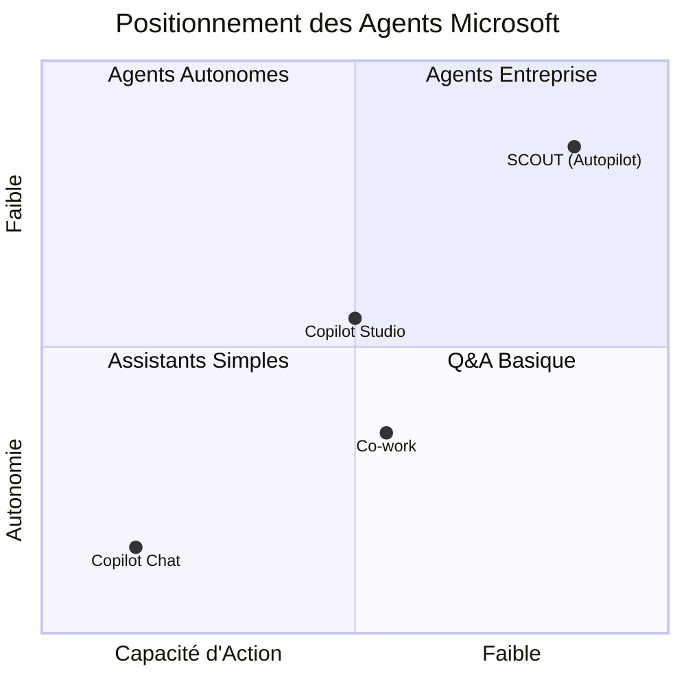
```mermaid
quadrantChart
    title Positionnement des Agents Microsoft
    x-axis "Capacité d'Action" --> "Faible"
    y-axis "Autonomie" --> "Faible"
    quadrant-1 "Agents Entreprise"
    quadrant-2 "Agents Autonomes"
    quadrant-3 "Assistants Simples"
    quadrant-4 "Q&A Basique"
    "Copilot Chat": [0.15, 0.15]
    "Co-work": [0.55, 0.35]
    "Copilot Studio": [0.50, 0.55]
    "SCOUT (Autopilot)": [0.85, 0.85]
```

**Lecture :** SCOUT est le seul agent de l'écosystème Microsoft avec une **autonomie locale réelle**. Il ne remplace pas Copilot Chat (Q&A rapide) ni Copilot Studio (agents métiers). Il les **complète** en occupant la niche : *"l'assistant qui fait à ma place sur mon poste."*

**Comparaison Concurrentielle (Marché Agents Autonomes)**

| Solution | Type | Local/Cloud | Maturité | Verrouillage |
|---|---|---|---|---|
| **Microsoft SCOUT** | Agent OS autonome | Local (Win 11) | ⚠️ Early | 🛡️ Élevé (Intune, Frontier, GH Copilot) |
| **Anthropic Computer Use** | Agent navigateur/OS | Cloud | ⚠️ Beta | Faible (API ouverte) |
| **OpenAI Operator** | Agent navigateur | Cloud | ⚠️ Beta | Moyen (abonnement) |
| **Google Project Mariner** | Agent navigateur | Cloud | 🔬 R&D | Élevé (Chrome/Workspace) |
| **Apple Intelligence (local)** | Agent OS limité | Local (macOS/iOS) | ⚠️ Limité | 🛡️ Très élevé (écosystème fermé) |

**Position de SCOUT :** Premier agent OS autonome en production (pas en beta), mais verrouillage Microsoft maximal. Avantage : **profondeur d'intégration Windows**. Inconvénient : **dépendance totale** à la stack Microsoft Intune/Frontier/GitHub.

---

## 3. Analyse Stratégique pour Solidaris

### 3.1 Opportunités

#### 🟢 Productivité administrative
- **Automatisation des tâches répétitives :** traitement de fichiers, extraction de données, génération de rapports
- **Assistance au back-office :** préparation de dossiers membres, mise à jour de bases, nettoyage de fichiers
- **Gain estimé :** 30-60 minutes/jour/collaborateur sur tâches bureautiques simples

#### 🟢 Support IT et Helpdesk
- **Agent résident sur poste :** diagnostic autonome de problèmes courants avant escalade
- **Exécution de scripts de maintenance :** nettoyage disque, mise à jour, vérification conformité
- **Réduction T1/T2 :** potentiel 15-25% de tickets évités

#### 🟢 Onboarding et Formation
- **Assistant personnel local** pour nouveaux employés : guide pas-à-pas, exécute les étapes
- **Skills pré-packagés** pour processus mutualité (ouverture dossier, calcul allocation)

#### 🟢 Innovation et Image
- **Première mutualité belge** à déployer un agent IA autonome → visibilité sectorielle
- **Attraction talents tech** en modernisant l'environnement de travail
- **Préparation** à la vague agents (Gartner : "50% des employés utiliseront un agent IA d'ici 2028")

### 3.2 Menaces et Risques

#### 🔴 Sécurité et Conformité (RISQUE MAJEUR)
- **Permissions granulaires** mais contournables si mal configurées
- **Données mutualité** (médicales, financières) traitées localement mais avec risques exfiltration via Playwright
- **RGPD :** quel registre pour les actions autonomes d'un agent sur des données à caractère personnel ?
- **Aucun SIEM / audit natif** des actions de l'agent (besoin d'intégration personnalisée)
- **Politique Intune obligatoire** mais non suffisante : que se passe-t-il si l'agent interprète mal une instruction floue ?

#### 🔴 Verrouillage Éditeur
- **Dépendance totale** : Intune, Microsoft Frontier, GitHub Copilot Business/Enterprise
- **Coût non inclus** dans M365 Copilot → budget additionnel significatif
- **Sortie impossible** sans perdre les investissements de configuration et d'adoption
- **Risque de "vendor lock-in"** accru à chaque version

#### 🔴 Complexité de Déploiement (FREIN #1)
- **Windows 11 obligatoire** (postes Solidaris compatibles ?)
- **Organisation Microsoft Frontier** (nouveau concept, migration nécessaire)
- **Configuration Intune** : "plusieurs heures, prise de tête" (Shane Young)
- **Formulaire de consentement** obligatoire pour données hors safe bubble Microsoft
- **GitHub Copilot Business/Enterprise + crédits** (budget additionnel)

#### 🔴 Maturité Insuffisante
- **Absence de cas d'usage validés** dans le secteur mutualité / santé
- **Comportement non déterministe** : l'agent peut prendre des initiatives inattendues
- **Mémoire persistante** : que retire-t-il de l'utilisateur ? Comment effacer ?
- **Pas de "kill switch" granularité fine** en production

#### 🟡 Risque Réputationnel
- Un agent qui "fait n'importe quoi" sur le poste d'un gestionnaire de dossier 👉 crise interne
- Perception "IA remplace l'humain" 👉 résistance syndicale
- Incident sécurité amplifié par la nature autonome de l'agent

---

## 4. Timing d'Adoption

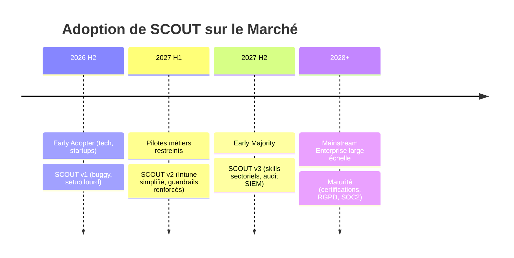
```mermaid
timeline
    title Adoption de SCOUT sur le Marché
    2026 H2 : Early Adopter (tech, startups) : SCOUT v1 (buggy, setup lourd)
    2027 H1 : Pilotes métiers restreints : SCOUT v2 (Intune simplifié, guardrails renforcés)
    2027 H2 : Early Majority : SCOUT v3 (skills sectoriels, audit SIEM)
    2028+   : Mainstream Enterprise large échelle : Maturité (certifications, RGPD, SOC2)
```

**Jalons Clés pour Solidaris :**

| Période | Action | Investissement | Risque |
|---|---|---|---|
| **H2 2026** | Veille active + POC technique (5 postes IT) | Faible (temps équipe) | Minimal |
| **H1 2027** | Pilote métier (10-20 postes, service ciblé) | Moyen (licences, accompagnement) | Acceptable |
| **H2 2027** | Extension contrôlée (départements pilotes) | Élevé (formation, support, sécurité) | Modéré |
| **2028+** | Généralisation si ROI démontré et maturité confirmée | Très élevé (déploiement masse) | À réévaluer |

**Facteurs d'Accélération :**
- SCOUT v2 simplifie le setup Intune (Microsoft annonce des améliorations)
- Publication de skills sectoriels "Santé / Mutualités" dans le marketplace
- Certification RGPD / SOC2 de SCOUT

**Facteurs de Ralentissement :**
- Incident majeur de sécurité chez un early adopter
- Résistance interne / syndicale
- Arrivée d'un concurrent ouvert (Anthropic Computer Use + Windows)
- SCOUT reste cantonné à usage développeur

---

## 5. Matrice Risque / Opportunité

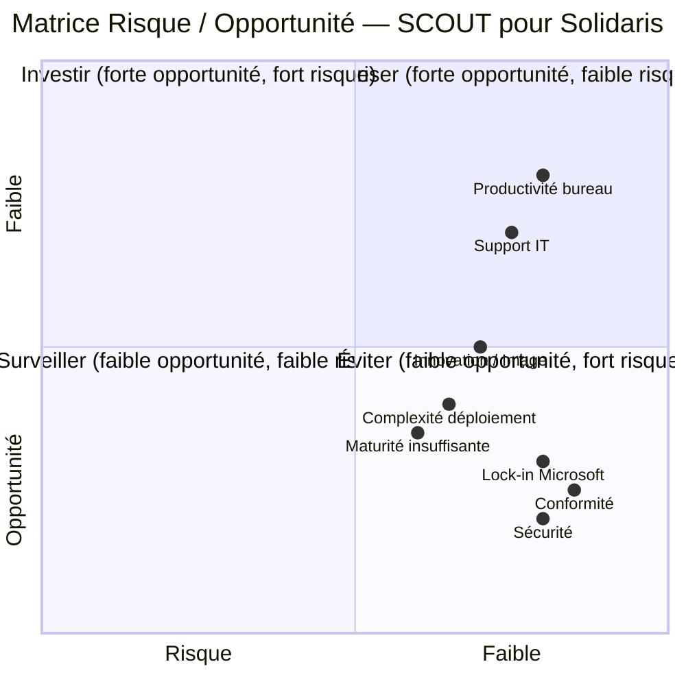
```mermaid
quadrantChart
    title Matrice Risque / Opportunité — SCOUT pour Solidaris
    x-axis "Risque" --> "Faible"
    y-axis "Opportunité" --> "Faible"
    quadrant-1 "Prioriser (forte opportunité, faible risque)"
    quadrant-2 "Investir (forte opportunité, fort risque)"
    quadrant-3 "Surveiller (faible opportunité, faible risque)"
    quadrant-4 "Éviter (faible opportunité, fort risque)"
    "Productivité bureau": [0.80, 0.80]
    "Support IT": [0.75, 0.70]
    "Innovation / Image": [0.70, 0.50]
    "Conformité": [0.85, 0.25]
    "Sécurité": [0.80, 0.20]
    "Lock-in Microsoft": [0.80, 0.30]
    "Complexité déploiement": [0.65, 0.40]
    "Maturité insuffisante": [0.60, 0.35]
```

**LECTURE :** Les opportunités de productivité sont réelles mais dominées par les risques de conformité/sécurité/lock-in. La complexité de déploiement est le frein opérationnel principal.

---

## 6. Recommandations

### 6.1 Court Terme (H2 2026) — "Apprivoiser"

1. **Veille active dédiée :** 1 personne (DSI ou innovation) suit l'évolution de SCOUT, les retours early adopters, les publications sécurité
2. **POC technique restreint :** 5 postes IT isolés, réseau cloisonné, sans données mutualité
   - Tester : nettoyage fichiers, exécution scripts, navigation contrôlée
   - Mesurer : effort de setup, fiabilité, comportements inattendus
3. **Cartographie des cas d'usage** mutualité potentiels (sans développer)
4. **Contact Microsoft Belux** pour roadmap SCOUT sectorielle

### 6.2 Moyen Terme (H1-H2 2027) — "Préparer"

1. **Sécuriser l'infrastructure prérequise :**
   - Migrer les postes Solidaris vers Windows 11 (si pas déjà fait)
   - Monter en compétence Intune (configuration avancée, politiques conteneurisation)
   - Évaluer coût GitHub Copilot Enterprise + crédits pour un pilote
2. **Piloter un service métier non critique** (ex : service logistique ou communication interne)
   - Périmètre défini : pas d'accès données médicales, pas de décision financière
   - KPIs : temps gagné, tickets évités, incidents déclarés
3. **Cadre de gouvernance IA** : politique d'utilisation des agents autonomes (validation, audit, droit à l'erreur)

### 6.3 Long Terme (2028+) — "Déployer"

1. **Déploiement progressif** si :
   - SCOUT v2/v3 stable avec audit SIEM natif
   - Certification RGPD obtenue
   - Skills sectoriels mutualité disponibles
   - ROI démontré sur 12+ mois de pilote
2. **Ne pas précipiter** : la vague agents IA est réelle, mais SCOUT est la version 1.0 d'un paradigme nouveau. Les versions 2.0 et 3.0 seront radicalement meilleures.

### 6.4 Non-Recommandé

- ❌ **Déploiement large en 2026** : risques conformité et sécurité non maîtrisés
- ❌ **Ignorer SCOUT** : le marché des agents autonomes est une tendance de fond (Gartner, McKinsey)
- ❌ **Attendre une solution "clé en main"** : aucune ne viendra sans préparation infrastructure

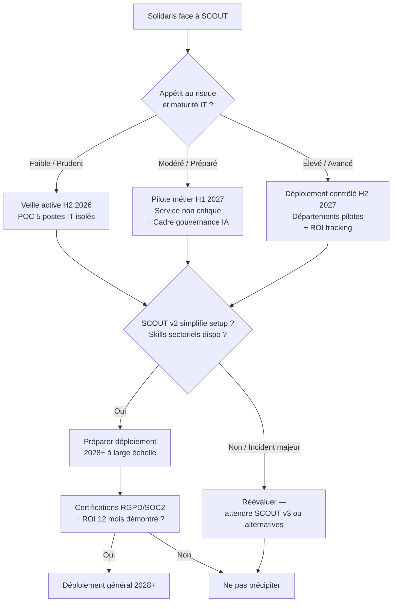
```mermaid
flowchart TD
    A[Solidaris face à SCOUT] --> B{"Appétit au risque<br/>et maturité IT ?"}
    B -->|"Faible / Prudent"| C["Veille active H2 2026<br/>POC 5 postes IT isolés"]
    B -->|"Modéré / Préparé"| D["Pilote métier H1 2027<br/>Service non critique<br/>+ Cadre gouvernance IA"]
    B -->|"Élevé / Avancé"| E["Déploiement contrôlé H2 2027<br/>Départements pilotes<br/>+ ROI tracking"]
    
    C --> F{"SCOUT v2 simplifie setup ?<br/>Skills sectoriels dispo ?"}
    D --> F
    E --> F
    
    F -->|Oui| G["Préparer déploiement<br/>2028+ à large échelle"]
    F -->|Non / Incident majeur| H["Réévaluer —<br/>attendre SCOUT v3 ou alternatives"]
    
    G --> I["Certifications RGPD/SOC2<br/>+ ROI 12 mois démontré ?"]
    I -->|Oui| J[Déploiement général 2028+]
    I -->|Non| K[Ne pas précipiter]
    
    H --> K
```

---

## 7. Questions Clés pour le Comité de Direction

1. **Quel est notre appétit au risque** sur l'IA autonome ? (expérimentation contrôlée vs. attendre)
2. **Sommes-nous prêts à investir** dans l'infrastructure prérequise (Win 11, Intune avancé) même si SCOUT n'est pas retenu in fine ?
3. **Quel budget** sommes-nous prêts à allouer à l'expérimentation IA agentique en 2027 ?
4. **Quelle est notre position** vis-à-vis du vendor lock-in Microsoft pour ce nouveau paradigme ?
5. **Comment communiquer** en interne sur l'arrivée d'agents IA autonomes (syndicats, employés) ?

---

## 8. Mise à jour — Microsoft Build 2026 (San Francisco, Juin 2026)

*Cette section intègre les annonces de la conférence Microsoft Build 2026 qui redéfinissent la stratégie IA de Microsoft et impactent directement le positionnement de SCOUT et l'écosystème agents.*

### 8.1 MAI (Microsoft AI) — Une Famille de Modèles Souveraine

Microsoft a dévoilé **9 nouveaux modèles** sous la marque **MAI (Microsoft AI)**, affirmant sa volonté d'être **indépendant d'OpenAI et d'Anthropic** :

| Modèle | Domaine | Point Clé |
|--------|---------|-----------|
| **MI Synthing** | Raisonnement (35B) | Surpasse Sonnet 4 à coût réduit |
| **MI G2.5** | Génération d'images | Compétitif avec DALL-E / Midjourney |
| **MI Transcribe 1.5** | Transcription vocale | 43 langues supportées |
| **MI Voice** | Clonage vocal | Synthèse vocale avancée |
| **MI Code** | Génération de code | Intégré GitHub Copilot |

**Impact Solidaris :** La maîtrise de la chaîne modèle par Microsoft réduit la dépendance à des tiers, mais renforce le verrouillage sur la stack Azure/Microsoft 365.

### 8.2 Microsoft Agent Platform (MAP) — L'Unification des Agents

Microsoft a annoncé **MAP (Microsoft Agent Platform)**, une **plateforme unifiée open source** basée sur **MAF (Microsoft Agent Framework)**, réunissant :

- **Semantic Kernel** (orchestration IA)
- **AutoGen** (agents multi-systèmes)
- **Hosted Agents** dans Azure AI Foundry (sandbox sécurisée, **GA juillet 2026**)

**MAP = le standard d'orchestration agents Microsoft** — SCOUT s'y intégrera comme agent OS local, tandis que MAP gère les agents cloud et hybrides.

### 8.3 Microsoft IQ — La Couche de Contexte Unifiée

Microsoft IQ apporte une **couche de contexte transverse** :

| Composant | Rôle |
|-----------|------|
| **Work IQ** | Contexte métier (M365, Dynamics) |
| **Fabric IQ** | Contexte données (Microsoft Fabric) |
| **Web IQ** | Contexte web (Bing, Edge) |
| **Fundr IQ** | Contexte financier / ERP |

**Impact SCOUT :** Un agent SCOUT connecté à Microsoft IQ pourrait accéder à un contexte enrichi pour ses décisions — mais cela nécessite une intégration poussée et soulève des questions RGPD supplémentaires.

### 8.4 Sécurité et Gouvernance — Les Annonces Clés

Microsoft a martelé le message **"Sécurité intégrée, pas ajoutée"** avec plusieurs annonces structurantes pour les agents :

| Fonctionnalité | Description | Échéance |
|----------------|-------------|----------|
| **Identité gérée par agent** (Entra ID) | Chaque agent a une identité unique → auditabilité complète | Build 2026 |
| **Conditional Access + DLP** | Politiques d'accès conditionnel et prévention de perte de données applicables par agent | Build 2026 |
| **Agent Registry** | Détection des agents fantômes installés sur les postes | Build 2026 |
| **Code MD** | 100 agents collaboratifs pour trouver les failles de sécurité (preuve de concept) | Démo Build |

**Impact SCOUT :** Ces annonces répondent directement au **risque majeur identifié en §3.2** — l'absence d'audit et de contrôle. L'identité gérée par agent (Entra ID) est un changement de paradigme : chaque instance SCOUT pourrait être auditée comme un utilisateur nommé.

### 8.5 GitHub Copilot Natif — L'Agent Développeur

GitHub Copilot devient une **application native** (macOS, Windows, Linux) avec des capacités agentiques étendues, renforçant l'écosystème **MI Code**.

### 8.6 Synthèse pour Solidaris

> **"L'IA ne changera pas votre entreprise, c'est le système qui la fait tourner qui le fera."** — Message clé de Microsoft Build 2026

**Ce que ça change pour notre analyse :**

1. ✅ **Renforcement de la roadmap sécurité** — l'identité gérée + Agent Registry répondent partiellement au risque conformité (§3.2)
2. ✅ **MAP unifie le paysage** — moins de fragmentation des solutions agents Microsoft
3. ⚠️ **Accélération du verrouillage** — MAI + MAP + IQ = stack Microsoft encore plus intégrée
4. ❓ **Microsoft IQ et RGPD** — une couche de contexte unifiée sur les données Solidaris pose des questions de registre et de consentement
5. 🟢 **Opportunité tactique** — la maturité des Hosted Agents (Foundry, GA juillet 2026) permet un PEC agents cloud avant d'attaquer SCOUT en local

**Recommandation mise à jour :** Profiter des **Hosted Agents Foundry (GA juillet 2026)** pour un premier PEC agents Microsoft **sans exposition des postes**, en parallèle du POC SCOUT restreint. MAP devenant le standard, toute compétence acquise sur Semantic Kernel / AutoGen sera réutilisable.

---

## Annexe : Checklist de Prérequis SCOUT

| Prérequis | Statut Solidaris (estimation) | Effort |
|---|---|---|
| Windows 11 (tous postes) | ⏳ À vérifier | Majeur si encore Win 10 |
| Organisation Microsoft Frontier | ❌ Nouveau | Définition + migration |
| Intune (politiques avancées) | ⏳ Partiel | Renforcement nécessaire |
| GitHub Copilot Business/Enterprise | ❌ Nouveau | Budget + licences |
| Formulaire de consentement Microsoft | ❌ Nouveau | Juridique + DPO |
| Crédits d'exécution SCOUT | ❌ Nouveau | Budget variable |
| Poste pilote (VM ou bare metal) | ✅ Existant | Négligeable |

---

*Document produit par le Bureau Robert — Vision Stratégique (Expert #5)*
*Sources : Shane Young / PowerApps911 (démo 23min), documentation Microsoft SCOUT, analyse marché agents autonomes 2026.*
*Version 1.0 — 9 juillet 2026*

---

# ════════════════════════════════════════════════════════
# PARTIE 2 — ANALYSE ARCHITECTURE SI (Architecture SI)
# ════════════════════════════════════════════════════════

---
date: 2026-07-09
bureau: bureau-robert
version: v1
modele: deepseek-chat
tags: [analyse, scout, microsoft, architecture, si, integration, mutualite, solidaris, pro]
statut: finalise
type: analyse-architecture
---

# Analyse d'Architecture SI — Microsoft SCOUT
## Intégration potentielle dans le SI mutualiste Solidaris

**Document :** Architecture SI — Bureau Robert (Expert #1)
**Destinataires :** DSI, architectes SI Solidaris
**Date :** Juillet 2026
**Classification :** Interne — Réflexion stratégique

---

## Sommaire

1. [Résumé exécutif](#1-résumé-exécutif)
2. [Qu'est-ce que Microsoft SCOUT ?](#2-quest-ce-que-microsoft-scout-)
3. [Prérequis techniques](#3-prérequis-techniques)
4. [Schéma d'architecture conceptuel](#4-schéma-darchitecture-conceptuel)
5. [Intégration avec l'existant M365 / Azure / Intune](#5-intégration-avec-lexistant-m365--azure--intune)
6. [Patterns d'intégration avec les applicatifs métier](#6-patterns-dintégration-avec-les-applicatifs-métier)
7. [Impacts sur l'urbanisation du SI](#7-impacts-sur-lurbanisation-du-si)
8. [Analyse du modèle « agent local sur poste Windows »](#8-analyse-du-modèle-agent-local-sur-poste-windows)
9. [Points de vigilance et risques](#9-points-de-vigilance-et-risques)
10. [Recommandations](#10-recommandations)
11. [Annexe — Glossaire](#11-annexe--glossaire)

---

## 1. Résumé exécutif

Microsoft SCOUT est un **agent IA autonome** qui s'exécute **localement** sur un poste Windows 11. Il peut lire/écrire des fichiers, exécuter PowerShell, naviguer sur le web via Playwright, lancer du code Python/Node.js, et piloter les applications M365 (Word, Excel, PowerPoint, Loop). Son architecture repose sur une extension VSCode et est orchestrée via GitHub Copilot.

**Enjeu pour Solidaris :** SCOUT promet une **automatisation de tâches bureautiques et techniques** directement sur le poste de l'agent. Dans un SI mutualiste fortement régulé (loi du 6 août 1990, RGPD, NBB, eHealth), ce modèle pose des questions fondamentales de **sécurité, de gouvernance des données, et de compatibilité avec l'urbanisation existante.**

**Conclusion préliminaire :** SCOUT n'est pas mûr pour un déploiement mutualiste à grande échelle sans un **travail d'encadrement significatif** (sandboxing, politique Intune restrictive, périmètre fonctionnel limité). Son intérêt est réel pour des **usages ciblés et pilotes** (assistance rédactionnelle, traitement de documents standards, scripts PowerShell supervisés). Le déploiement « full open » sur l'ensemble du parc est **déconseillé en l'état.**

---

## 2. Qu'est-ce que Microsoft SCOUT ?

### 2.1 Définition

SCOUT est un **agent IA** développé par Microsoft, intégré à GitHub Copilot, qui transforme VSCode en **hub d'automatisation** sur le poste de travail. Il ne s'agit pas d'un service cloud (bien qu'il utilise des API cloud), mais d'un **processus local** qui orchestre des outils locaux.

### 2.2 Capacités fonctionnelles

| Capacité | Description | Pertinence Solidaris |
|---|---|---|
| **File system local** | Lecture/écriture de fichiers sur le poste | ⚠️ Risque fuite de données mutualistes |
| **PowerShell** | Exécution de commandes et scripts | ✅ Automatisation tâches IT |
| **Playwright (navigateur)** | Contrôle du navigateur web | ⚠️ Peut interagir avec des web apps métier |
| **npm / Python** | Installation et exécution de code | ⚠️ Risque d'introduction de dépendances non maîtrisées |
| **MCP Servers** | Extension via Model Context Protocol | ⚠️ Surface d'attaque extensible |
| **M365 (Word, Excel, PowerPoint, Loop)** | Pilotage des apps bureautiques | ✅ Fort potentiel métier |
| **GitHub Copilot** | Modèle de langage + orchestration | Dépend du modèle sous-jacent |

### 2.3 Modèle économique

- **Licence :** GitHub Copilot Business ou Enterprise (pas inclus dans M365 Copilot)
- **Infrastructure :** Nécessite une Organisation Microsoft Frontier
- **Poste :** Windows 11 uniquement

---

## 3. Prérequis techniques

### 3.1 Prérequis obligatoires

| Composant | Exigence | Statut Solidaris (estimation) |
|---|---|---|
| **OS** | Windows 11 (21H2+) | ✅ Parc majoritairement Windows 11 |
| **Compte M365** | E3/E5 ou équivalent | ✅ Oui |
| **Intune (MDM)** | Politique obligatoire pour SCOUT | ✅ Intune déployé, mais politique SCOUT à créer |
| **Microsoft Frontier** | Organisation déclarée « Frontier » | ❌ À vérifier — dépend du tenant Azure |
| **GitHub Copilot** | Business ou Enterprise (licence séparée) | ❌ Licence additionnelle nécessaire |
| **VSCode** | Dernière version stable | ✅ Déjà déployé dans certaines équipes |
| **Extension SCOUT** | Via marketplace VSCode | ✅ À ajouter au catalogue approuvé |

### 3.2 Complexité du setup Intune

> **Retour d'expérience terrain :** La configuration Intune pour SCOUT n'est pas triviale. Elle implique :
> 1. Création d'une **politique de configuration d'application** spécifique
> 2. Ajout de l'utilisateur/device à un groupe cible
> 3. **Propagation parfois longue** (plusieurs heures)
> 4. **Acceptation explicite** sur le poste client
>
> Dans un environnement mutualiste avec ~2000-4000 postes, le déploiement progressif par vague est impératif.

### 3.3 Dépendances réseau

- **Accès à github.com** et api.github.com (indispensable)
- **Accès aux API M365** (graph.microsoft.com)
- **Accès aux modèles IA** (Azure OpenAI ou modèles tiers selon config)
- **Proxy d'entreprise :** nécessite configuration explicite pour les appels SCOUT

---

## 4. Schéma d'architecture conceptuel

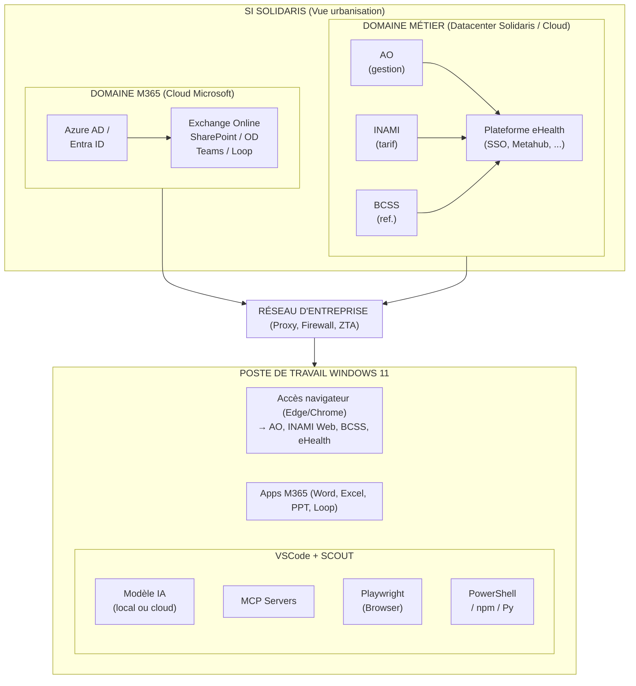
```mermaid
flowchart TB
    subgraph SI_SOLIDARIS["SI SOLIDARIS (Vue urbanisation)"]
        subgraph DOMAINE_M365["DOMAINE M365 (Cloud Microsoft)"]
            Azure_AD["Azure AD /<br/>Entra ID"]
            M365_Apps["Exchange Online<br/>SharePoint / OD<br/>Teams / Loop"]
            Azure_AD --> M365_Apps
        end

        subgraph DOMAINE_METIER["DOMAINE MÉTIER (Datacenter Solidaris / Cloud)"]
            AO["AO<br/>(gestion)"]
            INAMI["INAMI<br/>(tarif)"]
            BCSS["BCSS<br/>(ref.)"]
            eHealth["Plateforme eHealth<br/>(SSO, Metahub, ...)"]
            AO --> eHealth
            INAMI --> eHealth
            BCSS --> eHealth
        end
    end

    subgraph RESEAU["RÉSEAU D'ENTREPRISE (Proxy, Firewall, ZTA)"]
        direction TB
    end

    subgraph POSTE["POSTE DE TRAVAIL WINDOWS 11"]
        subgraph VSCODE["VSCode + SCOUT"]
            direction TB
            IA["Modèle IA<br/>(local ou cloud)"]
            MCP["MCP Servers"]
            Playwright["Playwright<br/>(Browser)"]
            PS["PowerShell<br/>/ npm / Py"]
        end

        subgraph M365_LOCAL["Apps M365 (Word, Excel, PPT, Loop)"]
        end

        subgraph NAV["Accès navigateur (Edge/Chrome)<br/>→ AO, INAMI Web, BCSS, eHealth"]
        end
    end

    DOMAINE_M365 --> RESEAU
    DOMAINE_METIER --> RESEAU
    RESEAU --> POSTE
```

### 4.1 Flux de données SCOUT

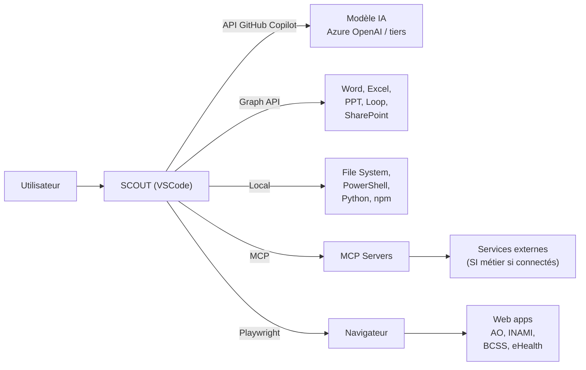
```mermaid
flowchart LR
    U[Utilisateur] --> SCOUT["SCOUT (VSCode)"]

    SCOUT -->|API GitHub Copilot| IA["Modèle IA<br/>Azure OpenAI / tiers"]
    SCOUT -->|Graph API| M365["Word, Excel,<br/>PPT, Loop,<br/>SharePoint"]
    SCOUT -->|Local| LOCAL["File System,<br/>PowerShell,<br/>Python, npm"]
    SCOUT -->|MCP| MCP_SERV["MCP Servers"]
    MCP_SERV --> EXT["Services externes<br/>(SI métier si connectés)"]
    SCOUT -->|Playwright| BROWSER["Navigateur"]
    BROWSER --> WEB["Web apps<br/>AO, INAMI,<br/>BCSS, eHealth"]
```

---

## 5. Intégration avec l'existant M365 / Azure / Intune

### 5.1 Azure AD / Entra ID

| Élément | Impact SCOUT |
|---|---|
| **Authentification** | SCOUT utilise le token M365 de l'utilisateur connecté dans VSCode |
| **Conditional Access** | Applicable — peut restreindre SCOUT à certains segments réseau |
| **MFA** | Respecte les politiques MFA existantes via le token |
| **PIM / Privileged Identity** | SCOUT hérite des droits de l'utilisateur — attention aux rôles élevés |

**⚠️ Risque :** Si un utilisateur avec des droits élevés (admin local, délégation) utilise SCOUT, l'agent hérite de ces droits. **Principe de moindre privilège impératif.**

### 5.2 Microsoft Intune

SCOUT nécessite une politique Intune spécifique. Voici ce qu'elle doit encadrer :

| Politique Intune | Recommandation Solidaris |
|---|---|
| **App Configuration Policy** | Créer une politique SCOUT avec paramètres restrictifs |
| **Managed Browser Policy** | Forcer Edge Managed si Playwright utilisé |
| **Data Protection** | Empêcher copie de données mutualistes hors périmètre |
| **Compliance Policy** | Exiger Windows 11 à jour, Defender ATP, BitLocker |
| **Custom Profile** | Bloquer l'exécution de code non signé via SCOUT |

### 5.3 M365 Apps (Word, Excel, PowerPoint, Loop)

C'est le **cas d'usage le plus prometteur** : SCOUT peut :
- Générer un **courrier standardisé** (Word) à partir de données AO
- Mettre à jour un **tableau de suivi** (Excel) avec des données INAMI
- Créer une **présentation** (PowerPoint) pour un comité de gestion
- Orchestrer un **workflow Loop** entre agents solidaris

**Potentiel immédiat :** Automatisation de la production documentaire mutualiste.

---

## 6. Patterns d'intégration avec les applicatifs métier

### 6.1 AO (Application de Gestion des Dossiers — Solidaris)

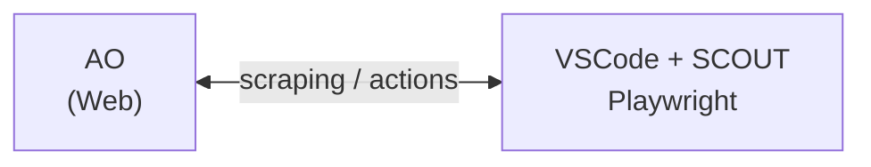
```mermaid
flowchart LR
    AO["AO<br/>(Web)"] <-->|scraping / actions| SCOUT["VSCode + SCOUT<br/>Playwright"]
```

- **Pattern recommandé :** RPA léger via Playwright (connexion, extraction, mise à jour)
- **Risque :** Le scraping d'AO est fragile — toute évolution de l'UI casse le script
- **Alternative plus robuste :** API AO si disponible (via MCP Server dédié)

### 6.2 INAMI (tarification, attestations)

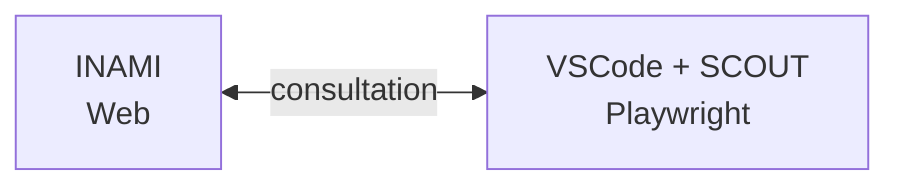
```mermaid
flowchart LR
    INAMI["INAMI<br/>Web"] <-->|consultation| SCOUT["VSCode + SCOUT<br/>Playwright"]
```

- **Usage :** Consultation d'attestations, vérification de tarifs
- **Contrainte :** INAMI Web nécessite eHealth / ItsMe — compatible via navigateur contrôlé
- **Limitation :** SCOUT ne gère **pas les identifiants** — le gestionnaire de mots de passe d'entreprise reste nécessaire

### 6.3 BCSS (Banque Carrefour Sécurité Sociale)

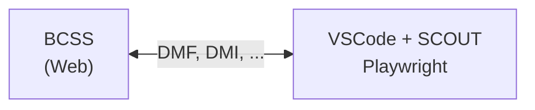
```mermaid
flowchart LR
    BCSS["BCSS<br/>(Web)"] <-->|DMF, DMI, ...| SCOUT["VSCode + SCOUT<br/>Playwright"]
```

- **Usage :** Déclarations DMFA, consultation de données sociales
- **⚠️ Critique :** Les données BCSS sont **hautement sensibles** (RGPD, loi du 15/01/1990). Toute interaction SCOUT doit être **journalisée et tracée.**

### 6.4 eHealth (Plateforme SSO)

| Service eHealth | Intégration SCOUT |
|---|---|
| **Metahub** | Possible via navigateur — authentification eHealth |
| **Recip-e** | Consultation d'historique médicamenteux (⚠️ sensible) |
| **Vitalink** | Partage de données de santé (⚠️ très sensible) |

### 6.5 Schéma récapitulatif des patterns

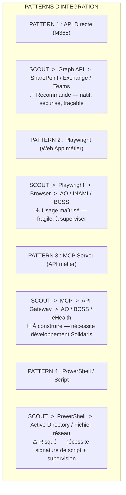
```mermaid
flowchart TB
    subgraph PATTERNS["PATTERNS D'INTÉGRATION"]
        P1["PATTERN 1 : API Directe (M365)"]
        P1_DESC["SCOUT  >  Graph API  >  SharePoint / Exchange / Teams<br/>✅ Recommandé — natif, sécurisé, traçable"]

        P2["PATTERN 2 : Playwright (Web App métier)"]
        P2_DESC["SCOUT  >  Playwright  >  Browser  >  AO / INAMI / BCSS<br/>⚠️ Usage maîtrisé — fragile, à superviser"]

        P3["PATTERN 3 : MCP Server (API métier)"]
        P3_DESC["SCOUT  >  MCP  >  API Gateway  >  AO / BCSS / eHealth<br/>🔧 À construire — nécessite développement Solidaris"]

        P4["PATTERN 4 : PowerShell / Script"]
        P4_DESC["SCOUT  >  PowerShell  >  Active Directory / Fichier réseau<br/>⚠️ Risqué — nécessite signature de script + supervision"]
    end
```

---

## 7. Impacts sur l'urbanisation du SI

### 7.1 Poste de travail

| Domaine | Impact |
|---|---|
| **OS** | Windows 11 obligatoire — pas de support Windows 10 |
| **VSCode** | Devient un outil de productivité généraliste (plus que simple IDE) |
| **Agent IA permanent** | Processus résident — impact mémoire/CPU à mesurer |
| **Extensions** | SCOUT + MCP = nouvelles extensions à gérer dans le catalogue |
| **Signature de code** | Les scripts Python/npm exécutés par SCOUT doivent-ils être signés ? |
| **Droits utilisateur** | Réévaluation nécessaire — SCOUT ne devrait pas tourner avec des droits admin |

### 7.2 Réseau

| Flux réseau | Impact |
|---|---|
| **github.com** | Nouveau flux sortant — à autoriser au proxy/firewall |
| **api.github.com** | Essentiel pour le fonctionnement de SCOUT |
| **Modèles IA** | Azure OpenAI (recommandé) vs modèles tiers (Gemini, etc.) |
| **MCP externes** | Nouveaux flux potentiels vers des services tiers |
| **Latence** | SCOUT est sensible à la latence API — proxy performant requis |

### 7.3 Sécurité

#### 7.3.1 Gouvernance des données

> **Point critique :** SCOUT peut lire/écrire **n'importe quel fichier** accessible par l'utilisateur sur le poste. Dans un contexte mutualiste, cela inclut :
> - Fichiers contenant des données de santé (RGPD art. 9)
> - Fichiers contenant des données de sécurité sociale (loi 1990)
> - Correspondances sensibles
> - Identifiants et mots de passe (⚠️ SCOUT n'est PAS un password manager mais peut y accéder)

**Recommandation :** Mettre en place une **DLP (Data Loss Prevention)** côté Microsoft 365 pour surveiller les actions SCOUT.

#### 7.3.2 Modèle de menace

| Menace | Probabilité | Impact | Atténuation |
|---|---|---|---|
| Fuite de données via modèle IA tiers | Moyenne | Critique | Forcer Azure OpenAI, pas de modèles externes |
| Exécution de code malveillant via MCP | Faible | Élevé | Politique Intune restrictive, whitelist MCP |
| Détournement de Playwright pour accès non autorisé | Moyenne | Élevé | Désactiver Playwright ou limiter aux URLs approuvées |
| Exfiltration via npm/Python | Faible | Critique | Désactiver installation de packages non approuvés |
| Escalade de privilèges via SCOUT | Faible | Élevé | Principe de moindre privilège |

### 7.4 Journalisation et traçabilité

**Recommandation forte :** Toute action SCOUT sur des données métier doit être :
1. **Journalisée** dans les logs Windows (EventID à définir)
2. **Corrélée** avec le SIEM (Sentinel ou équivalent)
3. **Traçable** jusqu'à l'utilisateur et l'action spécifique
4. **Horodatée** avec précision (obligation légale)

---

## 8. Analyse du modèle « agent local sur poste Windows »

### 8.1 Compatibilité avec un SI mutualiste

| Critère | Analyse | Score |
|---|---|---|
| **Sécurité des données** | L'agent tourne en local — les données ne quittent pas le poste *sauf* si le modèle IA les envoie au cloud. Si Azure OpenAI : données restent dans le périmètre Microsoft (mais pas forcément UE). | ⚠️ |
| **Conformité RGPD** | Possible si : modèle Azure OpenAI région UE + données pseudonymisées + pas de données de santé dans les prompts | ⚠️ |
| **Traçabilité** | Insuffisante en l'état — nécessite ajout de logging applicatif | ❌ |
| **Maintien en condition opérationnelle** | SCOUT évolue vite — les scripts et workflows peuvent casser sans préavis | ⚠️ |
| **Support utilisateur** | Nouveau type d'outil — les utilisateurs auront besoin d'accompagnement | ⚠️ |
| **Gouvernance** | Pas de console d'administration centralisée SCOUT — tout passe par Intune/GitHub | ❌ |

### 8.2 Contraintes identifiées

1. **Pas de « safety bubble » pour les modèles tiers** — si SCOUT est configuré pour utiliser Gemini ou d'autres modèles, les données sortent du périmètre Microsoft
2. **Pas de gestion des identifiants** — SCOUT ne doit pas gérer les mots de passe métier
3. **Licence séparée GitHub Copilot** — pas dans M365 Copilot, coût additionnel à prévoir
4. **Windows 11 uniquement** — pas de support Windows 10 (fin de vie 2025) ni macOS
5. **Pas de console d'administration** — la gouvernance est indirecte (Intune + politiques)

### 8.3 Scénarios de déploiement possibles

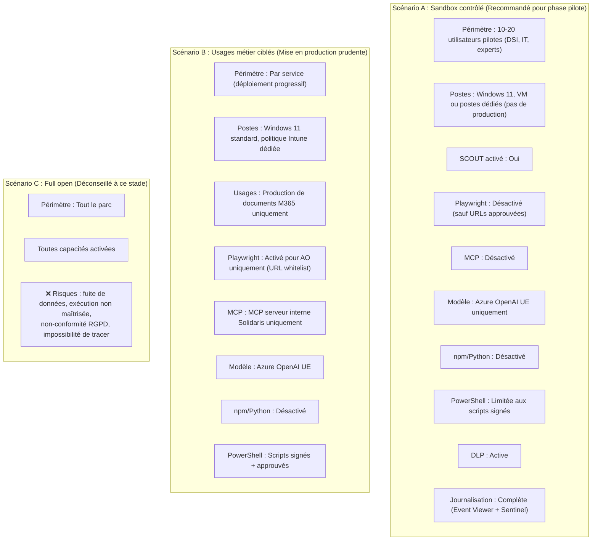
```mermaid
flowchart TB
    subgraph SCENARIO_A["Scénario A : Sandbox contrôlé (Recommandé pour phase pilote)"]
        A1["Périmètre : 10-20 utilisateurs pilotes (DSI, IT, experts)"]
        A2["Postes : Windows 11, VM ou postes dédiés (pas de production)"]
        A3["SCOUT activé : Oui"]
        A4["Playwright : Désactivé (sauf URLs approuvées)"]
        A5["MCP : Désactivé"]
        A6["Modèle : Azure OpenAI UE uniquement"]
        A7["npm/Python : Désactivé"]
        A8["PowerShell : Limitée aux scripts signés"]
        A9["DLP : Active"]
        A10["Journalisation : Complète (Event Viewer + Sentinel)"]
    end

    subgraph SCENARIO_B["Scénario B : Usages métier ciblés (Mise en production prudente)"]
        B1["Périmètre : Par service (déploiement progressif)"]
        B2["Postes : Windows 11 standard, politique Intune dédiée"]
        B3["Usages : Production de documents M365 uniquement"]
        B4["Playwright : Activé pour AO uniquement (URL whitelist)"]
        B5["MCP : MCP serveur interne Solidaris uniquement"]
        B6["Modèle : Azure OpenAI UE"]
        B7["npm/Python : Désactivé"]
        B8["PowerShell : Scripts signés + approuvés"]
    end

    subgraph SCENARIO_C["Scénario C : Full open (Déconseillé à ce stade)"]
        C1["Périmètre : Tout le parc"]
        C2["Toutes capacités activées"]
        C3["❌ Risques : fuite de données, exécution non maîtrisée,<br/>non-conformité RGPD, impossibilité de tracer"]
    end
```

---

## 9. Points de vigilance et risques

### 9.1 Risques critiques

| # | Risque | Niveau | Action requise |
|---|---|---|---|
| R1 | **Données de santé exfiltrées** via modèle IA tiers | 🔴 Critique | Forcer Azure OpenAI UE, pas de modèles externes |
| R2 | **Non-conformité RGPD** si les données ne sont pas pseudonymisées dans les prompts | 🔴 Critique | Définir une politique de prompt safe, audit |
| R3 | **Impossibilité de tracer** les actions SCOUT rétroactivement | 🟠 Élevé | Développer un module de logging SCOUT avant déploiement |
| R4 | **Dépendance à l'écosystème GitHub** indisponible | 🟠 Élevé | Prévoir un fallback, SCOUT ne fonctionne pas offline |
| R5 | **Introduction de vulnérabilités** via dépendances npm/Python | 🟠 Élevé | Désactiver l'installation de packages non approuvés |

### 9.2 Questions en suspens pour Microsoft

1. **Où sont exactement traitées les données** lorsque SCOUT utilise Azure OpenAI ? Région UE garantie ?
2. **Quelle est la roadmap** de SCOUT — va-t-il fusionner avec M365 Copilot ? Produit pérenne ?
3. **Comment auditer** les actions d'un agent SCOUT a posteriori ?
4. **Quel modèle de support** Microsoft propose-t-il pour SCOUT en entreprise ?
5. **Y a-t-il un SOC** dédié chez Microsoft pour détecter les abus SCOUT ?

### 9.3 Comparatif : SCOUT vs solutions alternatives

| Critère | SCOUT | Power Automate | RPA traditionnel (UiPath/AA) | Script manuel |
|---|---|---|---|---|
| **Autonomie** | Élevée (IA) | Moyenne (règles) | Élevée | Faible |
| **Facilité de déploiement** | Moyenne | Élevée | Faible | Élevée |
| **Traçabilité** | Faible | Élevée | Élevée | Moyenne |
| **Sécurité** | À encadrer | Bonne | Bonne | Variable |
| **Coût licence** | Moyen (GH Copilot) | Moyen (M365) | Élevé | Nul |
| **Flexibilité** | Très élevée | Moyenne | Élevée | Très élevée |
| **Maturité SI mutualiste** | Faible (nouveau) | Bonne (connu) | Bonne (testé) | Élevée (historique) |

---

## 10. Recommandations

### 10.1 Recommandations immédiates (avant tout déploiement)

1. **🔴 Auditer le périmètre réglementaire**
   - Valider avec le **Délégué à la Protection des Données (DPD)** l'utilisation d'un agent IA local
   - Vérifier la **conformité avec la loi du 6 août 1990** relative aux mutualités
   - Consulter l'**INAMI** sur l'utilisation d'agents IA pour les interactions avec leurs services

2. **🔴 Définir une politique de sécurité SCOUT**
   - Forcer le modèle Azure OpenAI **région UE** (France ou Pays-Bas)
   - **Désactiver les modèles tiers** (Gemini, etc.)
   - Interdire l'installation de **packages npm/Python non approuvés**
   - **Whitelist d'URLs** pour Playwright (AO, INAMI, BCSS, eHealth uniquement)

3. **🟠 Créer une politique Intune dédiée**
   - Ne pas réutiliser les politiques génériques
   - Tester la propagation sur un groupe pilote avant généralisation

### 10.2 Recommandations à court terme (phase pilote — 3 mois)

1. **Lancer un pilote de 10 utilisateurs maximum :**
   - Équipe DSI et référents métier
   - Périmètre : production documentaire M365 uniquement
   - Pas d'accès aux applicatifs métier (Playwright désactivé)
   - Durée : 8 semaines minimum
   - Indicateurs : productivité, incidents, conformité

2. **Développer un MCP Server interne Solidaris**
   - Alternative sécurisée à Playwright pour l'accès aux données métier
   - Interface contrôlée avec AO, BCSS, eHealth
   - Journalisation intégrée

3. **Former les utilisateurs pilotes**
   - Sensibilisation aux risques de sécurité
   - Bonnes pratiques de prompt engineering
   - Procédure de signalement d'incidents

### 10.3 Recommandations à moyen terme (6-12 mois)

1. **Évaluer l'intégration avec M365 Copilot**
   - SCOUT + Copilot = combinaison puissante mais redondante
   - Attendre la roadmap Microsoft pour savoir si SCOUT sera absorbé par M365 Copilot

2. **Étendre progressivement si le pilote est concluant**
   - Par service, en commençant par les équipes administratives
   - Avec un accompagnement utilisateur renforcé
   - En maintenant une politique de sécurité stricte

3. **Mettre en place une gouvernance SCOUT**
   - Comité de validation des cas d'usage
   - Revue trimestrielle des incidents
   - Mise à jour des politiques Intune

### 10.4 Déconseillé à ce stade

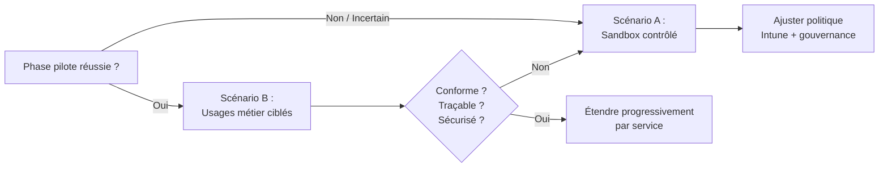
```mermaid
flowchart LR
    START[Phase pilote réussie ?] -->|Oui| B["Scénario B :<br/>Usages métier ciblés"]
    START -->|Non / Incertain| C["Scénario A :<br/>Sandbox contrôlé"]
    B --> D{"Conforme ?<br/>Traçable ?<br/>Sécurisé ?"}
    D -->|Oui| E["Étendre progressivement<br/>par service"]
    D -->|Non| C
    C --> F["Ajuster politique<br/>Intune + gouvernance"]
```

❌ **Déploiement généralisé** sur l'ensemble du parc Solidaris
❌ **Playwright ouvert** vers tous les sites web
❌ **Exécution de code non signé** via PowerShell/Python/npm
❌ **Utilisation de modèles IA hors périmètre UE**
❌ **Utilisation de MCP serveurs non contrôlés par Solidaris**
❌ **SCOUT sur des postes manipulant des données de santé sans DLP actif**

---

## 11. Annexe — Glossaire

| Terme | Définition |
|---|---|
| **SCOUT** | Agent IA autonome Microsoft, extension VSCode, orchestré par GitHub Copilot |
| **MCP** | Model Context Protocol — protocole d'extension de SCOUT vers des services externes |
| **Playwright** | Bibliothèque de contrôle de navigateur web (Microsoft) |
| **Azure OpenAI** | Service d'IA générative Microsoft hébergé sur Azure |
| **Intune** | MDM (Mobile Device Management) Microsoft pour la gestion des postes |
| **Frontier** | Organisation Microsoft avec les dernières fonctionnalités AI |
| **DLP** | Data Loss Prevention — prévention de perte de données |
| **AO** | Application de Gestion des dossiers Solidaris |
| **INAMI** | Institut National d'Assurance Maladie-Invalidité |
| **BCSS** | Banque Carrefour de la Sécurité Sociale |
| **eHealth** | Plateforme électronique des soins de santé belge |
| **ZTA** | Zero Trust Architecture — modèle de sécurité « ne jamais faire confiance, toujours vérifier » |
| **RGPD** | Règlement Général sur la Protection des Données (UE 2016/679) |

### 11.1 Diagramme de classes — Écosystème SCOUT / SI Solidaris

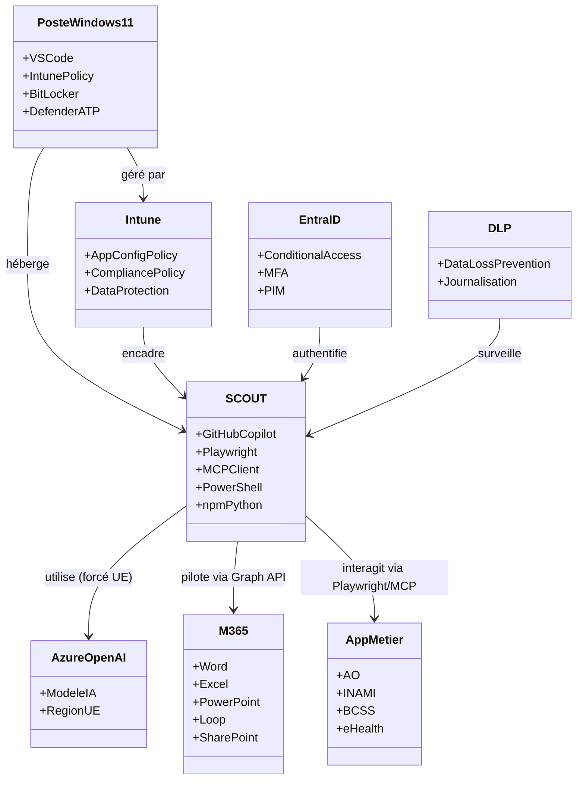
```mermaid
classDiagram
    class PosteWindows11 {
        +VSCode
        +IntunePolicy
        +BitLocker
        +DefenderATP
    }
    class SCOUT {
        +GitHubCopilot
        +Playwright
        +MCPClient
        +PowerShell
        +npmPython
    }
    class AzureOpenAI {
        +ModeleIA
        +RegionUE
    }
    class M365 {
        +Word
        +Excel
        +PowerPoint
        +Loop
        +SharePoint
    }
    class AppMetier {
        +AO
        +INAMI
        +BCSS
        +eHealth
    }
    class Intune {
        +AppConfigPolicy
        +CompliancePolicy
        +DataProtection
    }
    class EntraID {
        +ConditionalAccess
        +MFA
        +PIM
    }
    class DLP {
        +DataLossPrevention
        +Journalisation
    }

    PosteWindows11 --> SCOUT : héberge
    PosteWindows11 --> Intune : géré par
    SCOUT --> AzureOpenAI : utilise (forcé UE)
    SCOUT --> M365 : pilote via Graph API
    SCOUT --> AppMetier : interagit via Playwright/MCP
    Intune --> SCOUT : encadre
    EntraID --> SCOUT : authentifie
    DLP --> SCOUT : surveille
```

---

## 11. Mise à jour — Microsoft Build 2026 (juin 2026)

Les annonces de Build 2026 confirment et enrichissent l'architecture présentée :

### 11.1 Microsoft Agent Platform (MAP)

MAP est une plateforme unifiée open source qui couvre tout le cycle de vie des agents, de la conception (GitHub Copilot + VS Code) au run (Foundry) en passant par la gouvernance (Agent 365). Elle s'articule autour de :

| Couche | Technologie | Rôle architectural |
|:-------|:-----------|:-------------------|
| **Framework** | MAF (Microsoft Agent Framework) | Open source Python/.NET, base des agents |
| **Context** | Microsoft IQ (Work + Fabric + Web + Fundr) | Couche sémantique unifiée |
| **Run** | Foundry (Hosted Agents) | Runtime managé en sandbox sécurisée |
| **Gov** | Agent 365 (Entra + Defender + Purview) | Cycle de vie & sécurité |

### 11.2 Impact sur l'architecture SI Solidaris

| Changement | Impact |
|:-----------|:-------|
| SCOUT devient un composant MAP | Ne plus penser SCOUT isolément — intégrer MAP dans la roadmap SI |
| Modèles MAI souverains | Les données peuvent rester dans le tenant Microsoft → réduction risque exfiltration |
| Identité Entra ID pour agents | Chaque SCOUT a une identité → auditabilité, Conditional Access, DLP natif |
| Agent Registry | Détection des agents fantômes — complément de l'EDR existant |
| Hosted Agents GA juillet 2026 | Alternative cloud à l'agent local (SCOUT) pour certains cas d'usage |

### 11.3 Nouveaux flux identifiés

- **MAI Foundry** : nouveau flux entre le poste et les API Foundry (modèles MAI)
- **Agent Registry** : flux de télémétrie entre le poste et le service de découverte
- **Microsoft IQ** : flux de contexte enrichi entre les IQ et SCOUT

> **Recommandation mise à jour** : La maturation rapide de la plateforme Microsoft (MAP + MAI + identité gérée) rend SCOUT moins "frontier" qu'il y a 2 semaines. Néanmoins, les problématiques de données de santé et de déploiement Intune restent inchangées.

---

*Document produit par le Bureau Robert — Architecture SI (Expert #1)*
*Pour le compte de la DSI Solidaris — Juillet 2026*

---

# ════════════════════════════════════════════════════════
# PARTIE 3 — ANALYSE SÉCURITÉ & RGPD (Sécurité/RGPD)
# ════════════════════════════════════════════════════════

---
date: 2026-07-09
bureau: bureau-robert
version: v1
modele: deepseek-chat
tags: [analyse, scout, microsoft, securite, rgpd, nis2, donnees-sante, mutualite, solidaris, pro]
statut: finalise
type: analyse-securite
---

# Analyse Sécurité — Microsoft SCOUT en contexte Solidaris (Mutualité, Assurance Obligatoire)

**Destinataires :** RSSI, DPO, Direction Sécurité  
**Rédacteur :** Bureau Robert — Expert Sécurité (Expert #2)  
**Date :** 9 juillet 2026  
**Classification :** CONFIDENTIEL — Usage interne Solidaris

---

## 1. Résumé Exécutif

Microsoft SCOUT est un agent IA desktop profondément intégré à Windows (PowerShell, Python, navigateur, exécution de code local, installation de packages). Pour une mutualité comme Solidaris, qui traite des **données de santé relevant de l'article 9 RGPD** (catégories particulières), SCOUT présente des **risques graves et multiples** que les garde-fous techniques actuels (Intune, permissions granulaires) ne couvrent pas complètement.

**Jugement global : NON acceptable en l'état** pour un déploiement généralisé sur le périmètre mutualiste. Un déploiement sandbox très restreint (pilote technique, pas de données réelles) est le seul scénario envisageable à court terme.

---

## 2. Matrice des Risques

| # | Risque | Gravité | Probabilité | Criticité | Description |
|---|--------|---------|-------------|-----------|-------------|
| R1 | Exfiltration données de santé vers modèles tiers (Gemini, Opus via Copilot) | **Critique (5)** | **Élevée (4)** | **20 — CRITIQUE** | Le consentement utilisateur ne couvre pas les données de santé (art. 9 RGPD). Les données Solidaris (INAMI, BCSS, eHealth) peuvent transiter par GitHub Copilot configuré sur des modèles externes. |
| R2 | Exécution de code arbitraire local (PowerShell, Python) | **Critique (5)** | **Élevée (4)** | **20 — CRITIQUE** | SCOUT exécute du code avec les droits de l'utilisateur. En cas de compromission du prompt ou d'une skill malveillante, escalade de privilèges possible. |
| R3 | Supply chain — installation de packages npm, Python non vérifiés | **Élevée (4)** | **Élevée (4)** | **16 — ÉLEVÉ** | SCOUT peut installer des dépendances depuis des registres publics. Risque de dependency confusion, package malveillant, ou version vulnérable. |
| R4 | Interaction non supervisée avec le navigateur | **Élevée (4)** | **Moyenne (3)** | **12 — ÉLEVÉ** | SCOUT peut lire et manipuler le contenu du navigateur. Exfiltration de sessions web, accès à eHealth/BCSS, modification de formulaires. |
| R5 | Non-respect de la minimisation des données | **Élevée (4)** | **Élevée (4)** | **16 — ÉLEVÉ** | L'architecture de SCOUT nécessite d'envoyer le contexte (prompt, code, fichiers) à des LLMs. Pas de garantie de minimisation. |
| R6 | Absence de traçabilité complète des actions IA | **Moyenne (3)** | **Élevée (4)** | **12 — ÉLEVÉ** | Les logs SCOUT sont immatures. Impossible de garantir une piste d'audit complète pour les autorités de contrôle (APD, INAMI). |
| R7 | Violation du principe d'intégrité des traitements mutualistes | **Élevée (4)** | **Moyenne (3)** | **12 — ÉLEVÉ** | Un agent IA modifiant des fichiers ou exécutant des scripts peut altérer des traitements réglementés (statistiques INAMI, remboursements). |
| R8 | Non-conformité NIS2 — Sécurité des réseaux et SI | **Élevée (4)** | **Moyenne (3)** | **12 — ÉLEVÉ** | SCOUT crée des canaux de communication non maîtrisés (LLM cloud, registres packages) qui contournent les contrôles réseau traditionnels. |
| R9 | Consentement insuffisant au sens RGPD | **Critique (5)** | **Très élevée (5)** | **25 — CRITIQUE** | Le formulaire de consentement SCOUT ne distingue pas les données de santé. Le consentement n'est pas une base légale valide pour le traitement de données de santé par un responsable de traitement mutualiste. |
| R10 | Dépendance à GitHub Copilot comme unique backend LLM | **Moyenne (3)** | **Faible (2)** | **6 — MOYEN** | Si Copilot est bridé aux modèles Microsoft (GPT-4o), le risque est moindre. Mais la configuration "modèles externes" est un risque immédiat. |

### Carte thermique

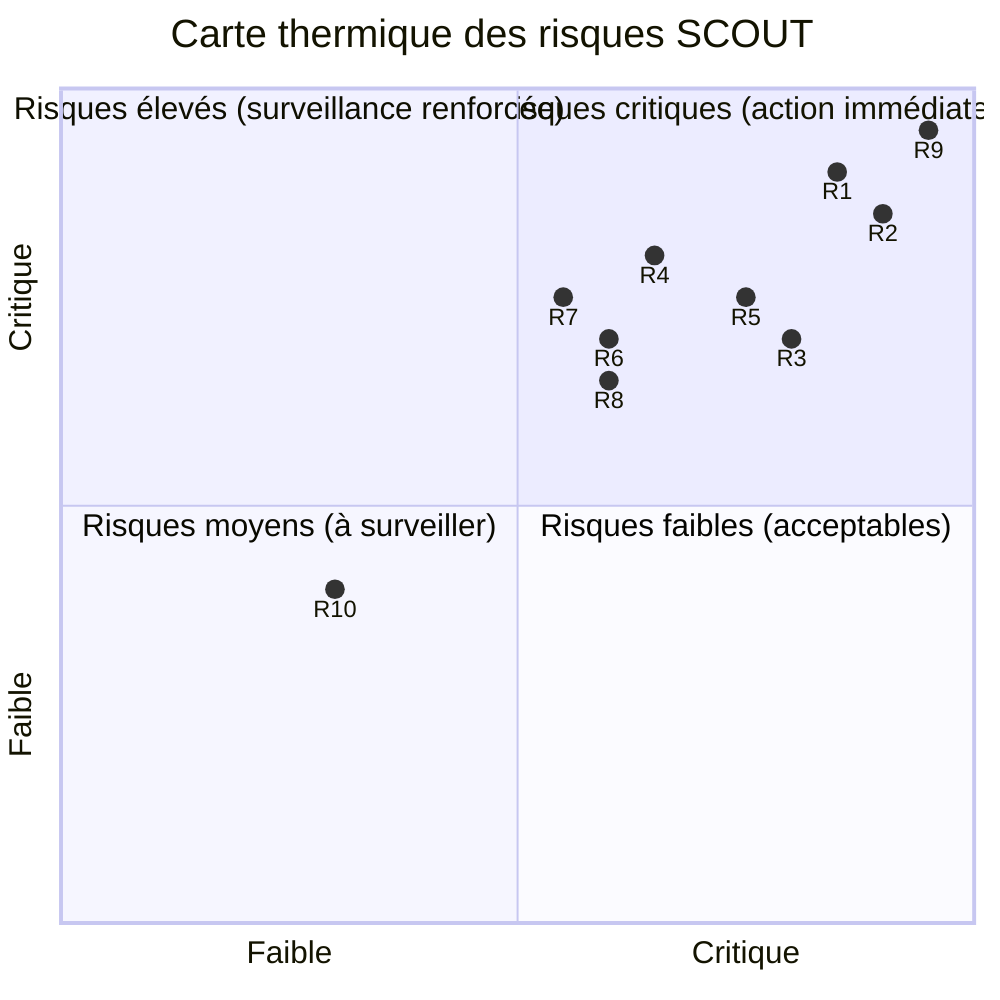
```mermaid
quadrantChart
    title Carte thermique des risques SCOUT
    x-axis "Faible" --> "Critique"
    y-axis "Faible" --> "Critique"
    quadrant-1 "Risques critiques (action immédiate)"
    quadrant-2 "Risques élevés (surveillance renforcée)"
    quadrant-3 "Risques moyens (à surveiller)"
    quadrant-4 "Risques faibles (acceptables)"
    R1: [0.85, 0.90]
    R2: [0.90, 0.85]
    R9: [0.95, 0.95]
    R3: [0.80, 0.70]
    R4: [0.65, 0.80]
    R5: [0.75, 0.75]
    R6: [0.60, 0.70]
    R7: [0.55, 0.75]
    R8: [0.60, 0.65]
    R10: [0.30, 0.40]
```

---

## 3. Analyse RGPD Approfondie

### 3.1 Licéité du traitement (Art. 6 + Art. 9)

**Arbre de décision des bases légales :**

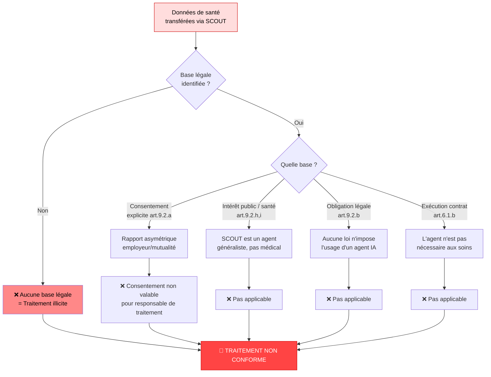
```mermaid
flowchart TD
    A["Données de santé<br/>transférées via SCOUT"] --> B{"Base légale<br/>identifiée ?"}
    
    B -->|Non| C["❌ Aucune base légale<br/>= Traitement illicite"]
    B -->|Oui| D{Quelle base ?}
    
    D -->|Consentement<br/>explicite art.9.2.a| E["Rapport asymétrique<br/>employeur/mutualité"]
    E --> F["❌ Consentement non valable<br/>pour responsable de traitement"]
    
    D -->|Intérêt public / santé<br/>art.9.2.h,i| G["SCOUT est un agent<br/>généraliste, pas médical"]
    G --> H[❌ Pas applicable]
    
    D -->|Obligation légale<br/>art.9.2.b| I["Aucune loi n'impose<br/>l'usage d'un agent IA"]
    I --> J[❌ Pas applicable]
    
    D -->|Exécution contrat<br/>art.6.1.b| K["L'agent n'est pas<br/>nécessaire aux soins"]
    K --> L[❌ Pas applicable]
    
    C --> M[🛑 TRAITEMENT NON CONFORME]
    F --> M
    H --> M
    J --> M
    L --> M
    
    style M fill:#ff4444,color:#fff,stroke:#cc0000
    style C fill:#ff8888,color:#000
    style A fill:#ffdddd,color:#000,stroke:#cc0000
```

Solidaris traite des **catégories particulières de données** (art. 9 RGPD) :
- Données de santé des affiliés
- Données INAMI (remboursements, statuts)
- Données BCSS (mutualité, affiliation)
- Données eHealth (DMG, dossier médical global)

**Problème fondamental :** SCOUT, par conception, envoie le contexte de la requête à un LLM distant (via GitHub Copilot). La base légale pour ce transfert est :
- ❌ **Consentement explicite** (art. 9(2)(a)) — Pas valable pour un responsable de traitement mutualiste dans le cadre de ses missions, rapport asymétrique
- ❌ **Intérêt public / santé** (art. 9(2)(h,i)) — Non applicable à un agent généraliste
- ❌ **Obligation légale** (art. 9(2)(b)) — Non
- ❌ **Nécessité contractuelle** (art. 6(1)(b)) — L'agent n'est pas nécessaire à l'exécution des soins

**Conclusion : Aucune base légale identifiée pour le transfert de données de santé vers des LLMs cloud via SCOUT.**

### 3.2 Minimisation (Art. 5(1)(c))

SCOUT transmet tout le contexte nécessaire à l'exécution de la tâche. Dans un environnement mutualiste, ce contexte inclut quasi-systématiquement des données à caractère personnel (nom, NISS, numéro d'affiliation, code INAMI). La **minimisation est structurellement impossible**.

### 3.3 DPO et Registre (Art. 30, 35, 37)

- **AIPD obligatoire** (Art. 35) : Un déploiement SCOUT nécessite une Analyse d'Impact relative à la Protection des Données. Le risque pour les droits et libertés est manifestement élevé.
- **Registre** : Chaque interaction SCOUT génère un traitement qui doit figurer au registre — impraticable à l'échelle.

### 3.4 Transferts hors UE (Art. 44-49)

Si GitHub Copilot ou les modèles externes sont hébergés hors EEE :
- **Data Privacy Framework** (US) : Insuffisant pour des données de santé
- **Clauses Contractuelles Types** : À vérifier avec Microsoft — ne couvrent pas les modèles tiers
- **Décision d'adéquation** : Aucune pour les données de santé vers les US

**Diagramme de flux de données SCOUT :**

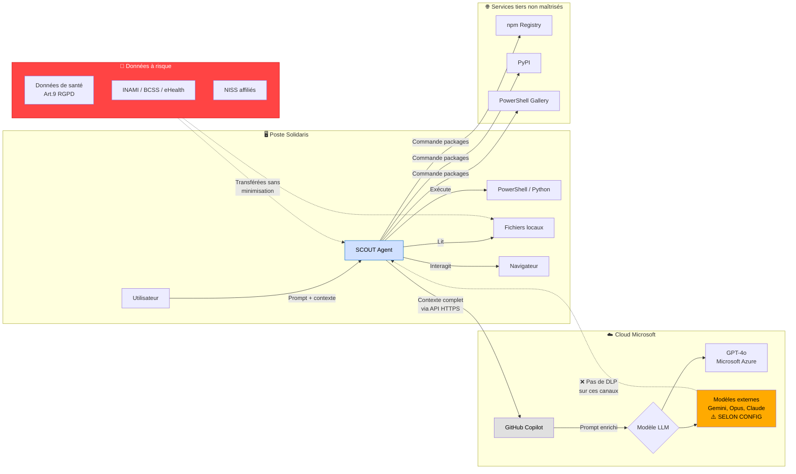
```mermaid
flowchart LR
    subgraph Poste["🖥️ Poste Solidaris"]
        U[Utilisateur] -->|Prompt + contexte| S[SCOUT Agent]
        S -->|Exécute| PS[PowerShell / Python]
        S -->|Lit| FS[Fichiers locaux]
        S -->|Interagit| NAV[Navigateur]
    end
    
    subgraph Cloud["☁️ Cloud Microsoft"]
        GH[GitHub Copilot] -->|Prompt enrichi| LLM{Modèle LLM}
        LLM --> GPT["GPT-4o<br/>Microsoft Azure"]
        LLM --> EXT["Modèles externes<br/>Gemini, Opus, Claude<br/>⚠️ SELON CONFIG"]
    end
    
    subgraph Tiers["🌐 Services tiers non maîtrisés"]
        NPM[npm Registry]
        PYPI[PyPI]
        PSG[PowerShell Gallery]
    end
    
    subgraph Données["🔴 Données à risque"]
        SANTE["Données de santé<br/>Art.9 RGPD"]
        INAMI[INAMI / BCSS / eHealth]
        NISS[NISS affiliés]
    end
    
    S -->|Commande packages| NPM
    S -->|Commande packages| PYPI
    S -->|Commande packages| PSG
    
    S -->|Contexte complet<br/>via API HTTPS| GH
    
    Données -.-> FS
    Données -.->|Transférées sans<br/>minimisation| S
    
    EXT -.->|❌ Pas de DLP<br/>sur ces canaux| S
    
    style Données fill:#ff4444,color:#fff,stroke:#cc0000
    style EXT fill:#ffaa00,color:#000
    style S fill:#d0e0ff,color:#000,stroke:#0066cc
    style GH fill:#e0e0e0,color:#000
```

### 3.5 Droit des personnes (Art. 12-23)

- **Droit à l'information** : Comment expliquer à un affilié Solidaris que ses données transitent par un LLM non déterminé ?
- **Droit d'opposition / effacement** : Impossible si les données ont été utilisées pour l'entraînement d'un modèle (bien que OpenAI/Microsoft affirment le contraire, l'auditabilité est nulle)

---

## 4. Analyse NIS2

Solidaris, comme mutualité d'assurance obligatoire, est probablement une **entité essentielle** au sens de NIS2 (secteur santé, seuil > 50 employés ou CA > 10M€).

### 4.1 Exigences impactées par SCOUT

| Exigence NIS2 | Impact | Analyse |
|--------------|--------|---------|
| **Art. 21(2)(c) — Sécurité des RH** | **Rouge** | Les utilisateurs peuvent consentir à des traitements qu'ils ne maîtrisent pas, hors politique de sécurité |
| **Art. 21(2)(d) — Sécurité des accès** | **Orange** | SCOUT contourne les contrôles GPO classiques par son modèle "Allow/Deny" géré par l'utilisateur |
| **Art. 21(2)(g) — Cryptographie** | **Vert** | Chiffrement natif Microsoft, mais les données sont déchiffrées avant envoi au LLM |
| **Art. 21(2)(i) — Gestion des incidents** | **Rouge** | Un incident SCOUT (exfiltration) est indétectable par les EDR classiques |
| **Art. 23 — Reporting incidents** | **Rouge** | Impossible de qualifier un incident dans les délais NIS2 (24h pour les entités essentielles) |
| **Art. 21(2)(j) — Tests de sécurité** | **Orange** | SCOUT nécessite une nouvelle surface d'attaque à tester, non couverte par les pentests classiques |
| **Art. 24 — Usage de technologies certifiées** | **Orange** | Aucune certification cybersécurité (EUCS, SOC 2) spécifique pour SCOUT connu à ce jour |

### 4.2 Risque de sanction

- Entité essentielle : amende jusqu'à 10M€ ou 2% du chiffre d'affaires annuel mondial
- Rupture d'obligation de notification d'incident : risque de sanction majoré

---

## 5. Analyse ISO 27001

| Contrôle | Statut SCOUT | Risque |
|---------|-------------|--------|
| A.5.14 — Transfert d'information | Non conforme | Toutes les données partent vers le LLM |
| A.6.7 — Télétravail | Étendu | SCOUT aggrave les risques en mobilité |
| A.8.10 — Suppression d'information | Non garanti | Données potentiellement persistées dans les logs LLM |
| A.8.12 — Prévention de fuite de données | Non conforme | Aucun DLP n'intercepte les appels API vers Copilot |
| A.8.16 — Activités de surveillance | Insuffisant | Logs SCOUT limités vs exigences d'audit |
| A.10.2 — Dépendances fournisseur | Critique | Dépendance à GitHub Copilot + modèles externes |
| A.14.2 — Sécurité du développement | Hors scope | SCOUT installe des packages non audités |

---

## 6. Comparaison avec l'Existant (Poste Verrouillé + GPO + EDR)

| Critère | Situation Actuelle (Solidaris) | Avec SCOUT | Évolution du risque |
|---------|-------------------------------|------------|-------------------|
| **Surface d'attaque** | Poste verrouillé, GPO restrictives, exécution restreinte | Exécution illimitée Python/PowerShell + installations packages | ⬆️ **CRITIQUE** |
| **DLP / Exfiltration** | Proxy, DLP réseau, blocage USB/applications cloud | Canal HTTPS direct vers GitHub Copilot + modèles tiers | ⬆️ **CRITIQUE** |
| **Audit / Logs** | Logs Windows, EDR (Defender/ Sentinel) | Logs SCOUT propriétaires, non intégrés au SIEM central | ⬆️ **ÉLEVÉ** |
| **Contrôle des permissions** | GPO + AD + RBAC strictes | Permissions SCOUT gérées par Intune + consentement utilisateur | ⬆️ **ÉLEVÉ** |
| **Supply chain** | Catalogue approuvé (SCCM/Intune) | npm, PyPI, PowerShell Gallery — aucun contrôle | ⬆️ **CRITIQUE** |
| **Sécurité navigateur** | Proxy + GPO Chrome/Edge restreint | SCOUT peut interagir avec le navigateur | ⬆️ **ÉLEVÉ** |
| **Gestion des identités** | PIV/SSO, MFA obligatoire | SCOUT ne gère PAS les mots de passe — bon point | ➡️ **NEUTRE** |
| **Mobilité** | VPN + device compliance | SCOUT mobile non contrôlé | ⬆️ **ÉLEVÉ** |

---

## 7. Analyse des Garde-Fous Proposés (Intune, Permissions Granulaires)

### 7.1 Politique Intune obligatoire

✅ **Points positifs :**
- Impose une configuration minimale de sécurité
- Peut bloquer SCOUT sur les devices non conformes
- Permet le déploiement sélectif (groupes de test)

❌ **Limites :**
- Intune ne contrôle pas ce que fait SCOUT, seulement la configuration du device
- Aucun contrôle sur le contenu envoyé au LLM
- BYOD/MDM partiel = trou dans la raquette
- Les politiques Intune sont contournables si le device est compromis

### 7.2 Permissions granulaires (Allow/Deny/Allow always)

✅ **Points positifs :**
- Chaque action sensible déclenche une demande explicite
- L'admin IT peut centraliser les permissions par automation
- Permet un blocage fin des actions à risque (ex: installer un package, écrire dans le système)

❌ **Limites :**
- **Fatigue de consentement :** L'utilisateur finit par cliquer "Allow always" par habitude
- **Pas de distinction données de santé :** Le modèle Allow/Deny ne sait pas si le fichier ouvert contient des données de santé
- **Pas de contexte réglementaire :** SCOUT ne peut pas décider de ce qui est RGPD-compatible
- **L'utilisateur peut autoriser une action dangereuse** en toute bonne foi

### 7.3 Formulaire de consentement "Données hors safe bubble Microsoft"

❌ **Problème critique :**
- Le consentement utilisateur ne couvre pas les données de santé (art. 9 RGPD)
- L'utilisateur d'une mutualité n'est pas habilité à consentir pour le compte de l'organisation ni des affiliés
- Le formulaire crée une **fausse sécurité juridique**

### 7.4 Contrôle des endpoints via Intune + Defender for Endpoint

✅ **Potentiel :**
- Blocage des exécutables non signés
- ASR rules (Attack Surface Reduction) pour bloquer les comportements suspects
- File Indicator pour bloquer les packages non approuvés

❌ **Limites :**
- Les scripts PowerShell signés par Microsoft peuvent être autorisés par défaut
- Les packages npm/Python sont rarement signés — difficile à bloquer sans casser le workflow
- Defender n'inspecte pas le contenu envoyé au LLM

---

## 8. Scénarios de Déploiement

**Arbre de décision :**

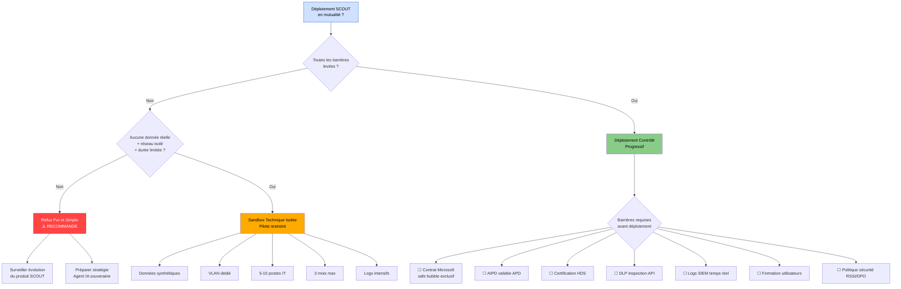
```mermaid
flowchart TD
    START["Déploiement SCOUT<br/>en mutualité ?"] --> COND1{"Toutes les barrières<br/>levées ?"}
    
    COND1 -->|Non| COND2{"Aucune donnée réelle<br/>+ réseau isolé<br/>+ durée limitée ?"}
    COND1 -->|Oui| C["Déploiement Contrôlé<br/>Progressif"]
    
    COND2 -->|Non| A["Refus Pur et Simple<br/>⚠️ RECOMMANDÉ"]
    COND2 -->|Oui| B["Sandbox Technique Isolée<br/>Pilote restreint"]
    
    A --> A1["Surveiller évolution<br/>du produit SCOUT"]
    A --> A2["Préparer stratégie<br/>Agent IA souveraine"]
    
    B --> B1[Données synthétiques]
    B --> B2[VLAN dédié]
    B --> B3[5-10 postes IT]
    B --> B4[3 mois max]
    B --> B5[Logs intensifs]
    
    C --> C1{"Barrières requises<br/>avant déploiement"}
    C1 --> C2["☐ Contrat Microsoft<br/>safe bubble exclusif"]
    C1 --> C3[☐ AIPD validée APD]
    C1 --> C4[☐ Certification HDS]
    C1 --> C5[☐ DLP inspection API]
    C1 --> C6[☐ Logs SIEM temps réel]
    C1 --> C7[☐ Formation utilisateurs]
    C1 --> C8[☐ Politique sécurité RSSI/DPO]
    
    style A fill:#ff4444,color:#fff,stroke:#cc0000
    style B fill:#ffaa00,color:#000
    style C fill:#88cc88,color:#000
    style START fill:#d0e0ff,color:#000,stroke:#0066cc
```

### Scénario A : Refus Pur et Simple ⚠️ RECOMMANDÉ

| Critère | Évaluation |
|---------|-----------|
| **Risque global** | Acceptable (risque évité) |
| **Conformité** | Garantie |
| **Cohérence avec l'existant** | Parfaite |
| **Coût** | Aucun |
| **Innovation** | Perdue |

**Arguments :**
- Les risques critiques (R1, R2, R9) ne peuvent pas être atténués techniquement
- Aucune base légale RGPD pour le transfert de données de santé
- NIS2 non compatible
- **Recommandation :** Refuser le déploiement. Surveiller l'évolution de SCOUT (notamment un éventuel modèle privé on-premise).

### Scénario B : Sandbox Technique Isolée ⚠️ PILOTE RESTREINT

| Critère | Évaluation |
|---------|-----------|
| **Risque global** | Acceptable avec contrôles stricts |
| **Conformité** | Sous condition (pas de données réelles) |
| **Cohérence avec l'existant** | Silotée |
| **Coût** | Moyen (infra + supervision) |
| **Innovation** | Partielle (test technique sans valeur métier) |

**Conditions strictes :**
1. **Aucune donnée réelle** — données synthétiques uniquement
2. **Mise en réseau isolée** (VLAN dédié, pas d'accès aux applicatifs métier, proxy bloqué vers les domaines métier)
3. **Comptes de test dédiés** (pas de comptes réels Solidaris)
4. **GitHub Copilot bridé aux modèles Microsoft uniquement** (vérification contractuelle)
5. **Journalisation intensive** (network logs + process logs + SCOUT logs)
6. **Durée limitée** (3 mois, revue avant extension)
7. **Périmètre** : 5-10 postes, service IT uniquement (pas de métier)

**Objectif du pilote :**
- Tester la maturité des logs SCOUT
- Valider ou infirmer les capacités de blocage Intune
- Cartographier les canaux d'exfiltration réels
- Évaluer le comportement des utilisateurs face à Allow/Deny

### Scénario C : Déploiement Contrôlé Progressif ⚠️ NON RECOMMANDÉ À CE STADE

| Critère | Évaluation |
|---------|-----------|
| **Risque global** | Élevé |
| **Conformité** | Non garantie |
| **Cohérence avec l'existant** | Difficile |
| **Coût** | Élevé (Intune + formation + audit + DPO) |
| **Innovation** | Maximale |

**Barrières avant d'envisager ce scénario :**
☐ Négociation contractuelle Microsoft pour garantir le **traitement exclusif dans le safe bubble Azure** (pas de modèles tiers)
☐ **AIPD validée** par l'APD (délais 6-12 mois)
☐ **Certification** SOC 2 + HDS pour SCOUT + GitHub Copilot
☐ **Chiffrement de bout en bout** des données envoyées au LLM (homomorphique ou à défaut TLS + clé client)
☐ **DLP** capable d'inspecter les appels API Copilot
☐ **Logs SCOUT intégrés au SIEM** avec alertes en temps réel
☐ **Formation obligatoire** de tous les utilisateurs (avec test de non-régression)
☐ **Politique de sécurité SCOUT** validée par le RSSI, le DPO et la Direction
☐ **Garantie contractuelle** d'absence de réutilisation des données pour l'entraînement

Tant que ces barrières ne sont pas toutes levées → **Scénario A ou B uniquement.**

---

## 9. Recommandations au RSSI

**Calendrier de mise en œuvre :**

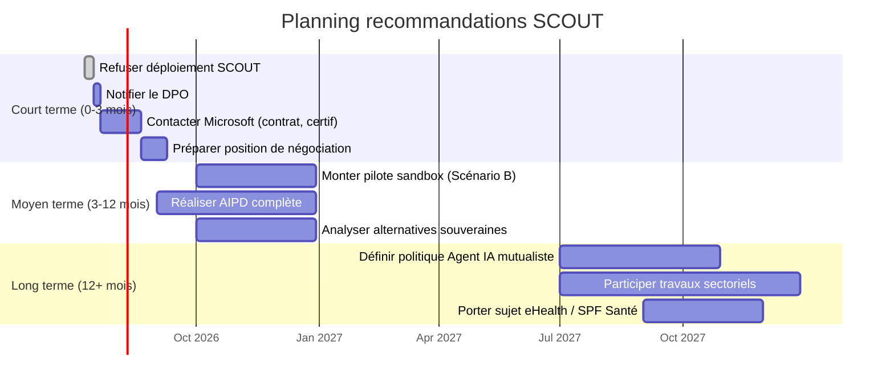
```mermaid
gantt
    title Planning recommandations SCOUT
    dateFormat  YYYY-MM-DD
    axisFormat  %b %Y
    
    section Court terme (0-3 mois)
    Refuser déploiement SCOUT           :done, a1, 2026-07-09, 7d
    Notifier le DPO                     :a2, after a1, 5d
    Contacter Microsoft (contrat, certif) :a3, after a2, 30d
    Préparer position de négociation    :a4, after a3, 20d
    
    section Moyen terme (3-12 mois)
    Monter pilote sandbox (Scénario B)  :b1, 2026-10-01, 90d
    Réaliser AIPD complète              :b2, 2026-09-01, 120d
    Analyser alternatives souveraines   :b3, 2026-10-01, 90d
    
    section Long terme (12+ mois)
    Définir politique Agent IA mutualiste :c1, 2027-07-01, 120d
    Participer travaux sectoriels       :c2, 2027-07-01, 180d
    Porter sujet eHealth / SPF Santé    :c3, 2027-09-01, 90d
```

### Court terme (0-3 mois)

1. **Refuser le déploiement** de SCOUT sur le périmètre mutualiste dans sa forme actuelle
2. **Notifier le DPO** pour ouverture d'une fiche d'analyse préliminaire
3. **Contacter Microsoft** pour obtenir :
   - Le contrat spécifique Solidaris (indicateurs de sécurité, SLA, engagement de non-réutilisation)
   - La confirmation écrite que GitHub Copilot peut être bridé aux modèles Microsoft uniquement
   - Les certifications en vigueur pour SCOUT (SOC 2, HDS, EUCS)
4. **Préparer une position de négociation** : refus sauf garanties contractuelles fermes sur :
   - Safe bubble exclusif (Azure OpenAI, pas de modèle tiers)
   - Absence de réutilisation des données
   - Auditabilités des logs
   - Clause résolutoire en cas de non-conformité

### Moyen terme (3-12 mois)

5. **Monter un pilote sandbox** (Scénario B) si les conditions de sécurité sont réunies
6. **Réaliser une AIPD** complète en vue d'un éventuel déploiement futur
7. **Analyser les alternatives** :
   - Modèle on-premise (GPT-Next, Mistral Large auto-hébergé)
   - Agents IA open-source avec données locales (Hermes Agent, LangChain)
   - Partenariat avec un éditeur HDS (Health Data Hosting français)

### Long terme (12+ mois)

8. **Définir une politique « Agent IA pour mutualiste »** intégrant :
   - Classification des données autorisées / interdites pour les agents
   - Principe de minimisation automatique (anonymisation avant envoi LLM)
   - Traçabilité obligatoire (logs, preuves de non-rétention)
   - Procédure de réponse à incident spécifique aux agents IA
9. **Participer aux travaux sectoriels** (Mutualité chrétienne, UNMS, UCM) pour une position commune
10. **Porter le sujet au niveau eHealth / SPF Santé** : les agents IA dans les mutualités sont un enjeu sectoriel

---

## 11. Mise à jour — Microsoft Build 2026

*Date de mise à jour : 9 juillet 2026*

Lors de la conférence Microsoft Build 2026 (mai 2026), Microsoft a présenté un ensemble de nouvelles fonctionnalités et annonces liées à la sécurité des agents IA qui impactent directement l'analyse de SCOUT en contexte Solidaris.

### 11.1 Microsoft Agent Platform (MAP) — Gouvernance unifiée

Microsoft a annoncé **Microsoft Agent Platform (MAP)** , une plateforme open source unifiée pour gouverner les agents. Pour Solidaris, cela représente une évolution potentiellement positive :

- **Standardisation** : un cadre unique pour la sécurité des agents, au lieu de solutions propriétaires disparates
- **Ouverture** : plateforme open source, permettant l'audit par la communauté et les RSSI
- **Orchestration** : possibilité de centraliser les politiques de sécurité applicables à tous les agents Microsoft

**Analyse Solidaris :** MAP est une avancée architecturale, mais elle n'adresse pas le problème fondamental du transfert de données de santé vers le cloud Microsoft. Une plateforme de gouvernance ne rend pas un traitement illicite soudainement licite.

### 11.2 Identité gérée pour chaque agent (Entra ID)

Microsoft introduit la notion d'**identité gérée** pour chaque agent, avec :

- Un **compte Entra ID dédié** par agent → auditabilité comparable à celle d'un utilisateur humain
- Application automatique de **Conditional Access** (MFA, device compliance, localisation)
- **DLP/Purview** appliqué automatiquement sur les flux de l'agent
- Traçabilité complète dans les logs Entra ID (sign-ins, actions, accès aux ressources)

**Analyse Solidaris :** C'est un progrès significatif en matière d'auditabilité. Pouvoir tracer chaque action d'un agent comme on trace un utilisateur (via Entra ID) répond partiellement au risque R6 (traçabilité). Cependant, cela ne résout PAS le problème RGPD du transfert de données de santé :

- L'identité gérée améliore l'auditabilité mais ne résout PAS le problème RGPD du transfert de données de santé — les données partent toujours vers le cloud Microsoft
- L'application de DLP/Purview sur les flux agents est positive, mais le DLP Microsoft n'est pas calibré pour les catégories particulières de données (art. 9 RGPD) dans un contexte d'agent IA
- Conditional Access ne peut pas distinguer une interaction légitime d'une exfiltration via prompt engineering

### 11.3 Agent 365 — Plan de contrôle sécurité unifié

**Agent 365** est un nouveau service de sécurité qui unifie **Entra ID + Defender + Purview** pour :

- Sécuriser, gouverner et gérer le cycle de vie des agents
- Détection des comportements anormaux des agents (UEBA adapté aux agents)
- Rapports de sécurité centralisés dans le portail Defender

**Analyse Solidaris :** Agent 365 est une brique manquante dans l'écosystème Microsoft. Elle adresse le risque de shadow IT des agents (un agent non autorisé qui s'exécute). Cependant, le service est nouveau et immature — aucun retour d'expérience sectoriel (santé, mutualité) disponible.

### 11.4 Agent Registry — Découverte des agents fantômes

Microsoft a présenté **Agent Registry**, un agent dédié à la découverte des **agents fantômes** (agents non autorisés publiant des endpoints sur les postes de travail).

**Analyse Solidaris :** Utile dans un environnement mutualiste où le shadow IT est un risque réel (agents non approuvés installés par des utilisateurs). Cela comble partiellement le risque R7 (intégrité des traitements mutualistes).

### 11.5 Code MD — 100 agents collaboratifs pour la sécurité offensive

**Code MD** est une initiative de Microsoft utilisant **100 agents collaboratifs** pour :

- Trouver des failles de sécurité en mode red team automatisé
- Générer des rapports directement dans le portail Defender
- Tester en continu la surface d'attaque

**Analyse Solidaris :** Peut-être pertinent pour les équipes Sécurité de Solidaris dans le cadre de tests d'intrusion continus, mais hors scope pour l'analyse de SCOUT comme outil utilisateur.

### 11.6 DLP natif sur les flux agents (Purview)

Microsoft renforce **Purview** avec un DLP natif capable d'inspecter les flux agents :

- Bloquer l'envoi de données sensibles (patterns PII, IBAN, NISS) via les API agents
- Appliquer des politiques DLP automatiquement sur les canaux agent → LLM
- Alertes en temps réel dans le portail Purview

**Analyse Solidaris :**
✅ **Points positifs :**
- Possibilité de détecter l'envoi de NISS, numéros INAMI, données BCSS vers le LLM
- Blocage en temps réel des flux non conformes
- Intégration avec l'existant Purview Solidaris (si déployé)

❌ **Limites :**
- Le DLP Purview inspecte le trafic vers le LLM mais ne peut pas bloquer l'exfiltration via des canaux indirects (agent qui écrit dans un fichier, puis upload manuel)
- La configuration des patterns DLP pour les données de santé mutualistes (NISS, INAMI, codes eHealth) nécessite un travail important et une maintenance continue
- Faux positifs potentiellement élevés dans un environnement qui manipule massivement ces données
- Le DLP ne résout pas le problème de base légale — même avec DLP, le transfert reste juridiquement non fondé

### 11.7 Hosted Agents en sandbox sécurisée (GA juillet 2026)

Microsoft annonce la **disponibilité générale** (GA juillet 2026) des **Hosted Agents** :

- Exécution en sandbox sécurisée avec compute/mémoire/filesystem partagés
- Isolation des agents par tenant
- Pas d'accès direct au poste utilisateur
- Facturation à l'usage

**Analyse Solidaris :** Pour Solidaris, les Hosted Agents sont potentiellement **plus sécurisés** que SCOUT (agent desktop). Une architecture où l'agent s'exécute dans une sandbox cloud et ne peut pas accéder directement au poste limite le risque R2 (exécution de code arbitraire local). Cela pourrait être une alternative à SCOUT desktop pour certains cas d'usage, mais les données de santé transiteraient toujours vers le cloud Microsoft.

### 11.8 Modèles MAI — 9 modèles maison Microsoft sous licence commerciale

Microsoft présente **MAI (Microsoft AI)** , une famille de **9 modèles maison** :

- Entraînés par Microsoft, disponibles sous licence commerciale
- **Sans distillation** de modèles concurrents (OpenAI, Google, Meta)
- Les **données restent dans le tenant Microsoft** — réduction du risque d'exfiltration vers LLMs tiers
- Modèles spécialisés : code, raisonnement, vision, analyse de documents

**Analyse Solidaris :**
✅ **Points positifs :**
- Les données ne quittent pas le tenant Microsoft → réduction du périmètre d'exfiltration
- Licence commerciale → couverture juridique (indemnisations, limitations de responsabilité)
- 9 modèles spécialisés permettent de choisir le modèle adapté à la tâche sans sur-exposition

❌ **Limites :**
- Les données restent dans le tenant Microsoft, ce qui ne résout pas le transfert hors EEE si le tenant est hébergé aux US
- Aucune garantie que les modèles spécialisés ne seront pas entraînés/réentraînés avec les données du tenant
- La « réduction du risque d'exfiltration vers LLMs tiers » est un argument commercial — le risque principal reste le transfert vers Microsoft lui-même

### 11.9 « Sécurité intégrée, pas ajoutée » — Message officiel Microsoft

Microsoft communique sur le principe de **sécurité intégrée dès la conception** pour ses agents.

**Analyse Solidaris :** Un message politique attendu. Dans les faits, SCOUT reste un agent desktop avec exécution de code local, packages externes, et transfert vers le cloud. Les annonces Build 2026 améliorent le **périmètre de sécurité** mais ne changent pas l'**architecture fondamentale** qui pose problème pour les données de santé mutualistes.

### Synthèse — Impact des annonces Build 2026 sur l'analyse SCOUT

| Risque | Impact Build 2026 | Appréciation |
|--------|-------------------|-------------|
| **R1** — Exfiltration vers modèles tiers | ⚠️ Réduit avec MAI (modèles maison), mais pas éliminé | Amélioration partielle |
| **R2** — Exécution de code arbitraire local | ➡️ Peu d'impact direct (Hosted Agents limitent mais c'est une alternative, pas un patch) | Stable |
| **R3** — Supply chain packages | ➡️ Non adressé par les annonces | Stable |
| **R4** — Interaction navigateur | ➡️ Non adressé | Stable |
| **R5** — Minimisation des données | ➡️ Non adressé (DLP aide à détecter, pas à minimiser) | Stable |
| **R6** — Traçabilité | ✅ Amélioration significative (identité gérée Entra ID + logs) | Positif |
| **R7** — Intégrité traitements | ⚠️ Agent Registry aide contre les agents fantômes, mais pas contre SCOUT lui-même | Légère amélioration |
| **R8** — NIS2 sécurité réseau | ⚠️ DLP Purview sur flux agents = progrès, mais contournable | Amélioration partielle |
| **R9** — Consentement/base légale | ➡️ **Non adressé** — aucune annonce ne résout le problème de base légale RGPD | **Aucun impact** |
| **R10** — Dépendance Copilot | ⚠️ MAP + MAI réduisent la dépendance à GitHub Copilot | Amélioration partielle |

**Conclusion Build 2026 :** Les annonces de Microsoft Build 2026 apportent des améliorations notables en matière de gouvernance (MAP), d'auditabilité (identité gérée Entra ID), de détection (Agent Registry, DLP Purview) et de sécurisation des modèles (MAI). Cependant, **le problème fondamental identifié dans cette analyse persiste** : l'absence de base légale RGPD pour le transfert de données de santé vers le cloud Microsoft, quel que soit le niveau de sécurité technique. L'identité gérée améliore l'auditabilité mais ne résout PAS le problème RGPD du transfert de données de santé.

**Recommandation mise à jour :** Les annonces Build 2026 ne changent pas la recommandation de refus de déploiement de SCOUT sur le périmètre mutualiste. Elles renforcent l'intérêt de :
- Surveiller l'évolution de MAP (gouvernance ouverte) qui pourrait, à terme, permettre une architecture agent compatible avec les exigences mutualistes
- Tester les Hosted Agents en sandbox cloud plutôt que SCOUT desktop (risque R2 réduit)
- Négocier avec Microsoft un contrat incluant les modèles MAI exclusivement (pas de modèles tiers) + garantie contractuelle de non-réutilisation des données
- Préparer une AIPD intégrant ces nouvelles capacités techniques dans l'évaluation du risque

---

## 12. Synthèse Décisionnelle

| Décision | Faisabilité technique | Conformité RGPD | Conformité NIS2 | Sécurité | Coût | Recommandation |
|----------|----------------------|-----------------|-----------------|----------|------|---------------|
| **Refus** | Immédiate | ✅ Garantie | ✅ Garantie | ✅ Maximale | Aucun | 🥇 **PRIVILÉGIÉE** |
| **Sandbox test** | 2-4 semaines | ⚠️ Sous conditions (données synthétiques) | ⚠️ Acceptable | ⚠️ Acceptable | €€ | 🥈 Acceptable |
| **Déploiement contrôlé** | 6-12 mois | ❌ Non garantie | ❌ Non conforme | ❌ Élevé | €€€€ | 🥉 NON |

**Conclusion :** Microsoft SCOUT, dans son architecture actuelle (modèle cloud, exécution de code, packages externes, consentement utilisateur), n'est pas compatible avec les exigences réglementaires et de sécurité d'une mutualité d'assurance obligatoire traitant des données de santé. **Recommandation ferme : refuser le déploiement, surveiller l'évolution du produit, et préparer une stratégie « Agent IA mutualiste » souveraine.**

---

## Annexes

### Annexe A — Références

- RGPD : Règlement (UE) 2016/679, articles 5, 6, 9, 30, 35, 44-49
- NIS2 : Directive (UE) 2022/2555, articles 21, 23, 24
- ISO 27001:2022 — Annexes A.5, A.6, A.8, A.10, A.14
- Loi belge du 30 juillet 2018 relative à la protection des personnes physiques
- Loi coordonnée du 14 juillet 1994 relative à l'assurance obligatoire soins de santé
- Avis CNIL / APD belge sur les agents IA et données de santé

### Annexe B — Glossaire

| Terme | Définition |
|-------|-----------|
| BCSS | Banque Carrefour de la Sécurité Sociale |
| eHealth | Plateforme belge d'échange de données de santé |
| INAMI | Institut National d'Assurance Maladie-Invalidité |
| DMG | Dossier Médical Global |
| HDS | Hébergeur de Données de Santé (agrément français) |
| EUCS | European Union Cybersecurity Certification Scheme |
| Safe bubble | Périmètre de confiance Microsoft (Azure + Microsoft 365) |
| NISS | Numéro d'Identification de la Sécurité Sociale |
| APD | Autorité de Protection des Données (belge) |

---

## 10. Mise à jour — Microsoft Build 2026 (juin 2026)

Les annonces de Build 2026 apportent des évolutions notables en matière de sécurité des agents :

### 10.1 Identité gérée pour les agents

Chaque agent autonome a désormais **sa propre identité Entra ID** :
- Auditable comme un utilisateur (logs, traces)
- Gouvernance via Conditional Access et MFA
- DLP/Purview appliqué automatiquement sur les flux de l'agent
- Agent Registry détecte les agents fantômes publiant des endpoints sur les postes

**🔴 Impact RGPD :** L'identité gérée améliore l'auditabilité et la traçabilité, ce qui répond à une partie des exigences RGPD (piste d'audit). Mais elle ne résout PAS le problème fondamental du transfert de données de santé vers des LLMs. L'AIPD reste obligatoire.

### 10.2 Agent 365 — Plan de contrôle sécurité unifié

Agent 365 étend Entra + Defender + Purview dans une vue unique pour :
- Sécuriser, gouverner et gérer le cycle de vie des agents (cloud et locaux)
- Appliquer des politiques DLP sur les flux agents
- Détecter les anomalies de comportement via Defender

### 10.3 Modèles MAI souverains

Les 9 nouveaux modèles MAI (Microsoft AI) sont entraînés sur données sous licence commerciale, sans distillation :
- **Réduction du risque d'exfiltration :** les données restent dans le tenant Microsoft
- **Alternative aux modèles tiers :** plus besoin d'envoyer des données à OpenAI, Google ou Anthropic
- **Mais vigilance :** selon la configuration GitHub Copilot, les modèles externes restent accessibles

### 10.4 Implications pour Solidaris

| Avancée sécurité | Impact |
|:-----------------|:-------|
| Identité gérée Entra ID | ✅ Améliore traçabilité — pas de RGPD bouclé |
| Modèles MAI souverains | ✅ Réduit exfiltration vers tiers |
| Agent Registry | ✅ Détecte agents non autorisés |
| DLP natif agents | ✅ Complément à l'EDR existant |
| **Verdict sécurité** | **🔴 Reste NON acceptable pour données de santé sans AIPD + DPA** |

> **Recommandation :** Ces avancées rendent un **POC technique (données synthétiques)** plus réaliste. Mais le déploiement sur données réelles reste bloqué par l'absence de base légale RGPD.

---

# ════════════════════════════════════════════════════════
# PARTIE 4 — ANALYSE PROJET & PROGRAMME (Projet/Programme)
# ════════════════════════════════════════════════════════

---
date: 2026-07-09
bureau: bureau-robert
version: v1
modele: deepseek-chat
tags: [analyse, scout, microsoft, deploiement, tco, planning, risques, mutualite, solidaris, pro]
statut: finalise
type: analyse-projet
---

# 🚀 Analyse Projet & Programme — Microsoft SCOUT
## Déploiement dans un contexte mutualiste (Solidaris / taille moyenne)

**Expert #6 — Bureau Robert | Audience : PMO, Direction Projets, Responsable Budgétaire**

---

## 1. Synthèse exécutive

Microsoft **SCOUT** (System Configuration and Orchestration Unified Toolkit) est l'agent autonome Microsoft qui exécute des tâches sur le poste de travail Windows 11. Il s'interface avec les applications locales, le système de fichiers, et le navigateur via un agent autonome orchestré depuis **GitHub Copilot**.

**Constats clés :**
- **Pas inclus dans M365 Copilot** — nécessite GitHub Copilot Business ($19/user/mois) ou Enterprise ($39/user/mois)
- **Prérequis bloquant :** Windows 11 + Intune + GitHub Copilot + Microsoft Frontier (organisation)
- **ROI potentiel** : automatisation de processus métier mutualistes à fort volume (gestion des dossiers, extraction de documents, répondre aux mails usagers, suivi BCSS/eHealth)
- **Risque majeur :** produit encore **frontier** — documentation limitée (1 vidéo détaillée), API/produit susceptible de changer
- **Recommandation :** Attendre la maturation du produit. Si déploiement, commencer par une **Proof of Concept (POC)** ciblée (5-10 utilisateurs) sans engagement pluriannuel.

---

## 2. Contexte Mutualiste (Solidaris — taille moyenne)

| Élément | Valeur |
|:--------|:-------|
| Type d'organisation | Mutualité (Solidaris — taille moyenne belge) |
| SI cible | ~1 000 à 3 000 postes Windows |
| Infrastructure existante | Windows 11 (probablement déployé partiellement), M365 E3/E5, Intune (partiel ou en déploiement) |
| Environnement métier | INAMI, BCSS, eHealth, MyCareNet, Intermutualité |
| Profils utilisateurs | Gestionnaires de dossiers, conseillers, service RH, service informatique |
| Niveau de maturité IT | Moyen (orga Microsoft Frontier probablement en place ou en cours) |

---

## 3. Architecture et Prérequis Techniques

### 3.1 Chaîne de dépendances

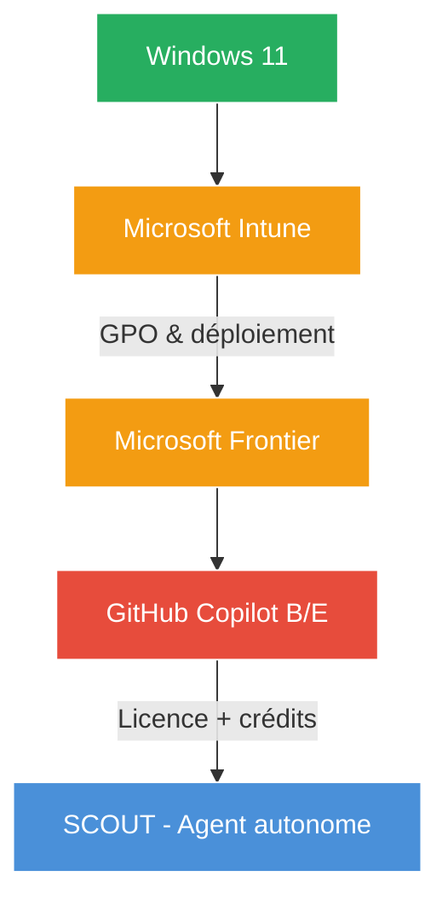
```mermaid
graph TD
    A[Windows 11] --> B[Microsoft Intune]
    B -->|GPO & déploiement| C[Microsoft Frontier]
    C --> D[GitHub Copilot B/E]
    D -->|Licence + crédits| E[SCOUT - Agent autonome]
    
    style A fill:#27ae60,stroke:#fff,color:#fff
    style B fill:#f39c12,stroke:#fff,color:#fff
    style C fill:#f39c12,stroke:#fff,color:#fff
    style D fill:#e74c3c,stroke:#fff,color:#fff
    style E fill:#4a90d9,stroke:#fff,color:#fff
```

### 3.2 Prérequis détaillés

| # | Prérequis | Statut estimé (Solidaris) | Effort |
|:-:|:----------|:--------------------------|:-------|
| 1 | Windows 11 sur TOUS les postes cibles | ⚠️ Partiel — migration probablement en cours | Moyen |
| 2 | Microsoft Intune déployé et configuré | ⚠️ Partiel — configuration GPO/politiques nécessaire | **Élevé** |
| 3 | Organisation Microsoft Frontier | ✅ Probablement déjà existant (M365 E3/E5) | Faible |
| 4 | GitHub Copilot Business ou Enterprise | ❌ À souscrire | Nouveau budget |
| 5 | Formulaire de consentement utilisateur | ❌ À créer + validation juridique (RGPD, CCT) | Moyen |
| 6 | Formation utilisateurs | ❌ À concevoir — concept nouveau (agent autonome vs chat) | Moyen |

### 3.3 Modèle de crédits SCOUT

SCOUT fonctionne sur un système de **crédits** :
- Chaque chat, heartbeat, et automation consomme des crédits
- Les modèles ont des coûts différents :

| Modèle | Coût crédits | Usage recommandé |
|:-------|:-------------|:-----------------|
| **Opus 4.7** | ⚠️ **Élevé** | Tâches complexes, critique |
| **Sonic 4.6** | Moyen | Tâches standards |
| **GPT 4.1** | **Faible (éco)** | Tâches simples, automation |

> ⚠️ **Attention :** Un heartbeat 24/7 peut épuiser les crédits très rapidement. Il est impératif de choisir le modèle adapté à chaque tâche.

---

## 4. Modèle de Licence et Coûts

### 4.1 Coûts de licence annuels (base 1 000 utilisateurs)

| Composant | Unité | Coût unitaire/mois | Nb utilisateurs | Coût annuel |
|:----------|:------|:------------------:|:---------------:|:-----------:|
| **GitHub Copilot Business** | Utilisateur | $19 | 200 (pilote) | **$45 600** |
| **GitHub Copilot Enterprise** | Utilisateur | $39 | 200 (pilote) | **$93 600** |
| **Crédits SCOUT** | Variable | Inclus dans Env. / selon consommation | — | **Variable** |

> ℹ️ Les crédits sont inclus dans GitHub Copilot mais avec un plafond. En cas de dépassement, coûts supplémentaires non documentés à ce stade.

### 4.2 Scénarios de dimensionnement

| Scénario | Nb users | Licence | Coût licence/an | Crédits estimés/an | Total estimé/an |
|:---------|:--------:|:--------|:--------------:|:------------------:|:--------------:|
| **POC** | 10 | Business | $2 280 | Faible | **~$3 000** |
| **Pilote** | 200 | Business | $45 600 | $5 000 — $15 000 | **~$55 000** |
| **Production (1 000)** | 1 000 | Business | $228 000 | $25 000 — $75 000 | **~$280 000** |
| **Production (1 000)** | 1 000 | Enterprise | $468 000 | $25 000 — $75 000 | **~$520 000** |

### 4.3 Options Enterprise vs Business

| Critère | Business ($19) | Enterprise ($39) |
|:--------|:--------------:|:----------------:|
| SCOUT agent | ✅ Oui | ✅ Oui |
| Crédits inclus | ✅ Oui | ✅ Oui |
| Modèles personnalisés | ❌ Non | ✅ Oui |
| SAML/SSO | ✅ Basique | ✅ Avancé |
| Audit & compliance | ❌ Non | ✅ Oui (logs, policies) |
| **Recommandation mutualité** | ❌ | **✅ Recommandé** pour conformité RGPD |

---

## 5. TCO (Total Cost of Ownership) — Périmètre Complet

### 5.1 TCO Année 1 — Déploiement partiel (200 users pilote → 1 000 users)

| Poste | Détail | Année 1 (Pilote 200) | Année 2 (Prod 1 000) |
|:------|:-------|:--------------------:|:--------------------:|
| **Licence GitHub Copilot Enterprise** | $39/user/mois | $93 600 | $468 000 |
| **Crédits SCOUT** | Selon consommation | $15 000 | $75 000 |
| **Microsoft Intune** | Déjà en place ou coût additionnel | $0 — $5 000 | $0 — $5 000 |
| **Support technique** | 15% des licences | $14 040 | $70 200 |
| **Formation utilisateurs** | ½ journée par user (x2 sessions) | $20 000 | $30 000 |
| **Formation formateurs IT** | 5 jours | $7 500 | $0 |
| **Pilotage / Chef de projet** | 0,5 ETP CDI | $45 000 | $45 000 |
| **Intégration Intune (packaging SCOUT)** | Prestation externe ou régie | $15 000 | $5 000 |
| **Révision juridique RGPD + CCT** | Consentement SCOUT, DPA | $5 000 | $0 |
| **Communication / conduite du changement** | Interne | $10 000 | $5 000 |

| **TOTAL ESTIMÉ** | | **~$225 140** | **~$698 200** |
|:-----------------|:---------------:|:--------------:|:--------------:|

### 5.2 TCO par utilisateur

| Période | Coût total | Nb users | Coût/user/an |
|:--------|:----------:|:--------:|:------------:|
| Année 1 (pilote) | ~$225 140 | 200 | **~$1 126** |
| Année 2 (production) | ~$698 200 | 1 000 | **~$698** |
| Année 3 (régime stable) | ~$650 000 | 1 000 | **~$650** |

---

## 6. ROI Potentiel — Processus Métier Automatisables

### 6.1 Matrice d'opportunité mutualiste

| Processus métier | Volume estimé | Automatable SCOUT | Gain attendu | Priorité |
|:-----------------|:-------------:|:-----------------:|:------------:|:--------:|
| **Traitement des dossiers usagers** (récurrents) | Haut | ✅ Extraction, résumé, mise à jour | 30-40% temps agent | 🥇 **Haute** |
| **Réponse aux mails usagers standards** | Très haut | ✅ Rédaction, qualification, routage | 40-60% temps agent | 🥇 **Haute** |
| **Suivi des flux BCSS/eHealth/MyCareNet** | Moyen | ✅ Vérification, alerte, mise à jour | 25-35% temps agent | 🥇 **Haute** |
| **Extraction données des documents** (DMIs, attestations) | Haut | ✅ OCR + structuration automatique | 50-70% temps administratif | 🥇 **Haute** |
| **Mise à jour des dossiers Intermutualité** | Moyen | ✅ Automation heartbeat | 20-30% temps | 🥈 **Moyenne** |
| **Génération de rapports périodiques** | Bas | ✅ Compilation automatique | 60-80% temps analyste | 🥈 **Moyenne** |
| **Tâches RH (demandes congés, notes de frais)** | Moyen | ✅ Orchestration formulaires | 15-25% temps RH | 🥉 **Faible** |
| **Support IT N1** | Haut | ✅ Diagnostic, résolution, escalade | 30-50% temps IT | 🥇 **Haute** |

### 6.2 Estimation ROI (scénario prudent)

| Horizon | Investissement total | Gains estimés (temps libéré) | ROI |
|:--------|:-------------------:|:---------------------------:|:---:|
| Année 1 (POC/Pilote) | ~$225 000 | ~$100 000 (5 ETP * $50k) | **-55%** |
| Année 2 (Prod ramp-up) | ~$698 000 | ~$500 000 (25 ETP * $50k) | **-28%** |
| Année 3 (Régime stable) | ~$650 000 | ~$1 000 000 (50 ETP * $50k) | **+54%** |

> ⚠️ ROI négatif les 2 premières années. Retour sur investissement à partir de l'année 3 si adoption massive et pérennité du produit.

---

## 7. Risques Projet

### 7.1 Matrice des risques

| # | Risque | Probabilité | Impact | Niveau | Mitigation |
|:-:|:-------|:-----------:|:-----:|:------:|:-----------|
| **R1** | **Dépendance Intune** — Si Intune n'est pas stabilisé, SCOUT est bloqué | **Haute** | **Critique** | 🔴 **20** | Audit Intune préalable ; n'engager SCOUT qu'après validation Intune |
| **R2** | **Dépendance Microsoft Frontier** — Organisation nécessaire au déploiement | **Moyenne** | **Élevé** | 🟠 **12** | Vérifier Organisation Frontier existante ; plan B : temporiser |
| **R3** | **Dépendance format Frontier** — Le format/fonctionnalités SCOUT est instable | **Haute** | **Élevé** | 🟠 **16** | Produit en version précoce ; prévoir clauses de sortie dans le contrat |
| **R4** | **Documentation insuffisante** — 1 seule vidéo (Shane Young), doc Microsoft encore « frontier » | **Haute** | **Moyen** | 🟠 **12** | Allouer du temps d'exploration ; réseau early adopters ; MVP contenu |
| **R5** | **Consommation excessive de crédits** — Heartbeat 24/7 épuise le quota | **Moyenne** | **Élevé** | 🟠 **12** | Politique d'usage : heartbeat limité, modèle éco pour tâches simples |
| **R6** | **Faible adoption utilisateurs** — Concept d'agent autonome mal compris | **Moyenne** | **Élevé** | 🟠 **12** | Formation obligatoire ½ journée ; cas d'usage concrets métier |
| **R7** | **Évolution du produit** — SCOUT peut changer, voire disparaître (produit frontier MS) | **Basse** | **Critique** | 🟠 **10** | Clause de résiliation sans pénalité dans le contrat Microsoft |
| **R8** | **Conformité RGPD** — Agent autonome accédant aux données des dossiers mutualistes | **Haute** | **Critique** | 🔴 **20** | DPO en amont ; registre traitement mis à jour ; consentement utilisateur ; limitation périmètre données |
| **R9** | **Dépendance à un seul modèle** — Pas d'alternative à l'agent SCOUT propriétaire | **Haute** | **Moyen** | 🟠 **12** | Garder une veille sur des solutions alternatives open source ; ne pas verrouiller l'architecture |

### 7.2 Risques résiduels non mitigeables

1. **Produit Microsoft « frontier »** — SCOUT n'est pas un produit mature. Microsoft peut en changer les termes, l'API, ou le modèle économique.
2. **Verrouillage Intune** — Une fois SCOUT déployé, le coût de sortie d'Intune est élevé. C'est un choix d'infrastructure à long terme.

---

## 8. Scénarios de Déploiement

### 8.1 Scénario A — POC uniquement (Recommandé court terme)

| Élément | Détail |
|:--------|:-------|
| **Périmètre** | 5-10 utilisateurs IT + 5 utilisateurs métier pilotes |
| **Durée** | 6-8 semaines |
| **Coût** | ~$3 000 — $5 000 |
| **Objectif** | Valider le concept, identifier les cas d'usage, tester la consommation crédits |
| **Livrables** | Rapport d'évaluation technique + business case élargi |
| **Décision** | Go/No Go pour Pilote |

### 8.2 Scénario B — Pilote contrôlé (Recommandé si POC OK)

| Élément | Détail |
|:--------|:-------|
| **Périmètre** | 200 utilisateurs (50 IT, 100 gestionnaires, 50 RH/finances) |
| **Durée** | 4-6 mois |
| **Coût** | ~$225 000 |
| **Objectif** | Mesurer le ROI réel, valider la conformité RGPD, former les relais |
| **Livrables** | Bilan ROI, guide d'usage, retour d'expérience utilisateurs |
| **Décision** | Go/No Go pour Généralisation |

### 8.3 Scénario C — Généralisation production

| Élément | Détail |
|:--------|:-------|
| **Périmètre** | 1 000 utilisateurs (déploiement par vagues de 200) |
| **Durée** | 6-9 mois post-pilote |
| **Coût** | ~$698 000 (année de transition) |
| **Objectif** | Déploiement complet, automation des processus identifiés |
| **Rythme** | Vague 1 : 200 → Vague 2 : +300 → Vague 3 : +500 |

---

## 9. Planning Estimé

### 9.1 Macro-Planning (18 mois)

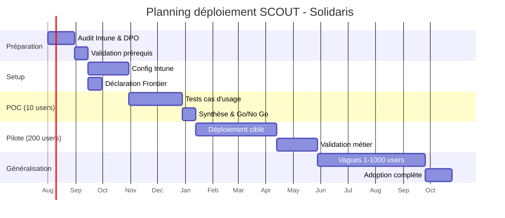
```mermaid
gantt
    title Planning déploiement SCOUT - Solidaris
    dateFormat  YYYY-MM-DD
    axisFormat  %b
    
    section Préparation
    Audit Intune & DPO       :a1, 2026-08-01, 30d
    Validation prérequis     :a2, after a1, 15d
    
    section Setup
    Config Intune            :b1, after a2, 45d
    Déclaration Frontier     :b2, after a2, 15d
    
    section POC (10 users)
    Tests cas d'usage        :c1, after b1, 60d
    Synthèse & Go/No Go      :c2, after c1, 15d
    
    section Pilote (200 users)
    Déploiement ciblé        :d1, after c2, 90d
    Validation métier        :d2, after d1, 45d
    
    section Généralisation
    Vagues 1-1000 users      :e1, after d2, 120d
    Adoption complète        :e2, after e1, 30d
```

### 9.2 Détail par phase

#### Phase ① — Préparation (Mois 1-2)

| Tâche | Responsable | Durée | Dépendances |
|:------|:------------|:-----:|:-----------|
| Audit parc Windows 11 | Équipe IT | 2 sem. | — |
| Audit Intune (déploiement, politiques, packaging) | Équipe IT | 3 sem. | — |
| Vérification Organisation Microsoft Frontier | Équipe IT | 1 sem. | — |
| Consultation DPO (conformité RGPD, registre, AIPD) | DPO | 3 sem. | — |
| Élaboration budget + validation comité de direction | PMO/Robert | 3 sem. | Audit préalable |
| Négociation contrat Microsoft (GitHub Copilot Enterprise) | Achats | 4 sem. | Budget validé |
| **Jalon : Décision de lancement POC** | Comité | — | Toutes tâches ci-dessus |

#### Phase ② — Setup Infrastructure (Mois 3-4)

| Tâche | Responsable | Durée | Dépendances |
|:------|:------------|:-----:|:-----------|
| Mise à niveau Windows 11 (si postes non conformes) | Équipe IT | 4 sem. | Audit parc |
| Configuration Intune (GPO, packaging SCOUT) | Équipe IT | **4 sem. (goulot)** | Intune disponible |
| Création Organisation Frontier SCOUT | Équipe IT | 1 sem. | Frontier OK |
| Déploiement GitHub Copilot Enterprise (10 comptes POC) | Équipe IT | 1 sem. | Contrat signé |
| Rédaction formulaire consentement utilisateur | DPO/RH | 2 sem. | DPO consulté |
| **Jalon : Infrastructure prête pour POC** | PMO | — | Tout ci-dessus |

#### Phase ③ — POC (Mois 5-8)

| Tâche | Responsable | Durée | Dépendances |
|:------|:------------|:-----:|:-----------|
| Identification des cas d'usage (3-5 processus) | Métier + PMO | 2 sem. | — |
| Déploiement SCOUT (10 users IT + 5 métier) | Équipe IT | 1 sem. | Infrastructure prête |
| Tests heartbeat, automation, chat | Équipe IT | 2 sem. | Déploiement |
| Mesure consommation crédits par modèle | Équipe IT | 4 sem. | Tests |
| Évaluation RGPD sur cas réels | DPO | 3 sem. | Usage réel |
| Rédaction rapport POC | PMO | 2 sem. | Tous les tests |
| **Jalon : Go/No Go Pilote** | Comité | — | Rapport POC |

#### Phase ④ — Pilote (Mois 9-14)

| Tâche | Responsable | Durée | Dépendances |
|:------|:------------|:-----:|:-----------|
| Déploiement SCOUT (200 users) par vagues de 50 | Équipe IT | 4 sem. | POC validé |
| Formation utilisateurs (½ journée, 10 sessions) | Formateurs IT | 6 sem. | Support formé |
| Création guide d'usage SCOUT (cas d'usage métier) | PMO + Métier | 4 sem. | Retour POC |
| Suivi adoption + consommation crédits | Équipe IT | 12 sem. | Déploiement |
| Mesure ROI sur processus automatisés | PMO | 8 sem. | 2 mois d'usage |
| Bilan conformité RGPD + audit intermédiaire | DPO | 4 sem. | 3 mois d'usage |
| **Jalon : Go/No Go Généralisation** | Comité | — | Bilan pilote + ROI |

#### Phase ⑤ — Généralisation (Mois 15-18)

| Tâche | Responsable | Durée | Dépendances |
|:------|:------------|:-----:|:-----------|
| Vague 1 : 200 users supplémentaires | Équipe IT | 4 sem. | Pilote validé |
| Vague 2 : 300 users supplémentaires | Équipe IT | 4 sem. | Vague 1 OK |
| Vague 3 : 500 users supplémentaires (full scale) | Équipe IT | 6 sem. | Vague 2 OK |
| Conduite du changement (communication, FAQ, support) | PMO/COM | 12 sem. | Tout le déploiement |
| Bilan post-déploiement + ajustements | PMO | 4 sem. | Généralisation complète |

---

## 10. Gouvernance Projet

### 10.1 Organisation

| Rôle | Persona | Missions |
|:-----|:--------|:---------|
| **Sponsor** | Direction Générale | Validation budgétaire, arbitrage |
| **Chef de Projet** | PMO Bureau Robert | Coordination, planning, reporting |
| **Expert Métier** | Bureau Robert (#6 Projet & Programme) | Analyse d'impact, TCO, risques |
| **Expert IT** | DSI Solidaris | Intune, Windows 11, packaging SCOUT |
| **DPO** | DPO Solidaris | Conformité RGPD, AIPD, consentement |
| **Référent Utilisateurs** | 1 par service pilote | Relais terrain, feedback |

### 10.2 Comités de décision

| Comité | Fréquence | Participants | Décisions |
|:-------|:---------:|:------------|:----------|
| **Comité de Pilotage (COPIL)** | Mensuel | Sponsor, PMO, DSI, DPO | Budget, périmètre, Go/No Go |
| **Comité Technique (COTECH)** | Bimensuel | PMO, Équipe IT, Référents | Intune, planning, incidents |
| **Comité Utilisateurs** | Mensuel | Référents, PMO, Formateur | Adoption, retours, ajustements |

---

## 11. Recommandation au Comité de Direction

### Positionnement

**Microsoft SCOUT est un produit innovant mais immature.** Il présente un potentiel réel pour l'automatisation des processus mutualistes, mais les risques sont significatifs :

🔴 **Risques bloquants (année 1) :**
- Dépendance Intune non stabilisée dans beaucoup d'orga
- Produit frontier vulnérable aux changements
- Documentation insuffisante (dépendance à 1 vidéo)
- Conformité RGPD à valider (agent autonome sur données mutualistes)

🟢 **Opportunités réelles :**
- Automatisation des dossiers usagers (30-70% de gain)
- Extraction et structuration de documents
- Support IT N1 automatisé

### Recommandation

| # | Recommandation | Horizon |
|:-:|:---------------|:-------:|
| 1 | **Auditer Intune d'abord** — sans Intune stable, SCOUT est impossible | Mois 1-2 |
| 2 | **POC limité (10 users)** — coût faible (~$5k), validation rapide | Mois 5-8 |
| 3 | **Ne PAS signer d'engagement pluriannuel** — clause de sortie obligatoire | Contrat |
| 4 | **Ne PAS étendre avant validation RGPD** — AIPD obligatoire avec DPO | DPO/Année 1 |
| 5 | **Former des relais internes** — concept d'agent autonome à expliquer | Pilote |
| 6 | **Garder une veille alternative** — ne pas verrouiller l'architecture sur SCOUT | Permanent |
| 7 | **Si POC concluant** → Pilote 200 users avec mesure ROI stricte | Mois 9-14 |

### Décision attendue du Comité

> **Proposition :** Valider le lancement de la **Phase ① (Préparation)** pour un audit Intune et une consultation DPO, avec un budget d'investigation de **€15 000 — €20 000** (ressources internes). La décision de lancer le POC sera prise sur la base des résultats de cet audit.
>
> **N'engager aucun budget licence GitHub Copilot / SCOUT avant la fin de l'audit préalable.**

---

## 12. Documents de Référence

| Document | Source | Utilité |
|:---------|:-------|:--------|
| Shane Young — SCOUT Demo (vidéo unique disponible) | YouTube | Source technique principale (1 seule vidéo détaillée) |
| Documentation Microsoft SCOUT (frontier) | Microsoft Learn | Documentation officielle (encore frontier) |
| Guide déploiement Intune | Microsoft | Prérequis n°1 |
| GitHub Copilot licensing guide | GitHub Docs | Modèle de licence |
| RGPD — Registre des traitements | DPO Solidaris | Conformité |

---

## 13. Versions

| Version | Date | Description | Auteur |
|:--------|:-----|:------------|:-------|
| v1 | 2026-07-09 | Version initiale — Analyse Projet & Programme SCOUT | Bureau Robert (Expert #6) |

---

<!-- AUTO:FOOTER -->
*Analyse produite par le **Bureau Robert — Expert #6 Projet & Programme** — Modèle : **deepseek-chat** — Date : **2026-07-09**
Dernière mise à jour : 2026-07-09*
<!-- AUTO:FOOTER:END -->

---

## 11. Mise à jour — Microsoft Build 2026 (juin 2026)

Les annonces de Build 2026 modifient sensiblement le cadrage projet de SCOUT :

### 11.1 MAP change le périmètre

Microsoft Agent Platform (MAP) est une **plateforme unifiée open source** qui dépasse largement SCOUT :
- MAF (Microsoft Agent Framework) en Python/.NET
- Hosted Agents en Foundry (sandbox sécurisée, GA juillet 2026)
- GitHub Copilot app native (macOS, Windows, **Linux**)
- Microsoft IQ comme couche de contexte unifiée

> **Impact projet :** SCOUT n'est plus un produit isolé à évaluer. C'est le premier composant d'une plateforme agent Microsoft. La question devient : **faut-il adopter MAP, et SCOUT en est le premier cas d'usage ?**

### 11.2 Impact sur le TCO

| Changement | Impact sur les coûts |
|:-----------|:--------------------|
| Modèles MAI souverains (MI Synthing) | Coût réduit vs Opus/Sonnet — économie sur les crédits GitHub Copilot |
| Frontier Tuning | Fine-tuning données Solidaris → GPT 5.4-like pour 10× moins cher |
| Identité gérée | Économie sur le coût de gouvernance (audit intégré) |
| Hosted Agents GA | Alternative cloud au déploiement local — mutualisation possible |

### 11.3 Planning révisé

| Phase | Nouvelle estimation | Justification |
|:------|:-------------------:|:--------------|
| POC technique | **T3 2026** inchangé | MAP en GA juillet, MAI disponibles |
| Pilote métier | **T1-T2 2027** inchangé | Toujours besoin de maturité sécurité |
| Généralisation | **H2 2027 au plus tôt** inchangé | Dépend de AIPD + DPA |

### 11.4 Message clé à retenir

> **"L'IA ne changera pas votre entreprise, c'est le système qui la fait tourner qui le fera."**
>
> Cette phrase de Microsoft Build 2026 résume l'enjeu pour Solidaris : SCOUT n'est qu'un outil. La **plateforme** (MAP, MAF, IQ, identité, sécurité) est ce qui crée la valeur. L'investissement dans la plateforme précède et conditionne le ROI de SCOUT.

---

*Document fusion v2 — Bureau Robert — 09/07/2026*
*Contenu brut des 4 analyses d'experts, sans altération ni synthèse.*

> 🤖 Dernier audit : 24/07/2026 à 11:52 (UTC+2)
