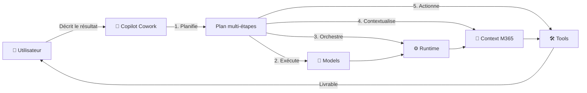
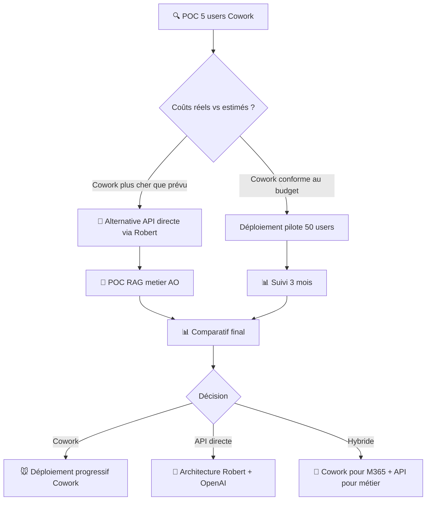

# 🏛️ Dossier Stratégique — Microsoft Copilot Cowork
## Analyse des coûts, de l'utilisation et des implications pour Solidaris

> **Bureau :** Robert 🏛️ — Conseil Stratégique IT & Business
> **Audience :** Direction AO, DSI, Budget — Solidaris
> **Date :** 16/07/2026 | **Version :** v1
> **Sources :** Microsoft Copilot Credits Guide (July 2026), CustomerCoworkEstimator.xlsx

---

## Table des matières

1. [Contexte et objectifs](#1-contexte-et-objectifs)
2. [Qu'est-ce que Copilot Cowork ?](#2-quest-ce-que-copilot-cowork-)
3. [Architecture du modèle de coûts — Copilot Credits](#3-architecture-du-modèle-de-coûts--copilot-credits)
4. [Détail des 4 buckets de coûts](#4-détail-des-4-buckets-de-coûts)
5. [Grille tarifaire indicative](#5-grille-tarifaire-indicative)
6. [Méthodologie d'estimation](#6-méthodologie-destimation)
7. [Scénarios budgétaires pour Solidaris](#7-scénarios-budgétaires-pour-solidaris)
8. [Comparaison avec les alternatives](#8-comparaison-avec-les-alternatives)
9. [Points d'attention spécifiques Solidaris](#9-points-dattention-spécifiques-solidaris)
10. [Recommandations](#10-recommandations)
11. [Annexes](#11-annexes)

---

## 1. Contexte et objectifs

Microsoft a publié en juillet 2026 son guide **« Copilot Credits Guide »** détaillant un nouveau modèle de facturation à l'usage pour les capacités IA avancées de son écosystème, notamment **Copilot Cowork**.

La Direction AO de Solidaris doit comprendre ce nouveau modèle pour :
- Anticiper les coûts potentiels d'une adoption
- Comparer avec les alternatives open source et autres fournisseurs
- Prendre une décision éclairée sur l'opportunité de déployer Cowork
- Budgétiser correctement les années à venir

---

## 2. Qu'est-ce que Copilot Cowork ?

### 2.1 Définition

Copilot Cowork est un **système agentique** qui planifie, exécute et livre du travail réel de manière autonome dans l'environnement Microsoft 365.

> « Décrivez le résultat que vous voulez → Cowork fait le travail. »

### 2.2 Capacités

| Domaine | Actions possibles |
|:--------|:-----------------|
| 📧 **Email** | Rédiger, envoyer, classer, répondre automatiquement |
| 📅 **Calendrier** | Planifier des réunions, gérer les conflits, envoyer des invitations |
| 📝 **Documents** | Créer, éditer, commenter des fichiers Word, Excel, PowerPoint |
| 💬 **Teams** | Poster dans les canaux, répondre aux messages, créer des réunions |
| 📁 **Fichiers** | Organiser, déplacer, partager dans OneDrive/SharePoint |

### 2.3 Principe de fonctionnement



### 2.4 Prérequis

**Copilot Cowork nécessite la licence Microsoft 365 Copilot** comme prérequis. Cowork est facturé **en supplément à l'usage** — aucun crédit n'est inclus dans l'abonnement M365 Copilot.

| Prérequis | Détail |
|:----------|:-------|
| Licence M365 Copilot | Obligatoire (abonnement par utilisateur) |
| Abonnement M365 | E3, E5 ou équivalent |
| Location des données | Tenant Azure éligible (EU requis pour Solidaris) |
| Partenaire Microsoft | Recommandé (CSP) |

---

## 3. Architecture du modèle de coûts — Copilot Credits

### 3.1 Principe général

Les **Copilot Credits** sont la monnaie commune pour tous les usages IA payants dans l'écosystème Microsoft :

| Domaine | Ce que les crédits financent |
|:--------|:-----------------------------|
| 🤖 **Copilot Cowork** | Tâches agentiques multi-étapes |
| 🔌 **Work IQ APIs** | Requêtes de grounding, retrieval, raisonnement |
| 🧩 **Copilot Studio** | Agents personnalisés |
| 🏢 **Business Apps** | Dynamics 365, Power Platform |

### 3.2 Pooling au niveau tenant

Les crédits sont **mutualisés au niveau du tenant** (entreprise). La consommation totale est la somme des usages de tous les services.

```
Tenant Solidaris
├── Copilot Cowork → X crédits/mois
├── Work IQ APIs  → Y crédits/mois
├── Copilot Studio → Z crédits/mois
└── Dynamics 365  → W crédits/mois
                    ─────────────
    Total          → Somme des crédits → Facture
```

### 3.3 Variabilité

Le nombre de crédits consommés **varie selon la complexité** de chaque tâche. Plus une tâche nécessite d'étapes, de contexte, d'outils et de qualité de modèle, plus elle coûte de crédits.

---

## 4. Détail des 4 buckets de coûts

Chaque tâche Cowork consomme des crédits selon 4 facteurs :

### 4.1 🧠 Models — Modèles IA

| Type de modèle | Usage typique | Coût relatif |
|:---------------|:--------------|:------------:|
| **Modèle léger** | Tâches simples, classification, extraction | Faible |
| **Modèle standard** | Rédaction, analyse modérée | Moyen |
| **Modèle haute qualité** | Synthèse complexe, décision multi-critères | Élevé |

La sélection du modèle est **automatique** selon la tâche. L'utilisateur ne choisit pas.

### 4.2 ⚙️ Runtime — Orchestration

| Composant | Description |
|:----------|:------------|
| Planification | Décomposition de la tâche en sous-étapes |
| Exécution | Lancement et suivi des agents |
| Long-running | Tâches qui durent plusieurs minutes/heures |
| Monitoring | Vérification de l'exécution |

### 4.3 📂 Context — Contexte

| Source de contexte | Ce qui est analysé |
|:-------------------|:-------------------|
| Emails | Conversations, pièces jointes |
| Fichiers | Documents OneDrive/SharePoint |
| Calendrier | Réunions, disponibilités |
| Personnes | Organisation, rôles, relations |
| Teams | Messages, canaux, historiques |

### 4.4 🛠️ Tools — Outils

| Action | Coût en crédits |
|:-------|:---------------:|
| Envoyer un email | 0,1 crédit |
| Planifier une réunion | 0,1 crédit |
| Créer un document | 0,1 crédit |
| Poster dans Teams | 0,1 crédit |
| Déplacer/classer un fichier | 0,1 crédit |

> Les outils ont un coût **fixe et faible** comparé aux modèles et au runtime.

---

## 5. Grille tarifaire indicative

### 5.1 Types de prompts

| Type | Crédits | Coût ($) | Description |
|:----:|:-------:|:--------:|:------------|
| 🌱 **Light** | 125 | ~1,25 $ | Contexte étroit, modèle léger, 0-1 outils, tâche simple |
| 🌿 **Medium** | 500 | ~5,00 $ | Contexte riche, modèle capable, plusieurs outils, synthèse |
| 🌳 **Heavy** | 1 200 | ~12,00 $ | Agrégation large, modèle haute qualité, nombreux outils |

> **Taux de conversion :** 100 crédits = 1 $ USD (prix catalogue Microsoft, juillet 2026)

### 5.2 Work IQ APIs

| API | Type de facturation | Crédits |
|:----|:--------------------|:-------:|
| Chat API | Variable (query) | Selon complexité |
| Context API | Variable (query) | Selon complexité |
| Tools API | Fixe (par appel) | 0,1 crédit |

### 5.3 Copilot Studio

| Usage | Facturation |
|:------|:------------|
| Interaction agent standard | Temps et effort de l'agent |
| Voix (voice agents) | Durée totale de l'appel (à la seconde) |
| Workflows et AI Tools | Actions invoquées |

---

## 6. Méthodologie d'estimation

Microsoft recommande une approche en **4 étapes** :

### Étape 1 — Définir les personas

| Persona | Description | Exemple Solidaris |
|:--------|:------------|:------------------|
| 👔 **Corporate Knowledge Worker** | Travailleur administratif | Agent AO back-office |
| 🤝 **Customer-Facing** | En contact avec les membres | Agent AO guichet/téléphone |
| 🔧 **Technical Worker** | Travailleur technique | Informaticien, analyste |
| 🎯 **Manager & Senior Leader** | Encadrement, décision | Chef de service AO, Direction |

### Étape 2 — Estimer les prompts par persona

| Persona | Light/mois | Medium/mois | Heavy/mois |
|:--------|:----------:|:-----------:|:----------:|
| 👔 Corporate Knowledge Worker | 22 | 11 | 5 |
| 🤝 Customer-Facing | 17 | 13 | 5 |
| 🔧 Technical Worker | 12 | 9 | 14 |
| 🎯 Manager & Senior Leader | 13 | 6 | 3 |

> Chiffres par défaut basés sur les « Microsoft Frontier Guidelines »

### Étape 3 — Appliquer le coût par prompt

```
Coût mensuel par utilisateur = 
  (Light × 1,25 $) + (Medium × 5,00 $) + (Heavy × 12,00 $)
```

### Étape 4 — Calculer le budget mensuel total

```
Budget mensuel = Somme des coûts individuels
Budget annuel  = Budget mensuel × 12
```

---

## 7. Scénarios budgétaires pour Solidaris

### 7.1 Scénario A — Pilote Direction AO (50 utilisateurs)

| Profil | Effectif | Coût unitaire/mois | Total/mois |
|:-------|:--------:|:------------------:|:----------:|
| Agents AO (Customer-Facing) | 30 | ~147 $ | 4 410 $ |
| Managers AO (Managers) | 10 | ~86 $ | 860 $ |
| Tech/Support (Technical) | 10 | ~235 $ | 2 350 $ |
| **Total** | **50** | | **7 620 $** |

| Métrique | Valeur |
|:---------|:------:|
| **Budget mensuel** | ~7 620 $ |
| **Budget annuel** | ~91 440 $ |
| **Coût moyen par user/mois** | ~152 $ |
| **+ Licence M365 Copilot** | ~30 $/user/mois |

> **Coût total pilote 50 users : ~9 000 $/mois** (Cowork + Licence)

### 7.2 Scénario B — Déploiement partiel (200 utilisateurs)

| Profil | Effectif | Coût unitaire/mois | Total/mois |
|:-------|:--------:|:------------------:|:----------:|
| Agents AO | 120 | ~147 $ | 17 640 $ |
| Managers AO | 30 | ~86 $ | 2 580 $ |
| Tech/Support | 30 | ~235 $ | 7 050 $ |
| Cadres direction | 20 | ~86 $ | 1 720 $ |
| **Total** | **200** | | **28 990 $** |

| Métrique | Valeur |
|:---------|:------:|
| **Budget mensuel** | ~28 990 $ |
| **Budget annuel** | ~347 880 $ |
| **Coût moyen par user/mois** | ~145 $ |
| **+ Licence M365 Copilot** | ~30 $/user/mois |

> **Coût total 200 users : ~34 990 $/mois** soit ~420 000 $/an

### 7.3 Scénario C — Généralisation (1 000 utilisateurs)

| Métrique | Valeur |
|:---------|:------:|
| **Budget Cowork mensuel** | ~145 000 $ |
| **Budget Cowork annuel** | ~1 740 000 $ |
| **Licences M365 Copilot** | ~360 000 $/an |
| **Coût total annuel** | **~2 100 000 $** |

### 7.4 Synthèse des scénarios

| Scénario | Users | Cowork/an | Licences/an | **Total/an** |
|:---------|:----:|:---------:|:-----------:|:-----------:|
| 🟢 **A — Pilote** | 50 | 91 000 $ | 18 000 $ | **~109 000 $** |
| 🟡 **B — Partiel** | 200 | 348 000 $ | 72 000 $ | **~420 000 $** |
| 🔴 **C — Généralisation** | 1 000 | 1 740 000 $ | 360 000 $ | **~2 100 000 $** |

> ⚠️ **Tous les prix sont en USD** et au tarif catalogue Microsoft (sans négociation partenaire).

---

## 8. Comparaison avec les alternatives

### 8.1 Solution Microsoft vs OpenAI Direct

| Critère | Microsoft Copilot Cowork | OpenAI API (via Robert) |
|:--------|:------------------------:|:-----------------------:|
| 🔌 **Intégration M365** | Native (email, calendrier, Teams) | Aucune — nécessite développement |
| 🔒 **Sécurité données** | Héritée de M365 | À configurer (proxy, gateway) |
| 📊 **Modèle de coût** | Abonnement + crédits (variable) | Pay-per-token (variable) |
| 💰 **Coût pour usage similaire** | ~5-12 $/prompt heavy | ~0,05-0,50 $/prompt (GPT-4o) |
| 🧩 **Personnalisation** | Limitée (ce que Microsoft expose) | Totale (via API, RAG, fine-tuning) |
| 🤖 **Agentique** | Intégré (planification, outils M365) | À construire (LangChain, AutoGen) |
| 🏢 **Vendor lock-in** | Élevé (M365 + Azure) | Modéré (API standard) |
| 🇪🇺 **Data residency** | Azure Europe | Configurable (Azure Europe) |

### 8.2 Avantages de Copilot Cowork

- **Intégration native** avec l'écosystème M365 existant de Solidaris
- **Sécurité et gouvernance** héritées (pas de configuration supplémentaire)
- **Déploiement rapide** (pas de développement)
- **Expérience utilisateur** fluide (dans les outils habituels)

### 8.3 Inconvénients de Copilot Cowork

- **Coût élevé** vs API directe (facteur 10 à 100)
- **Vendor lock-in** Microsoft renforcé
- **Personnalisation limitée** — pas de RAG métier AO spécifique sans Copilot Studio
- **Dépendance** au modèle de crédits Microsoft (prix, conditions)

---

## 9. Points d'attention spécifiques Solidaris

### 9.1 Données de santé — Conformité

| Point | Analyse |
|:------|:--------|
| **RGPD** | Les données traitées par Cowork transitent par les serveurs Microsoft. Vérifier le Data Processing Agreement (DPA) Azure pour les données de santé. |
| **AI Act** | Cowork pourrait être classé en « risque limité » (transparence requise). Vérifier la classification exacte avec Microsoft. |
| **NIS2** | Solidaris est probablement dans le périmètre NIS2 (santé). Cowork doit être inclus dans le SMSI. |
| **Localisation** | Les données doivent rester dans la région Europe (tenant Azure configuré). |

### 9.2 Licence M365 Copilot — Prérequis obligatoire

| Point | Détail |
|:------|:--------|
| **Coût** | ~30 $/user/mois (prix catalogue) |
| **Inclus** | Copilot Chat, Copilot dans Word/Excel/PPT/Outlook/Teams, Work IQ |
| **Non inclus** | Cowork, Copilot Studio avancé, Work IQ APIs |
| **Négociation** | Possible via partenaire CSP ou Microsoft Sales |

### 9.3 Dépendance stratégique

| Risque | Mitigation |
|:-------|:-----------|
| **Vendor lock-in** | Garder une architecture hybride (Robert + API directe) comme alternative |
| **Hausse des prix** | Négocier un contrat pluriannuel avec plafond de hausse |
| **Disponibilité** | Prévoir un mode dégradé (fallback API directe) |

---

## 10. Recommandations

### 10.1 Court terme (T3-T4 2026)

| # | Action | Priorité | Responsable |
|:-:|:-------|:--------:|:------------|
| 1 | **Demander un devis** à un partenaire Microsoft CSP pour M365 Copilot + Cowork | 🔴 | DSI + Budget |
| 2 | **Vérifier le DPA** Azure pour les données de santé Solidaris | 🔴 | Sécurité (3) + Juridique (14) |
| 3 | **Comparer avec l'approche API directe** (OpenAI via Robert) pour un cas d'usage AO précis | 🟡 | Robert + Data Eng (7) |
| 4 | **Lancer un POC limité** (5 utilisateurs, 1 mois) pour valider les coûts réels vs estimés | 🟡 | Projet (4) + Budget (5) |

### 10.2 Moyen terme (2027)

| # | Action | Priorité |
|:-:|:-------|:--------:|
| 5 | **Décider** entre Cowork, API directe, ou hybride selon les résultats du POC | 🔴 |
| 6 | **Négocier** un contrat pluriannuel avec un partenaire CSP | 🟡 |
| 7 | **Former** les équipes AO à l'utilisation de Cowork (si retenu) | 🟡 |
| 8 | **Industrialiser** l'alternative API directe via Robert (si retenue) | 🟡 |

### 10.3 Scénario recommandé pour la Direction AO



---

## 11. Annexes

### 11.1 Glossaire

| Terme | Définition |
|:------|:-----------|
| **Copilot Credit** | Unité de facturation à l'usage pour l'IA Microsoft (100 crédits = 1 $) |
| **Cowork** | Système agentique autonome dans M365 |
| **Work IQ** | Couche d'intelligence workplace (contexte M365) |
| **CSP** | Cloud Solution Provider (partenaire Microsoft) |
| **DPA** | Data Processing Agreement (contrat de traitement des données) |

### 11.2 Références

- Microsoft Copilot Credits Guide — July 2026
- CustomerCoworkEstimator.xlsx — Microsoft, 2026
- Microsoft 365 Copilot Licensing Guide
- AI Act — Classification des systèmes d'IA

### 11.3 Experts sollicités pour cette analyse

| Expert | Contribution |
|:-------|:-------------|
| 🏛️ Vision Stratégique (1) | Analyse du positionnement Microsoft, tendances marché |
| 💰 Budget & TCO (5) | Modélisation des scénarios budgétaires |
| 🏗️ Architecture SI (2) | Intégration avec le SI Solidaris |
| 🛡️ Sécurité & RGPD (3) | Conformité données de santé |

---

*Document produit par Robert 🏛️ — Conseil Stratégique IT & Business*
*Basé sur Microsoft Copilot Credits Guide (July 2026) et CustomerCoworkEstimator.xlsx*
*Juillet 2026*

> 🤖 Dernier audit : 24/07/2026 à 08:09 (UTC+2)
