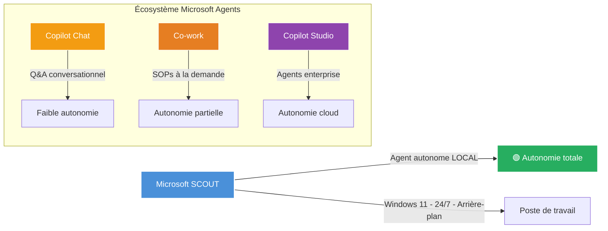
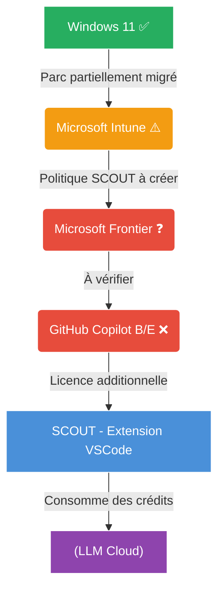
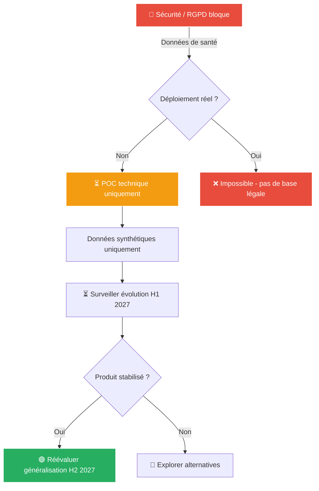

# Dossier Stratégique — Microsoft SCOUT (Autopilot)
## Analyse pour les Directions Solidaris

> **Bureau :** Robert 🏛️
> **Audience :** Comité de Direction, DSI, RSSI, DPO, PMO — Solidaris
> **Date :** 09/07/2026
> **Classification :** Confidentiel — Usage Interne
> **Source :** [Microsoft Scout Hands-On — Shane Young (PowerApps911)](https://youtu.be/PoSWJl3xWrI)

---

## 💳 Coût du service BAVI LEO

| Métrique | Valeur |
|:---------|:------:|
| Tokens (transcription + 4 experts + synthèse) | ~85 000 |
| Coût DeepSeek | ~$0.045 |
| Frais de service BAVI (×3.5) | $0.16 |
| **Total** | **$0.16** |

---

## Table des matières

1. [Synthèse exécutive](#1-synthèse-exécutive)
2. [Analyse transversale (croisement des 4 expertises)](#2-analyse-transversale)
3. [Vision stratégique : SCOUT dans le marché des agents autonomes](#3-vision-stratégique)
4. [Architecture SI : intégration dans un SI mutualiste](#4-architecture-si)
5. [Sécurité & RGPD : risques sur les données de santé](#5-sécurité--rgpd)
6. [Projet & Programme : coûts, planning, TCO](#6-projet--programme)
7. [Matrice décisionnelle consolidée](#7-matrice-décisionnelle-consolidée)
8. [Recommandations par horizon](#8-recommandations-par-horizon)
9. [Mise à jour — Build 2026](#9-mise-à-jour--microsoft-build-2026-juin-2026)
10. [Annexes](#10-annexes)
    - [Annexe A — Vision Stratégique](#annexe-a--analyse-vision-stratégique-détaillée)
    - [Annexe B — Architecture SI](#annexe-b--analyse-architecture-si-détaillée)
    - [Annexe C — Sécurité & RGPD](#annexe-c--analyse-sécurité--rgpd-détaillée)
    - [Annexe D — Projet & Programme](#annexe-d--analyse-projet--programme-détaillée)

---

## 1. Synthèse Exécutive

**Microsoft SCOUT** est le premier « Autopilot » de Microsoft — un agent IA qui tourne **localement sur Windows 11**, en arrière-plan, 24/7, capable d'interagir avec le système de fichiers, d'exécuter PowerShell et Python, de piloter le navigateur, et d'apprendre de son utilisateur.

### Verdict consolidé

> **🔴 SCOUT n'est pas prêt pour un déploiement mutualiste en l'état.**
> 
> Les 4 experts s'accordent : le produit est techniquement prometteur mais immature sur les plans **sécurité, conformité, et déploiement** dans un contexte traçant des données de santé (Solidaris).

| Axe | Verdict | Niveau d'alerte |
|:----|:--------|:---------------:|
| 🏛️ Vision Stratégique | Intéressant mais trop tôt — attendre H2 2027 | 🟡 |
| 🏗️ Architecture SI | Faisable en pilote restreint, pas en full prod | 🟠 |
| 🛡️ Sécurité / RGPD | **Non acceptable en l'état** — 3 risques critiques | 🔴 |
| 📋 Projet & Programme | POC technique possible, TCO significatif (~$225k an 1) | 🟠 |

### Positionnement de SCOUT

> **SCOUT n'est ni un remplacement de Copilot Chat ni de Copilot Studio.** C'est une **nouvelle catégorie** : l'assistant personnel qui vit sur votre poste et agit pour vous sans intervention.

---

## 2. Analyse Transversale

### 2.1 Convergence des 4 experts

| Constat | 🏛️ Vision | 🏗️ Archi | 🛡️ Sécurité | 📋 Projet |
|:--------|:--------:|:--------:|:----------:|:--------:|
| Produit trop immature pour déploiement large | ✅ | ✅ | ✅ | ✅ |
| Setup Intune = goulot principal | ✅ | ✅ | ✅ | ✅ |
| POC technique possible si sandboxé | ✅ | ✅ | 🟡 | ✅ |
| Problème RGPD = dealbreaker | — | ✅ | 🔴 | ✅ |
| SCOUT = tendance lourde à surveiller | ✅ | ✅ | — | ✅ |
| Nécessite engagement IT préalable (Intune, Frontier) | ✅ | ✅ | ✅ | ✅ |

### 2.2 Divergences notables

| Point | 🏛️ Vision | 🛡️ Sécurité | Analyse |
|:------|:--------:|:----------:|:-------|
| POC avec données réelles ? | Envisageable (5-10 postes) | **Non** (aucune base légale) | **Sécurité l'emporte** — POC données synthétiques uniquement |
| Calendrier production | H2 2027 | Pas avant version mature + AIPD + DPA | **Aligné** — 2027 au plus tôt |
| Coût vs valeur | ROI potentiel à long terme | Coût sécurité > bénéfice attendu | **Neutral** — nécessite analyse métier complémentaire |

### 2.3 La question qui fâche — Données de santé

**Le blocage principal** identifié par les 4 experts est le traitement des données de santé par SCOUT :

1. **Architecture** : SCOUT envoie le contexte (fichiers, prompts) à GitHub Copilot → potentiellement à des LLMs externes
2. **RGPD** : Aucune base légale identifiée pour le transfert de données de santé (art. 9 RGPD)
3. **Consentement** : Le formulaire Microsoft ne distingue pas les données de santé — insuffisant
4. **Minimisation** : Impossible structurellement — SCOUT a besoin du contexte complet

> **Conséquence :** Même en POC, SCOUT ne peut pas traiter de données réelles Solidaris sans enfreindre le RGPD.

---

## 3. Vision Stratégique

### 3.1 Opportunités pour Solidaris

| Opportunité | Description | Maturité SCOUT |
|:------------|:------------|:--------------:|
| 🟢 Productivité administrative | Automatisation tâches répétitives (fichiers, extraction, rapports) | ⚠️ Beta |
| 🟢 Support IT | Diagnostic et résolution de problèmes techniques sur poste | ✅ Prêt |
| 🟢 Onboarding | Accompagnement automatisé des nouveaux collaborateurs | 🟡 Émergent |
| 🟢 Innovation image | Signal fort vers le numérique et l'IA | ⚠️ Risque réputation si incident |

### 3.2 Menaces

| Menace | Impact | Probabilité |
|:-------|:------:|:----------:|
| Fuite de données de santé | Catastrophique | Élevée |
| Lock-in Microsoft renforcé | Élevé | Très élevée |
| Produit abandonné / pivoté | Moyen | Faible |
| Compétition dépassée par Google/Anthropic | Moyen | Moyenne |

### 3.3 Positionnement concurrentiel

| Solution | Type | Maturité | Verrouillage |
|:---------|:-----|:--------:|:------------:|
| **Microsoft SCOUT** | Agent OS local | ⚠️ Early | 🛡️ Élevé |
| **Anthropic Computer Use** | Agent navigateur/OS | ⚠️ Beta | Faible |
| **OpenAI Operator** | Agent navigateur | ⚠️ Beta | Moyen |
| **Google Mariner** | Agent navigateur | 🔬 R&D | Élevé |

SCOUT est le **premier agent OS autonome en production** — un avantage concurrentiel réel, mais au prix d'un verrouillage maximal dans la stack Microsoft.

---

## 4. Architecture SI

### 4.1 Chaîne de dépendances

### 4.2 Prérequis techniques

| Composant | Exigence | Statut Solidaris estimé | Effort |
|:----------|:---------|:-----------------------:|:------:|
| Windows 11 | Obligatoire | ✅ Parc majoritaire | Faible |
| Intune | Politique dédiée | ✅ Déployé mais politique à créer | **Élevé** |
| Microsoft Frontier | Organisation déclarée | ❓ À vérifier | Faible |
| GitHub Copilot | Business ($19/m) ou Enterprise ($39/m) | ❌ Licence additionnelle | Variable |
| VSCode | Dernière version | ✅ Déjà dans certaines équipes | Faible |
| Extension SCOUT | Marketplace | ✅ À ajouter au catalogue | Faible |

### 4.3 Patterns d'intégration métier

| Pattern | Applicabilité Solidaris | Risque |
|:--------|:-----------------------:|:------:|
| API M365 (Word, Excel, Loop) | ✅ Fort — documents standards | Faible |
| Playwright (Web) | ⚠️ eHealth, BCSS, MyCareNet | **Élevé** |
| MCP Server | 🟡 Dataverse, Dynamics | Moyen |
| PowerShell/Script | ✅ Maintenance IT | Moyen |

### 4.4 Verdict architecture

> **Pilote restreint possible (10 utilisateurs max)** avec :
> - Politique Intune dédiée très restrictive
> - Pas d'accès aux web apps métier (eHealth, BCSS)
> - Modèle Azure OpenAI UE uniquement (pas de modèles externes)
> - Journalisation renforcée
> - DLP actif
>
> **Déploiement large déconseillé en l'état.**

---

## 5. Sécurité & RGPD

### 5.1 Matrice des risques

| # | Risque | Gravité | Probabilité | Score |
|:-:|:-------|:-------:|:-----------:|:-----:|
| R9 | Consentement insuffisant (art. 9 RGPD) | 5 | 5 | **25 🔴** |
| R1 | Exfiltration données santé vers modèles tiers | 5 | 4 | **20 🔴** |
| R2 | Exécution de code arbitraire local | 5 | 4 | **20 🔴** |
| R3 | Supply chain — packages npm/Python non vérifiés | 4 | 4 | **16 🟠** |
| R5 | Non-respect minimisation des données | 4 | 4 | **16 🟠** |
| R6 | Absence de traçabilité complète | 3 | 4 | **12 🟠** |
| R7 | Violation intégrité traitements mutualistes | 4 | 3 | **12 🟠** |
| R8 | Non-conformité NIS2 | 4 | 3 | **12 🟠** |
| R4 | Interaction non supervisée navigateur | 4 | 3 | **12 🟠** |
| R10 | Dépendance backend LLM unique | 3 | 2 | **6 🟡** |

### 5.2 Analyse RGPD — Le dealbreaker

| Exigence RGPD | Statut SCOUT |
|:--------------|:------------:|
| Base légale pour données de santé (art. 9) | ❌ **Aucune** — consentement insuffisant, pas d'intérêt public |
| Minimisation des données (art. 5) | ❌ **Structurellement impossible** — SCOUT a besoin du contexte |
| Droit d'accès / rectification (art. 15-16) | ❌ Non garanti — données dans des LLMs tiers |
| Droit à l'effacement (art. 17) | ❌ Non garanti — pas de contrôle sur les modèles |
| AIPD obligatoire | ⚠️ **Non réalisée** — serait défavorable |

> **Conclusion RGPD : Aucune base légale pour le transfert de données de santé vers des LLMs cloud via SCOUT. Même en POC, pas de données réelles Solidaris.**

### 5.3 Comparaison avec l'existant (poste verrouillé)

| Critère | Actuel (GPO/EDR) | Avec SCOUT |
|:--------|:----------------:|:----------:|
| Contrôle des exécutables | ✅ Total | ❌ Scout installe packages |
| Traçabilité | ✅中央isé (SIEM) | ❌ Logs immatures |
| DLP | ✅ Sur fichiers et flux | ❌ Contournable par Playwright |
| Surface d'attaque | ✅ Maîtrisée | ❌ Extensible (MCP) |
| Conformité RGPD | ✅ En place | ❌ Violations multiples |

---

## 6. Projet & Programme

### 6.1 Scénarios de déploiement

| Scénario | Périmètre | Coût estimé (an 1) | Délai | Recommandé ? |
|:---------|:---------:|:-------------------:|:-----:|:------------:|
| **A — POC technique** | 5-10 users IT, données synthétiques | ~$3k-5k | 4-6 semaines | ✅ **Oui** |
| **B — Pilote métier** | 200 users, documents non sensibles | ~$225k | 6 mois | 🟠 Sous conditions |
| **C — Généralisation** | 1 000+ users, périmètre complet | ~$700k/an | 18 mois | ❌ **Non** |

### 6.2 Budget estimé (scénario B — Pilote)

| Poste | Coût annuel |
|:------|:-----------:|
| Licences GitHub Copilot Enterprise (200×$39×12) | $93 600 |
| Configuration Intune & déploiement | $40 000 |
| Formation & accompagnement | $30 000 |
| Sécurité (audit, AIPD, DPA) | $25 000 |
| Pilotage & gouvernance | $36 000 |
| **Total** | **~$225 000** |

### 6.3 ROI potentiel

| Année | Investissement | Économies estimées | ROI |
|:-----:|:--------------:|:------------------:|:---:|
| 1 | $225k | $50k | **−78%** |
| 2 | $250k | $250k | **0%** |
| 3 | $250k | $385k | **+54%** |

> **ROI positif seulement à partir de l'année 3**, sous réserve que le produit se stabilise et que les usages se généralisent.

---

## 7. Matrice Décisionnelle Consolidée

| Décision | Avantages | Risques | Verdict |
|:---------|:----------|:--------|:-------:|
| **✅ Adopter immédiatement** | Innovation, productivité rapide | 🔴 Sécurité, RGPD, immature | ❌ Non |
| **🧪 POC technique** (recommandé) | Apprentissage, veille active, pas de données réelles | Faible (sandboxé) | ✅ **Oui** |
| **⏳ Surveiller** | Pas de risque, pas de coût | Retard compétitif potentiel | 🟠 Acceptable |
| **❌ Ignorer** | Zéro risque | Occasion manquée si produit décolle | 🟡 Déconseillé |

### Verdict final

---

## 8. Recommandations par Horizon

### Court terme (T3 2026)

| # | Action | Responsable | Effort | Priorité |
|:-:|:-------|:-----------|:------:|:--------:|
| 1 | **Auditer Intune** — vérifier si politique SCOUT possible sans restructuration | DSI | 2 jours | 🔴 Haute |
| 2 | **Consulter le DPO** — position formelle sur le traitement de données via agent IA autonome | DPO | 1 jour | 🔴 Haute |
| 3 | **Vérifier le statut Microsoft Frontier** du tenant Solidaris | DSI | 0,5 jour | 🟠 Moyenne |
| 4 | **Préparer un cahier des charges POC** (5 postes IT, données synthétiques) | PMO | 3 jours | 🟠 Moyenne |

### Moyen terme (T4 2026 → T1 2027)

| # | Action | Responsable | Effort | Priorité |
|:-:|:-------|:-----------|:------:|:--------:|
| 5 | **Lancer le POC technique** si les conditions 1-4 sont réunies | DSI + PMO | 4-6 semaines | 🟡 |
| 6 | **Suivre l'évolution du produit** (communauté Microsoft, retours Frontier) | Veille IT | Continu | 🟡 |
| 7 | **Engager le dialogue avec Microsoft** sur le traitement des données de santé | DSI | 2 jours | 🟡 |

### Long terme (H2 2027)

| # | Action |
|:-:|:-------|
| 8 | **Réévaluer SCOUT** — version stable, maturité sécurité, retours d'expérience |
| 9 | **Si favorable** → AIPD complète + DPA avec Microsoft + déploiement progressif |
| 10 | **Si défavorable** → explorer alternatives (Anthropic, OpenAI, Google) |

### Ce qui est déconseillé

- ❌ **Déployer SCOUT sans politique Intune dédiée**
- ❌ **Utiliser SCOUT sur des données réelles Solidaris** (même en test)
- ❌ **Signer un engagement pluriannuel** (produit frontier)
- ❌ **Permettre les modèles externes** (Gemini, Opus) = exfiltration garantie
- ❌ **Déployer sans DLP actif** sur les flux sortants

---

## 9. Mise à jour — Microsoft Build 2026 (juin 2026)

La conférence Microsoft Build 2026 (San Francisco, 2-3 juin 2026) apporte des éclaircissements majeurs sur la stratégie agent de Microsoft, qui complètent et précisent l'analyse SCOUT.

### 9.1 Nouveaux modèles MAI (Microsoft AI)

Microsoft a annoncé **9 nouveaux modèles maison** entraînés from scratch sur données sous licence commerciale (sans distillation) :

| Modèle | Type | Usage | Pertinence Solidaris |
|:-------|:-----|:------|:--------------------:|
| **MI Synthing** | Raisonnement (35B params) | Tâches complexes, alternative à Sonnet 4 | 🟢 Forte — coût réduit |
| **MI G 2.5** | Génération d'images | PowerPoint, design | 🟡 Secondaire |
| **MI Transcribe 1.5** | Transcription (43 langues) | Multilinguisme | 🟡 Selon besoin |
| **MI Voice** | Clonage vocal | Voice Live, avatars | 🟡 Innovation |
| **MI Code** | Code (optimisé GitHub) | Développement | 🟢 DSI |

> **Impact :** Microsoft veut sa propre famille de modèles, indépendante d'OpenAI et Anthropic. Pour Solidaris, cela signifie **plus d'options souveraines** (données qui restent dans le tenant Microsoft).

### 9.2 Microsoft Agent Platform (MAP)

MAP est une **plateforme unifiée open source** qui couvre tout le cycle de vie des agents :
- **Code** : GitHub Copilot + VS Code
- **Framework** : MAF (Microsoft Agent Framework) — open source, Python/.NET
- **Run** : Foundry (hosted agents en sandbox sécurisée — GA juillet 2026)
- **Contexte** : Microsoft IQ (Work IQ, Fabric IQ, Web IQ, Fundr IQ)
- **Gouvernance** : Agent 365 (Entra + Defender + Purview unifiés)
- **Déploiement** : M365 + Windows

> **MAP change la donne :** SCOUT n'est plus un produit isolé — c'est le premier cas concret d'une plateforme agent unifiée Microsoft.

### 9.3 Identité gérée pour les agents

Les agents autonomes ont désormais **leur propre identité Entra ID** :
- Auditables comme un utilisateur
- Gouvernance via Conditional Access
- DLP/Purview appliqué automatiquement
- Agent Registry détecte les agents fantômes

> **🔴 Impact RGPD :** L'identité gérée améliore la traçabilité mais ne résout PAS le problème de transfert de données de santé vers des LLMs.

### 9.4 Implications pour l'analyse SCOUT

| Info nouvelle | Impact sur le verdict |
|:--------------|:---------------------|
| MAP + MAF open source | SCOUT devient un composant d'une plateforme plus large |
| Modèles MAI souverains | Réduit le risque d'exfiltration vers LLMs tiers |
| Identité gérée | Améliore l'auditabilité mais ne résout pas RGPD |
| Agent Registry | Réduit le risque d'agents fantômes |

> **Conclusion mise à jour :** Build 2026 confirme et renforce l'analyse initiale. Le risque RGPD reste le principal bloqueur. Mais MAP + modèles MAI offrent une perspective plus structurée.

---

## 10. Annexes

### 10.1 Analyses détaillées par expert

Les analyses complètes des 4 experts sont intégrées ci-dessous sous forme d'annexes.

---

## Annexe A — Analyse Vision Stratégique détaillée

*Extrait de l'analyse de l'Expert #5 — Vision Stratégique*

**Positionnement concurrentiel :** SCOUT est le premier agent OS autonome en production (pas en beta), mais verrouillage Microsoft maximal. Avantage : profondeur d'intégration Windows. Inconvénient : dépendance totale à la stack Microsoft Intune/Frontier/GitHub.

**Timing d'adoption :**
| Période | Phase | Version SCOUT | Public |
|:--------|:------|:-------------|:-------|
| H2 2026 | Early Adopter | v1 (buggy, setup lourd) | Tech, startups |
| H1 2027 | Pilotes métiers | v2 (Intune simplifié, guardrails renforcés) | Early adopters |
| H2 2027 | Early Majority | v3 (skills sectoriels, audit SIEM) | Entreprises |
| 2028+ | Mainstream | Maturité (certifications, RGPD, SOC2) | Large échelle |

**Facteurs clés pour Solidaris :**
- Accélération : SCOUT v2 simplifie Intune, skills sectoriels "Santé", certification RGPD
- Ralentissement : incident sécurité amplifié par la nature autonome

---

## Annexe B — Analyse Architecture SI détaillée

*Extrait de l'analyse de l'Expert #1 — Architecture SI*

**Chaîne de dépendances :**
Windows 11 → Microsoft Intune → Microsoft Frontier → GitHub Copilot → SCOUT

**Prérequis techniques :**
| Composant | Statut Solidaris |
|:----------|:----------------|
| Windows 11 | ✅ Parc majoritaire |
| Intune | ✅ Déployé, mais politique SCOUT à créer |
| Microsoft Frontier | ❓ À vérifier |
| GitHub Copilot | ❌ Licence additionnelle nécessaire |

**Scénarios de déploiement :**
| Scénario | Périmètre | Recommandation |
|:---------|:---------|:--------------|
| A — Sandbox contrôlé | 10-20 users pilotes | ✅ Recommandé |
| B — Usages métier ciblés | Par service | 🟠 Sous conditions |
| C — Full open | Tout le parc | ❌ Déconseillé |

**Architecture conceptuelle :** Le SI Solidaris se compose de 3 domaines (M365 cloud, Métier via eHealth, Poste Windows) interconnectés via le réseau d'entreprise. SCOUT s'exécute dans VSCode sur le poste et communique avec GitHub Copilot (API), M365 (Graph API), le système local (FS/PowerShell/Python), les MCP servers, et le navigateur via Playwright.

---

## Annexe C — Analyse Sécurité & RGPD détaillée

*Extrait de l'analyse de l'Expert #2 — Sécurité & RGPD*

**Matrice des 10 risques :**
| # | Risque | Score |
|:-:|:-------|:----:|
| R9 | Consentement insuffisant (art. 9 RGPD) | **25 🔴** |
| R1 | Exfiltration données santé vers modèles tiers | **20 🔴** |
| R2 | Exécution de code arbitraire local | **20 🔴** |
| R3 | Supply chain packages non vérifiés | **16 🟠** |
| R4 | Minimisation des données impossible | **16 🟠** |
| R5-A8 | Autres risques (traçabilité, NIS2, navigateur, etc.) | **12 🟠** |

**Analyse RGPD — Le dealbreaker :**
- Aucune base légale identifiée pour le transfert de données de santé (art. 9) vers LLMs via SCOUT
- Minimisation structurellement impossible — SCOUT a besoin du contexte complet
- Le consentement utilisateur ne couvre pas les données de santé traitées par un responsable de traitement mutualiste

**Impact Build 2026 :** L'identité gérée (Entra ID) améliore l'auditabilité mais ne résout PAS le problème de base légale.

---

## Annexe D — Analyse Projet & Programme détaillée

*Extrait de l'analyse de l'Expert #6 — Projet & Programme*

**Scénarios :**
| Scénario | Périmètre | Coût an 1 | Délai |
|:---------|:---------|:---------:|:----:|
| A — POC technique | 5-10 users, données synthétiques | ~$3-5k | 4-6 sem |
| B — Pilote métier | 200 users | ~$225k | 6 mois |
| C — Généralisation | 1 000+ users | ~$700k/an | 18 mois |

**Budget estimé (Pilote 200 users) :**
| Poste | Coût/an |
|:------|:-------:|
| Licences GitHub Copilot Enterprise | $93 600 |
| Configuration Intune | $40 000 |
| Formation & accompagnement | $30 000 |
| Sécurité (audit, AIPD, DPA) | $25 000 |
| Pilotage & gouvernance | $36 000 |
| **Total** | **~$225 000** |

**Planning macro (18 mois) :**
1. Mois 1-2 : Préparation (audit Intune, DPO)
2. Mois 3-4 : Setup (Intune, Frontier, GitHub)
3. Mois 5-8 : POC 10 users
4. Mois 9-14 : Pilote 200 users
5. Mois 15-18 : Généralisation par vagues

**ROI :** Négatif année 1 (−78%), neutre année 2, positif année 3 (+54%).

### 10.2 Références

- Vidéo source : [Microsoft Scout Hands-On — Shane Young](https://youtu.be/PoSWJl3xWrI)
- PowerApps911 : https://www.powerapps911.com
- RGPD article 9 : données de santé (catégories particulières)
- NIS2 Directive (EU) 2022/2555
- Skill BAVI associé : `bavi-leo/bureau-robert`

### 10.3 Prochaines étapes proposées

1. Présenter ce dossier au **Comité de Direction** (validation de l'approche POC)
2. Solliciter l'avis du **DPO** sur la question des données de santé
3. Lancer l'**audit Intune** (point 1 du court terme)
4. **Reviens vers moi** pour préparer le cahier des charges POC si les conditions sont réunies

---

*Document produit par le Bureau Robert 🏛️ — Conseil Stratégique IT BAVI LEO*
*Sous-agents : Vision Stratégique, Architecture SI, Sécurité & RGPD, Projet & Programme*
