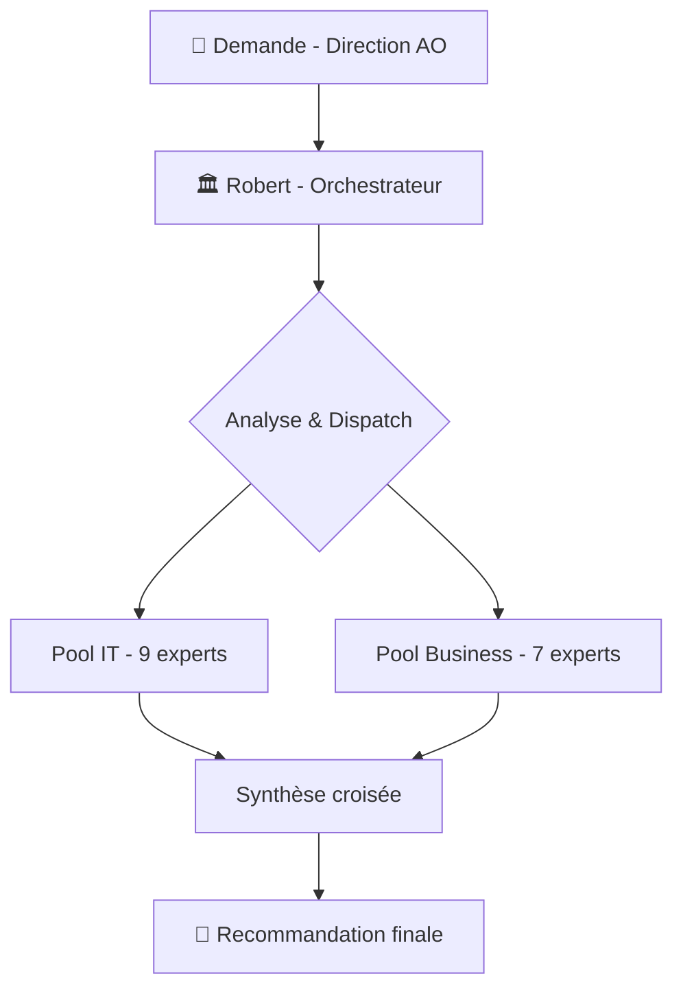
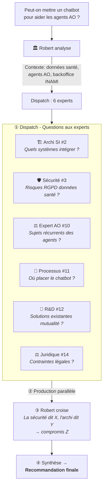
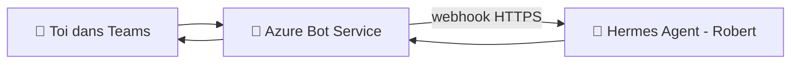
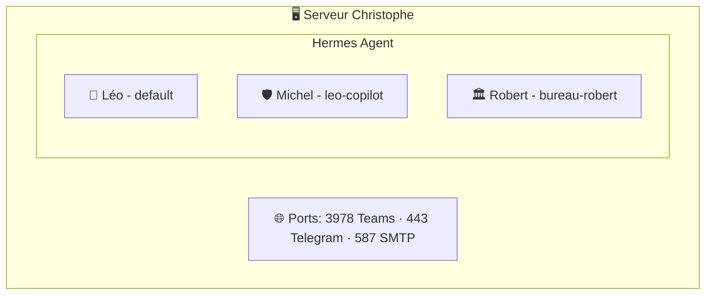
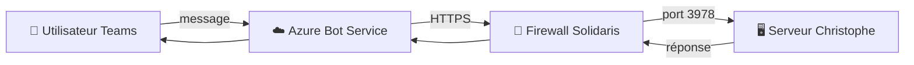
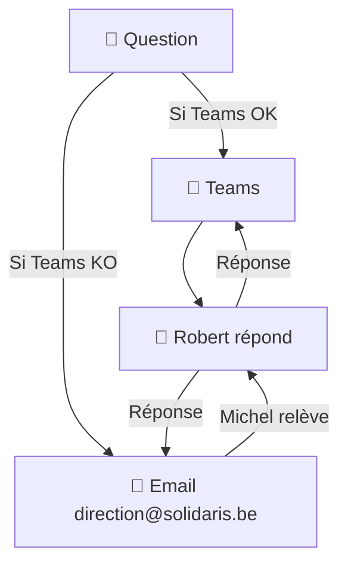
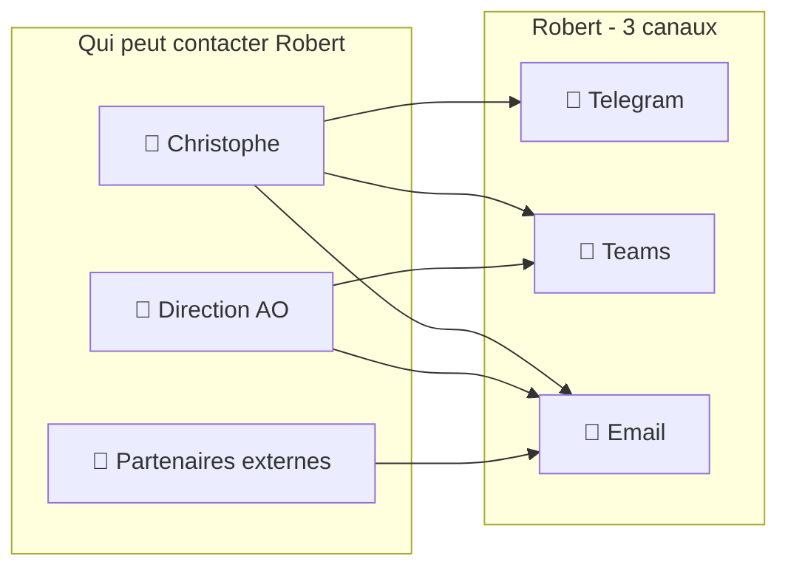
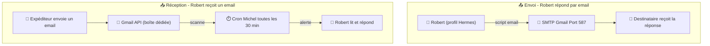
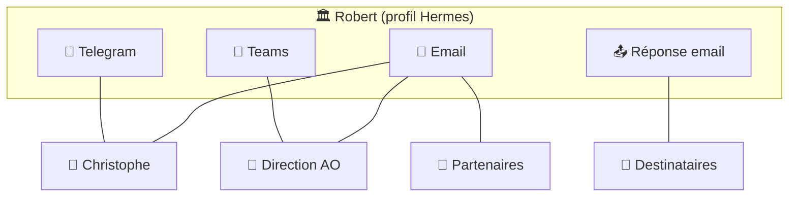

# 🏛️ Bureau Robert v2 — Évolution Stratégique & Référentiel de Mise en Place
## Architecture multi-experts IT & Business pour l'intégration de l'IA

> **Document évolutif** — Chaque version archive la précédente.
> **Date :** 15/07/2026 | **Version :** v3 (finalisé — validation environnement)

---

## 📚 Historique des versions

| Version | Date | Auteur | Statut | Description |
|:--------|:----:|:-------|:------:|:------------|
| **v1** | 08/07/2026 | LEO 🤖 | ✅ Finalisé | Analyse initiale — 7 experts IT |
| **v2** | 14/07/2026 | LEO 🤖 | ✅ Archivé | Design 16 experts (brouillon conception) |
| **v3** | 15/07/2026 | 🏛️ **Robert** | ✅ **Finalisé** | Validation environnement + fiches expert |

---

> ⚠️ **Note :** Ce document intègre l'intégralité des sections des versions v1 et v2 (conception, infra, roadmap, canaux) auxquelles s'ajoute la validation environnement de la v3. Rien n'a été supprimé.

---

# PARTIE I — FONDATIONS (v1-v2)

---

## 1. Principe fondateur : Robert reste un orchestrateur

Robert ne change pas de nature. Il reste celui qui **orchestre** — il reçoit la demande, analyse le besoin, **dispatche** aux bons sous-agents, croise leurs analyses et produit la synthèse.

La différence : il dispose désormais de **deux pools d'experts** au lieu d'un.



---

## 2. Architecture des sous-agents

### 2.1 Pool IT (9 experts)

| # | Expert | Mission | Domaine | Quand l'activer |
|:-:|:-------|:--------|:--------|:----------------|
| 1 | 🏛️ **Vision Stratégique** | Marché IT, tendances, benchmarking, positionnement | Veille, roadmap | Sujet stratégique |
| 2 | 🏗️ **Architecture SI** | Intégration technique, APIs, cloud, dépendances | APIs, microservices, SI | Solution technique envisagée |
| 3 | 🛡️ **Sécurité & RGPD** | Risques, conformité, AIPD, NIS2, AI Act | Données santé, risques | **OBLIGATOIRE** si données de santé |
| 4 | 📋 **Projet & Programme** | Planning, jalons, ressources, TCO, budget, ROI | Gestion de projet | Projet structuré |
| 5 | 💰 **Budget & TCO** | Coûts, licensing, maintenance, scenarii financiers | Finances IT, ROI | Budget à établir ou comparer |
| 6 | 🔄 **Interopérabilité** | eHealth, BCSS, MyCareNet, standards mutualistes | Connecteurs mutualistes | Projet touchant aux organismes |
| 7 | 🧪 **Data Engineering & IA Ops** | Pipelines, datasets, MLOps, RAG, embeddings | Python, LLM | **Systématique** pour tout POC IA |
| 8 | ☁️ **Infrastructure & Cloud IA** | GPU, vector DB, déploiement modèles, scaling | Cloud, infra LLM | Déploiement IA concret |
| 9 | 🔗 **API & Intégration IA** | Proxy, caching, rate limiting, tokens, gateway IA | OpenAI API, sécurité API | Connexion LLM externe au SI |

### 2.2 Pool Business (7 experts)

| # | Expert | Mission | Domaine | Quand l'activer |
|:-:|:-------|:--------|:--------|:----------------|
| 10 | ⚖️ **Expert Métier AO** | Processus INAMI/BCSS, réglementation mutualiste Solidaris | AO, mutualité | **OBLIGATOIRE** métier AO |
| 11 | 🏢 **Architecture Processus Métier** | BPMN, goulots, optimisation, analyse de valeur | Flux métier | Processus dans le périmètre |
| 12 | 🧪 **R&D & Innovation IA** | Veille cas d'usage mutualistes, POC, prototypage | IA, RPA, OCR, NLP | **Systématique** nouveau concept IA |
| 13 | 🔄 **Gestion du Changement** | Impact organisationnel, adoption, accompagnement | Change management | Projet impactant équipes |
| 14 | ⚖️ **Juridique & Conformité Métier** | AI Act, RGPD santé, droit mutualiste, assurances | Droit, conformité | **OBLIGATOIRE** données réelles |
| 15 | 🎓 **Acculturation & Formation** | Supports, ateliers, vulgarisation IA | Pédagogie | Parallèle au déploiement |
| 16 | 📊 **Data & Analyse** | Qualité données, indicateurs, data governance, KPIs | Analytics, KPI | Projet data-driven |

---

## 3. Fonctionnement — Comment Robert orchestre

### 3.1 Exemple : Mission « Chatbot agent AO »



### 3.2 Modes de saisine selon le besoin

| Type de demande | Experts IT | Experts Business | Temps |
|:----------------|:----------:|:----------------:|:------|
| 🔍 **Quick scan** (« c'est faisable ? ») | 1-3 | 1 | Chat |
| 📋 **Note d'analyse** | 3-4 | 2-3 | 1 session |
| 📑 **Dossier stratégique** | 5-8 | 4-6 | 2-3 sessions |
| 🚀 **Projet déploiement IA** | 7-10 | 5-6 | Plusieurs sessions |

### 3.3 Règles de dispatch

#### Impératives

| Condition | Dispatch obligatoire |
|:----------|:---------------------|
| Données de santé | **Sécurité (3)** + **Juridique (14)** |
| Impact agents AO | **Changement (13)** + **Processus (11)** + **Expert AO (10)** |
| Nouveau concept IA | **R&D (12)** + **Data Eng (7)** + **Expert AO (10)** |
| Projet IA concret (POC) | **Data Eng (7)** + **Cloud IA (8)** + **API IA (9)** + **Sécurité (3)** + **Expert AO (10)** + **R&D (12)** |
| Sujet technologique pur | Pool IT uniquement |
| Sujet organisationnel pur | Pool Business uniquement |

#### Optionnelles (selon contexte)

| Contexte | Expert recommandé |
|:---------|:------------------|
| Budget concerné | **Budget (5)** |
| Intégration SI externe | **Interop (6)** + **Archi (2)** |
| Décision stratégique | **Vision (1)** |
| Formation nécessaire | **Acculturation (15)** |
| Données / indicateurs | **Data Analyse (16)** |

---

## 4. Profil dédié — Pourquoi ?

Avec 16 sous-agents à coordonner, Robert a besoin de :

- **Mémoire persistante** : se souvenir des analyses précédentes, capitaliser
- **Autonomie** : pouvoir travailler en background sans présence
- **Spécialisation** : son skill unique avec les règles de dispatch des 16 experts
- **Évolutivité** : ajouter/supprimer des sous-agents sans impacter Léo

→ Comme Sylvia (bavi-leo), Michel (leo-copilot), Émile (emile)

---

## 5. Roadmap suggérée (vision initiale v2)

| Phase | Action | Statut |
|:------|:-------|:------:|
| **1. Cadrage** | Valider les besoins avec la Direction AO | ✅ Fait |
| **2. Conception** | Définir les 16 sous-agents + règles de dispatch | ✅ Fait |
| **3. Création profil** | `bureau-robert` — profil Hermes dédié | ✅ Fait |
| **4. Rédaction skill** | SKILL.md complet | ✅ Fait |
| **5. Tests & validation** | Missions de validation du dispatch | ✅ **Fait (v3)** |
| **6. Mise en production** | Présentation à la Direction AO | ⬜ À venir |

---

# PARTIE II — CANAUX DE COMMUNICATION (v2)

---

## 6. Canal de communication — Telegram vs Microsoft Teams

> **Décision :** Dans un premier temps, Robert utilise **Telegram**. L'option Teams est documentée pour une évolution future.

### 6.1 Choix immédiat — Telegram

Robert a un bot Telegram dédié pour les échanges avec Christophe et la Direction AO. ✅ **Actif et validé.**

### 6.2 Évolution possible — Microsoft Teams

Si la Direction AO souhaite intégrer Robert dans l'environnement professionnel Solidaris, Teams est une option.

#### 🤖 Le Bot Azure — À quoi il sert ?

C'est une **passerelle** entre Teams et Hermes :



Le bot Azure ne fait **rien** lui-même — il reçoit ton message dans Teams, le transmet à Hermes via un webhook, et renvoie la réponse dans Teams.

#### Ce que l'IT Solidaris doit fournir

| Élément | À demander à l'IT | Pourquoi |
|:--------|:-------------------|:---------|
| 🔑 **TEAMS_CLIENT_ID** | « Un App Registration dans Azure AD avec les droits Bot Framework » | Identifiant de l'application bot |
| 🔑 **TEAMS_CLIENT_SECRET** | « Le secret de l'App Registration » | Mot de passe pour que Hermes s'authentifie |
| 🔑 **TEAMS_TENANT_ID** | « L'ID du tenant Azure AD Solidaris » | Pour savoir que le bot appartient à Solidaris |
| 🌐 **Port webhook ouvert** | « Autoriser un webhook entrant HTTPS sur le port 3978 » | Pour que Microsoft Bot Service puisse joindre Hermes |
| 👤 **TEAMS_ALLOWED_USERS** | Optionnel : « Limiter le bot à certains utilisateurs » | Pour que seules les personnes autorisées parlent à Robert |

#### Ce que l'IT Solidaris n'a PAS besoin de faire

- ❌ **Pas d'infrastructure Microsoft 365 supplémentaire**
- ❌ **Pas de licence spéciale** (Bot Framework inclus dans Azure)
- ❌ **Pas de modification des politiques Teams existantes**

#### Configuration Hermes (par Michel)

| Élément | Responsable |
|:--------|:------------|
| Créer l'App Azure (Bot Framework) | IT Solidaris |
| Fournir les 3 credentials | IT Solidaris → Christophe → Michel |
| Activer le plugin `teams-platform` | Michel |
| Déployer le webhook (port 3978) | Michel |
| Créer le profil Hermes `bureau-robert` | Michel |
| Créer un canal Teams dédié « Robert - Conseil IA » | Christophe |

> 💡 **Vision long terme :** Robert pourrait avoir **deux canaux** — Teams pour les sujets Solidaris/AO (pro), Telegram pour Christophe (perso). Le même profil Hermes peut supporter les deux transports.

---

## 7. Infrastructure réseau et hébergement

### 7.1 Où tourne Robert ?

Robert (comme Léo, Michel, etc.) est un **agent Hermes**. Il tourne sur la même machine que les autres — le serveur de Christophe.



### 7.2 Si Teams est activé — Flux réseau



### 7.3 Ce qu'il faut ouvrir côté réseau

| Flux | De | Vers | Port | Protocole | Qui ouvre |
|:-----|:---|:-----|:----:|:---------|:----------|
| 🔌 **Webhook Teams → Hermes** | Internet (Azure) | Serveur Christophe | **3978** | HTTPS | Christophe (ou Michel) |
| 📩 **Envoi email (mode dégradé)** | Serveur Christophe | SMTP Gmail | 587 | TLS | Déjà ouvert |
| 📱 **Telegram API** | Serveur Christophe | api.telegram.org | 443 | HTTPS | Déjà ouvert |

> ⚠️ Le port 3978 doit être accessible **depuis Internet** (Azure Bot Service ne peut pas joindre un réseau local). Solutions :
> - Ouvrir le port sur le routeur de Christophe
> - Utiliser un **tunnel** (Cloudflare Tunnel, ngrok)
> - Configurer un **reverse proxy**

### 7.4 Sécurité

| Point | Solution |
|:------|:---------|
| 🔒 **Authentification** | Le bot Azure valide l'identité via les credentials Teams |
| 🔑 **Validation du webhook** | Le secret Teams permet à Hermes de vérifier la requête |
| 👤 **Contrôle d'accès** | `TEAMS_ALLOWED_USERS` limite les utilisateurs autorisés |
| 📝 **Journalisation** | Hermes logue toutes les interactions |
| 🌐 **TLS** | Flux chiffré de bout en bout (HTTPS) |

---

## 8. Mode dégradé — Si Teams est indisponible

**Oui, il faut prévoir un mode dégradé.** Teams peut être indisponible pour plusieurs raisons :
- Panne Azure / Microsoft 365
- Problème réseau Solidaris
- Maintenance programmée
- Expiration des credentials

### Scénarios de dégradation

| Situation | Impact | Solution |
|:----------|:-------|:---------|
| 🔴 **Teams indisponible** (panne Azure) | Robert injoignable sur Teams | Basculer sur **Telegram** (si activé) ou **email** |
| 🟡 **Bot Teams non déployé** (phase initiale) | Robert accessible uniquement sur Telegram | C'est le plan actuel — Telegram d'abord |
| 🟢 **Credentials expirés** | Le bot Teams ne répond plus | Michel renouvelle les credentials Azure AD |

### Mode dégradé — Email

Si Teams est indisponible et que Robert n'a pas Telegram, **l'email permet de garder le contact** :



### Quand utiliser l'email

| Cas | Action |
|:----|:-------|
| ✅ **Phase de test** (avant déploiement Teams) | Utiliser Telegram uniquement |
| ⚠️ **Teams indisponible temporairement** | Informer par email, orienter vers Telegram |
| 🔴 **Teams indisponible longue durée** | Basculer sur email + Telegram jusqu'au rétablissement |
| ✅ **Demande simple** | Peut être traitée par email sans urgence |
| ❌ **Demande urgente** | Nécessite Telegram (temps réel, plus rapide) |

> 💡 **Recommandation :** Activer **Telegram + Teams** pour Robert. Si Teams tombe, Telegram prend le relais. L'email reste un filet de sécurité.

---

## 9. Canal email — Architecture et mise en place

Au-delà du mode dégradé, l'email peut être un **troisième canal de communication à part entière** pour Robert.

### 9.1 Concept



Chaque canal a son usage :

| Canal | Usage principal | Qui parle |
|:------|:----------------|:----------|
| 💬 **Telegram** | Christophe ←→ Robert | Christophe uniquement |
| 💼 **Teams** | Direction AO ←→ Robert | Équipe Solidaris |
| 📧 **Email** | Tous ←→ Robert | Christophe, Direction, partenaires |

### 9.2 Architecture technique



### 9.3 Fonctionnement détaillé

#### 📥 Réception — Comment Robert reçoit un email

```
1. Un email arrive dans la boîte dédiée (ex: robert@... ou un libellé Gmail)
2. Le cron Michel (toutes les 30 min) détecte le nouvel email
3. Robert reçoit l'alerte et peut :
   a. Lire l'email via Gmail API
   b. Comprendre la demande
   c. Y répondre (par le même canal ou un autre)
```

#### 📤 Envoi — Comment Robert répond par email

```
1. Robert décide de répondre par email
2. Il exécute un script d'envoi (Gmail API ou SMTP)
3. L'email part avec une signature « Robert — Conseil Stratégique IA »
4. Le destinataire reçoit la réponse dans sa boîte
```

### 9.4 Configuration nécessaire

| Élément | Solution | Qui fait |
|:--------|:---------|:---------|
| 📧 **Boîte email dédiée** | Libellé Gmail dédié `Robert/` ou adresse dédiée | Christophe |
| 🔌 **Gmail API** | Déjà en place (Léo utilise la même) | ✅ Existant |
| ⏱️ **Cron surveillance** | Copie du check-gmail adaptée pour Robert | Michel |
| 📝 **Script d'envoi** | Script Python Gmail API (existe déjà pour Léo) | Michel |
| 👤 **Signature email** | « Robert — Conseil Stratégique IA / Solidaris » | Léo (contenu) |

### 9.5 Comparatif des 3 canaux

| Critère | 💬 Telegram | 💼 Teams | 📧 Email |
|:--------|:-----------|:---------|:---------|
| ⏱️ **Temps réel** | ✅ Oui | ✅ Oui | ❌ Non (30 min) |
| 🔒 **Sécurité pro** | ⚠️ Limité | ✅ Élevée | ✅ Chiffré |
| 📎 **Pièces jointes** | ✅ Limité | ✅ Oui | ✅ Oui |
| 👥 **Multi-utilisateurs** | ❌ Groupe limité | ✅ Canal Teams | ✅ N'importe qui |
| 🔌 **Nécessite un bot** | ✅ Bot Telegram | ✅ Azure Bot | ❌ Juste une boîte |
| 📋 **Traçabilité** | ❌ Faible | ✅ Moyenne | ✅ Excellente |
| 💰 **Coût** | ✅ Gratuit | ⚠️ Azure | ✅ Gratuit |

### 9.6 Recommandation — Architecture cible



> 💡 **À retenir :** L'email comme 3ᵉ canal ne nécessite **presque aucune infrastructure supplémentaire** — la Gmail API est déjà en place, la signature à personnaliser, et le cron à dupliquer pour Robert.

---

# PARTIE III — PLAN DE MISE EN ŒUVRE (v2)

---

## 10. Plan de mise en œuvre — Répartition Léo / Michel

> Les sections Email (9) et Teams (6) ne sont pas à l'ordre du jour immédiat. Seul **Telegram** est actif.

### 10.1 Prérequis livrés par Léo (contenu)

| Livrable | Détail | Statut |
|:---------|:-------|:-------|
| 📝 **SKILL.md complet** | Fichier créé dans le profil `bureau-robert` | ✅ **Créé (v2.1)** |
| 🧠 **16 fiches experts** | Mission, domaine, condition d'activation | ✅ **Créées (v3)** |
| ⚙️ **Règles de dispatch** | Impératives + optionnelles | ✅ **Prêt** |
| 📋 **Modes de saisine** | Quick scan → Projet déploiement | ✅ **Prêt** |
| 🗂️ **Structure dossier wiki** | `bureau-robert/` avec index | ✅ **Prêt** |
| 📊 **Schémas Mermaid** | Architecture, flux, dispatch | ✅ **Prêt** |
| 🏛️ **Identité Robert** | Nom, rôle, signature, présentation | ✅ **Prêt** |

### 10.2 Implémentation par Michel (infrastructure)

| Action | Détail | Dépend de | Statut |
|:-------|:-------|:----------|:------:|
| **Création profil** | `~/.hermes/profiles/bureau-robert/config.yaml` | Prérequis Léo | ✅ **Fait** |
| **Bot Telegram** | @BotFather → token → config profil | Profil créé | ✅ **Fait** |
| **SKILL.md installé** | Contenu dans `skills/bureau-robert/SKILL.md` | ✅ Livré par Léo | ✅ **Fait** |
| **SOUL.md** | Défini — règles orchestration | Profil créé | ✅ **Fait** |
| **Accès vault Obsidian** | Git clone + droits écriture | Profil créé | ✅ **Fait** |
| **Monitoring Gateway** | Dashboard Hermes → ajouter Robert | Profil actif | ⬜ À faire |
| **Test** | « Bonjour, je suis Robert 🤖 » → Christophe validé | Tout le reste | ✅ **Fait** |

### 10.3 Règles générales (applicables à Robert) — Léo + Michel

| Règle | Détail | Par |
|:------|:--------|:----|
| 🔒 **Rôles** | Léo = contenu, rédaction, documents. **Michel = infrastructure, configs, crons, scripts, coûts, modèles** | ✅ Établi |
| 🔄 **Git** | Commit + push immédiat après chaque modification de document | Léo / Robert |
| 📝 **Frontmatter** | Tout document wiki doit avoir un frontmatter YAML valide | Léo / Robert |
| 🗂️ **Obsidian** | Tous les documents sont dans le vault Obsidian BAVI LEO | Léo / Robert |
| 📊 **Mermaid** | Tous les schémas en Mermaid (pas d'ASCII art) | Léo / Robert |
| 🔌 **Transport** | Telegram uniquement pour l'instant (pas de Teams, pas d'email) | Michel |
| ⚙️ **Config profil** | Modèle deepseek-v4-flash, fallback deepseek-v4-flash | Michel |

### 10.4 Vérification — Checklist déploiement

| # | Vérification | Qui | ✅ |
|:-:|:-------------|:----|:-:|
| 1 | SKILL.md livré par Léo | **Léo** | ✅ |
| 2 | Documentation des 16 experts complète | **Léo** | ✅ |
| 3 | Schémas Mermaid et règles dispatch validés | **Léo** | ✅ |
| 4 | Profil `bureau-robert` créé | Michel | ✅ |
| 5 | Bot Telegram créé et token configuré | Michel | ✅ |
| 6 | SKILL.md installé dans le profil | Michel | ✅ |
| 7 | Robert répond sur Telegram | Michel | ✅ |
| 8 | Accès au vault Obsidian (git clone + pull) | Michel | ✅ |
| 9 | Mémoire persistante activée | Michel | ✅ |
| 10 | Robert apparaît dans le dashboard Gateway | Michel | ⬜ |
| 11 | Christophe notifié que Robert est opérationnel | Michel | ✅ |

---

# PARTIE IV — VALIDATION ENVIRONNEMENT (v3 — NOUVEAU)

---

## 11. Environnement technique — Validation du 15/07/2026

### 11.1 Profil Hermes « bureau-robert »

| Élément | Statut |
|:--------|:------:|
| Profil créé | ✅ `~/.hermes/profiles/bureau-robert/` |
| Config YAML | ✅ Modèle: `deepseek-v4-flash`, Provider: `deepseek` |
| SOUL.md | ✅ Défini — règles d'orchestration |
| Canal Telegram | ✅ Actif — session en cours |
| Mémoire persistante | ✅ Active |

### 11.2 Skill d'orchestration (SKILL.md)

| Élément | Statut |
|:--------|:------:|
| Fichier | ✅ `skills/bureau-robert/SKILL.md` |
| Version | ✅ v2.1 — 16 experts IT & Business |
| Dispatch | ✅ Règles impératives + optionnelles |
| Modes saisine | ✅ Quick scan → Projet déploiement |
| Références | ✅ `references/bavi-leo-repository.md` |
| Fiches expert | ✅ 16 fiches individuelles créées (v3) |

### 11.3 Accès au dépôt BAVI LEO

| Élément | Statut |
|:--------|:------:|
| Wiki GitHub Pages | ✅ `christophedanhier-hash.github.io/BAVI_LEO/wiki/agent-pro/bureau-robert/` |
| Dépôt GitHub | ✅ `christophedanhier-hash/BAVI_LEO` (public) |
| Clone local | ✅ `/home/tofdan/Projets_Dev/BAVI_LEO/` |
| Authentification | ✅ Token GitHub configuré |
| Git pull (test) | ✅ Succès |
| Auteur commits | ✅ `LEO (Christophe's Hermes)` |
| Dernier commit | ✅ `v3 — Référentiel de mise en place` |

### 11.4 Documents dans le wiki

| Document | Type | Statut |
|:---------|:-----|:------:|
| `evolution-bureau-robert-v2-ia-business.md` | **Ce document** (v3 — réf. mise en place) | ✅ **Finalisé** |
| `expert-01-vision-strategique.md` | Fiche expert | ✅ Finalisé |
| `expert-02-architecture-si.md` | Fiche expert | ✅ Finalisé |
| `expert-03-securite-rgpd.md` | Fiche expert | ✅ Finalisé |
| `expert-04-projet-programme.md` | Fiche expert | ✅ Finalisé |
| `expert-05-budget-tco.md` | Fiche expert | ✅ Finalisé |
| `expert-06-interoperabilite.md` | Fiche expert | ✅ Finalisé |
| `expert-07-data-engineering.md` | Fiche expert | ✅ Finalisé |
| `expert-08-infra-cloud-ia.md` | Fiche expert | ✅ Finalisé |
| `expert-09-api-integration-ia.md` | Fiche expert | ✅ Finalisé |
| `expert-10-expert-metier-ao.md` | Fiche expert | ✅ Finalisé |
| `expert-11-architecture-processus.md` | Fiche expert | ✅ Finalisé |
| `expert-12-rd-innovation-ia.md` | Fiche expert | ✅ Finalisé |
| `expert-13-gestion-changement.md` | Fiche expert | ✅ Finalisé |
| `expert-14-juridique-conformite.md` | Fiche expert | ✅ Finalisé |
| `expert-15-acculturation-formation.md` | Fiche expert | ✅ Finalisé |
| `expert-16-data-analyse.md` | Fiche expert | ✅ Finalisé |
| Autres analyses (SCOUT, ISO, AO) | Archives historiques | ✅ Existants |

> **Note :** Les documents d'analyse antérieurs (SCOUT, ISO 27001, Assurance Obligatoire) sont des **archives historiques** stockées dans le wiki. Ils ne constituent pas la configuration du Bureau Robert et n'influencent pas son fonctionnement.

### 11.5 Audit de couverture des domaines AO

| Domaine attendu | Expert(s) couvrant | ✅ |
|:----------------|:-------------------|:-:|
| Stratégie & Transformation digitale | Vision Stratégique (1) | ✅ |
| Architecture SI & Cloud | Architecture SI (2) + Infra Cloud (8) | ✅ |
| Sécurité & Conformité | Sécurité (3) + Juridique (14) | ✅ |
| Gestion de projets & Budget | Projet (4) + Budget (5) | ✅ |
| Interopérabilité mutualiste | Interop (6) + Expert AO (10) | ✅ |
| Data & IA | Data Eng (7) + Data Analyse (16) | ✅ |
| Intégration IA dans le SI | API IA (9) | ✅ |
| Innovation & R&D | R&D Innovation (12) | ✅ |
| Processus métier AO | Processus (11) + Expert AO (10) | ✅ |
| Gestion du changement | Changement (13) | ✅ |
| Acculturation IA | Acculturation (15) | ✅ |

> **✅ Couverture : 11/11 domaines — complète.**

---

## 12. Règles de production

1. **Frontmatter YAML** obligatoire sur tout document wiki (date, bureau, version, tags, statut)
2. **Schémas Mermaid** uniquement — pas d'ASCII art
3. **Commit + push immédiat** après chaque modification de document sur BAVI LEO
4. **Mémoire persistante** active — capitalise chaque analyse
5. **Délégation** aux sous-agents via `delegate_task` — chaque expert reçoit une question précise

### Dispatch via delegate_task

```python
delegate_task(
    goal="<mission précise de l'expert>",
    context="""<contexte technique complet>

IMPORTANT - Inclus ce frontmatter YAML en tête de ton fichier :
---
date: YYYY-MM-DD
bureau: bureau-robert
version: v1
tags: [tag1, tag2, pro]
statut: finalise
type: analyse-xxx
---""",
    toolsets=['terminal', 'file', 'web']
)
```

**⚠️ Ne pas oublier le frontmatter dans le context** — sinon le fichier produit sera invisible sur le wiki.

---

## 13. Ce que Robert ne fait PAS

- **Ne décide pas** — aide à décider, ne décide pas
- **N'implémente pas** — ne produit pas de code, config, déploiement
- **Ne modifie pas l'infrastructure** — ça c'est Michel
- **Ne stocke pas d'analyses perso** — les analyses personnelles (Michel, Léo, Sylvia, Émile) vont dans leurs bureaux respectifs

---

## 14. Interopérabilité avec les autres bureaux

| Bureau | Quand appeler | Comment |
|--------|--------------|---------|
| 💰 **Sophie** | Analyse avec volet financier (TCO, business case) | Appel skill `bureau-sophie` |
| 🛡️ **Assurance Obligatoire** | Impact métier AO spécifique | Expert AO (10) intégré au pool Business |

---

## 15. Stockage

Toutes les analyses produites par Robert sont stockées dans :
`BAVI_LEO/docs/wiki/agent-pro/bureau-robert/`

Index auto-généré : `agent-pro-index.py --bureau robert`

---

*Document évolutif — v3 — Architecture 16 experts IT & Business + Validation environnement*
*Produit par Robert 🏛️ — Juillet 2026*
