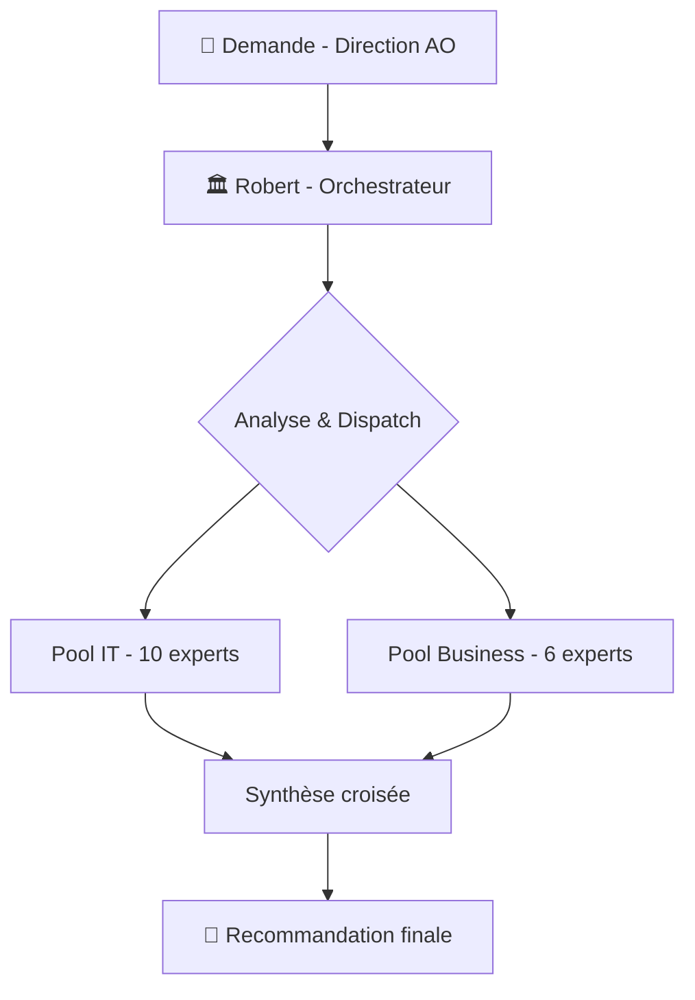
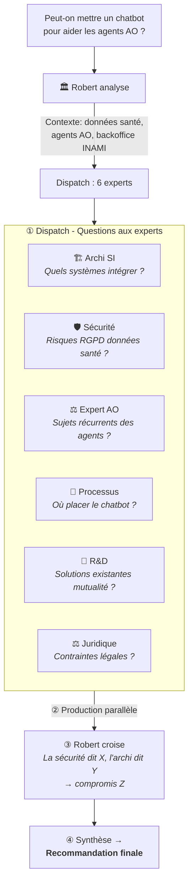

# 🏛️ Bureau Robert v2 — Évolution Stratégique IA  
## Analyse : Architecture multi-experts IT & Business pour l'intégration de l'IA

> **Document de réflexion — pas encore implémenté**
> **Date :** 14/07/2026 | **Version :** brouillon v2

---

## 1. Principe fondateur : Robert reste un orchestrateur

Robert ne change pas de nature. Il reste celui qui **orchestre** — il reçoit la demande, analyse le besoin, **dispatche** aux bons sous-agents, croise leurs analyses et produit la synthèse.

La différence : il dispose désormais de **deux pools d'experts** au lieu d'un.

---

## 2. Architecture des sous-agents

### 2.1 Pool IT — Renforcé (existants + nouveaux)

| # | Sous-agent | Rôle | Expertise clé |
|:-:|:-----------|:-----|:--------------|
| 1 | 🏛️ **Vision Stratégique** | Analyse du marché, tendances, positionnement | Veille technologique, benchmarks |
| 2 | 🏗️ **Architecture SI** | Intégration technique, patterns, dépendances | APIs, cloud, SI Solidaris |
| 3 | 🛡️ **Sécurité & RGPD** | Risques, conformité, AIPD | Données santé, NIS2, AI Act |
| 4 | 📋 **Projet & Programme** | Planning, coûts, TCO, jalons | Gestion de projet IT |
| 5 | ⚖️ **Assurance Obligatoire (AO)** | Impact INAMI/BCSS, réglementation mutualiste | Contexte métier Solidaris |
| 6 | 💰 **Budget & TCO** | Modélisation financière, ROI | Coûts IT, scénarios |
| 7 | 🔄 **Interopérabilité** | eHealth, BCSS, MyCareNet, connecteurs | Standards mutualistes belges |

**Nouveaux experts IT (pour répondre au Business IA) :**

| # | Sous-agent | Rôle | Expertise clé | Pourquoi |
|:-:|:-----------|:-----|:--------------|:---------|
| 8 | 🧪 **Data Engineering & IA Ops** | Pipelines de données, préparation datasets, feature engineering, MLOps | Python, bases vectorielles, embeddings, RAG | Le Business va demander des PoC IA → quelqu'un doit les construire |
| 9 | ☁️ **Infrastructure & Cloud IA** | GPU, vecteur DB, déploiement modèles, scaling | Azure OpenAI, AWS Bedrock, huggingface | Les modèles LLM ne tournent pas sur un serveur classique |
| 10 | 🔗 **API & Intégration IA** | Sécurisation des appels API IA, proxy, caching, rate limiting, monitoring tokens | OpenAI API, gestion coûts tokens, gateway IA | Connecter les modèles externes au SI Solidaris sans fuite de données |

### 2.2 Pool Business — Nouveaux

| # | Sous-agent | Rôle | Expertise clé | Quand l'activer |
|:-:|:-----------|:-----|:--------------|:----------------|
| 8 | 🏢 **Architecture des Processus Métier** | Cartographier les processus AO, identifier les goulots et points d'entrée IA | BPMN, flux métier, analyse de valeur | Dès qu'un processus métier est concerné |
| 9 | 🧪 **R&D & Innovation IA** | Veille cas d'usage mutualistes, POC, prototypage | IA générative, RPA, OCR, NLP, agents | Pour tout sujet IA concret |
| 10 | 🔄 **Gestion du Changement** | Impact organisationnel, adoption, accompagnement des équipes | Conduite du changement, formation | Projets impactant les agents AO |
| 11 | ⚖️ **Juridique & Conformité Métier** | AI Act, RGPD santé, droit mutualiste, responsabilité | Droit social, assurances, données santé | Obligatoire pour tout projet avec données réelles |
| 12 | 🎓 **Acculturation & Formation** | Création de supports, ateliers, vulgarisation IA | Pédagogie, cas d'usage concrets | En amont ou parallèle au déploiement |
| 13 | 📊 **Data & Analyse** | Données disponibles, qualité, préparation, indicateurs | Data governance, analytics, KPI | Pour tout projet data-driven |

---

## 3. Fonctionnement — Comment Robert orchestre

### 3.1 Exemple : Mission "Chatbot agent AO"

### 3.2 Modes de saisine selon le besoin

| Type de demande | Experts IT | Experts Business | Temps |
|:----------------|:----------:|:----------------:|:------|
| 🔍 **Quick scan** ("c'est faisable ?") | 1-3 | 1 | Chat |
| 📋 **Note d'analyse** | 3-4 | 2-3 | 1 session |
| 📑 **Dossier stratégique** | 5-8 | 4-6 | 2-3 sessions |
| 🚀 **Projet déploiement IA** | 7-10 | 5-6 | Plusieurs sessions |

### 3.3 Règles de dispatch

| Condition | Dispatch |
|:----------|:---------|
| Sujet avec **données de santé** | Toujours activer Sécurité (3) + Juridique (11) |
| Sujet avec **impact agents AO** | Toujours activer Changement (10) + Processus (8) |
| Sujet **technologique pur** (cloud, infra) | Pool IT uniquement |
| Sujet **organisationnel** (transformation) | Pool Business uniquement |
| **Projet IA concret** (POC, déploiement) | **Tous les nouveaux IT** (8,9,10) + R&D (9) + Sécurité(3) |
| **Nouveau concept IA** | Toujours activer R&D (9) + Data Eng (8) |

---

## 4. Profil dédié — Pourquoi ?

Avec 13 sous-agents à coordonner, Robert a besoin de :

- **Mémoire persistante** : se souvenir des analyses précédentes, capitaliser
- **Autonomie** : pouvoir travailler en background sans ma présence
- **Spécialisation** : son skill unique avec les règles de dispatch des 13 experts
- **Évolutivité** : ajouter/supprimer des sous-agents sans impacter Léo

→ Comme Sylvia (bavi-leo), Michel (leo-copilot), Émile (emile)

---

## 5. Roadmap suggérée

| Phase | Action |
|:------|:-------|
| **1. Cadrage** | Valider les besoins avec la Direction AO |
| **2. Conception** | Définir les 13 sous-agents + règles de dispatch |
| **3. Création profil** | `bureau-robert` — profil Hermes dédié |
| **4. Rédaction skill** | SKILL.md complet : rôle, sous-agents, dispatch, règles |
| **5. Tests** | 2-3 missions fictives pour valider le dispatch |
| **6. Mise en production** | Présentation à la Direction AO |

---

*Document de réflexion — v2 — Architecture multi-experts IT & Business*
*Produit par Léo 🤖 — Juillet 2026 — Rien n'est implémenté*
