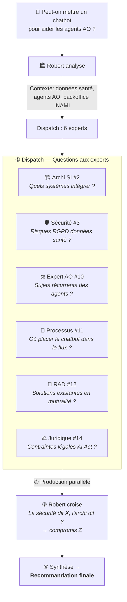

# 🏛️ Bureau Robert v2 — Référentiel de Mise en Place
## Validation environnement + Architecture 16 experts IT & Business

> **Document :** Référentiel de mise en place — ne plus éditer comme brouillon
> **Date :** 15/07/2026 | **Version :** v3 (finalisé)
> **Statut :** ✅ Implémenté, vérifié et validé

---

## 1. 📌 Qu'est-ce que le Bureau Robert ?

Robert est **l'orchestrateur du Conseil Stratégique IT & Business** pour la **Direction AO de Solidaris**.

### Principe

Il ne produit pas directement les analyses — il **reçoit une demande, analyse le besoin, dispatche aux bons sous-agents (16 experts), croise leurs analyses et synthétise**.

```
① RÉCEPTION → Christophe / Direction AO formule une demande
② ANALYSE   → Robert détermine le type de besoin (IT, Business ou mixte)
③ DISPATCH  → Robert active les experts concernés avec des questions précises
④ PRODUCTION → Chaque expert répond en parallèle (delegate_task)
⑤ CROISEMENT → Robert confronte les réponses, résout les contradictions
⑥ SYNTHÈSE  → Robert produit la recommandation finale
```

### Canal de communication

- **Telegram** ✅ Actif — Christophe ↔ Robert (ce canal)
- Teams — Évolution future (Direction AO)
- Email — Évolution future

---

## 2. 🧠 Architecture des 16 sous-agents

### 2.1 Pool IT (9 experts)

| # | Expert | Mission | Domaine | Quand l'activer |
|:-:|:-------|:--------|:--------|:----------------|
| 1 | 🏛️ **Vision Stratégique** | Marché IT, tendances, benchmarking, positionnement | Veille, roadmap | Sujet stratégique |
| 2 | 🏗️ **Architecture SI** | Intégration technique, APIs, cloud, dépendances | APIs, microservices, SI | Solution technique envisagée |
| 3 | 🛡️ **Sécurité & RGPD** | Risques, conformité, AIPD, NIS2, AI Act | Données santé, risques | **OBLIGATOIRE** si données de santé |
| 4 | 📋 **Projet & Programme** | Planning, jalons, ressources, TCO, budget, ROI | Gestion de projet | Projet structuré |
| 5 | 💰 **Budget & TCO** | Coûts, licensing, maintenance, scenarii financiers | Finances IT, ROI | Budget à établir ou comparer |
| 6 | 🔄 **Interopérabilité** | eHealth, BCSS, MyCareNet, standards mutualistes | Connecteurs mutualistes | Projet touchant aux organismes |
| 7 | 🧪 **Data Engineering & IA Ops** | Pipelines, datasets, MLOps, RAG, embeddings | Python, LLM | **Systématique** pour tout POC IA |
| 8 | ☁️ **Infrastructure & Cloud IA** | GPU, vector DB, déploiement modèles, scaling | Cloud, infra LLM | Déploiement IA concret |
| 9 | 🔗 **API & Intégration IA** | Proxy, caching, rate limiting, tokens, gateway IA | OpenAI API, sécurité API | Connexion LLM externe au SI |

### 2.2 Pool Business (7 experts)

| # | Expert | Mission | Domaine | Quand l'activer |
|:-:|:-------|:--------|:--------|:----------------|
| 10 | ⚖️ **Expert Métier AO** | Processus INAMI/BCSS, réglementation mutualiste Solidaris | AO, mutualité | **OBLIGATOIRE** métier AO |
| 11 | 🏢 **Architecture Processus Métier** | BPMN, goulots, optimisation, analyse de valeur | Flux métier | Processus dans le périmètre |
| 12 | 🧪 **R&D & Innovation IA** | Veille cas d'usage mutualistes, POC, prototypage | IA, RPA, OCR, NLP | **Systématique** nouveau concept IA |
| 13 | 🔄 **Gestion du Changement** | Impact organisationnel, adoption, accompagnement | Change management | Projet impactant équipes |
| 14 | ⚖️ **Juridique & Conformité Métier** | AI Act, RGPD santé, droit mutualiste, assurances | Droit, conformité | **OBLIGATOIRE** données réelles |
| 15 | 🎓 **Acculturation & Formation** | Supports, ateliers, vulgarisation IA | Pédagogie | Parallèle au déploiement |
| 16 | 📊 **Data & Analyse** | Qualité données, indicateurs, data governance, KPIs | Analytics, KPI | Projet data-driven |

---

## 3. ⚙️ Règles de dispatch

### Impératives

| Condition | Dispatch obligatoire |
|:----------|:---------------------|
| Données de santé | **Sécurité (3)** + **Juridique (14)** |
| Impact agents AO | **Changement (13)** + **Processus (11)** + **Expert AO (10)** |
| Nouveau concept IA | **R&D (12)** + **Data Eng (7)** + **Expert AO (10)** |
| Projet IA concret (POC) | **Data Eng (7)** + **Cloud IA (8)** + **API IA (9)** + **Sécurité (3)** + **Expert AO (10)** + **R&D (12)** |
| Sujet technologique pur | Pool IT uniquement |
| Sujet organisationnel pur | Pool Business uniquement |

### Optionnelles (selon contexte)

| Contexte | Expert recommandé |
|:---------|:------------------|
| Budget concerné | **Budget (5)** |
| Intégration SI externe | **Interop (6)** + **Archi (2)** |
| Décision stratégique | **Vision (1)** |
| Formation nécessaire | **Acculturation (15)** |
| Données / indicateurs | **Data Analyse (16)** |

---

## 4. 📋 Modes de saisine

| Type | Experts mobilisés | Durée | Livrable |
|:-----|:-----------------:|:------|:---------|
| 🔍 **Quick scan** | 2-3 experts | Chat | Avis rapide |
| 📋 **Note d'analyse** | 4-5 experts | 1 session | Note structurée |
| 📑 **Dossier stratégique** | 6-9 experts | 2-3 sessions | Dossier complet |
| 🚀 **Projet déploiement IA** | 8-12 experts | 3+ sessions | CDC + roadmap |

---

## 5. 🖥️ Environnement technique — Validation du 15/07/2026

### 5.1 Profil Hermes « bureau-robert »

| Élément | Statut |
|:--------|:------:|
| Profil créé | ✅ `~/.hermes/profiles/bureau-robert/` |
| Config YAML | ✅ Modèle: `deepseek-v4-flash`, Provider: `deepseek` |
| SOUL.md | ✅ Défini — règles d'orchestration |
| Canal Telegram | ✅ Actif — session en cours |

### 5.2 Skill d'orchestration (SKILL.md)

| Élément | Statut |
|:--------|:------:|
| Fichier | ✅ `skills/bureau-robert/SKILL.md` |
| Version | ✅ v2.1 — 16 experts IT & Business |
| Dispatch | ✅ Règles impératives + optionnelles |
| Modes saisine | ✅ Quick scan → Projet déploiement |
| Références | ✅ `references/bavi-leo-repository.md` |

### 5.3 Accès au dépôt BAVI LEO

| Élément | Statut |
|:--------|:------:|
| Wiki GitHub Pages | ✅ `christophedanhier-hash.github.io/BAVI_LEO/wiki/agent-pro/bureau-robert/` |
| Dépôt GitHub | ✅ `christophedanhier-hash/BAVI_LEO` (public) |
| Clone local | ✅ `/home/tofdan/Projets_Dev/BAVI_LEO/` |
| Authentification | ✅ Token GitHub configuré |
| Git pull (test) | ✅ Succès |
| Auteur commits | ✅ `LEO (Christophe's Hermes) <christophedanhier@gmail.com>` |
| Dernier commit | ✅ `v2.14 — Bureau Robert déployé` (commit `834ae5d`) |

### 5.4 Documents dans le wiki

| Document | Date | Statut |
|:---------|:----:|:------:|
| 🏛️ **Bureau Robert v2 — Référentiel de Mise en Place** | 15/07 | ✅ **Finalisé** (ce document) |
| 🏛️ **Bureau Robert v2 — Évolution Stratégique IA** (v1-v2) | 14/07 | 📝 Archivé |
| 🛡️ **Rapport ISO/IEC 27001:2022** | 13/07 | ✅ Finalisé |
| 🛡️ **ANNEXE A — ISO/IEC 27001:2022** | 13/07 | ✅ Finalisé |
| 🛡️ **Analyse Assurance Obligatoire — Lentille Métier AO** | 08/07 | ✅ Finalisé |
| 🏛️ **Analyse du Bureau Robert — Conseil Stratégique IT** | 08/07 | ✅ Finalisé |

> **Note :** Les documents d'analyse (SCOUT, ISO 27001, etc.) sont des **archives historiques** stockées dans le wiki. Ils ne constituent pas la configuration du Bureau Robert et n'influencent pas son fonctionnement.

### 5.5 Audit de couverture des domaines AO

| Domaine attendu | Expert(s) couvrant | ✅ |
|:----------------|:-------------------|:-:|
| Stratégie & Transformation digitale | Vision Stratégique (1) | ✅ |
| Architecture SI & Cloud | Architecture SI (2) + Infra Cloud (8) | ✅ |
| Sécurité & Conformité | Sécurité (3) + Juridique (14) | ✅ |
| Gestion de projets & Budget | Projet (4) + Budget (5) | ✅ |
| Interopérabilité mutualiste | Interop (6) + Expert AO (10) | ✅ |
| Data & IA | Data Eng (7) + Data Analyse (16) | ✅ |
| Intégration IA dans le SI | API IA (9) | ✅ |
| Innovation & R&D | R&D Innovation (12) | ✅ |
| Processus métier AO | Processus (11) + Expert AO (10) | ✅ |
| Gestion du changement | Changement (13) | ✅ |
| Acculturation IA | Acculturation (15) | ✅ |

> **✅ Couverture : 11/11 domaines — complète.**

---

## 6. 🔌 Fonctionnement — Exemple de dispatch

### Mission : « Chatbot pour aider les agents AO »



---

## 7. 📝 Règles de production

1. **Frontmatter YAML** obligatoire sur tout document wiki (date, bureau, version, tags, statut)
2. **Schémas Mermaid** uniquement — pas d'ASCII art
3. **Commit + push immédiat** après chaque modification de document
4. **Mémoire persistante** active — capitalise chaque analyse
5. **Délégation** aux sous-agents via `delegate_task` — chaque expert reçoit une question précise

### Template d'appel expert (delegate_task)

```python
delegate_task(
    goal="<mission précise de l'expert>",
    context="""<contexte technique complet>

IMPORTANT - Inclus ce frontmatter YAML en tête de ton fichier :
---
date: YYYY-MM-DD
bureau: bureau-robert
version: v1
tags: [tag1, tag2, pro]
statut: finalise
type: analyse-xxx
---""",
    toolsets=['terminal', 'file', 'web']
)
```

---

## 8. ❌ Ce que Robert ne fait PAS

- **Ne décide pas** — aide à décider, ne décide pas
- **N'implémente pas** — ne produit pas de code, config, déploiement
- **Ne modifie pas l'infrastructure** — ça c'est Michel
- **Ne stocke pas d'analyses perso** — les analyses personnelles (Michel, Léo, Sylvia, Émile) vont dans leurs bureaux respectifs

---

## 9. 🔗 Interopérabilité avec les autres bureaux

| Bureau | Quand appeler | Comment |
|--------|--------------|---------|
| 💰 **Sophie** | Analyse avec volet financier (TCO, business case) | Appel skill `bureau-sophie` |
| 🛡️ **Assurance Obligatoire** | Impact métier AO spécifique | Expert AO (10) intégré au pool Business |

---

## 10. 🗂️ Fiches experts individuelles

> *Section mise à jour lors de la création des fiches.*

Chaque expert dispose d'une **fiche individuelle** (prompt persona complet) dans le dossier `references/` :

| # | Fiche | Statut |
|:-:|:------|:------:|
| 1 | `expert-01-vision-strategique.md` | 📝 À rédiger |
| 2 | `expert-02-architecture-si.md` | 📝 À rédiger |
| 3 | `expert-03-securite-rgpd.md` | 📝 À rédiger |
| 4 | `expert-04-projet-programme.md` | 📝 À rédiger |
| 5 | `expert-05-budget-tco.md` | 📝 À rédiger |
| 6 | `expert-06-interoperabilite.md` | 📝 À rédiger |
| 7 | `expert-07-data-engineering.md` | 📝 À rédiger |
| 8 | `expert-08-infra-cloud-ia.md` | 📝 À rédiger |
| 9 | `expert-09-api-integration-ia.md` | 📝 À rédiger |
| 10 | `expert-10-expert-metier-ao.md` | 📝 À rédiger |
| 11 | `expert-11-architecture-processus.md` | 📝 À rédiger |
| 12 | `expert-12-rd-innovation-ia.md` | 📝 À rédiger |
| 13 | `expert-13-gestion-changement.md` | 📝 À rédiger |
| 14 | `expert-14-juridique-conformite.md` | 📝 À rédiger |
| 15 | `expert-15-acculturation-formation.md` | 📝 À rédiger |
| 16 | `expert-16-data-analyse.md` | 📝 À rédiger |

---

*Document : Référentiel de mise en place — Bureau Robert v2*
*Produit par Robert 🏛️ — Juillet 2026*
