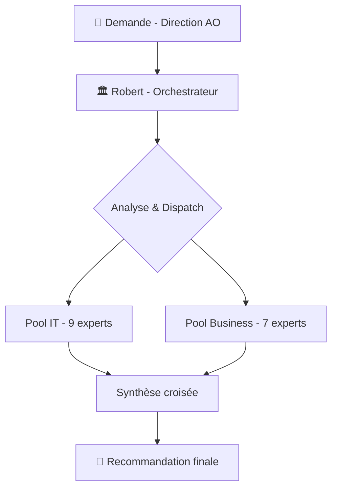
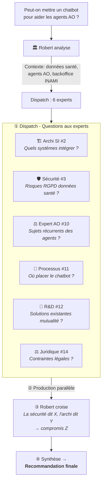
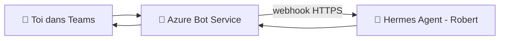
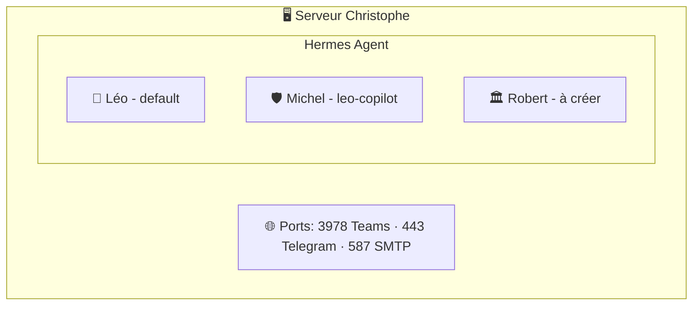
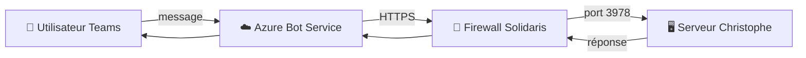
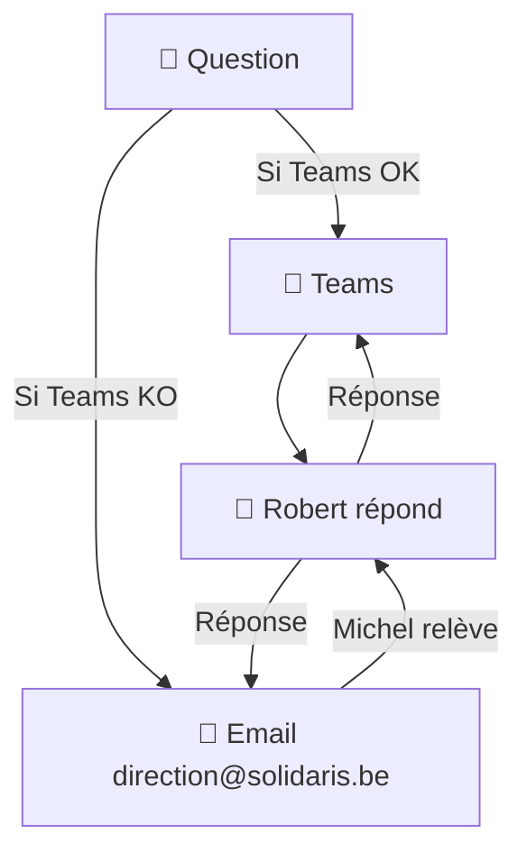
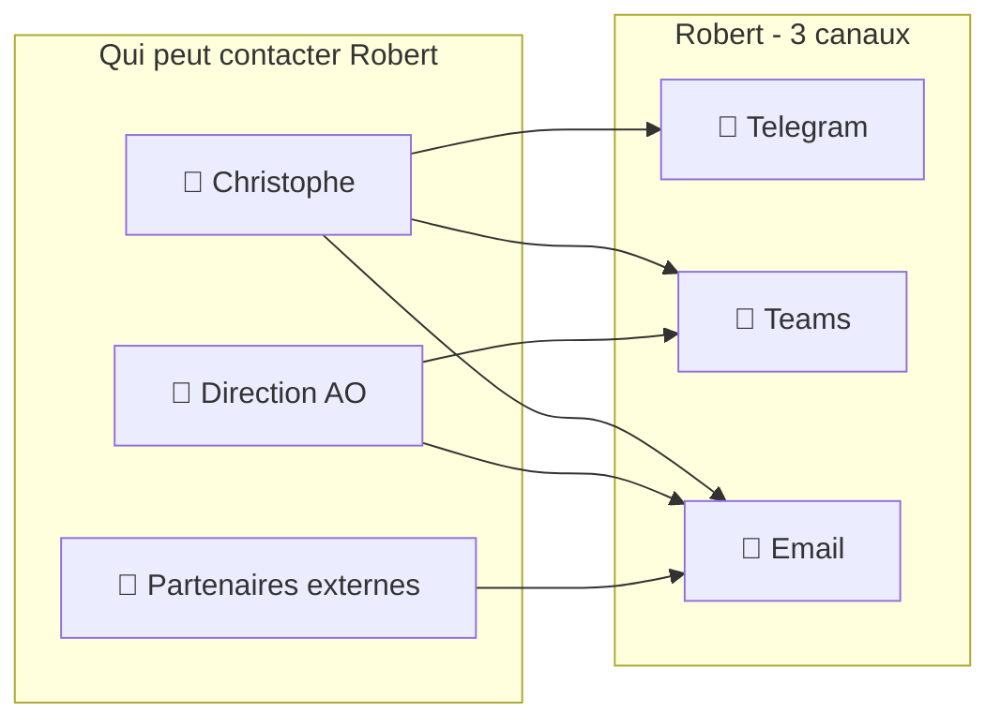
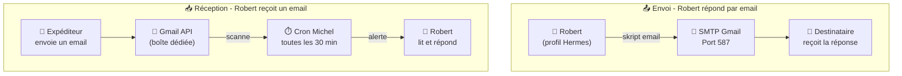
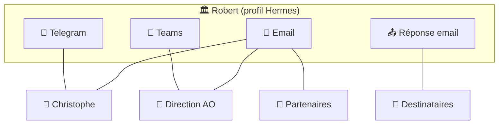

# 🏛️ Bureau Robert v2 — Évolution Stratégique IA  
## Analyse : Architecture multi-experts IT & Business pour l'intégration de l'IA

> **Document de réflexion — pas encore implémenté**
> **Date :** 14/07/2026 | **Version :** brouillon v2

---

## 1. Principe fondateur : Robert reste un orchestrateur

Robert ne change pas de nature. Il reste celui qui **orchestre** — il reçoit la demande, analyse le besoin, **dispatche** aux bons sous-agents, croise leurs analyses et produit la synthèse.

La différence : il dispose désormais de **deux pools d'experts** au lieu d'un.



---

## 2. Architecture des sous-agents

### 2.1 Pool IT — Renforcé (9 experts)

| # | Sous-agent | Rôle | Expertise clé |
|:-:|:-----------|:-----|:--------------|
| 1 | 🏛️ **Vision Stratégique** | Analyse du marché, tendances, positionnement | Veille technologique, benchmarks |
| 2 | 🏗️ **Architecture SI** | Intégration technique, patterns, dépendances | APIs, cloud, SI Solidaris |
| 3 | 🛡️ **Sécurité & RGPD** | Risques, conformité, AIPD | Données santé, NIS2, AI Act |
| 4 | 📋 **Projet & Programme** | Planning, coûts, TCO, jalons | Gestion de projet IT |
| 5 | 💰 **Budget & TCO** | Modélisation financière, ROI | Coûts IT, scénarios |
| 6 | 🔄 **Interopérabilité** | eHealth, BCSS, MyCareNet, connecteurs | Standards mutualistes belges |

**Nouveaux experts IT (pour répondre au Business IA) :**

| # | Sous-agent | Rôle | Expertise clé | Pourquoi |
|:-:|:-----------|:-----|:--------------|:---------|
| 7 | 🧪 **Data Engineering & IA Ops** | Pipelines de données, préparation datasets, feature engineering, MLOps | Python, bases vectorielles, embeddings, RAG | Le Business va demander des PoC IA → quelqu'un doit les construire |
| 8 | ☁️ **Infrastructure & Cloud IA** | GPU, vecteur DB, déploiement modèles, scaling | Azure OpenAI, AWS Bedrock, huggingface | Les modèles LLM ne tournent pas sur un serveur classique |
| 9 | 🔗 **API & Intégration IA** | Sécurisation des appels API IA, proxy, caching, rate limiting, monitoring tokens | OpenAI API, gestion coûts tokens, gateway IA | Connecter les modèles externes au SI Solidaris sans fuite de données |

### 2.2 Pool Business — Nouveaux (7 experts)

| # | Sous-agent | Rôle | Expertise clé | Quand l'activer |
|:-:|:-----------|:-----|:--------------|:----------------|
| 10 | ⚖️ **Expert Métier AO** | Connaissance des processus INAMI/BCSS, réglementation mutualiste Solidaris | Contexte métier AO, circuits de remboursement | Tout projet touchant au métier AO |
| 11 | 🏢 **Architecture des Processus Métier** | Cartographier les processus AO, identifier les goulots et points d'entrée IA | BPMN, flux métier, analyse de valeur | Dès qu'un processus métier est concerné |
| 12 | 🧪 **R&D & Innovation IA** | Veille cas d'usage mutualistes, POC, prototypage | IA générative, RPA, OCR, NLP, agents | Pour tout sujet IA concret |
| 13 | 🔄 **Gestion du Changement** | Impact organisationnel, adoption, accompagnement des équipes | Conduite du changement, formation | Projets impactant les agents AO |
| 14 | ⚖️ **Juridique & Conformité Métier** | AI Act, RGPD santé, droit mutualiste, responsabilité | Droit social, assurances, données santé | Obligatoire pour tout projet avec données réelles |
| 15 | 🎓 **Acculturation & Formation** | Création de supports, ateliers, vulgarisation IA | Pédagogie, cas d'usage concrets | En amont ou parallèle au déploiement |
| 16 | 📊 **Data & Analyse** | Données disponibles, qualité, préparation, indicateurs | Data governance, analytics, KPI | Pour tout projet data-driven |

---

## 3. Fonctionnement — Comment Robert orchestre

### 3.1 Exemple : Mission "Chatbot agent AO"



### 3.2 Modes de saisine selon le besoin

| Type de demande | Experts IT | Experts Business | Temps |
|:----------------|:----------:|:----------------:|:------|
| 🔍 **Quick scan** ("c'est faisable ?") | 1-3 | 1 | Chat |
| 📋 **Note d'analyse** | 3-4 | 2-3 | 1 session |
| 📑 **Dossier stratégique** | 5-8 | 4-6 | 2-3 sessions |
| 🚀 **Projet déploiement IA** | 7-10 | 5-6 | Plusieurs sessions |

### 3.3 Règles de dispatch

| Condition | Dispatch |
|:----------|:---------|
| Sujet avec **données de santé** | Toujours activer Sécurité (3) + Juridique (14) |
| Sujet avec **impact agents AO** | Toujours activer Changement (13) + Processus (11) + **Expert AO (10)** |
| Sujet **technologique pur** (cloud, infra) | Pool IT uniquement |
| Sujet **organisationnel** (transformation) | Pool Business uniquement |
| **Projet IA concret** (POC, déploiement) | IT IA (7,8,9) + Sécurité (3) + Expert AO (10) + R&D (12) |
| **Nouveau concept IA** | Toujours activer R&D (12) + Data Eng (7) + **Expert AO (10)** |

---

## 4. Profil dédié — Pourquoi ?

Avec 13 sous-agents à coordonner, Robert a besoin de :

- **Mémoire persistante** : se souvenir des analyses précédentes, capitaliser
- **Autonomie** : pouvoir travailler en background sans ma présence
- **Spécialisation** : son skill unique avec les règles de dispatch des 13 experts
- **Évolutivité** : ajouter/supprimer des sous-agents sans impacter Léo

→ Comme Sylvia (bavi-leo), Michel (leo-copilot), Émile (emile)

---

## 5. Roadmap suggérée

| Phase | Action |
|:------|:-------|
| **1. Cadrage** | Valider les besoins avec la Direction AO |
| **2. Conception** | Définir les 13 sous-agents + règles de dispatch |
| **3. Création profil** | `bureau-robert` — profil Hermes dédié |
| **4. Rédaction skill** | SKILL.md complet : rôle, sous-agents, dispatch, règles |
| **5. Tests** | 2-3 missions fictives pour valider le dispatch |
| **6. Mise en production** | Présentation à la Direction AO |

---

## 6. Canal de communication — Telegram vs Microsoft Teams

> **Décision :** Dans un premier temps, Robert utilisera **Telegram**. L'option Teams est documentée ci-dessous pour une évolution future.

### 6.1 Choix immédiat — Telegram

Robert aura un bot Telegram dédié pour les échanges avec Christophe et la Direction AO. C'est la solution la plus rapide à mettre en place.

### 6.2 Évolution possible — Microsoft Teams

Si la Direction AO souhaite intégrer Robert dans l'environnement professionnel Solidaris, Teams est une option.

#### 🤖 Le Bot Azure — À quoi il sert ?

C'est une **passerelle** entre Teams et Hermes :



Le bot Azure ne fait **rien** lui-même — il reçoit ton message dans Teams, le transmet à Hermes via un webhook, et renvoie la réponse dans Teams.

#### Ce que l'IT Solidaris doit fournir

| Élément | À demander à l'IT | Pourquoi |
|:--------|:-------------------|:---------|
| 🔑 **TEAMS_CLIENT_ID** | "Un App Registration dans Azure AD avec les droits Bot Framework" | Identifiant de l'application bot |
| 🔑 **TEAMS_CLIENT_SECRET** | "Le secret de l'App Registration" | Mot de passe pour que Hermes s'authentifie |
| 🔑 **TEAMS_TENANT_ID** | "L'ID du tenant Azure AD Solidaris" | Pour savoir que le bot appartient à Solidaris |
| 🌐 **Port webhook ouvert** | "Autoriser un webhook entrant HTTPS sur le port 3978" | Pour que Microsoft Bot Service puisse joindre Hermes |
| 👤 **TEAMS_ALLOWED_USERS** | Optionnel : "Limiter le bot à certains utilisateurs" | Pour que seules les personnes autorisées parlent à Robert |

#### Ce que l'IT Solidaris n'a PAS besoin de faire

- ❌ **Pas d'infrastructure Microsoft 365 supplémentaire**
- ❌ **Pas de licence spéciale** (Bot Framework inclus dans Azure)
- ❌ **Pas de modification des politiques Teams existantes**

#### Configuration Hermes (par Michel)

| Élément | Responsable |
|:--------|:------------|
| Créer l'App Azure (Bot Framework) | IT Solidaris |
| Fournir les 3 credentials | IT Solidaris → Christophe → Michel |
| Activer le plugin `teams-platform` | Michel |
| Déployer le webhook (port 3978) | Michel |
| Créer le profil Hermes `bureau-robert` | Michel |
| Créer un canal Teams dédié "Robert - Conseil IA" | Christophe |

> 💡 **Vision long terme :** Robert pourrait avoir **deux canaux** — Teams pour les sujets Solidaris/AO (pro), Telegram pour Christophe (perso). Le même profil Hermes peut supporter les deux transports.

---

## 7. Infrastructure réseau et hébergement

### 7.1 Où tourne Robert ?

Robert (comme Léo, Michel, etc.) est un **agent Hermes**. Il tourne sur la même machine que les autres — le serveur de Christophe.



### 7.2 Si Teams est activé — Flux réseau



### 7.3 Ce qu'il faut ouvrir côté réseau

| Flux | De | Vers | Port | Protocole | Qui ouvre |
|:-----|:---|:-----|:----:|:---------|:----------|
| 🔌 **Webhook Teams → Hermes** | Internet (Azure) | Serveur Christophe | **3978** | HTTPS | Christophe (ou Michel) |
| 📩 **Envoi email (mode dégradé)** | Serveur Christophe | SMTP Gmail | 587 | TLS | Déjà ouvert |
| 📱 **Telegram API** | Serveur Christophe | api.telegram.org | 443 | HTTPS | Déjà ouvert |

> ⚠️ Le port 3978 doit être accessible **depuis Internet** (Azure Bot Service ne peut pas joindre un réseau local). Il faut soit :
> - Ouvrir le port sur le routeur de Christophe
> - Utiliser un **tunnel** (Cloudflare Tunnel, ngrok, ou le tunnel déjà en place pour Hermes)
> - Configurer un **reverse proxy** si le serveur est derrière un NAT

### 7.4 Sécurité

| Point | Solution |
|:------|:---------|
| 🔒 **Authentification** | Le bot Azure valide l'identité via les credentials Teams |
| 🔑 **Validation du webhook** | Le secret Teams permet à Hermes de vérifier que la requête vient bien d'Azure |
| 👤 **Contrôle d'accès** | `TEAMS_ALLOWED_USERS` limite les utilisateurs autorisés |
| 📝 **Journalisation** | Hermes logue toutes les interactions |
| 🌐 **TLS** | Le flux est chiffré de bout en bout (HTTPS) |

---

## 8. Mode dégradé — Si Teams est indisponible

**Oui, il faut prévoir un mode dégradé.** Teams peut être indisponible pour plusieurs raisons :
- Panne Azure / Microsoft 365
- Problème réseau Solidaris
- Maintenance programmée
- Expiration des credentials

### Scénarios de dégradation

| Situation | Impact | Solution |
|:----------|:-------|:---------|
| 🔴 **Teams indisponible** (panne Azure) | Robert injoignable sur Teams | Basculer sur **Telegram** (si activé) ou **email** |
| 🟡 **Bot Teams non déployé** (phase initiale) | Robert accessible uniquement sur Telegram | C'est le plan actuel — Telegram d'abord |
| 🟢 **Credentials expirés** | Le bot Teams ne répond plus | Michel renouvelle les credentials Azure AD |

### Mode dégradé — Email

Si Teams est indisponible et que Robert n'a pas Telegram, **l'email permet de garder le contact** :



### Quand utiliser l'email

| Cas | Action |
|:----|:-------|
| ✅ **Phase de test** (avant déploiement Teams) | Utiliser Telegram uniquement |
| ⚠️ **Teams indisponible temporairement** | Informer par email, orienter vers Telegram |
| 🔴 **Teams indisponible longue durée** | Basculer sur email + Telegram jusqu'au rétablissement |
| ✅ **Demande simple** | Peut être traitée par email sans urgence |
| ❌ **Demande urgente** | Nécessite Telegram (temps réel, plus rapide) |

> 💡 **Recommandation :** Activer **Telegram + Teams** pour Robert. Si Teams tombe, Telegram prend le relais. L'email reste un filet de sécurité pour les communications écrites non urgentes.

---

## 9. Canal email — Architecture et mise en place

Au-delà du mode dégradé, l'email peut être un **troisième canal de communication à part entière** pour Robert.

### 9.1 Concept



Chaque canal a son usage :

| Canal | Usage principal | Qui parle |
|:------|:----------------|:----------|
| 💬 **Telegram** | Christophe ←→ Robert | Christophe uniquement |
| 💼 **Teams** | Direction AO ←→ Robert | Équipe Solidaris |
| 📧 **Email** | Tous ←→ Robert | Christophe, Direction, partenaires |

### 9.2 Architecture technique

L'email fonctionne en deux temps : **réception** et **envoi**.



### 9.3 Fonctionnement détaillé

#### 📥 Réception — Comment Robert reçoit un email

```
1. Un email arrive dans la boîte dédiée (ex: robert@... ou un libellé Gmail)
2. Le cron Michel (toutes les 30 min) détecte le nouvel email
3. Robert reçoit l'alerte et peut :
   a. Lire l'email via Gmail API
   b. Comprendre la demande
   c. Y répondre (par le même canal ou un autre)
```

#### 📤 Envoi — Comment Robert répond par email

```
1. Robert décide de répondre par email
2. Il exécute un script d'envoi (Gmail API ou SMTP)
3. L'email part avec une signature "Robert — Conseil Stratégique IA"
4. Le destinataire reçoit la réponse dans sa boîte
```

### 9.4 Configuration nécessaire

| Élément | Solution | Qui fait |
|:--------|:---------|:---------|
| 📧 **Boîte email dédiée** | Libellé Gmail dédié `Robert/` ou adresse dédiée | Christophe |
| 🔌 **Gmail API** | Déjà en place (Léo utilise la même) | ✅ Existant |
| ⏱️ **Cron surveillance** | Copie du check-gmail adaptée pour Robert | Michel |
| 📝 **Script d'envoi** | Script Python Gmail API (existe déjà pour Léo) | Michel |
| 👤 **Signature email** | "Robert — Conseil Stratégique IA / Solidaris" | Léo (contenu) |

### 9.5 Comparatif des 3 canaux

| Critère | 💬 Telegram | 💼 Teams | 📧 Email |
|:--------|:-----------|:---------|:---------|
| ⏱️ **Temps réel** | ✅ Oui | ✅ Oui | ❌ Non (30 min) |
| 🔒 **Sécurité pro** | ⚠️ Limité | ✅ Élevée | ✅ Chiffré |
| 📎 **Pièces jointes** | ✅ Limité | ✅ Oui | ✅ Oui |
| 👥 **Multi-utilisateurs** | ❌ Groupe limité | ✅ Canal Teams | ✅ N'importe qui |
| 🔌 **Nécessite un bot** | ✅ Bot Telegram | ✅ Azure Bot | ❌ Juste une boîte |
| 📋 **Traçabilité** | ❌ Faible | ✅ Moyenne | ✅ Excellente |
| 💰 **Coût** | ✅ Gratuit | ⚠️ Azure | ✅ Gratuit |

### 9.6 Recommandation — Architecture cible



> 💡 **À retenir :** L'email comme 3ème canal ne nécessite **presque aucune infrastructure supplémentaire** — la Gmail API est déjà en place, la signature à personnaliser, et le cron à dupliquer pour Robert. C'est Michel qui fait la copie du cron et du script d'envoi.

- Faut-il que Robert ait **un bot Telegram dédié** en plus de Teams, ou uniquement Teams ?
- La Direction AO est-elle prête à utiliser un canal Teams pour interagir avec un agent IA ?
- Faut-il prévoir un **mode dégradé** (email) si Teams est indisponible ?

---

*Document de réflexion — v2 — Architecture multi-experts IT & Business*
*Produit par Léo 🤖 — Juillet 2026 — Rien n'est implémenté*