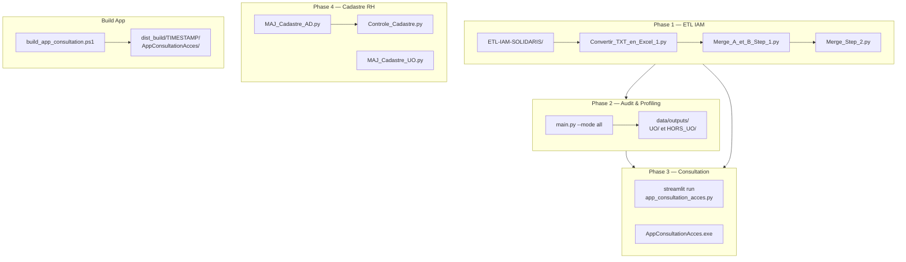
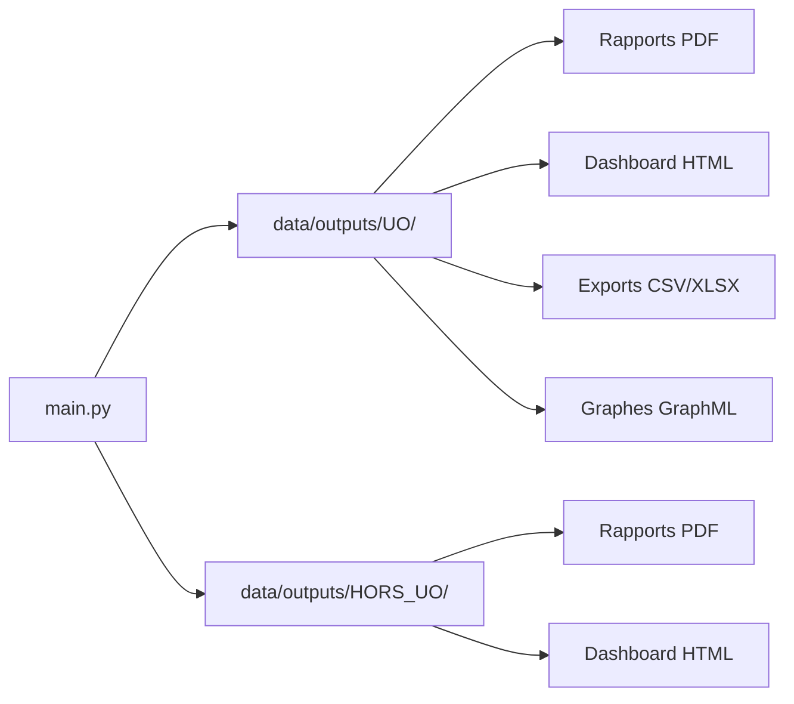
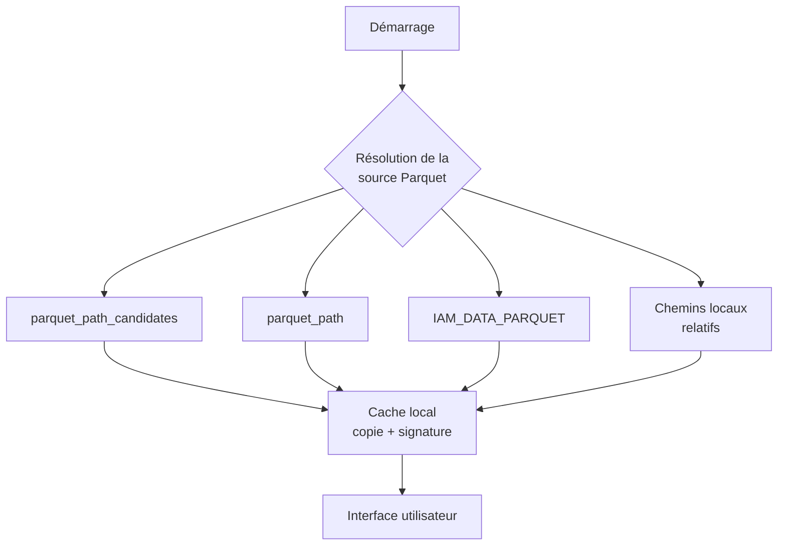
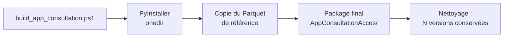

# 📖 Guide Utilisateur & Déploiement — AUDIT IAM ETL SOLIDARIS

> **Projet :** Audit IAM — Identity & Access Management Solidaris
> **Version document :** v1 — Refonte des documents GUIDE_UTILISATEUR.md + NOTICE_UTILISATEUR_APP_CONSULTATION.txt
> **Date :** 21/07/2026

---

## 1. Prérequis techniques

| Prérequis | Détail |
|:----------|:-------|
| 🐍 **Python** | 3.12.10 (environnement `.venv` dédié) |
| 📦 **Dépendances** | `pip install -r requirements.txt` (9 dépendances) |
| 💾 **Données** | Sources disponibles dans `data/raw/` et `data/etl/` |
| ☁️ **OneDrive** | Accès au partage contenant le fichier Parquet central |
| 🪟 **OS** | Windows (scripts .bat, .ps1, chemins OneDrive) |

---

## 2. Chaîne d'exécution complète



---

## 3. Phase 1 — ETL IAM

Pipeline de préparation des données d'accès, à exécuter dans l'ordre.

### Étape 1 — Conversion des accès bruts

```bash
python ETL-IAM-SOLIDARIS/Convertir_TXT_en_Excel_1.py
```

Convertit le fichier TXT RACF brut en fichier Excel structuré et exploitable.

### Étape 2 — Jointure AD / CICS

```bash
python ETL-IAM-SOLIDARIS/Merge_A_et_B_Step_1.py
```

Fusionne les données Active Directory et les accès CICS. Produit le fichier Parquet source.

### Étape 3 — Enrichissement final

```bash
python ETL-IAM-SOLIDARIS/Merge_Step_2.py
```

Ajoute les transactions, l'historisation et les enrichissements complémentaires.

### Résultats intermédiaires

| Fichier | Rôle |
|:--------|:-----|
| `data/etl/FULL_MERGE_B_PUIS_A_TRIE.parquet` | **Source unique** pour l'application de consultation |
| `data/processed/FULL_MERGE_STEP_2.xlsx` | **Source enrichie** pour l'audit et le profiling |

---

## 4. Phase 2 — Audit & Profiling

### Lancement complet

```bash
python main.py --mode all
```

Modes disponibles :

| Mode | Traitement | Sorties |
|:-----|:-----------|:--------|
| `all` | Audit complet + Profiling | Tous les livrables |
| `audit` | Statistiques, risques, dashboard | Rapport + Dashboard |
| `profiling` | Catalogue + Profils métier | Profils + Gap analysis |

### Sorties produites



| Type de livrable | Contenu |
|:-----------------|:--------|
| 📄 **Rapports PDF** | Synthèse par périmètre (UO / Hors UO) |
| 🌐 **Dashboard HTML** | Visualisations interactives |
| 📊 **Exports CSV / XLSX** | Données détaillées par analyse |
| 🔗 **Graphes GraphML** | Réseaux de co-occurrences (Gephi) |

---

## 5. Phase 3 — Consultation des accès

### 5.1 Application Streamlit

```bash
streamlit run app_consultation_acces.py
```

### 5.2 Package exécutable

```bash
# Double-clic sur l'exécutable
AppConsultationAcces.exe

# Ou via le script de lancement
start_app_consultation.bat
```

### 5.3 Fonctionnement



### 5.4 Interface utilisateur

| Élément | Description |
|:--------|:------------|
| 🔍 **Recherche** | Par identifiant utilisateur |
| 📋 **Filtres** | Attribut_UO, Secteur, Company, Fonction, Service, Actif?, Code transaction, texte libre |
| 📄 **Détail utilisateur** | Droits, transactions, historique |
| 📥 **Exports** | Consultation (CSV), détail utilisateur (CSV), synthèse organigramme (CSV) |

### 5.5 Cache local

| Mécanisme | Comportement |
|:-----------|:-------------|
| **Premier lancement** | Copie locale depuis la source distante |
| **Signature identique** | Réutilisation du cache existant |
| **Signature différente** | Rafraîchissement automatique |
| **Forçage** | Boutons latéraux : « Forcer le rafraîchissement » / « Remettre le cache à zéro » |

---

## 6. Phase 4 — Cadastre RH

### 6.1 Mise à jour AD → Cadastre

```bash
python ETL-CADASTRE/MAJ_Cadastre_AD.py
```

Synchronise l'Active Directory vers le fichier cadastre avec :
- Sauvegarde automatique avant écriture
- INSERT des nouveaux comptes
- UPDATE des comptes existants
- DELETE des comptes sortis

### 6.2 Contrôle post-mise à jour

```bash
python ETL-CADASTRE/Controle_Cadastre.py
```

Produit un rapport de contrôle : écarts détectés, volumes mis à jour, anomalies éventuelles.

### 6.3 Mise à jour ciblée UO

```bash
python ETL-CADASTRE/MAJ_Cadastre_UO.py
```

Mise à jour ciblée des étiquettes Attribut_UO sur le cadastre.

---

## 7. Build de l'application de consultation

### Commande

```powershell
.\build_app_consultation.ps1
```

### Ce que fait le script



### Sortie

```
dist_build/20260721_143000/
└── AppConsultationAcces/
    ├── AppConsultationAcces.exe
    ├── data/etl/FULL_MERGE_B_PUIS_A_TRIE.parquet
    └── ...
```

---

## 8. Tests

```bash
python -m pytest tests/ -v
```

**Couverture actuelle :** ~9 % (12 fichiers, ~480 lignes)

---

## 9. Configuration

### Fichier de configuration

`app_consultation_acces.config.json`

```json
{
  "parquet_path_candidates": [
    "\\\\SERVER\\IAM_SHARE\\AUDIT-IAM-ET-ETL-SOLIDARIS\\data\\etl\\FULL_MERGE_B_PUIS_A_TRIE.parquet",
    "%OneDriveCommercial%/AUDIT-IAM-ET-ETL-SOLIDARIS/data/etl/FULL_MERGE_B_PUIS_A_TRIE.parquet"
  ],
  "parquet_path": "%OneDriveCommercial%/AUDIT-IAM-ET-ETL-SOLIDARIS/data/etl/FULL_MERGE_B_PUIS_A_TRIE.parquet"
}
```

### Ordre de résolution de la source

```
1. parquet_path_candidates (fichier config.json)
2. parquet_path (fichier config.json)
3. IAM_DATA_PARQUET (variable d'environnement)
4. Chemins locaux relatifs autour de l'exécutable (fallback)
```

---

## 10. Dépannage

| Problème | Cause probable | Solution |
|:---------|:---------------|:---------|
| ❌ Source introuvable | Chemin config erroné, OneDrive non synchronisé | Vérifier `app_consultation_acces.config.json` et `IAM_DATA_PARQUET` |
| ❌ Source verrouillée | Fichier OneDrive/partage en cours d'utilisation | Vérifier synchronisation OneDrive, fermer autres processus |
| ❌ Cache incohérent | Signature modifiée mais cache obsolète | Utiliser « Remettre le cache à zéro » dans l'application |
| ❌ Lecture impossible | Droits d'accès insuffisants | Vérifier les permissions sur le dossier et le fichier |
| ❌ Dépendances manquantes | `.venv` non activé | Activer l'environnement : `venv\Scripts\activate` |
| ❌ Données ETL absentes | Pipeline non exécuté | Exécuter les 3 scripts ETL Phase 1 |

---

## 11. Parcours utilisateur type

```mermaid
flowchart TB
    START[Exécuter l'ETL IAM<br/>3 scripts] --> AUDIT[Lancer l'audit<br/>main.py --mode all]
    AUDIT --> CONSULT[Consulter les accès<br/>Streamlit / exe]
    AUDIT --> CADASTRE[Mettre à jour le cadastre<br/>MAJ_Cadastre_AD.py]
    CADASTRE --> CONTROLE[Contrôle post-MAJ<br/>Controle_Cadastre.py]
    CONSULT --> EXPORT[Exporter les résultats<br/>CSV depuis l'interface]
    AUDIT --> BUILD[Builder l'app (opt.)<br/>build_app_consultation.ps1]
```

---

*Document refactoré par Robert 🏛️ — Pool Développement (D2 Rédacteur Technique + D6 DevOps)*
*Sources : GUIDE_UTILISATEUR.md + NOTICE_UTILISATEUR_APP_CONSULTATION.txt du dépôt GitHub*
*Juillet 2026*
