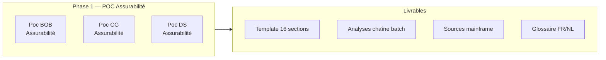
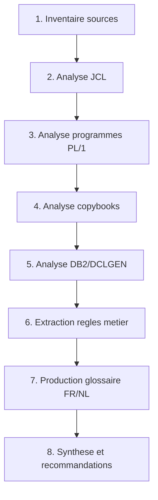

# 📋 Phase 1 — POC Assurabilité : Document Initial
## Cadrage et méthodologie d'analyse mainframe

> **Exercice :** Nouvel exercice — reconstruction structurée
> **Base :** Mémoire initiale (GDrive `01_Poc_Développement_AO/`)
> **Date :** 21/07/2026 | **Version :** v1

---

## 1. Périmètre de la Phase 1

### Objectif
Produire un **corpus documentaire structuré et réutilisable** pour l'analyse de chaînes batch mainframe z/OS : règles métier, glossaire bilingue, sources, validations.

### 3 sous-projets
| Projet | Périmètre | Statut initial |
|:-------|:-----------|:--------------:|
| **BOB** | Assurabilité — périmètre RA-001 à RA-003 | ✅ Documenté |
| **CG** | Assurabilité — périmètre complémentaire | ✅ Documenté |
| **DS** | Assurabilité — périmètre complémentaire | ✅ Documenté |

---

## 2. Méthodologie : Template 16 sections

Le cœur de la Phase 1 est un **template méthodologique en 16 sections** pour analyser systématiquement toute chaîne batch z/OS.

### Les 16 sections

| # | Section | Objet |
|:-:|:--------|:------|
| **1** | Contexte et objectifs | Périmètre, finalité métier |
| **2** | Inventaire des sources | Liste exhaustive fichiers (JCL, PL/1, copybooks, DCLGEN, DDL) |
| **3** | Architecture de la chaîne | Flux batch, dépendances, enchaînement |
| **4** | Analyse JCL | Steps, DD names, fichiers, procédures |
| **5** | Analyse des programmes | Logique métier, règles, traitements |
| **6** | Analyse des copybooks | Structures de données, inclusions |
| **7** | Analyse DB2 | Tables, DCLGEN, accès SQL |
| **8** | Règles métier | Extraction des règles codées dans PL/1 |
| **9** | Glossaire FR/NL | Terminologie bilingue |
| **10** | Flux de données | Entrées, sorties, dépendances |
| **11** | Gestion des erreurs | Codes retour, traitements d'erreur |
| **12** | Sécurité et conformité | Accès, profils, sensibilité |
| **13** | Analyse de qualité | Complexité, maintenabilité |
| **14** | Synthèse technique | Vue d'ensemble consolidée |
| **15** | Recommandations | Pistes d'évolution, modernisation |
| **16** | Annexes | Références, codes, listings |

---

## 3. Processus d'analyse type

---

## 4. État initial de la mémoire

Ce qui existe déjà dans `01_Poc_Développement_AO/` (GDrive) :

| Type | Contenu |
|:-----|:--------|
| 📁 **BOB** | Sources PL/1, JCL, copybooks, DCLGEN, documentation technique |
| 📁 **CG** | Sources + diagrammes + documentation |
| 📁 **DS** | Sources + documentation |
| 📄 **Template** | `Prompt_BOB_CG_DS.md` — template 16 sections |
| 📄 **Comparatifs** | BOB vs Copilot vs DeepSeek — analyses comparatives |
| 📄 **Analyses** | Synthèses section 16, ordinogrammes, qualité code |
| 📁 **Old versions** | Archives versions antérieures |

---

## 5. Ce qu'on va produire dans cet exercice

| Livrable | Description |
|:---------|:------------|
| 📄 **Analyse Phase 1 consolidée** | Synthèse des 3 POC (BOB, CG, DS) |
| 📄 **Template 16 sections amélioré** | Version ajustée de l'existant |
| 📄 **Glossaire FR/NL** | Terminologie bilingue consolidée |
| 📄 **Recommandations Phase 1 → Phase 2** | Transition vers l'industrialisation CI/CD |

---

*Document initial produit par Robert 🏛️ — Nouvel exercice*
*Basé sur la mémoire initiale GDrive `01_Poc_Développement_AO/`*
