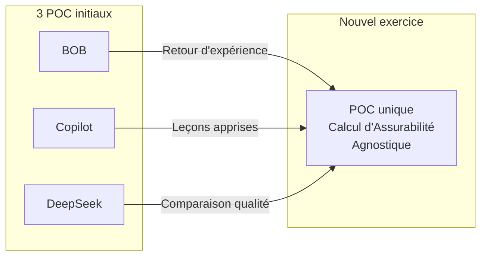
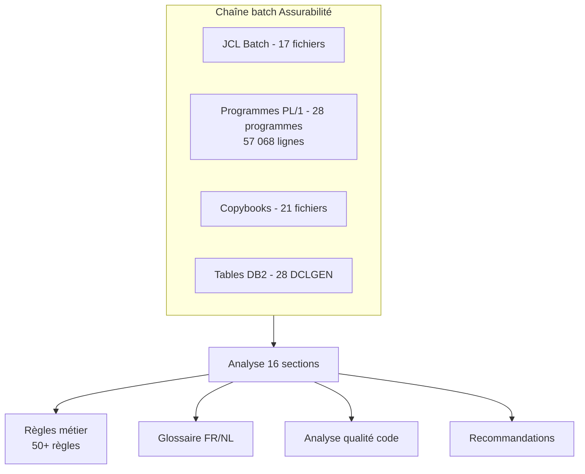
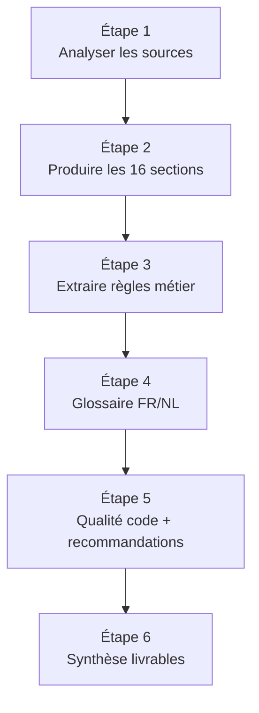

# 📋 Phase 1 — POC Calcul d'Assurabilité : Document Initial
## Cadrage et méthodologie d'analyse mainframe (agnostique outil/modèle)

> **Exercice :** Reconstruction — un seul POC, sans choix de solution ou modèle
> **Base :** Retour d'expérience des 3 POC initiaux (BOB, CG, DS)
> **Date :** 21/07/2026 | **Version :** v2

---

## 1. Pourquoi repartir sur un seul POC ?

Les 3 POC initiaux (BOB, Copilot, DeepSeek) ont analysé **le même code source PL/1** — la chaîne de calcul d'assurabilité Solidaris — mais avec des outils et modèles différents. Résultat : **3 livrables de qualité et contenu différents**.

**Leçon apprise :** plutôt que de comparer des outils, nous allons produire **un seul POC de référence**, agnostique de l'outil ou du modèle, centré sur la qualité du livrable.

---

## 2. Périmètre du POC unique

### Chaîne batch : Calcul d'Assurabilité Solidaris

### Métriques clés (issues du POC BOB)

| Métrique | Valeur |
|:---------|:------:|
| Fichiers sources inventoriés | 97 |
| JCL batch | 17 |
| Programmes PL/1 | 28 (57 068 lignes) |
| Copybooks | 21 |
| Tables DB2 (DCLGEN) | 28 |
| Règles métier documentées | 50+ |
| Codes retour documentés | 40+ |
| Livrables POC BOB | 30 (~250 pages) |

---

## 3. Méthodologie : Template 16 sections (agnostique)

Le template **ne dépend d'aucun outil ni modèle**. Il est réutilisable pour toute analyse de chaîne batch mainframe.

| # | Section | Objet |
|:-:|:--------|:------|
| **1** | Cartographie workspace | Inventaire exhaustif des sources |
| **2** | Identification JCL | Analyse des 17 JCL batch |
| **3** | Analyse programmes PL/1 | 28 programmes, logique métier |
| **4** | Analyse copybooks | 21 structures de données |
| **5** | Analyse DCLGEN DB2 | 28 tables, accès SQL |
| **6** | Analyse routines | Routines de calcul, validation, erreur |
| **7** | Copybooks complémentaire | Structures transverses |
| **8** | Analyse paramètres SYSIN | Paramètres d'entrée batch |
| **9** | Reconstitution DDL DB2 | Schéma des tables |
| **10** | Flux de données | Entrées/sorties/dépendances |
| **11** | Contrôles statuts rejets | Codes retour, gestion d'erreurs |
| **12** | Règles métier | Extraction des règles codées |
| **13** | Matrice IT/Business | Correspondance technique ↔ métier |
| **14** | Sources manquantes | Identification des lacunes |
| **15** | Synthèse finale | Vue consolidée + recommandations |
| **16** | Ordinogrammes | Diagrammes des flux et traitements |

---

## 4. Leçons des 3 POC initiaux

| Aspect | BOB | Copilot | DeepSeek |
|:-------|:---:|:-------:|:--------:|
| Qualité analyse | ✅ Élevée | ⚠️ Moyenne | ⚠️ Moyenne |
| Complétude 16 sections | ✅ Complète | ⚠️ Partielle | ⚠️ Partielle |
| Règles métier extraites | ✅ 50+ | ⚠️ ~30 | ⚠️ ~25 |
| Ordinogrammes | ✅ 20+ | ❌ Peu | ❌ Peu |
| Qualité code | ✅ Analyse détaillée | ⚠️ Superficielle | ⚠️ Superficielle |
| Volume livrables | ~250 pages | ~80 pages | ~60 pages |

**Ce qu'on garde :** la méthode 16 sections, le niveau de détail métier, la rigueur d'analyse
**Ce qu'on améliore :** agnostique outil/modèle, reproductibilité, qualité constante

---

## 5. Plan de travail proposé

---

## 6. Sources disponibles (mémoire initiale)

| Source | Emplacement |
|:-------|:------------|
| Code PL/1 BO | `01_Poc_Assurabilité_BOB/1_SOURCES_MAINFRAME/` |
| JCL batch | `BOB/1_SOURCES_MAINFRAME/JCL/` |
| Copybooks | `BOB/1_SOURCES_MAINFRAME/PL1/COPYBOOKS/` |
| DCLGEN DB2 | `BOB/1_SOURCES_MAINFRAME/DB2/DCLGEN/` |
| Documentation technique | `BOB/1_SOURCES_MAINFRAME/DOCUMENTATION_TECHNIQUE/` |
| Analyses BOB existantes | `BOB/SYNTHESE_SECTION_*.md` (référence) |

---

*Document initial v2 produit par Robert 🏛️ — Nouvel exercice*
*POC unique Calcul d'Assurabilité — Agnostique outil/modèle*
*Basé sur le retour d'expérience des 3 POC initiaux (BOB, Copilot, DeepSeek)*
