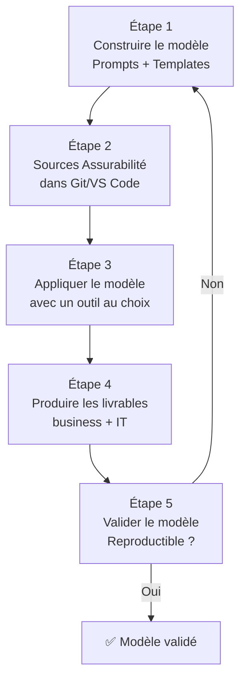

# 🧠 Phase 1 — Modèle d'Extraction : Document de Cadrage
## Construction d'un modèle réutilisable d'extraction de connaissance depuis les sources

> **Objectif :** Créer un **modèle d'extraction systématique** capable de transformer n'importe quel code source (PL/1, COBOL, Java, etc.) en documentation business (BPMN, règles) et IT (architecture, analyse fonctionnelle).
> **Outils cibles :** Claude Code, Codex, BOB, GitHub Copilot, Kilo Code, etc.
> **Source :** Application Assurabilité Solidaris (PL/1 batch z/OS)
> **Date :** 21/07/2026 | **Version :** v3

---

## 1. Concept

```mermaid
flowchart LR
    subgraph INPUT["Entrée (n'importe quelle app)"]
        SRC[Sources dans Git/VS Code]
    end

    subgraph MODEL["🧠 Modèle d'Extraction"]
        PROMPT[Prompts structurés]
        TEMPLATE[Templates de livrables]
        METHOD[Phases d'analyse]
        REGLES[Règles d'extraction]
    end

    subgraph TOOLS["Outils au choix"]
        CC[Claude Code]
        CX[Codex]
        BOB[BOB]
        COP[GitHub Copilot]
        KC[Kilo Code]
    end

    subgraph OUTPUT["Livrables (business + IT)"]
        BPMN[Processus BPMN]
        REGLES_M[Règles métier]
        ARCHI[Architecture applicative]
        FONC[Analyse fonctionnelle]
    end

    SRC --> MODEL
    MODEL --> TOOLS
    TOOLS --> OUTPUT
```



---

## 2. Ce qu'on va produire

### Lot 1 — Le Modèle (le livrable principal)

| Composant | Description | Format |
|:----------|:------------|:-------|
| **M1 - Prompt d'extraction** | Prompt générique pour analyser du code source et extraire la connaissance | `.md` réutilisable |
| **M2 - Templates de livrables** | Modèles pour chaque type de livrable (BPMN, architecture, règles, etc.) | `.md` avec Mermaid |
| **M3 - Guide d'utilisation** | Comment appliquer le modèle à une nouvelle application, outil par outil | `.md` |
| **M4 - Règles de qualité** | Critères de validation des livrables produits | `.md` |

### Lot 2 — L'application à Assurabilité (la démo)

| Livrable | Contenu |
|:---------|:--------|
| **A1 - BPMN processus métier** | Processus d'assurabilité modélisé |
| **A2 - Règles métier extraites** | 50+ règles classées et validées |
| **A3 - Glossaire FR/NL** | Terminologie bilingue |
| **A4 - Architecture applicative** | Schémas des composants et dépendances |
| **A5 - Analyse fonctionnelle** | Rôle de chaque programme, flux, traitements |
| **A6 - Schéma des données** | Tables DB2, copybooks, relations |
| **A7 - Matrice de dépendances** | Programme → copybook → DB2 → fichier |

---

## 3. Le Prompt d'extraction (M1) — version initiale

Basé sur le template 16 sections de l'existant, mais refondu pour être :
- ✅ **Agnostique** (outil, langage, application)
- ✅ **Reproductible** (même résultat quel que soit l'outil)
- ✅ **Complet** (business + IT)
- ✅ **Visuel** (BPMN, schémas Mermaid)

### Structure du prompt

```markdown
# MISSION : ANALYSE ET EXTRACTION DE CONNAISSANCE

## Contexte
- Application : [NOM]
- Langage : [PL/1, COBOL, Java, etc.]
- Sources : [chemin Git/VS Code]
- Objectif métier : [description]

## Phases d'extraction

### Phase A — Cartographie
1. Inventaire exhaustif des sources (fichiers, types, lignes)
2. Structure du workspace (arborescence)
3. Identification des points d'entrée (JCL, scripts, APIs)

### Phase B — Extraction knowledge
4. Extraction des flux (données, contrôle, appels)
5. Extraction des règles métier (conditions, calculs, validations)
6. Extraction du glossaire (termes techniques, abréviations)
7. Extraction des dépendances (programmes, données, fichiers)

### Phase C — Modélisation
8. Modélisation BPMN des processus métier
9. Schéma d'architecture applicative
10. Schéma des données (entités, relations)
11. Diagramme de flux batch/système

### Phase D — Synthèse
12. Analyse fonctionnelle par composant
13. Analyse qualité du code
14. Recommandations et plan d'action
```

---

## 4. Déroulé de l'exercice



---

## 5. Rétrospective des 3 POC — Leçons pour le modèle

| Leçon | Impact sur le modèle |
|:------|:---------------------|
| 🔴 Inventaire incomplet → reprise en cascade | **Règle impérative** : inventaire exhaustif AVANT toute analyse |
| 🟡 Qualité variable selon l'outil | **Prompts standardisés** pour garantir un niveau minimum |
| 🟢 BOB a produit les 16 sections complètes | **Structure en phases** éprouvée, à généraliser |
| 🟢 CG a produit des diagrammes Mermaid | **Templates Mermaid** obligatoires dans les livrables |
| 🔴 ASCII art illisible | **Mermaid uniquement** — pas de diagrammes texte |

---

*Document de cadrage v3 produit par Robert 🏛️*
*Construction d'un modèle d'extraction réutilisable — Application démo : Assurabilité*

> 🤖 Dernier audit : 24/07/2026 à 08:10 (UTC+2)
