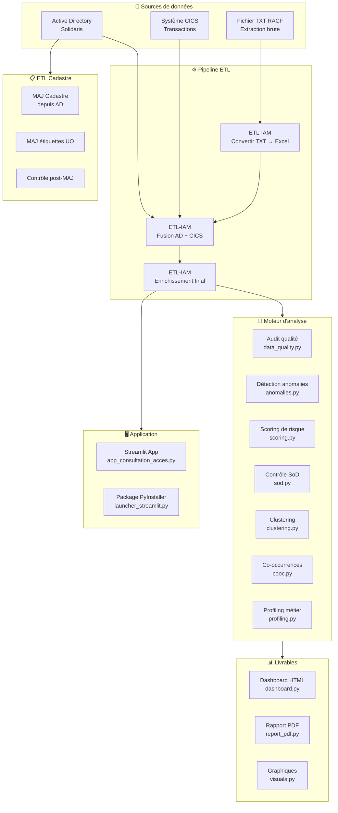
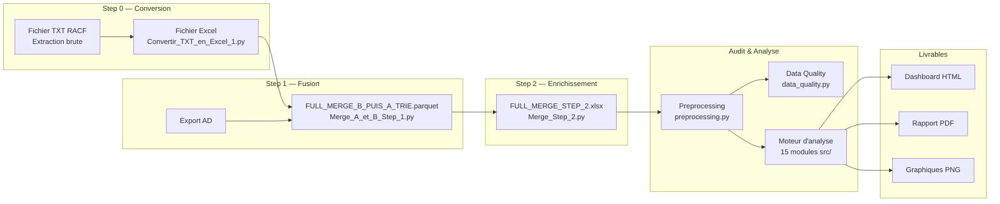
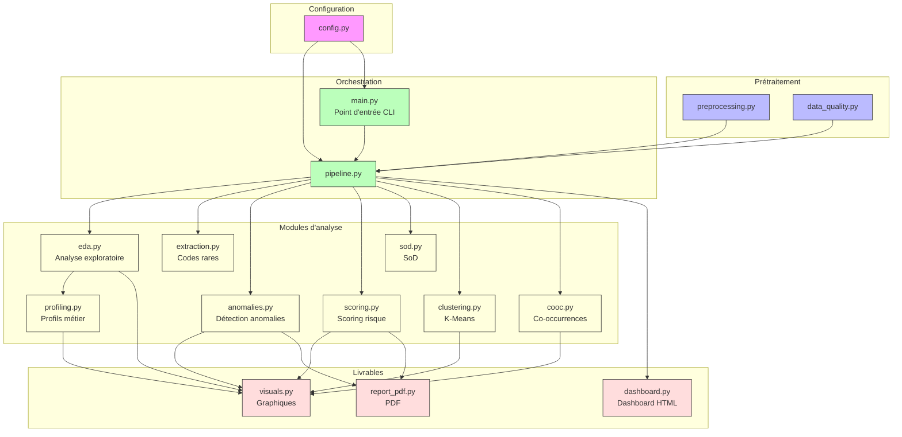
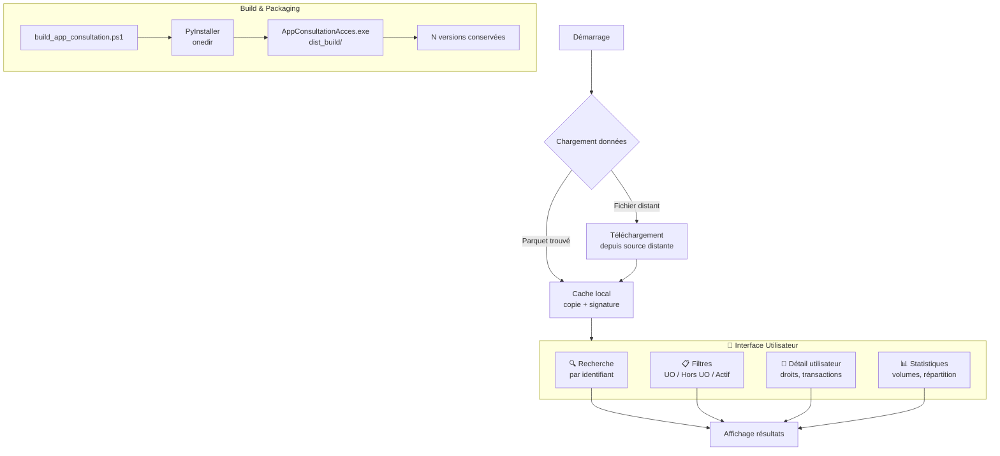
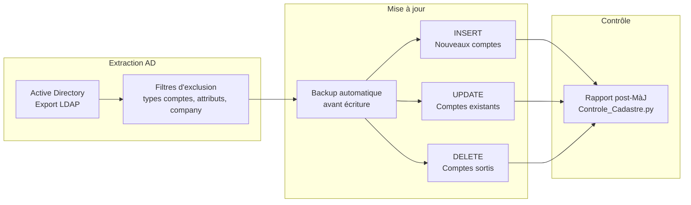
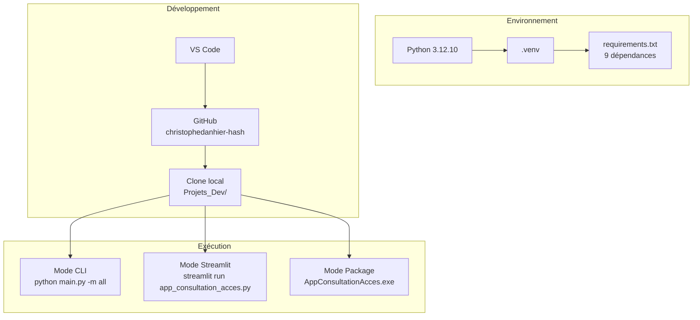

# 🏗️ Référentiel Architecture — AUDIT IAM ETL SOLIDARIS

> **Projet :** Audit IAM — Identity & Access Management Solidaris
> **Dépôt :** `christophedanhier-hash/AUDIT-IAM-ET-ETL-SOLIDARIS`
> **Stack :** Python 3.12 · Pandas · Streamlit · PyInstaller · ReportLab · NetworkX · Matplotlib
> **Date :** 21/07/2026 | **Version :** v1

---

## 1. Architecture globale du système

---

## 2. Chaîne de traitement des données

---

## 3. Architecture des modules `src/` (moteur d'analyse)

---

## 4. Flux d'exécution — Application Streamlit

---

## 5. Pipeline ETL Cadastre

---

## 6. Déploiement et environnement

---

## 7. Index des modules

| Module | Rôle | Lignes | Dépendances clés |
|:-------|:-----|:------:|:-----------------|
| `main.py` | Point d'entrée CLI | ~49 | src.* |
| `app_consultation_acces.py` | Application Streamlit | ~1 199 | pandas, streamlit |
| `src/config.py` | Configuration centralisée | ~100 | os, json |
| `src/preprocessing.py` | Chargement & nettoyage | ~300 | pandas, config |
| `src/data_quality.py` | Audit qualité données | ~200 | pandas, config |
| `src/pipeline.py` | Orchestrateur principal | ~135 | 15 modules src |
| `src/eda.py` | Analyse exploratoire | ~400 | pandas, matplotlib |
| `src/extraction.py` | Extraction codes rares | ~150 | pandas |
| `src/anomalies.py` | Détection d'anomalies | ~250 | pandas, numpy |
| `src/scoring.py` | Score de risque combiné | ~200 | pandas, numpy |
| `src/sod.py` | Séparation des tâches | ~300 | pandas, json |
| `src/clustering.py` | K-Means + optimisation | ~350 | sklearn, pandas |
| `src/cooc.py` | Co-occurrences + graphe | ~250 | pandas, networkx |
| `src/profiling.py` | Profils génériques + gap | ~400 | pandas, config |
| `src/visuals.py` | Visualisations | ~350 | matplotlib, seaborn |
| `src/report_pdf.py` | Génération PDF | ~300 | reportlab |
| `src/dashboard.py` | Dashboard HTML | ~250 | pandas |

---

## 8. Métriques clés

| Indicateur | Valeur |
|:-----------|:------:|
| Fichiers Python | 37 |
| Lignes de code | ~5 300 |
| Modules src/ | 15 |
| Scripts ETL | 6 (3 IAM + 3 Cadastre) |
| Tests | 12 fichiers (~480 lignes) |
| Couverture de tests | ~9 % |
| Dépendances | 9 (requirements.txt) |
| Données | ~428 Mo (gitignorées) |
| Commits Git | 5 |

---

*Document produit par Robert 🏛️ — Pool Développement (D1 Architecte + D2 Rédacteur Technique)*
*Projet : AUDIT-IAM-ET-ETL-SOLIDARIS — Juillet 2026*
