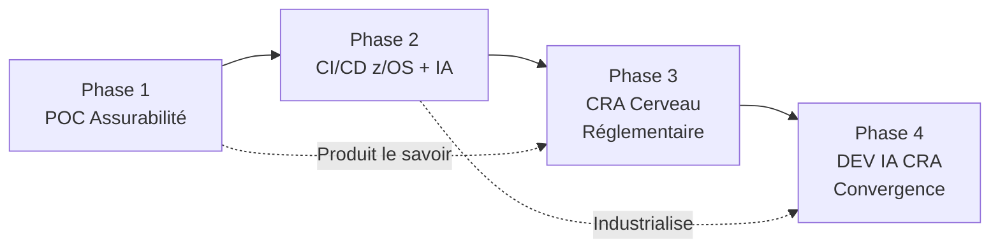
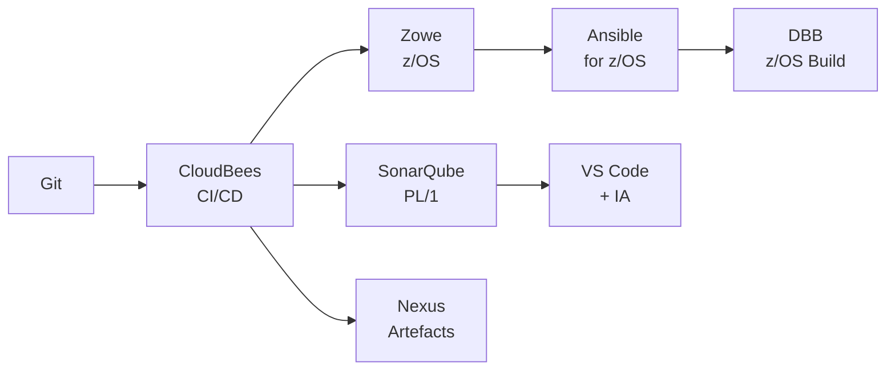
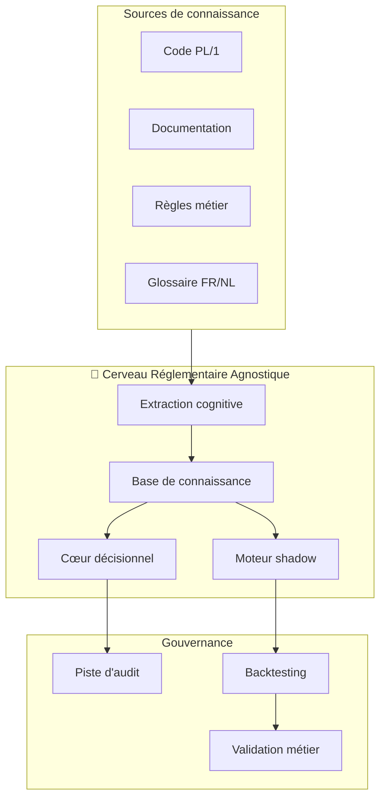
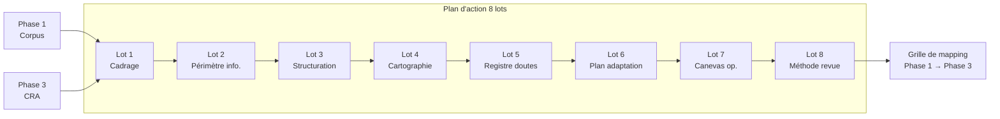

# 🏛️ Référentiel Stratégique — Développement & IA Solidaris
## Architecture cible en 4 phases : Assurabilité → CI/CD → CRA → Convergence

> **Périmètre :** Stratégique, Financier, Développement
> **Source :** OneDrive `02_Dev et IA` — Synthèse et documents d'analyse
> **Stockage détail :** GDrive `Développement & IA/`
> **Date :** 21/07/2026 | **Version :** v1

---

## 1. Vision d'ensemble — Les 4 phases

| Phase | Objet | Statut | Docs dans GDrive |
|:------|:------|:-----:|:-----------------|
| **1** | POC Assurabilité — Corpus documentaire, règles, glossaire FR/NL, validation | ✅ Acquis | `01_POC_Assurabilite/` |
| **2** | Socle CI/CD z/OS + IA — Git, CloudBees, Zowe, Ansible, DBB, SonarQube | ✅ Architecture validée | `02_Mainframe_CICD/` |
| **3** | CRA — Cerveau Réglementaire Agnostique : savoir gouverné, simulation, shadow | ✅ Vision consolidée | `03_CRA_Cerveau_Reglementaire/` |
| **4** | DEV IA CRA — Convergence Phase 1 → Phase 3 sur socle Phase 2 | ✅ Plan d'action 8 lots | `04_DEV_IA_CRA/` |

---

## 2. Phase 1 — POC Assurabilité

### Objectif
Produire un **corpus documentaire structuré** : règles métier, glossaire FR/NL, sources mainframe, validations.

### Périmètre
- Périmètre Assurabilité (RA-001 à RA-003)
- 1 chaîne batch PL/1
- 1-3 programmes, copybooks, 1 JCL, 1-2 tables DB2

### Livrables
- Règles métier documentées et validées
- Glossaire bilingue FR/NL
- Sources mainframe (PL/1, JCL, DCLGEN, DDL)
- Analyse qualité du code

### État
✅ **Acquis méthodologique solide** — le corpus constitue la base de connaissance pour les phases suivantes.

---

## 3. Phase 2 — Socle CI/CD z/OS + IA

### Objectif
**Industrialiser la maintenance du savoir** : intégrer le mainframe dans la chaîne DevSecOps moderne.

### Éléments clés
| Technologie | Rôle |
|:------------|:-----|
| **Git** | Gestion de version du code source PL/1, JCL, copybooks |
| **CloudBees** | CI/CD pipeline automatisé |
| **Zowe** | Interface moderne avec le mainframe z/OS |
| **Ansible for z/OS** | Automatisation des déploiements |
| **DBB** (z/OS Build) | Build et test automatisés du code PL/1 |
| **SonarQube + plugin PL/1** | Analyse statique de code |
| **Nexus** | Gestion des artefacts et dépendances |
| **VS Code + IA** | Environnement de développement assisté |

### État
✅ **Architecture de référence validée** — repose sur les investissements existants (Git, CloudBees, SonarQube).

---

## 4. Phase 3 — CRA (Cerveau Réglementaire Agnostique)

### Objectif
**Transformer le savoir en actif gouverné** : explication, simulation, shadow, audit.

### Architecture de la connaissance
| Composant | Description |
|:----------|:------------|
| **Extraction cognitive** | Transformation du code PL/1 et de la documentation en règles structurées |
| **Base de connaissance** | Stockage gouverné des règles, glossaire, décisions |
| **Cœur décisionnel** | Moteur d'exécution des règles (indépendant du mainframe) |
| **Shadow / Backtesting** | Simulation des décisions vs mainframe réel pour validation |
| **Piste d'audit** | Traçabilité complète de chaque décision |

### État
✅ **Vision consolidée** — découplage agnostique du mainframe validé, architecture de connaissance définie.

---

## 5. Phase 4 — DEV IA CRA (Convergence)

### Objectif
**Opérationnaliser la convergence** Phase 1 → Phase 3 sur le socle Phase 2.

### Les 8 lots du plan d'action

| Lot | Objet | Livrable |
|:----|:------|:---------|
| **1** | Cadrage initial phase 4 | Périmètre, objectifs, planning |
| **2** | Périmètre informationnel | Identification des sources de données |
| **3** | Structuration conceptuelle | Modèle de connaissance cible |
| **4** | Cartographie des flux documentaires | Flux, dépendances, cycles |
| **5** | Registre des doutes et alignements | Écarts Phase 1 → Phase 3 |
| **6** | Plan d'adaptation documentaire | Correction des écarts |
| **7** | Canevas opérationnel et annexes | Templates, guides |
| **8** | Méthode de revue documentaire | Processus de validation continue |

### État
✅ **Plan d'action en 8 lots** — grille de mapping Phase 1 → Phase 3 produite, priorités de correction identifiées.

---

## 6. Business Case & Budget

| Métrique | Valeur |
|:---------|:-------|
| **Investissement Phase 1** | Acquis (POC réalisé) |
| **Coût socle Phase 2** | Réutilisation des investissements existants (Git, CloudBees, Nexus, SonarQube) |
| **ROI attendu CRA** | Documenté dans `BUSINESS_CASE_CRA.md` → GDrive `03_CRA/` |
| **Modèle économique** | Build vs Buy — découplage agnostique pour éviter le vendor lock-in |

---

## 7. Principes directeurs

| Principe | Description |
|:---------|:------------|
| 🧭 **You pilot, not the AI** | L'IA assiste, documente, explique. Elle ne valide pas, ne décide pas, ne déploie pas. |
| 🔄 **Réutilisation** | S'appuyer sur les investissements existants (Git, CloudBees, SonarQube, IAM) |
| 🏗️ **Découplage agnostique** | Le CRA est indépendant du mainframe — pas de vendor lock-in |
| 🔍 **Traçabilité** | Chaque décision doit être auditée et backtestée |
| 🗣️ **Bilinguisme** | FR/NL — les règles et glossaire sont bilingues |

---

## 8. Accès rapide

| Ressource | Lien |
|:----------|:-----|
| 📦 **Archive ZIP** | Transférée manuellement par Christophe |
| 📄 **Synthèse complète** | Voir référentiel BAVI |

---

*Document référentiel produit par Robert 🏛️ — Juillet 2026*
*Sources : OneDrive 02_Dev et IA — Synthèse et documents d'analyse*
*Stockage détail : GDrive `Développement & IA/`*
