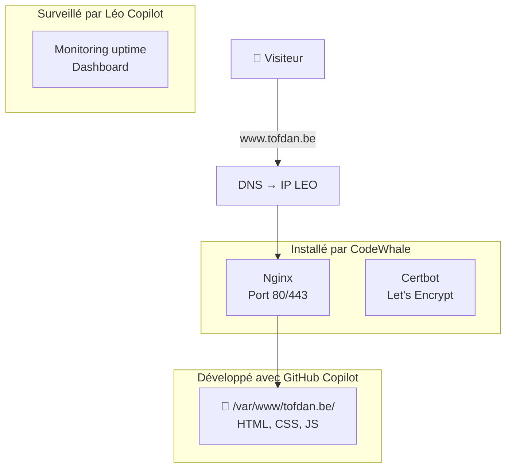

# 🌐 Stratégie d'hébergement — tofdan.be

> **Objectif :** Migrer le site www.tofdan.be de Google Sites vers le serveur LEO
> **Orchestrateur :** 🤖 LEO | **Code :** 💻 GitHub Copilot | **Infra hôte :** 🐋 CodeWhale | **Infra conteneur :** 🔧 Léo Copilot

---

## 1. 🎯 Objectifs

| Objectif | Priorité |
|:---------|:--------:|
| 🏠 **Héberger** tofdan.be sur le serveur LEO | 🔴 Haute |
| 🔒 **HTTPS** (Let's Encrypt) | 🔴 Haute |
| ⚡ **Rapide** (serveur statique → Nginx/Caddy) | 🟡 Moyenne |
| 📊 **Monitoring** (stats visites, uptime) | 🟢 Souhaitable |
| ♻️ **Facile à mettre à jour** | 🟡 Moyenne |

---

## 2. 🏗️ Architecture proposée

```
Internet
  ↓ www.tofdan.be
🌐 Cloudflare (DNS, cache, DDOS protection) — optionnel
  ↓ IP du serveur LEO
🏠 Serveur LEO (hôte)
  └── 🐋 CodeWhale installe :
      ├── Nginx ou Caddy (serveur web)
      ├── Certbot (HTTPS Let's Encrypt)
      └── Reverse proxy (si plusieurs services)
          └── 📁 /var/www/tofdan.be/ (fichiers du site)
```

### Simple, sans Docker (recommandé pour un site statique)



---

## 3. 📋 Plan d'action

### Phase 1 — Installation serveur (🐋 CodeWhale)

| # | Tâche | Responsable |
|:-:|:------|:-----------:|
| 1 | Installer Nginx ou Caddy sur l'hôte | 🐋 CodeWhale |
| 2 | Configurer le virtual host pour tofdan.be | 🐋 CodeWhale |
| 3 | Installer Certbot + générer certificat HTTPS | 🐋 CodeWhale |
| 4 | Configurer le pare-feu (ports 80, 443) | 🐋 CodeWhale |
| 5 | Vérifier que le site répond en HTTP + HTTPS | 🐋 + 🔧 Léo Copilot |

**Estimation :** ~30 min

### Phase 2 — Développement du site (💻 GitHub Copilot)

| # | Tâche | Responsable |
|:-:|:------|:-----------:|
| 1 | Créer la structure du site (HTML/CSS/JS) | 💻 GitHub Copilot (VS Code) |
| 2 | Développer les pages (accueil, projets, contact) | 💻 GitHub Copilot |
| 3 | Tester en local | 👤 Christophe |
| 4 | Copier les fichiers vers /var/www/tofdan.be/ | 💻 GitHub Copilot + 🐋 si besoin |

**Estimation :** 1-2 sessions

### Phase 3 — Monitoring (🔧 Léo Copilot)

| # | Tâche | Responsable |
|:-:|:------|:-----------:|
| 1 | Ajouter un cron de check uptime (toutes les 5 min) | 🔧 Léo Copilot |
| 2 | Dashboard stats visites (optionnel : GoAccess ou simple compteur) | 🔧 Léo Copilot |
| 3 | Alerte si site down | 🔧 Léo Copilot |

---

## 💻 Contenu du site (structure actuelle)

Basé sur le site existant www.tofdan.be (hébergé sur Google Sites) :

**Thème :** Astrophotographie — par Tof & Syl 🪐🔭

| Page | Contenu |
|:-----|:--------|
| 🏠 **Accueil** | Présentation du site, photo Lune/Soleil, message de bienvenue |
| 🔭 **Astro** | Section principale astrophotographie |
| 📱 **App Astro** | Application liée à l'astro |
| 📰 **News** | Actualités |
| 🔧 **Mon matériel** | Équipement utilisé (télescopes, caméras) |
| 🖼️ **Album** | Galerie photos |
| 🌤️ **Météo - Astro** | Conditions météo pour l'observation |
| 📚 **Biblio** | Bibliographie, ressources |
| 💬 **Chat & Message** | Contact, formulaire |

**Design actuel :** Google Sites (limité) — objectif : le refaire en HTML/CSS libre et responsive.

---

## 5. 🚫 Ce qui reste dans Google Sites (le temps de la migration)

Pendant la phase de test, tu peux garder l'ancien site Google Sites actif et pointer un sous-domaine (ex: `old.tofdan.be`) ou simplement couper quand le nouveau est prêt.

---

## 6. 📊 Budget

| Poste | Coût |
|:------|:----:|
| Hébergement LEO (déjà existant) | **0 €** |
| Nom de domaine tofdan.be (déjà acheté) | **0 €** |
| Certificat HTTPS Let's Encrypt | **0 €** |
| Nginx/Caddy (open source) | **0 €** |
| CodeWhale (interventions ponctuelles) | Forfait |
| **Total** | **~0 €** + CodeWhale |

---

## 7. 🎯 Prompts par acteur

### 🧠 LEO (moi) — Orchestrateur

**Contexte :** Je suis LEO, l'assistant central de Christophe. Je coordonne le projet tofdan.be, je rédige la stratégie, je dispatch les tâches et je documente.

**Étapes :**
1. Analyser le besoin avec Christophe → rédiger la stratégie
2. Valider le plan avec Christophe
3. Dispatch les tâches vers CodeWhale, GitHub Copilot, Léo Copilot
4. Documenter l'avancement dans le wiki BAVI
5. Proposer les évolutions (blog, sections, design)

---

### 🐋 CodeWhale — Installation serveur hôte (hors conteneur)

**Contexte :** Le site www.tofdan.be doit migrer de Google Sites vers un auto-hébergement sur le serveur LEO (Linux, Ubuntu, IP 100.92.102.28 via Tailscale). Le serveur fait déjà tourner Hermes Agent dans un conteneur Docker. L'installation doit se faire sur l'HÔTE, pas dans le conteneur.

**Tâches :**

| # | Tâche | Détail |
|:-:|:------|:-------|
| 1 | Installer Nginx | `sudo apt install nginx` — serveur web |
| 2 | Créer le répertoire du site | `/var/www/tofdan.be/` — droits www-data |
| 3 | Configurer le virtual host | Fichier `/etc/nginx/sites-available/tofdan.be` avec : racine, index.html, logs |
| 4 | Activer le site | `ln -s` vers `sites-enabled/`, `nginx -t`, `systemctl reload nginx` |
| 5 | Installer Certbot (Let's Encrypt) | `sudo apt install certbot python3-certbot-nginx` |
| 6 | Générer certificat HTTPS | `sudo certbot --nginx -d www.tofdan.be -d tofdan.be` |
| 7 | Configurer le pare-feu | Ouvrir ports 80 (HTTP) et 443 (HTTPS) |
| 8 | Vérifier | `curl -I https://www.tofdan.be` → 200 OK |

**Fichiers à créer côté CodeWhale :**
```
/etc/nginx/sites-available/tofdan.be   ← config virtual host
/var/www/tofdan.be/                     ← dossier du site
/var/www/tofdan.be/index.html          ← page de test "Hello tofdan.be"
```

**Résultat attendu :** https://www.tofdan.be répond avec une page de test.

---

### 💻 GitHub Copilot (VS Code) — Développement du site

**Contexte :** Christophe a un abonnement GitHub Copilot avec accès aux modèles Sonnet 4.6 et Opus 4.x. Le développement se fait dans VS Code sur le serveur (Code-Server, port 8081) ou en local.

**Tâches :**

| # | Tâche | Modèle recommandé |
|:-:|:------|:-----------------:|
| 1 | Créer la structure du site | Opus 4.x — analyse du besoin |
| 2 | Développer la page d'accueil (HTML+CSS) | Sonnet 4.6 — rapide et créatif |
| 3 | Développer les pages secondaires | Sonnet 4.6 |
| 4 | Ajouter le design responsive (mobile) | Sonnet 4.6 |
| 5 | Tester le rendu local | Manuel — Christophe |
| 6 | Copier les fichiers vers `/var/www/tofdan.be/` | Manuel ou script |
| 7 | Versionner le code sur GitHub | `git init` + push vers repo Christophe |

**Structure attendue du site (reproduction du site actuel) :**
```
/var/www/tofdan.be/
├── index.html              ← Accueil (astro + présentation)
├── astro.html              ← Section astrophotographie
├── app-astro.html          ← Application Astro
├── news.html               ← Actualités
├── materiel.html           ← Mon matériel (télescopes, caméras)
├── album.html              ← Galerie photos
├── meteo-astro.html        ← Météo pour observation
├── biblio.html             ← Bibliographie
├── chat.html               ← Contact / Message
├── css/
│   └── style.css           ← Design responsive (refonte Google Sites → libre)
├── js/
│   └── main.js             ← Interactivité
└── images/                 ← Photos astro (Lune, Soleil, ciel)
```

**Résultat attendu :** Site complet, responsive, design propre.

---

### 🔧 Léo Copilot (Michel — Infra_Hermes) — Monitoring

**Contexte :** Je suis Léo Copilot, le bot infrastructure. Je travaille DANS le conteneur Hermes. Je ne peux pas installer Nginx sur l'hôte.

**Tâches :**

| # | Tâche | Détail |
|:-:|:------|:-------|
| 1 | Créer un cron de check uptime | Toutes les 5 min : `curl -s -o /dev/null -w "%{http_code}" https://www.tofdan.be` → si ≠ 200, alerte |
| 2 | Ajouter un dashboard | Dans le dashboard Hermes (port 9119) : widget tofdan.be status (vert/rouge) |
| 3 | Configurer une alerte | Si site down 3 vérifications consécutives → notifier Christophe |

**Contrainte :** Léo Copilot ne travaille que dans le conteneur Hermes. Toute action hors conteneur doit être redirigée vers CodeWhale.

---

## 8. ✅ Avantages vs Google Sites

| Critère | Google Sites | LEO Server |
|:--------|:------------:|:-----------:|
| Contrôle total | ❌ | ✅ |
| Design libre | ❌ (limité) | ✅ (HTML/CSS libre) |
| HTTPS | ✅ | ✅ (Let's Encrypt) |
| Coût | Inclus Google | **0 €** |
| Performance | Moyen | ⚡ Très rapide (fichiers statiques) |
| Maintenance | Google s'en charge | Toi + Léo Copilot |

---

## Versions

| Version | Date | Auteur | Description |
|:--------|:-----|:-------|:------------|
| v1 | 27/06/2026 | LEO | Proposition stratégique hébergement tofdan.be |

---

*Analyse produite par 🤖 LEO — BAVI LEO*
