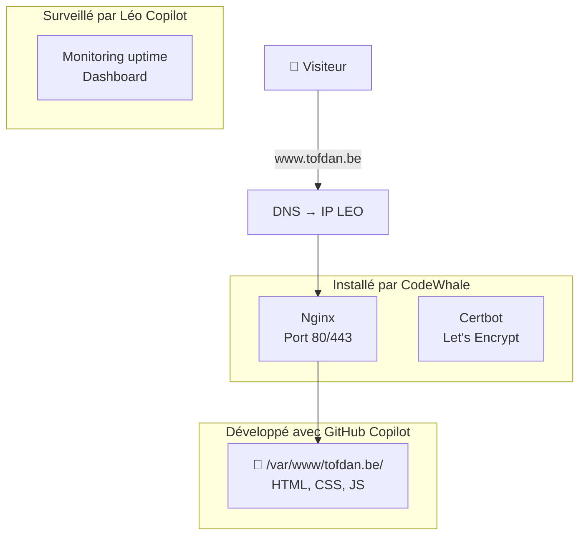

# 🌐 Stratégie d'hébergement — tofdan.be

> **Objectif :** Migrer le site www.tofdan.be de Google Sites vers le serveur LEO
> **Orchestrateur :** 🤖 LEO | **Code :** 💻 GitHub Copilot | **Infra hôte :** 🐋 CodeWhale | **Infra conteneur :** 🔧 Léo Copilot

---

## 1. 🎯 Objectifs

| Objectif | Priorité |
|:---------|:--------:|
| 🏠 **Héberger** tofdan.be sur le serveur LEO | 🔴 Haute |
| 🔒 **HTTPS** (Let's Encrypt) | 🔴 Haute |
| ⚡ **Rapide** (serveur statique → Nginx/Caddy) | 🟡 Moyenne |
| 📊 **Monitoring** (stats visites, uptime) | 🟢 Souhaitable |
| ♻️ **Facile à mettre à jour** | 🟡 Moyenne |

---

## 2. 🏗️ Architecture proposée

```
Internet
  ↓ www.tofdan.be
🌐 Cloudflare (DNS, cache, DDOS protection) — optionnel
  ↓ IP du serveur LEO
🏠 Serveur LEO (hôte)
  └── 🐋 CodeWhale installe :
      ├── Nginx ou Caddy (serveur web)
      ├── Certbot (HTTPS Let's Encrypt)
      └── Reverse proxy (si plusieurs services)
          └── 📁 /var/www/tofdan.be/ (fichiers du site)
```

### Simple, sans Docker (recommandé pour un site statique)



---

## 3. 📋 Plan d'action

### Phase 1 — Installation serveur (🐋 CodeWhale)

| # | Tâche | Responsable |
|:-:|:------|:-----------:|
| 1 | Installer Nginx ou Caddy sur l'hôte | 🐋 CodeWhale |
| 2 | Configurer le virtual host pour tofdan.be | 🐋 CodeWhale |
| 3 | Installer Certbot + générer certificat HTTPS | 🐋 CodeWhale |
| 4 | Configurer le pare-feu (ports 80, 443) | 🐋 CodeWhale |
| 5 | Vérifier que le site répond en HTTP + HTTPS | 🐋 + 🔧 Léo Copilot |

**Estimation :** ~30 min

### Phase 2 — Développement du site (💻 GitHub Copilot)

| # | Tâche | Responsable |
|:-:|:------|:-----------:|
| 1 | Créer la structure du site (HTML/CSS/JS) | 💻 GitHub Copilot (VS Code) |
| 2 | Développer les pages (accueil, projets, contact) | 💻 GitHub Copilot |
| 3 | Tester en local | 👤 Christophe |
| 4 | Copier les fichiers vers /var/www/tofdan.be/ | 💻 GitHub Copilot + 🐋 si besoin |

**Estimation :** 1-2 sessions

### Phase 3 — Monitoring (🔧 Léo Copilot)

| # | Tâche | Responsable |
|:-:|:------|:-----------:|
| 1 | Ajouter un cron de check uptime (toutes les 5 min) | 🔧 Léo Copilot |
| 2 | Dashboard stats visites (optionnel : GoAccess ou simple compteur) | 🔧 Léo Copilot |
| 3 | Alerte si site down | 🔧 Léo Copilot |

---

## 4. 💻 Contenu du site (proposition)

| Page | Contenu | Priorité |
|:-----|:--------|:--------:|
| 🏠 **Accueil** | Présentation, photo, slogan | 🔴 |
| 👤 **À propos** | Parcours, expertise | 🟡 |
| 📂 **Projets** | BAVI LEO, T600, voyages | 🟡 |
| 📧 **Contact** | Formulaire ou email direct | 🟢 |
| 📝 **Blog** (optionnel) | Articles, veille IA | 🟢 |

---

## 5. 🚫 Ce qui reste dans Google Sites (le temps de la migration)

Pendant la phase de test, tu peux garder l'ancien site Google Sites actif et pointer un sous-domaine (ex: `old.tofdan.be`) ou simplement couper quand le nouveau est prêt.

---

## 6. 📊 Budget

| Poste | Coût |
|:------|:----:|
| Hébergement LEO (déjà existant) | **0 €** |
| Nom de domaine tofdan.be (déjà acheté) | **0 €** |
| Certificat HTTPS Let's Encrypt | **0 €** |
| Nginx/Caddy (open source) | **0 €** |
| CodeWhale (interventions ponctuelles) | Forfait |
| **Total** | **~0 €** + CodeWhale |

---

## 7. ✅ Avantages vs Google Sites

| Critère | Google Sites | LEO Server |
|:--------|:------------:|:-----------:|
| Contrôle total | ❌ | ✅ |
| Design libre | ❌ (limité) | ✅ (HTML/CSS libre) |
| HTTPS | ✅ | ✅ (Let's Encrypt) |
| Coût | Inclus Google | **0 €** |
| Performance | Moyen | ⚡ Très rapide (fichiers statiques) |
| Maintenance | Google s'en charge | Toi + Léo Copilot |

---

## Versions

| Version | Date | Auteur | Description |
|:--------|:-----|:-------|:------------|
| v1 | 27/06/2026 | LEO | Proposition stratégique hébergement tofdan.be |

---

*Analyse produite par 🤖 LEO — BAVI LEO*
