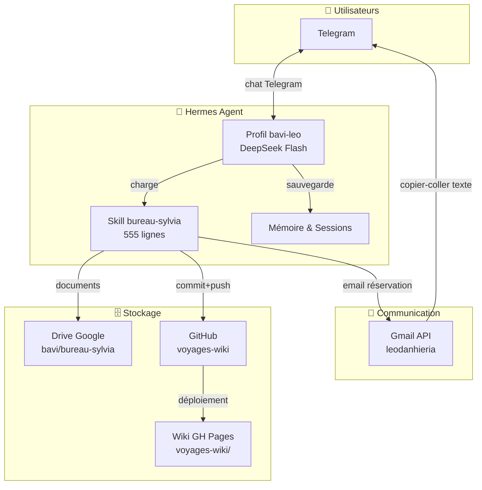
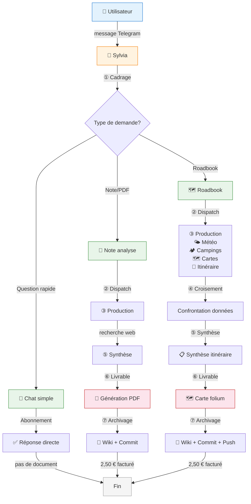
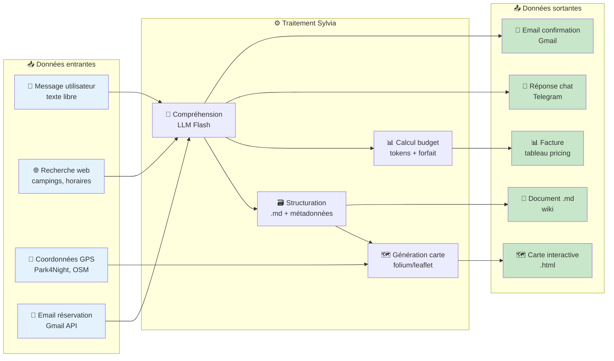
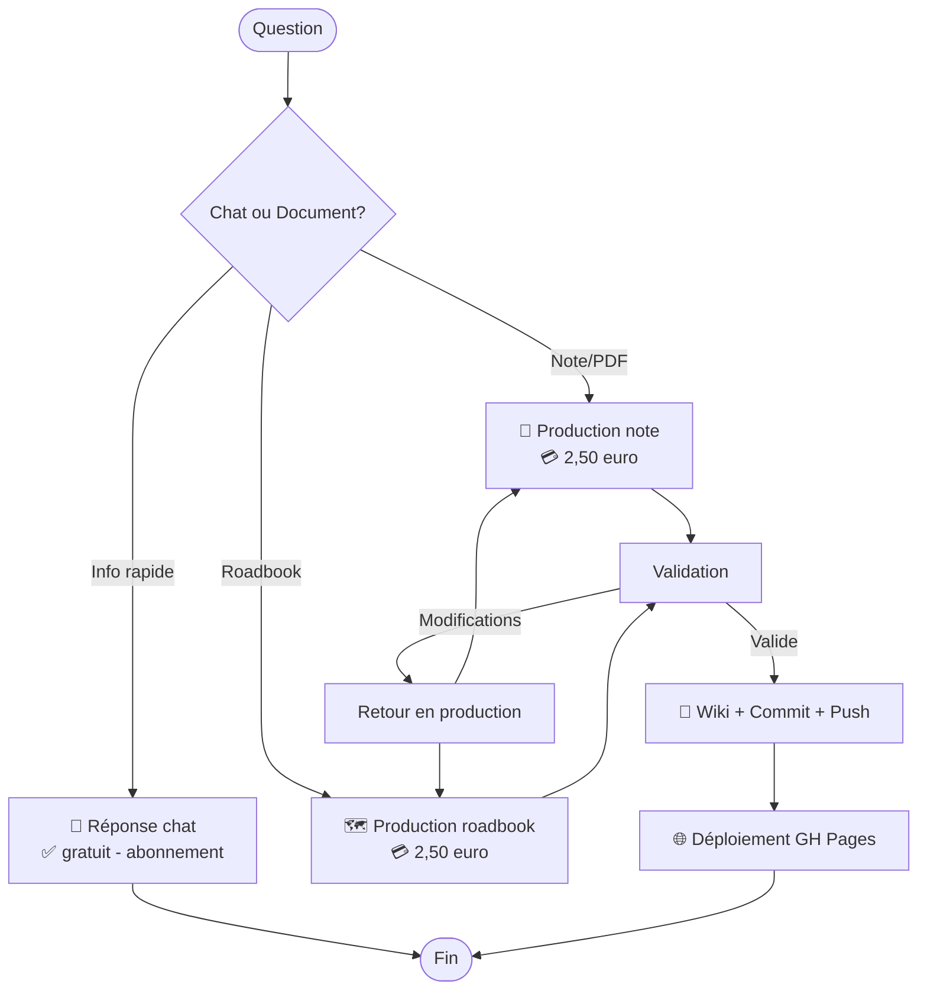
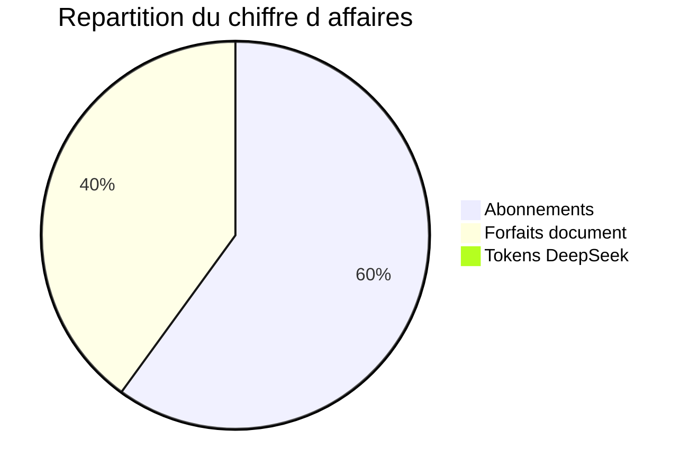

# 🧭 Analyse Business & Fonctionnelle — Bot Carnet de Voyages (Sylvia)

> **Bureau :** 🏛️ Robert — Conseil Stratégique IT | **Date :** 27/06/2026
> **Sujet :** Analyse du bot voyage BAVI LEO, modèle économique, flux fonctionnels et architecture

---

## 1. 🎯 Présentation du projet

### 1.1 Contexte

**Sylvia** est un assistant de voyage intelligent, déployé comme bot Telegram `@bavi_leo_voyages_bot`. Elle est le fruit d'une évolution : partie d'un simple assistant roadbook camping-car, elle est aujourd'hui une **agence de voyage complète** capable de gérer tous modes de transport et hébergements.

### 1.2 Objectifs

| Objectif | Description |
|:---------|:------------|
| 🎯 **Assister** la planification de voyages pour Christophe et ses amis |
| 📋 **Produire** des roadbooks structurés et des notes PDF |
| 🗺️ **Générer** des cartes interactives OSM |
| 💰 **Facturer** de manière transparente (abonnement + forfait) |
| 📚 **Archiver** chaque document dans un wiki versionné |

### 1.3 Public cible

| Profil | Rôle | Accès | Facturation |
|:-------|:-----|:------|:------------|
| 🧑‍✈️ **Christophe** | Propriétaire, admin système | DM + groupe Telegram | Tokens IN/OUT uniquement |
| 👥 **Amis** (Pascal…) | Utilisateurs du bot voyage | Groupe Telegram | Abonnement **12 €/an** + forfait document |
| 🧑 **Invités** | Consultation ponctuelle | Groupe Telegram (limité) | Abonnement ou accès libre selon décision |

---

## 2. 🏗️ Architecture technique

### 2.1 Diagramme d'architecture générale

### 2.2 Stack technique

| Composant | Technologie | Rôle |
|:----------|:------------|:-----|
| **Agent** | Hermes Agent (profil `bavi-leo`) | Exécution du skill Sylvia |
| **Modèle** | DeepSeek V4 Flash ($0,15/M IN, $0,60/M OUT) | Inférence chat + production documents |
| **Transport** | Telegram API (bot `@bavi_leo_voyages_bot`) | Interface utilisateur |
| **Stockage docs** | Google Drive (dossier `bavi/bureau-sylvia`) | Brouillons, sources |
| **Versioning** | GitHub (`christophedanhier-hash/voyages-wiki`) | Wiki, historique des commits |
| **Hébergement** | GitHub Pages | Site web public du wiki |
| **Email** | Gmail API (compte `leodanhieria@gmail.com`) | Envoi confirmations |
| **Sync cron** | Hermes cron (`wiki-sync`) | Synchronisation Drive → Wiki |

---

## 3. 🔄 Flux fonctionnels

### 3.1 Processus complet — BPMN (Business Process)

### 3.2 Flux de données

### 3.3 Cycle de vie d'un document

---

## 4. 💳 Modèle économique

### 4.1 Structure de revenus

### 4.2 Tarifs

| Poste | Tarif | Bénéficiaire |
|:------|:-----:|:-------------|
| 🎫 **Abonnement annuel** | **12 €/an** par ami | Chat illimité |
| 📝 **Forfait note/PDF** | **2,50 €** | Document dans le wiki |
| 🗺️ **Forfait roadbook** | **2,50 €** | Fichier + carte + wiki |
| 💰 **Tokens DeepSeek** | Coût réel ($0,15/0,60M) | Christophe : tokens only, Amis : inclus dans forfait |

### 4.3 Projection annuelle (estimation)

| Poste | Quantité | Prix unitaire | Total/an |
|:------|:--------:|:-------------:|:--------:|
| Abonnements | 1 abonné (Pascal) | 12 € | **12 €** |
| Roadbooks | 4 / an | 2,50 € | **10 €** |
| Notes/PDF | 6 / an | 2,50 € | **15 €** |
| Tokens DeepSeek | ~500K IN/mois | $0,15/M | **~0,90 $/an** |
| **Total estimé** | | | **~37 €/an** |

---

## 5. 🚫 Périmètre fonctionnel

| Fonction | Statut | Priorité |
|:---------|:------:|:--------:|
| Roadbooks camping-car | ✅ Actif | Haute |
| Roadbooks voiture/train/avion | ✅ Actif | Haute |
| Recherche hébergements (tous types) | ✅ Actif | Haute |
| Cartes interactives OSM | ✅ Actif | Haute |
| Notes PDF | ✅ Actif | Moyenne |
| Location vélo/moto/voiture | ✅ Actif | Basse |
| Multi-utilisateurs (groupe) | ✅ Actif | Haute |
| Copier-coller email pour amis | ✅ Actif | Basse |
| Réservation en ligne directe | ❌ Futur | — |
| Paiement intégré | ❌ Futur | — |

---

## 6. 📈 Évolutions possibles

| Évolution | Impact | Complexité |
|:----------|:------:|:----------:|
| 📱 Application mobile dédiée | Fort | Élevée |
| 💳 Paiement Stripe intégré | Fort | Moyenne |
| 🤝 Partenariats hôteliers/campings | Moyen | Faible |
| 🌍 Support multilingue | Faible | Faible |
| 📊 Dashboard admin pour Christophe | Moyen | Moyenne |
| 🗓️ Calendrier de réservation | Moyen | Moyenne |

---

## 7. 📊 Indicateurs clés (KPI)

| Indicateur | Valeur | Objectif |
|:-----------|:------:|:--------:|
| Utilisateurs actifs | 2 (Christophe + Pascal) | +1/an |
| Documents produits | 4 roadbooks | 8/an |
| Taux de rétention (J+30) | 100 % | >80 % |
| Coût moyen par document | 0,09 € (tokens) | <0,50 € |
| Temps moyen de réponse chat | <5s | <10s |
| Satisfaction utilisateur | ✅ Aucun retour négatif | >4/5 |

---

## 8. 🔗 Annexes

- [🌐 Wiki voyage](https://christophedanhier-hash.github.io/voyages-wiki/)
- [📖 Guide utilisateur](https://christophedanhier-hash.github.io/voyages-wiki/guide-utilisateur/)
- [🤖 Bot Telegram](https://t.me/bavi_leo_voyages_bot)
- [📋 Suivi projet](https://github.com/christophedanhier-hash/leo-tracker/issues)
- [🧠 Skill Sylvia (source de vérité)](https://github.com/christophedanhier-hash/hermes-christophe)

---

## Versions

| Version | Date | Auteur | Description |
|:--------|:-----|:-------|:------------|
| v1 | 27/06/2026 | LEO + Robert | Version initiale — analyse business BPMN + flux données |

---

*Analyse produite par 🏛️ Bureau Robert — BAVI LEO*
