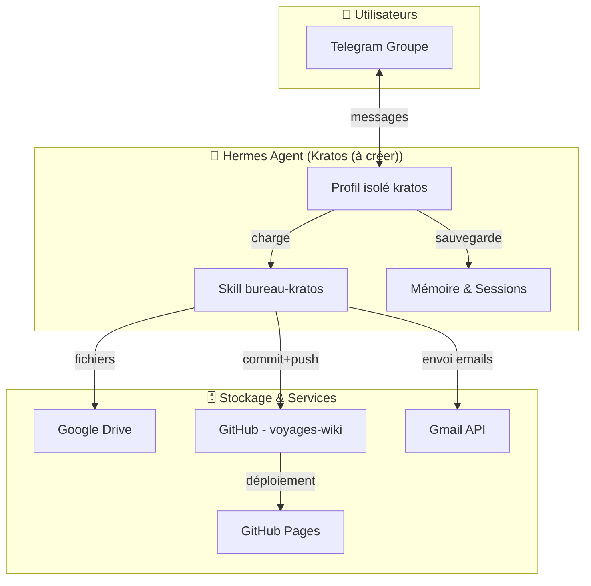
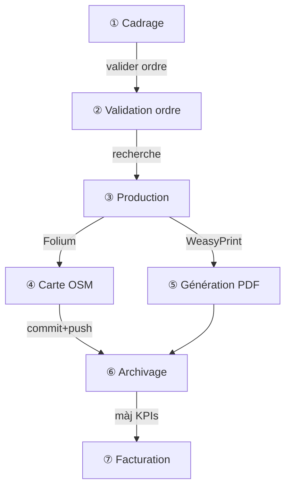

# 🧭 Transfert de Compétence — Bot Voyage Sylvia → Kratos (à créer)

> **Document de transfert** pour que **Kratos (à créer)** (l'agent Hermès de **John**) puisse reconstruire intégralement le système **Sylvia — Agence de Voyage**
> 
> **De :** BAVI LEO — Bureau Sylvia  
> **À :** Kratos (à créer) — Plateforme Vermès de John  
> **Date :** 13/07/2026 | **Version :** v2

---

## Table des matières

1. [Présentation du projet](#1-présentation-du-projet)
2. [Architecture technique](#2-architecture-technique)
3. [Le Skill Sylvia (source de vérité)](#3-le-skill-sylvia-source-de-vérité)
4. [Infrastructure à configurer](#4-infrastructure-à-configurer)
5. [Workflows opérationnels](#5-workflows-opérationnels)
6. [Modèle économique](#6-modèle-économique)
7. [Références et templates](#7-références-et-templates)
8. [Pièges à éviter](#8-pièges-à-éviter)
9. [Checklist déploiement Kratos (à créer)](#9-checklist-déploiement-kratos)

---

## 1. Présentation du projet

### 1.1 Qu'est-ce que Sylvia ?

**Sylvia** est un assistant de voyage intelligent, déployé comme bot Telegram `@bavi_leo`. Elle fonctionne comme **une agence de voyage complète** capable de gérer tous modes de transport et hébergements pour planifier des voyages sur mesure.

### 1.2 Capacités

| Fonctionnalité | Description |
|:---------------|:------------|
| 🗺️ **Roadbooks** | Itinéraires complets étape par étape |
| 🏕️ **Hébergements** | Campings, hôtels, locations Airbnb, aires CC, auberges |
| 🚐 **Tous transports** | Camping-car, voiture, train, avion, moto, ferry |
| 🗺️ **Cartes OSM** | Cartes interactives Folium/Leaflet |
| 📄 **PDF** | Génération de roadbooks en PDF |
| 👥 **Multi-utilisateurs** | Gestion d'un groupe Telegram avec plusieurs voyageurs |
| 💳 **Facturation** | Abonnements + forfaits documents |
| 📧 **Emails** | Envoi de confirmations de réservation |

### 1.3 Public cible

| Profil | Rôle |
|:-------|:-----|
| **John** | Propriétaire, admin système |
| **Amis de John** | Utilisateurs du bot voyage |
| **Invités** | Consultation ponctuelle |

---

## 2. Architecture technique

### 2.1 Vue d'ensemble



### 2.2 Stack technique

| Composant | Technologie | Rôle |
|:----------|:------------|:-----|
| **Agent** | Hermes Agent (profil isolé) | Exécution du skill |
| **Modèle LLM** | DeepSeek V4 Flash (ou équivalent) | Inférence chat + production documents |
| **Transport** | Telegram API (bot) | Interface utilisateur |
| **Stockage docs** | Google Drive | Brouillons, sources |
| **Versioning** | GitHub | Wiki, historique des commits |
| **Hébergement** | GitHub Pages | Site web public du wiki |
| **Email** | Gmail API | Envoi confirmations |
| **Sync** | Hermes cron | Synchronisation des fichiers |

### 2.3 Flux de communication

```mermaid
flowchart LR
    U[👤 Utilisateur] -->|message Telegram| S[🧠 Kratos (à créer)]
    S -->|recherche web| W[🌐 Sites]
    S -->|génère| R[📄 Roadbook .md]
    S -->|génère| C[🗺️ Carte Folium .html]
    S -->|génère| P[📑 PDF]
    S -->|commit + push| G[🐙 GitHub]
    S -->|email| E[📧 Confirmation]
    S -->|réponse| U
```

---

## 3. Le Skill Sylvia (source de vérité)

### 3.1 Structure du skill

Le cœur du système est un fichier **SKILL.md** unique qui contient toute la logique :

```
📁 bureau-kratos/
├── 📄 SKILL.md              ← La source de vérité (tout le code métier)
├── 📁 references/
│   ├── pricing.md           ← Modèle économique
│   └── cost-rules.md        ← Règles de transparence
└── 📁 templates/
    └── (templates optionnels)
```

> **Règle d'or** : Le SKILL.md doit être **auto-suffisant**. Il contient TOUTE la logique métier, les workflows, le périmètre, les tarifs et les pièges.

### 3.2 Contenu du SKILL.md

Le skill doit impérativement contenir ces sections :

| Section | Contenu |
|:--------|:--------|
| **Rôle** | Définition : "Tu es Kratos (à créer), l'agent de voyage" |
| **Contexte multi-utilisateurs** | Gestion du groupe Telegram, identification des personnes |
| **Pièges à éviter** | Tous les lessons learned (format table) |
| **Production du roadbook** | Workflows A à L |
| **Format de sortie** | Dates belges, distances routières |
| **Périmètre** | Ce que Kratos (à créer) fait / ne fait pas |
| **Tarification** | Abonnements et forfaits |
| **Types de documents** | Roadbook vs Note PDF |

### 3.3 Variables à personnaliser pour John

| Variable | Valeur BAVI LEO | À adapter pour John |
|:---------|:----------------|:--------------------|
| Nom du bot | Sylvia | Kratos (à créer) |
| Profil Hermes | `bavi-leo` | `kratos` (ou nom choisi) |
| Bot Telegram | @bavi_leo | @nom_du_bot_de_john |
| GitHub Org | christophedanhier-hash | john-org |
| Repo wiki | voyages-wiki | voyages-wiki |
| URL wiki | christophedanhier-hash.github.io/voyages-wiki | john.github.io/voyages-wiki |
| Email envoi | leodanhieria@gmail.com | email-de-john@gmail.com |
| Google Drive | bavi/bureau-sylvia | kratos/ |
| Abonnement | 12 €/an | À définir |
| Forfait document | 2,50 € | À définir |
| Modèle | DeepSeek V4 Flash | Choix de John |

---

## 4. Infrastructure à configurer

### 4.1 Hermes Agent — Profil isolé

```bash
hermes profile create kratos
```

**Pourquoi un profil isolé ?**
- Évite les interférences avec l'agent principal de John
- Permet une gestion séparée des tokens et sessions
- Plus simple pour la maintenance et le débogage

### 4.2 Telegram Bot

```bash
# Via @BotFather sur Telegram
/newbot → Kratos (à créer)TravelBot → @kratos_travel_bot
# Puis configurer dans Hermes :
hermes config set telegram.bot_token "VOTRE_TOKEN"
```

### 4.3 GitHub Repository — Wiki de voyages

```bash
gh repo create voyages-wiki --public --description "Wiki des voyages Kratos (à créer)"
```

Structure du repo :

```
voyages-wiki/
├── docs/
│   ├── index.md
│   ├── guide-utilisateur.md
│   ├── italie-2026/
│   │   ├── index.md
│   │   ├── carte.html
│   │   └── roadbook-italie.pdf
│   └── espagne-2026/
│       ├── index.md
│       ├── carte.html
│       └── roadbook-espagne.pdf
├── mkdocs.yml
└── README.md
```

### 4.4 GitHub Pages

```yaml
# mkdocs.yml
site_name: "Voyages Kratos (à créer)"
site_url: https://john.github.io/voyages-wiki/
theme:
  name: material
  language: fr
  palette:
    primary: blue
    accent: red
nav:
  - Accueil: index.md
  - Guide utilisateur: guide-utilisateur.md
  - Voyages John:
    - "Italie 2026": italie-2026/index.md
```

### 4.5 Google Drive

```
GDrive/Kratos (à créer)/
├── brouillons/
└── references/
```

### 4.6 Gmail API

```python
from google_auth_oauthlib.flow import InstalledAppFlow

SCOPES = ["https://www.googleapis.com/auth/gmail.send"]
flow = InstalledAppFlow.from_client_secrets_file("client_secret.json", SCOPES)
creds = flow.run_local_server(port=0)

with open("kratos_token.json", "w") as f:
    f.write(creds.to_json())
```

---

## 5. Workflows opérationnels

### 5.1 Processus complet d'un roadbook



### 5.2 Workflow A — Génération de la carte OSM (Folium)

```python
import folium

m = folium.Map(location=[LATITUDE_CENTRE, LONGITUDE_CENTRE],
               zoom_start=6, control_scale=True)

for i, (lat, lon, name, description) in enumerate(route):
    color = "green" if i == 0 or i == len(route)-1 else "blue"
    icon_type = "flag" if i == 0 or i == len(route)-1 else "info-sign"
    folium.Marker([lat, lon], popup=f"<b>{name}</b><br>{description}",
                  tooltip=name, icon=folium.Icon(color=color, icon=icon_type)).add_to(m)

for i in range(len(route) - 1):
    folium.PolyLine([[route[i][0], route[i][1]], [route[i+1][0], route[i+1][1]]],
                    color="red", weight=3, opacity=0.6).add_to(m)

m.save("docs/{voyage}/carte.html")
```

### 5.3 Workflow B — Génération PDF

```python
import markdown, re, os
from weasyprint import HTML

voyage = "nom-du-voyage"
titre = "Voyage Exemple — Planning"

with open(f"docs/{voyage}/index.md") as f:
    md = f.read()

# Supprimer la section coûts (interne)
md = re.sub(r'## 💳 Coût du service .+?\n(> .*?\n)?', '', md)

# Remplacer iframes par un lien
md = re.sub(r'<iframe[^>]*></iframe>',
    f'> 🗺️ **Carte interactive** : [Ouvrir](https://john.github.io/voyages-wiki/{voyage}/carte.html)', md)

html_body = markdown.markdown(md, extensions=['tables', 'fenced_code'])

html = f'''<!DOCTYPE html>
<html><head><meta charset="utf-8">
<style>
    @page {{ size: A4; margin: 2cm 1.5cm; }}
    body {{ font-family: "DejaVu Sans", Arial, sans-serif; font-size: 10pt; }}
    h1 {{ color: #1a5276; border-bottom: 3px solid #e63946; }}
    table {{ width: 100%; border-collapse: collapse; }}
    th {{ background: #1a5276; color: white; padding: 5px; }}
    td {{ padding: 4px; border: 1px solid #ccc; }}
</style></head><body>
<h1>{titre}</h1>
{html_body}
</body></html>'''

HTML(string=html).write_pdf(f"docs/{voyage}/roadbook-{voyage}.pdf")
```

### 5.4 Workflow C — Checklist de fin

| # | Vérification |
|:-:|:-------------|
| 1 | Le compteur Sessions a-t-il été incrémenté ? |
| 2 | Les KPIs (messages, appels, outils, tokens) sont-ils mis à jour ? |
| 3 | La page d'accueil du wiki est-elle à jour ? |
| 4 | Tous les fichiers sont-ils commités ET pushés ? |
| 5 | Le PDF a-t-il été regénéré si l'itinéraire a changé ? |
| 6 | La carte a-t-elle été regénérée si l'itinéraire a changé ? |
| 7 | Le site web est-il accessible en ligne ? (~1 min GitHub Pages) |

### 5.5 Workflow D — Gestion multi-utilisateurs

| Situation | Action |
|:----------|:-------|
| Nouveau message, prénom inconnu | Demander le prénom |
| Ambiguïté ("je veux partir") | Demander qui parle |
| Voyage de groupe | Itinéraire unique, compromis |
| Voyage individuel | Sessions indépendantes |
| Ami planifie pour sa famille | Voyage au nom du bénéficiaire réel |

---

## 6. Modèle économique

### 6.1 Structure tarifaire

| Poste | Tarif conseillé | Bénéficiaire |
|:------|:---------------:|:-------------|
| 🎫 **Abonnement annuel** | **12 €/an** par ami | Chat illimité |
| 📝 **Forfait note/PDF** | **2,50 €** | Document dans le wiki |
| 🗺️ **Forfait roadbook** | **2,50 €** | Fichier + carte + wiki |
| 💰 **Tokens LLM** | Coût réel | John : tokens only, Amis : inclus dans forfait |

### 6.2 Tableau de coûts dans chaque roadbook

| Métrique | Valeur |
|:---------|------:|
| **Sessions** | X |
| **Commits git** | X |
| **Messages échangés** | ~XX |
| **Appels API LLM** | ~XX |
| **Outils mobilisés** | ~XX |
| **Tokens consommés** | XXX IN · XXX OUT |
| **Coût LLM réel** | **~X,XX €** |
| **Frais de service** | **X,XX €** forfait |
| **Total facturé** | **X,XX €** |

---

## 7. Références et templates

### 7.1 Fichiers de référence à créer

| Fichier | Contenu |
|:--------|:--------|
| `references/pricing.md` | Modèle économique, tarifs, calcul des coûts |
| `references/cost-rules.md` | Règles de transparence des coûts |
| `references/gmail-booking-extraction.md` | Extraction d'emails de réservation |
| `references/gmail-booking-send.md` | Envoi d'emails de confirmation |
| `references/modeles-compacts-cc.md` | Conseils achat camping-car |
| `templates/camping-booking-email.md` | Template email réservation camping |
| `templates/roadbook-hotel.md` | Template roadbook hôtel |

### 7.2 Liens utiles

- [Hermes Agent Documentation](https://hermes-agent.nousresearch.com/docs)
- [Folium Documentation](https://python-visualization.github.io/folium/)
- [WeasyPrint Documentation](https://doc.courtbouillon.org/weasyprint/stable/)
- [GitHub Pages](https://pages.github.com/)
- [Material for MkDocs](https://squidfunk.github.io/mkdocs-material/)
- [Google Gmail API](https://developers.google.com/gmail/api)
- [Telegram Bot API](https://core.telegram.org/bots/api)

---

## 8. Pièges à éviter

### 8.1 Pièges techniques

| Piège | Solution |
|:------|:---------|
| Icône folium 'home' ne s'affiche pas | Utiliser `icon="flag"` ou pas d'icône personnalisée |
| Marqueurs folium superposés | NE PAS placer 2 marqueurs aux mêmes coordonnées |
| Distances vol d'oiseau inutiles | TOUJOURS distances routières (OSRM) + 1h buffer |
| iframes dans le PDF | WeasyPrint ne supporte pas → remplacer par lien |
| Dates belges ambiguës | "2/9" = 2 septembre, pas 2 juillet |
| Tables markdown désalignées | TOUJOURS commencer par `|` simple, jamais `||` |
| PDF sans titre de document | Ajouter un `<h1>` dans le template HTML |
| Section coûts dans le PDF | TOUJOURS la supprimer avant génération |
| OAuth redirect_uri mismatch | Configurer `redirect_uri=http://localhost` (sans port) |

### 8.2 Pièges métier

| Piège | Solution |
|:------|:---------|
| Ordre des étapes non validé | Valider l'ordre AVANT d'écrire le roadbook |
| Modifications non pushées | Commit + push immédiat après chaque modif |
| Mise à jour partielle | Vérifier TOUTES les sections, pas seulement l'évidente |
| Oubli des coûts (transparence) | Mettre à jour les 4 fichiers : roadbook, index, carte, PDF |
| Nom du bot mal orthographié | Le bot voyage = Kratos (à créer) |
| Confusion entre voyageurs | Toujours identifier qui parle |
| Réservation préexistante oubliée | Demander "Avez-vous déjà des réservations ?" |
| Spot nuit mal choisi | Demander "Camping ou parking gratuit ?" |
| Campings absents d'OSM | Géocoder l'adresse postale ou la ville |
| Historique des lieux demandé | Ajouter `> 📜 **Un peu d'histoire :** ...` par étape |

### 8.3 Règles d'or pour Kratos (à créer)

1. **Un roadbook = 3 fichiers** : `index.md` + `carte.html` + `roadbook-xxx.pdf`
2. **Toute modification = commit + push immédiat**
3. **Transparence des coûts** pour chaque ami
4. **Avant d'écrire, valider l'ordre** des étapes
5. **Dates belges (jj/mm/aaaa)** — si ambiguïté, demander le mois
6. **Distances routières réelles** (OSRM), jamais Haversine
7. **1h de buffer** sur toutes les estimations de temps de route
8. **Le SKILL.md est la source de vérité** — le maintenir à jour

---

## 9. Checklist déploiement Kratos (à créer)

### Phase 1 — Création du compte et infrastructure

| # | Action |
|:-:|:-------|
| 1 | Créer un compte GitHub pour John (ou utiliser existant) |
| 2 | Créer un profil Hermes dédié : `kratos` |
| 3 | Configurer le modèle LLM (DeepSeek Flash ou équivalent) |
| 4 | Créer le bot Telegram via @BotFather |
| 5 | Configurer le token Telegram dans Hermes |
| 6 | Créer le repo GitHub `voyages-wiki` |
| 7 | Configurer GitHub Pages (mkdocs.yml + GitHub Actions) |
| 8 | Créer le dossier Google Drive `Kratos (à créer)/` |
| 9 | Configurer Gmail API (client OAuth + token) |

### Phase 2 — Installation du skill

| # | Action |
|:-:|:-------|
| 1 | Transférer le SKILL.md adapté dans `~/.hermes/skills/kratos/` |
| 2 | Créer les fichiers de référence (`references/`) |
| 3 | Créer les templates (`templates/`) |
| 4 | Adapter les variables (nom du bot, URLs, etc.) |
| 5 | Tester avec un premier roadbook factice |

### Phase 3 — Tests et validation

| # | Test |
|:-:|:-----|
| 1 | Chat simple (question rapide) |
| 2 | Production d'un roadbook complet |
| 3 | Génération de carte Folium |
| 4 | Génération PDF |
| 5 | Commit + push GitHub |
| 6 | Déploiement GitHub Pages |
| 7 | Carte interactive en ligne |
| 8 | Multi-utilisateurs (2 personnes dans le groupe) |
| 9 | Facturation (affichage des coûts) |

### Phase 4 — Mise en production

| # | Action |
|:-:|:-------|
| 1 | Présenter Kratos (à créer) aux amis de John dans le groupe Telegram |
| 2 | Distribuer le guide utilisateur |
| 3 | Lancer le 1er vrai voyage |
| 4 | Vérifier les coûts réels après 1 mois |
| 5 | Ajuster les tarifs si nécessaire |

---

## Annexes

### A. Exemple de script d'envoi d'email

```python
#!/usr/bin/env python3
import os, base64
from email.mime.text import MIMEText
from google.oauth2.credentials import Credentials
from googleapiclient.discovery import build

SENDER = "john@gmail.com"
TO = "ami@email.com"
CC = "john@gmail.com"
SUBJECT = "Confirmation réservation — Camping XYZ"

body_text = """Bonjour [Nom],

Votre réservation au Camping XYZ est confirmée :

Dates : XX/XX/XXXX → XX/XX/XXXX
Type : [Type d'hébergement]
Prix : XXX €

Merci de votre confiance."""

msg = MIMEText(body_text, "plain", "utf-8")
msg["To"] = TO
msg["From"] = SENDER
msg["Cc"] = CC
msg["Subject"] = SUBJECT

raw = base64.urlsafe_b64encode(msg.as_bytes()).decode()
creds = Credentials.from_authorized_user_file("kratos_token.json")
gmail = build("gmail", "v1", credentials=creds)
gmail.users().messages().send(userId="me", body={"raw": raw}).execute()
```

### B. Exemple de page d'accueil du wiki

```markdown
# 🌍 Voyages Kratos (à créer)

Bienvenue sur le wiki des voyages organisés par **Kratos (à créer)** !

## Voyages John 🧑‍✈️

| Destination | Dates | Sessions | Commits | Coût |
|:------------|:-----:|:--------:|:-------:|:----:|
| Italie 2026 | 01/09 → 15/09/2026 | 3 | 5 | 7,50 € |
| ... | | | | |

## Voyages Amis 🤖

| Personne | Destination | Total |
|:---------|:------------|:-----:|
| Pascal | Espagne 2026 | 2,50 € |
```

---

## Historique des versions

| Version | Date | Auteur | Description |
|:--------|:-----|:-------|:------------|
| v1 | 13/07/2026 | LEO 🤖 | Version initiale |
| **v2** | **13/07/2026** | **LEO** 🤖 | **Ajout diagrammes Mermaid, correction tableaux (pipes simples), formatage** |

---

*Document produit par 🤖 Bureau LEO pour transfert vers 🏛️ Kratos (à créer) (Vermès / John)*
*BAVI LEO — Juillet 2026*

> 🤖 Dernier audit : 20 July 2026 à 09:14 (UTC+2)

