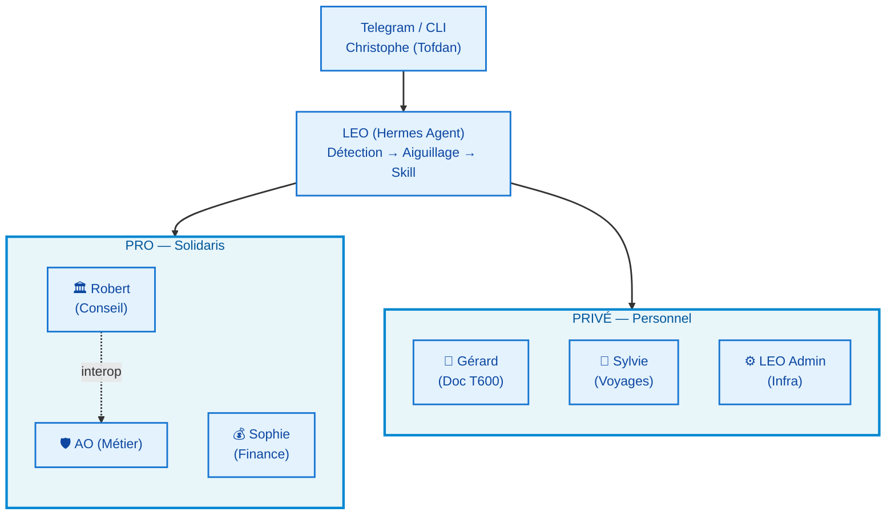
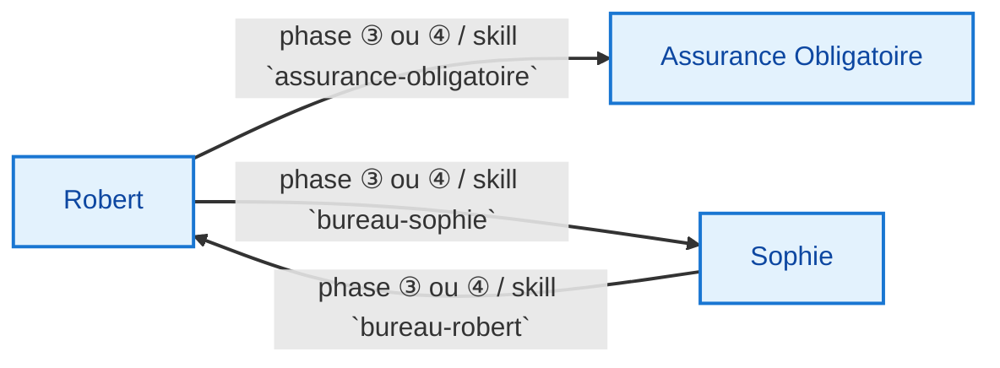
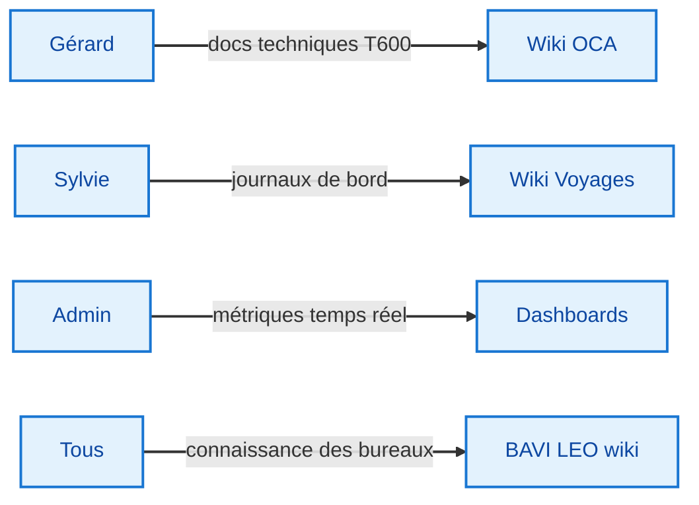

# 🏗️ Architecture BAVI LEO

**Version :** 2.0 | **Date :** 16 juin 2026

---

## Vue d'ensemble



---

## Architecture multi-couche

### Couche 1 — Point d'entrée (LEO)

LEO reçoit la demande de Christophe et **aiguille** vers le bon bureau en détectant le nom du skill dans le message.

```
Message Telegram → LEO détecte "bureau-robert" → charge skill bureau-robert
                  → LEO détecte "budget" → pas de skill, réponse directe
```

### Couche 2 — Orchestrateurs de bureau (5 skills)

Chaque bureau a son propre skill Hermes qui définit :
- **Rôle** : personnalité, posture, limites
- **Sous-experts** : domaines couverts, dispatch conditionnel
- **Workflow** : 7 phases standardisées avec parallélisation possible
- **Interopérabilité** : appels vers les autres bureaux

### Couche 3 — Production (experts virtuels + skills réels)

| Type | Description | Exemple |
|------|-------------|---------|
| **Experts virtuels** | Sous-agents dans le prompt (dispatch conditionnel) | Expert Architecture dans Robert |
| **Skills réels** | Skills Hermes autonomes appelables | `assurance-obligatoire` |

> La distinction permet d'économiser des tokens : un expert virtuel n'est activé que si nécessaire, un skill réel peut être appelé depuis n'importe quel bureau.

---

## Workflow standardisé — 7 phases

Tous les bureaux suivent le même squelette :

```
① CADRAGE → ② DISPATCH → ③ PRODUCTION → ④ CROISEMENT → ⑤ SYNTHÈSE → ⑥ LIVRABLE → ⑦ ARCHIVAGE
```

### Variantes par bureau

| Bureau | Phases utiles | Particularité |
|--------|:------------:|---------------|
| 🏛️ Robert | ①→②→③→④→⑤→⑥→⑦ | Dispatch parmi 7 experts |
| 💰 Sophie | ①→②→③→④→⑤→⑥→⑦ | Production parallélisable Marché+Risques |
| 🛡️ AO | ①→③→⑥ | Workflow raccourci (expert unique) |
| 📝 Gérard | ①→②→③→④→⑤→⑥→⑦ | Croisement obligatoire Hardware↔Firmware |
| 🧭 Sylvie | ①→②→③→④→⑤→⑥→⑦ | Cartographie OSM en parallèle |
| ⚙️ Admin | Cron-driven (collecte→dashboard) | Modèle différent, pas de phases |

---

## Flux Inter-Bureaux

### Appels formels (skills)



### Flux de livraison



---

## Comparaison des architectures

### Avant (monolithique — v1.0)

```
1 skill = 1 bureau = tout le prompt
→ 7 experts Robert chargés même pour une question d'architecture simple
→ Pas de parallélisation possible
→ Pas d'interopérabilité formelle
→ LEO Admin non documenté comme bureau
```

### Après (dispatchée — v2.0)

```
1 skill = 1 orchestrateur + dispatch conditionnel + interopérabilité
→ Seuls les experts pertinents sont activés (économie de tokens)
→ Phases indépendantes parallélisées
→ Appels formels entre bureaux
→ LEO Admin = bureau PRIVÉ documenté
```

---

## Impact mesurable

| Métrique | Avant | Après | Gain |
|----------|-------|-------|------|
| Taille moyenne skill | 450 lignes | 310 lignes | -30% |
| Dispatch inutile | 7 experts systématiques | 2-3 experts dispatchés | -60% |
| Parallélisation | Non | Marché+Risques, HW+FW | 2x plus rapide |
| Interopérabilité | Tacite | Formelle (skills) | Traçable |
| Documentation | 6 pages wiki | 12 pages wiki | 2x plus complet |

---

## Règle de format des livrables

| Contexte | Format | Outil | Bureaux concernés |
|----------|--------|-------|:-----------------:|
| 💻 Travail interne (analyses, brouillons) | `.md` — natif BAVI | Wiki BAVI LEO | Tous |
| 📄 Partage / Impression (direction, comité) | **Google Docs** | `google-workspace` skill | 🏛️ Robert, 🛡️ AO |
| 📊 Modèle financier (tableaux, chiffres) | **Google Sheets** | `google-workspace` skill | 💰 Sophie |
| 📽️ Présentation (comité de direction) | **Google Slides** | `google-workspace` skill | 🏛️ Robert |
| 🏠 Projets personnels (T600, voyages) | `.md` — wiki | Wiki OCA / Voyages | 📝 Gérard, 🧭 Sylvie |
