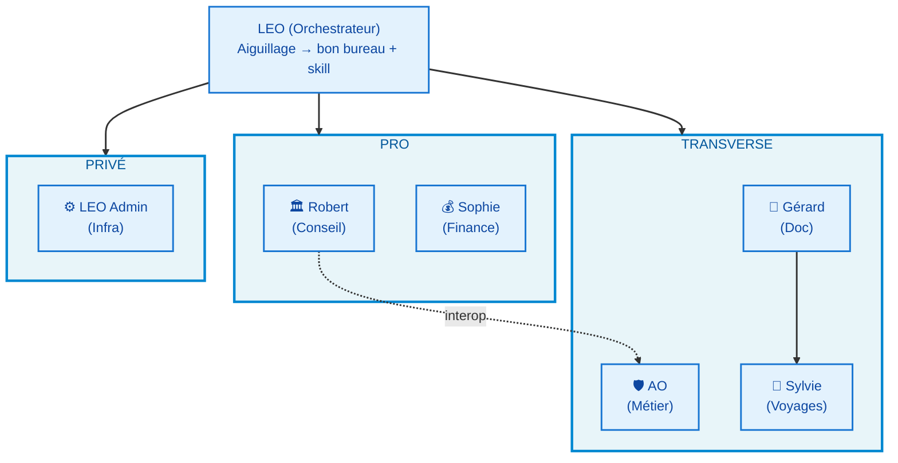

# 🔍 Audit BAVI LEO — Analyse et Optimisation

**Version :** 1.0 | **Date :** 16 juin 2026 | **Auteur :** LEO

---

## Résumé exécutif

BAVI LEO compte **5 bureaux actifs** + **1 bureau infra** (LEO Admin), chacun avec son orchestrateur, ses sous-experts et son workflow. L'audit révèle **6 axes d'optimisation** pour passer d'une architecture monolithique (tout dans le même prompt) à une architecture **dispatchée, parallélisable et interopérable**.

---

## 1. Audit par bureau

### 1.1 🏛️ Bureau Robert — Conseil IT Stratégique

| Élément | État actuel | Problème |
|---------|-----------|----------|
| **Orchestrateur** | Robert (skill `bureau-robert`, 473 lignes) | ✅ Bien défini |
| **Sous-experts** | 7 rôles virtuels dans le prompt | ❌ Pas de dispatch parallèle possible |
| **Workflow** | 6 phases : Cadrage → Dispatch → Croisement → Synthèse → Livrable → Checkpoint | ✅ Structure correcte |
| **Interopérabilité** | Assurance Obligatoire mentionné comme expert #7 | ❌ Pas d'appel formel au skill `assurance-obligatoire` |
| **Gouvernance** | Règles absolues + traçabilité | ✅ Bon cadrage |

**Problème central :** Les 7 sous-experts sont dans le même prompt. Quand Christophe demande une analyse architecturale, tout le prompt est chargé (y compris Sécurité, Data, Gouvernance…). Cela consomme des tokens DeepSeek inutilement.

**Optimisation :**
1. Structurer le prompt pour un **dispatch conditionnel** (ne charger que les experts nécessaires)
2. Ajouter l'interopérabilité formelle vers **Assurance Obligatoire** et **Sophie**
3. Standardiser le workflow sur le modèle BAVI 7 phases

---

### 1.2 💰 Bureau Sophie — Pilotage Financier IT

| Élément | État actuel | Problème |
|---------|-----------|----------|
| **Orchestrateur** | Sophie (skill `bureau-sophie`, 575 lignes) | ✅ Bien défini |
| **Sous-experts** | 3 rôles virtuels | ❌ Pas de dispatch parallèle |
| **Workflow** | 6 phases : Cadrage → Marché → Modélisation → Risques → Synthèse → Livrable | ⚠️ Séquentiel alors que Marché et Risques pourraient être parallèles |
| **Interopérabilité** | Aucune | ❌ Pas de lien vers Robert (contexte stratégique) |

**Problème central :** Le workflow est purement séquentiel. Les phases Analyse Marché et Analyse des Risques sont indépendantes et pourraient être parallélisées.

**Optimisation :**
1. Parallélisation Marché + Risques après modélisation
2. Interopérabilité vers Robert pour alignement stratégique
3. Standardisation du workflow

---

### 1.3 🛡️ Assurance Obligatoire — Lentille Métier Transverse

| Élément | État actuel | Problème |
|---------|-----------|----------|
| **Orchestrateur** | Pas d'orchestrateur (expert unique) | ⚠️ Ni bureau autonome ni sous-agent clairement |
| **Sous-experts** | Aucun (expert unique) | ✅ Cohérent |
| **Workflow** | Pas de workflow structuré | ❌ Relecture ad-hoc sans phases |
| **Interopérabilité** | Expert #7 de Robert | ❌ Double rôle non documenté |

**Problème central :** L'Assurance Obligatoire a un **double statut** : c'est à la fois un sous-agent de Robert (expert métier AO dans les analyses IT) et un skill autonome que Christophe peut solliciter directement. Ce n'est pas documenté.

**Optimisation :**
1. Clarifier le double rôle : **skill transverse** appelable depuis Robert OU directement
2. Ajouter un workflow de relecture en 3 phases
3. Documenter dans le prompt son positionnement exact

---

### 1.4 📝 Bureau Gérard — Documentation Technique T600

| Élément | État actuel | Problème |
|---------|-----------|----------|
| **Orchestrateur** | Gérard (skill `bureau-gerard`, 406 lignes) | ✅ Bien défini |
| **Sous-experts** | 6 agents + 2 supports virtuels | ❌ Tout dans le même prompt |
| **Workflow** | 5 phases : Extraction → Validation → Rédaction → Relecture → Livraison | ⚠️ Extraction et Validation pourraient être dispatchées |
| **Interopérabilité** | Wiki OCA en livraison | ✅ |

**Problème central :** Même problème que Robert — 8 rôles dans un seul prompt. L'ethnographe, l'astro-optique, le hardware et le firmware travaillent sur des domaines totalement différents.

**Optimisation :**
1. Structure de dispatch conditionnel
2. Croisement formel hardware ↔ firmware
3. Standardisation du workflow

---

### 1.5 🧭 Bureau Sylvie — Voyages Camping-Car

| Élément | État actuel | Problème |
|---------|-----------|----------|
| **Orchestrateur** | Sylvie (skill `bureau-sylvie`, 392 lignes) | ✅ Bien défini |
| **Sous-experts** | 3 rôles virtuels | ✅ Adapté au volume |
| **Workflow** | 4 phases : Planification → Récit → Doc → Archivage | ⚠️ Pas de dispatch possible |
| **Interopérabilité** | Wiki Voyages | ✅ |

**Optimisation :**
1. Workflow standardisé
2. Ajout d'une phase **Cartographie** (OSM — la plus coûteuse en tokens)
3. Règles renforcées (distances Haversine, pas de photos, pas de Google Maps)

---

### 1.6 ⚙️ LEO Admin — Infrastructure Hermes

| Élément | État actuel | Problème |
|---------|-----------|----------|
| **Orchestrateur** | Moi (LEO) — natif | ✅ |
| **Sous-skills** | `budget-tracking`, `machine-metrics`, `dashboard-kpi`, `system-management` | ✅ Existent mais pas documentés comme bureau |
| **Workflow** | Cron-driven | ✅ Automatique |
| **Interopérabilité** | Dashboards, monitoring | ✅ Actif |

**Problème central :** LEO Admin n'est pas documenté comme un "bureau" dans BAVI LEO. Ses sous-skills existent mais ne sont pas référencés.

**Optimisation :**
1. Documenter LEO Admin comme bureau PRIVÉ à part entière dans le wiki
2. Lier les sous-skills Hermes existants

---

## 2. Workflow Standardisé BAVI — 7 phases

J'harmonise tous les bureaux sur un modèle commun :

| Phase | Nom | Description | Parallélisable |
|:-----:|-----|-------------|:--------------:|
| ① | **Cadrage** | Comprendre la demande, le contexte, les livrables | ❌ |
| ② | **Dispatch** | Router vers les expertises nécessaires | ❌ |
| ③ | **Production** | Chaque expert produit son analyse | ✅ |
| ④ | **Croisement** | Confronter les analyses, identifier divergences | ✅ |
| ⑤ | **Synthèse** | Produire une analyse transversale unifiée | ❌ |
| ⑥ | **Livrable** | Formater selon le standard attendu | ❌ |
| ⑦ | **Archivage** | Documenter dans le wiki, proposer les suites | ❌ |

### Correspondance par bureau

| Bureau | Ancien workflow | Nouveau (7 phases) |
|--------|----------------|-------------------|
| 🏛️ Robert | 6 phases (Cadrage → Dispatch → Croisement → Synthèse → Livrable → Checkpoint) | ①→②→③→④→⑤→⑥→⑦ |
| 💰 Sophie | 6 phases (Cadrage → Marché → Modélisation → Risques → Synthèse → Livrable) | ①→②→③(parallèle Marché+Risques)→④→⑤→⑥→⑦ |
| 🛡️ AO | Pas de workflow | ①→③→⑥ (shortcut — expert unique) |
| 📝 Gérard | 5 phases (Extraction → Validation → Rédaction → Relecture → Livraison) | ①→②→③(parallèle Hardware+Firmware)→④→⑤→⑥→⑦ |
| 🧭 Sylvie | 4 phases (Planification → Récit → Doc → Archivage) | ①→②→③(Cartographie parallèle)→④→⑤→⑥→⑦ |
| ⚙️ Admin | Cron-driven (pas de workflow interactif) | Documenté comme bureau automatisé |

---

## 3. Architecture Inter-Bureaux

### Flux inter-bureaux

| De | Vers | Condition | Mécanisme |
|----|------|-----------|-----------|
| Robert | Assurance Obligatoire | Analyse IT avec impact AO | Appel skill `assurance-obligatoire` |
| Robert | Sophie | Analyse avec volet financier | Appel skill `bureau-sophie` |
| Sophie | Robert | Business case avec impact stratégique | Appel skill `bureau-robert` |
| Gérard | Formateur | Documentation → formation | Mentionné dans workflow |
| LEO | Tous | Aiguillage utilisateur | Détection du nom de bureau |

---

## 4. Matrice des différences entre bureaux

| Critère | 🏛️ Robert | 💰 Sophie | 🛡️ AO | 📝 Gérard | 🧭 Sylvie | ⚙️ Admin |
|---------|-----------|-----------|-------|-----------|-----------|---------|
| **Catégorie** | PRO | PRO | PRO | PRIVÉ | PRIVÉ | PRIVÉ |
| **Orchestrateur** | Robert | Sophie | (aucun) | Gérard | Sylvie | LEO |
| **Sous-experts** | 7 | 3 | 0 | 6 + 2 | 3 | 5+ skills |
| **Nb phases workflow** | 6→7 | 6→7 | 0→3 | 5→7 | 4→7 | Cron |
| **Parallélisable** | Partiel (3/7) | 50% (Marché+Risques) | Non | Partiel (Hardware+Firmware) | Cartographie | N/A |
| **Interopérabilité** | AO, Sophie | Robert | Robert, Sophie | Wiki OCA | Wiki Voyages | Dashboards |
| **Livrable type** | Note stratégique | Business case | Relecture AO | Manuel technique | Journal voyage | Dashboard |
| **Audience** | Direction IT | Direction IT | Métier AO | OCA membres | Personnel | Toi |
| **Taille skill** | 473 lignes | 575 lignes | 202 lignes | 406 lignes | 392 lignes | N/A |
| **Autonomie** | Haute | Haute | Faible (transverse) | Haute | Moyenne | Automatique |

---

## 5. Plan d'optimisation

| # | Action | Impact | Effort |
|---|--------|--------|--------|
| 1 | Workflow standardisé 7 phases dans TOUS les skills | ⭐⭐⭐ | Faible |
| 2 | Dispatch conditionnel (ne charger que les experts nécessaires) | ⭐⭐⭐ | Moyen |
| 3 | Parallélisation Production (phase ③) via delegate_task | ⭐⭐⭐ | Moyen |
| 4 | Interopérabilité formelle Robert↔AO↔Sophie | ⭐⭐ | Faible |
| 5 | Documentation LEO Admin comme bureau | ⭐⭐ | Faible |
| 6 | Wiki complet page audit + architecture | ⭐⭐⭐ | Moyen |

---

*Document d'audit généré par LEO — 16 juin 2026*
