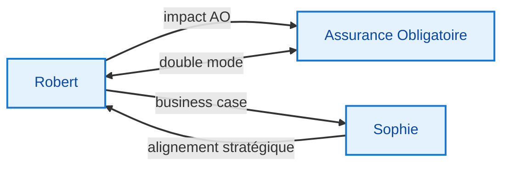

# 🏢 Bureaux PRO — Solidaris

Les bureaux PRO couvrent le périmètre métier de Christophe chez Solidaris : conseil IT stratégique, pilotage financier, et expertise Assurance Obligatoire.

---

## Bureaux disponibles

| Bureau | Domaine | Workflow | Interop |
|--------|---------|:--------:|---------|
| 🏛️ **Robert** | Conseil IT stratégique AO | 7 phases | → AO, Sophie |
| 💰 **Sophie** | Pilotage économique & financier IT | 7 phases (parallèle) | → Robert |
| 🛡️ **Assurance Obligatoire** | Lentille métier AO transverse | 3 phases (expert unique) | → Robert, direct |

---

## Relations entre bureaux PRO

---

## Utilisation

Lancez un bureau depuis Telegram :
- `bureau-robert : <ta demande>`
- `bureau-sophie : <ta demande>`
- `assurance-obligatoire : <ta demande>`

---

## Principes

- **Neutralité technique** : pas de stack imposée
- **Ancrage AO** : le contexte par défaut est l'écosystème mutualiste belge
- **Non décisionnel** : LEO analyse, propose, alerte — tu décides
- **Dispatch conditionnel** : seuls les experts pertinents sont activés
