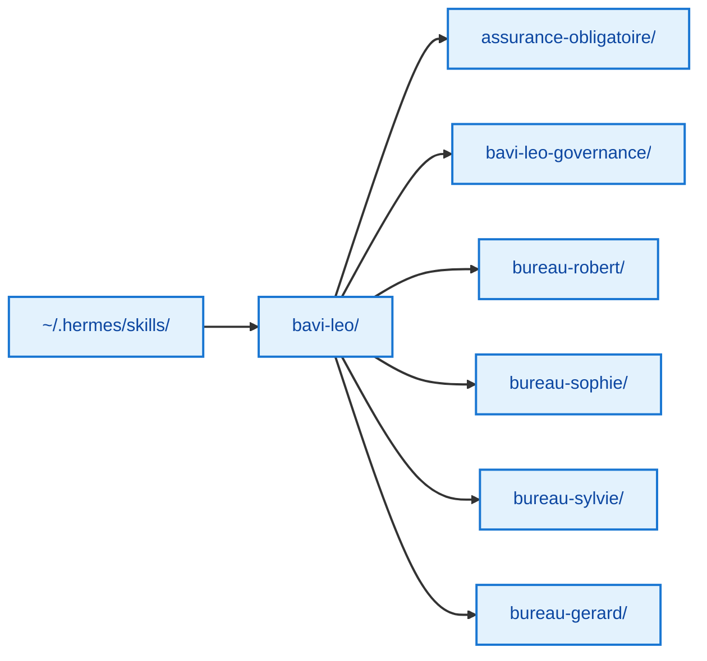

# 📚 Catalogue des Skills

**Version :** 2.0 (après audit optimisation)

---

Les skills Hermes sont les modules d'expertise de chaque bureau BAVI LEO. Chaque skill est un prompt système qui définit le rôle, le workflow, les sous-experts et les contraintes.

---

## Arborescence

```
skills/
└── bavi-leo/
    │
    ├── 📋 assurance-obligatoire/
    │   └── SKILL.md
    │       → 🛡️ **Lentille métier AO transverse**
    │         INAMI, BCSS, eHealth, MyCareNet.
    │         Appelable depuis Robert ou directement.
    │
    ├── ⚙️ bavi-leo-governance/
    │   ├── SKILL.md
    │   └── references/
    │       → 🏗️ **Méthodologie d'audit & optimisation**
    │         Workflow 7 phases, dispatch conditionnel,
    │         interopérabilité. Créer et auditer des bureaux.
    │
    ├── 📝 bureau-gerard/
    │   └── SKILL.md
    │       → 🔭 **Documentation technique T600**
    │         6 experts + 2 supports.
    │         Croisement obligatoire Hardware↔Firmware.
    │
    ├── 🏛️ bureau-robert/
    │   └── SKILL.md
    │       → 💼 **Conseil Stratégique IT**
    │         Analyses transversales, notes, arbitrages.
    │         7 experts dispatch + interop AO/Sophie.
    │
    ├── 💰 bureau-sophie/
    │   └── SKILL.md
    │       → 📊 **Pilotage Économique & Financier IT**
    │         Business cases, TCO/ROI, 3 scenarii.
    │         Production parallélisable Marché+Risques.
    │
    └── 🧭 bureau-sylvie/
        ├── SKILL.md
        └── references/
            → 🚐 **Organisation de voyages camping-car**
              Planification, récit, cartographie OSM,
              archivage. Workflow 7 phases.
```

---

## Skills PRO — Solidaris

| Bureau | Skill | Persona | Version |
|--------|-------|---------|:-------:|
| 🏛️ **Robert** | `bureau-robert` | 💼 Conseil IT stratégique — 7 experts dispatch, interop AO/Sophie | 2.0 |
| 💰 **Sophie** | `bureau-sophie` | 📊 Pilotage financier IT — Business cases, TCO/ROI, 3 scenarii | 2.0 |
| 🛡️ **AO** | `assurance-obligatoire` | 🛡️ Lentille métier AO — INAMI, BCSS, eHealth, MyCareNet | 2.0 |

## Skills PRIVÉ — Personnel

| Bureau | Skill | Persona | Version |
|--------|-------|---------|:-------:|
| 📝 **Gérard** | `bureau-gerard` | 🔭 Documentation T600 — 6 experts + 2 supports, croisement HW↔FW | 2.0 |
| 🧭 **Sylvie** | `bureau-sylvie` | 🚐 Voyages camping-car — Planification, carto OSM, archivage | 2.0 |

## Infrastructure — LEO Admin

| Skill | Rôle | Type |
|-------|------|:----:|
| `budget-tracking` | 📊 Suivi budget DeepSeek | Cron H:35 |
| `machine-metrics` | 💻 Collecte CPU/RAM/Disk | Cron H:00 |
| `dashboard-kpi` | 📈 Dashboard KPI Hermes | Cron |
| `system-management` | 🖥️ Gestion machines Tailscale | Cron |
| `leo-email-assistant` | 📧 Envoi emails Gmail OAuth2 | À la demande |
| `dashboard-deployment` | 🚀 Déploiement GH Pages | Cron 4h |

---

## Évolution de la taille des skills

| Skill | v2.0 (audit) | Actuel | Variation |
|-------|:----:|:----:|:---------:|
| `bureau-robert` | 473 | 110 | **−77%** |
| `bureau-sophie` | 575 | 98 | **−83%** |
| `assurance-obligatoire` | 202 | 85 | **−58%** |
| `bureau-gerard` | 406 | 91 | **−78%** |
| `bureau-sylvie` | 392 | 229 | **−42%** |

> **Gain total :** les skills ont été considérablement optimisés depuis la v2.0 (audit), passant de 2 048 à 613 lignes cumulées (−70 %), pour un contenu plus ciblé et des tokens réduits.

---

## Emplacement des fichiers


