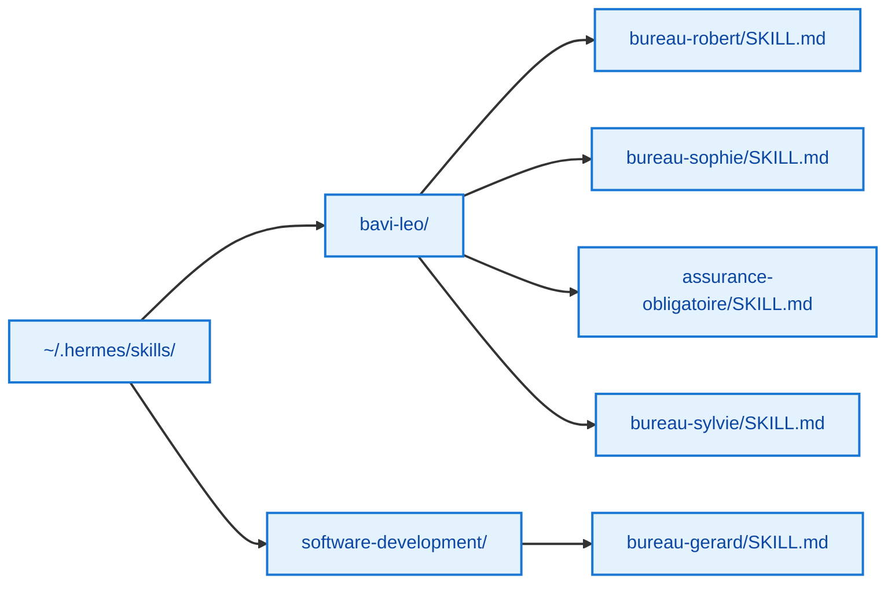

# 📚 Catalogue des Skills

**Version :** 2.0 (après audit optimisation)

---

Les skills Hermes sont les modules d'expertise de chaque bureau BAVI LEO. Chaque skill est un prompt système qui définit le rôle, le workflow, les sous-experts et les contraintes.

---

## Skills PRO — Solidaris

| Skill | Bureau | Expertises | Lignes | Version |
|-------|--------|-----------|:------:|:-------:|
| `bureau-robert` | 🏛️ Robert | Conseil IT stratégique, 7 experts dispatch | 370 | 2.0 |
| `bureau-sophie` | 💰 Sophie | Pilotage financier, TCO/ROI, 3 scenarii | 320 | 2.0 |
| `assurance-obligatoire` | 🛡️ AO | Lentille métier AO, expert transverse | 220 | 2.0 |

## Skills PRIVÉ — Personnel

| Skill | Bureau | Expertises | Lignes | Version |
|-------|--------|-----------|:------:|:-------:|
| `bureau-gerard` | 📝 Gérard | Documentation T600, 6 agents + 2 supports | 340 | 2.0 |
| `bureau-sylvie` | 🧭 Sylvie | Voyages camping-car, 3 experts, carto OSM | 310 | 2.0 |

## Infrastructure — LEO Admin

| Skill | Rôle | Type |
|-------|------|:----:|
| `budget-tracking` | Suivi budget DeepSeek | Cron H:35 |
| `machine-metrics` | Collecte CPU/RAM/Disk | Cron H:00 |
| `dashboard-kpi` | Dashboard KPI Hermes | Cron |
| `system-management` | Gestion machines Tailscale | Cron |
| `leo-email-assistant` | Envoi emails Gmail OAuth2 | À la demande |
| `dashboard-deployment` | Déploiement GH Pages | Cron 4h |

---

## Évolution de la taille des skills

| Skill | v2.0 (audit) | Actuel | Variation |
|-------|:----:|:----:|:---------:|
| `bureau-robert` | 473 | 110 | **-77%** |
| `bureau-sophie` | 575 | 98 | **-83%** |
| `assurance-obligatoire` | 202 | 85 | **-58%** |
| `bureau-gerard` | 406 | 91 | **-78%** |
| `bureau-sylvie` | 392 | 229 | **-42%** |

> **Gain total :** les skills ont été considérablement optimisés depuis la v2.0 (audit), passant de 2 048 à 613 lignes cumulées (−70 %), pour un contenu plus ciblé et des tokens réduits.

---

## Emplacement des fichiers

