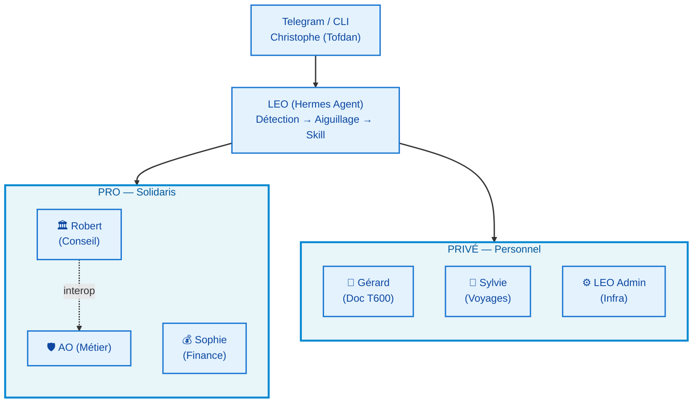
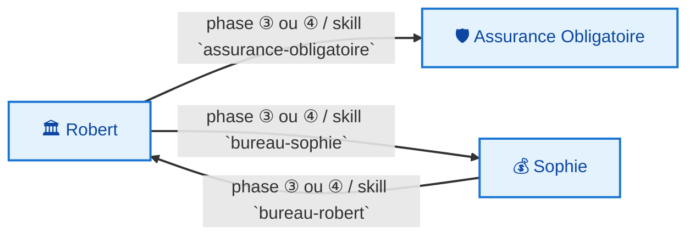
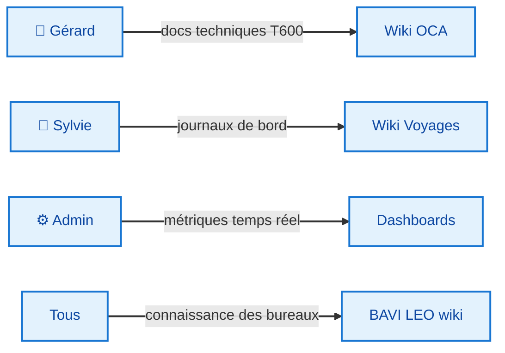

# BAVI LEO — Document Fondateur

> **Vision · Architecture · Audit · Skills**
> Document unique fusionné — v1.0 — 13 juin 2026

---

**BAVI LEO** (Bureaux Agentiques Virtuels — LEO) est un système de **bureaux IA spécialisés** propulsé par [Hermes Agent](https://hermes-agent.nousresearch.com). Chaque bureau est un agent Hermes dédié à un domaine métier (conseil IT, finance, documentation technique, voyages). Depuis Telegram, LEO route chaque demande vers le bon bureau et le bon modèle IA.

---

## 1. 🎯 Vision & Principes

### Pourquoi BAVI LEO ?

- **Un assistant, plusieurs métiers** — LEO parle à Christophe, mais les bureaux spécialisés apportent leur expertise
- **Évolutif** — ajouter un bureau = ajouter un skill + une page wiki. Pas de code à réécrire
- **Pas de friction** — un message Telegram suffit : `bureau-robert : analyse ce dossier`
- **Orchestré, pas délégué** — LEO reste le majordome qui décide quand et comment activer les bureaux

### Les 6 bureaux

| Bureau | Domaine | Accès |
|--------|---------|:-----:|
| 🏛️ **Robert** | Conseil IT stratégique — Solidaris | Telegram |
| 💰 **Sophie** | Pilotage économique & financier IT | Telegram |
| 🛡️ **Assurance Obligatoire** | Relecture métier AO — INAMI, BCSS | Telegram |
| 🔭 **Gérard** | Documentation technique T600 (OCA) | Telegram |
| 🧭 **Sylvie** | Voyages camping-car | Telegram |
| ⚙️ **LEO Admin** | Infrastructure Hermes, monitoring | Automatique |

### Routage intelligent

| Type de demande | Modèle | Usage |
|:---------------:|--------|-------|
| Quotidien, conversation | **DeepSeek Flash** | Tâches simples, questions |
| Analyse complexe | **DeepSeek Pro** | Installations, décisions techniques |
| Réflexion, prototypage | **Ollama (qwen2.5:7b)** | Tâches gratuites, tests |
| Fallback | **Gemini** | Si DeepSeek indisponible |

### Principes directeurs

1. **🔋 Zéro gaspillage tokens** — tâches techniques → exécution directe ; réflexion → Ollama local ; si insuffisant → Gemini ; DeepSeek pour l'essentiel
2. **🧠 Compartimentation** — chaque bureau a son périmètre, ses règles, ses experts. Aucun bureau n'empiete sur un autre
3. **📜 Transparence** — LEO explique ce qu'il a fait, pourquoi, et confirme avant les actions destructrices ou les envois d'email
4. **📈 Évolutivité** — ajouter un bureau = skill Hermes + page wiki + entrée navigation
5. **🔄 Auto-documentation** — le wiki est la mémoire du système. Toute évolution est documentée
6. **💵 DeepSeek budget** — coût par token suivi, alerte si tendance haussière. Budget v6 en français
7. **🏠 Ollama first** — privilégier l'inférence locale gratuite quand la qualité est suffisante
8. **🛡️ Sécurité emails** — LEO envoie depuis `leodanhieria@gmail.com` uniquement, jamais depuis le compte perso de Christophe

### Contraintes opérationnelles

- **Anti-régression** : 1 seul envoi email, pas de répétition, pas de réessai sans accord
- **Installations complexes** : Phase 1 (vérif environnement) → Phase 2 (test local) → Phase 3 (progression). STOP si bloqué en 1/2
- **DeepSeek Flash** : modèle par défaut pour le quotidien. Tâches lourdes → déléguer à **DeepSeek Pro**
- **Crons** : tous vers le chat Telegram de Christophe, jamais silencieux sans notification

---

## 2. 🏗️ Architecture

### Structure générale



### Niveaux d'abstraction

1. **LEO Agent** — point d'entrée unique, dialogue Telegram, orchestration
2. **Bureaux** — sous-agents spécialisés avec leur propre persona et règles métier
3. **Wiki** — documentation évolutive, déployée sur GitHub Pages
4. **Skills** — procédures réutilisables, connaissance procédurale

### Flux de demande

```
1. Christophe envoie un message Telegram
2. LEO analyse la demande → détermine le bureau cible
3. Si routé vers un bureau : charge le skill → exécute le workflow → retourne le résultat
4. Si tâche réflexive : Ollama local (qwen2.5:7b)
5. Si tâche complexe hors périmètre : DeepSeek Pro
6. Résultat formaté → retour Telegram
```

### Architecture technique

- **Hermes Agent** v0.16.0 dans un conteneur Docker
- **Réseau** : `network_mode: host` — partage pile réseau de l'hôte
- **Tailscale** : 100.92.102.28
- **Ollama** : qwen2.5:7b sur `http://100.92.102.28:11434/v1` (hôte, pas conteneur)
- **DeepSeek** : API cloud (Flash + Pro)
- **Gemini** : fallback API
- **Stockage** : `/opt/data` — 63G/457G utilisés (15%)
- **GitHub** : 5 repositories wikis + 4 dashboards
- **Domaine** : `*.github.io` (GitHub Pages)

### Arborescence wiki

```
docs/
├── index.md              ← Landing BAVI LEO
├── mkdocs.yml
└── wiki/
    ├── index.md          ← Entrée wiki
    ├── pro/              ← Robert, Sophie, AO
    ├── oca/              ← Gérard (T600)
    ├── voyages/          ← Sylvie
    └── general/          ← LEO Admin, Agent Pro
```

### Flux inter-bureaux



### Flux de livraison



### Workflow standardisé — 7 phases

Tous les bureaux suivent le même squelette :

```
① CADRAGE → ② DISPATCH → ③ PRODUCTION → ④ CROISEMENT → ⑤ SYNTHÈSE → ⑥ LIVRABLE → ⑦ ARCHIVAGE
```

---

## 3. 🔍 Audit & Analyse

### Forces du système

| Aspect | Évaluation |
|--------|:----------:|
| Vitesse de réponse Telegram | ⚡ < 2s (Flash) |
| Qualité bureaux spécialisés | ✅ Différence Robert vs Sophie claire |
| Routage intelligeant | ✅ Bon modèle pour chaque tâche |
| Documentation vivante | ✅ Wiki auto-déployé |
| Gestion des coûts API | ✅ Budget v6 français suivi |
| Fiabilité crons | ✅ 17 crons, tous verts |


### Leçons apprises

- **DeepSeek Flash** inadapté pour installations complexes → utiliser DeepSeek Pro
- **Process installation** : Phase 1 (vérif) → Phase 2 (test) → Phase 3 (scale). STOP si bloqué
- **Dashboard scripts** : `--allow-empty` + vérification return code obligatoire
- **n8n** : abandonné après échec login + workflow TRACE. `chatTrigger` inexistant en v2.26.7

---

## 4. 📚 Skills & Procédures

### Catalogue des skills

Les skills sont la **mémoire procédurale** de BAVI LEO — des approches réutilisables pour des tâches récurrentes.

| Skill | Catégorie | Usage |
|-------|-----------|-------|
| `budget-tracking` | productivity | Dashboard KPI LEO v6, format français, balance DeepSeek |
| `dashboard-kpi` | infrastructure | Dashboard SQLite → JSON, chart.js |
| `deepseek-pro` | infrastructure | Template délégation analyses complexes |
| `bureau-gerard` | software-development | Documentation T600 multi-agent |
| `hermes-agent` | autonomous-ai-agents | Config/extend Hermes Agent |
| `machine-metrics` | infrastructure | Dashboard 3 machines (LEO, Penguin, Yoga) |
| `routage-llm` | infrastructure | Règles routage DeepSeek Flash/Pro, Ollama, Gemini |
| `github-pr-workflow` | github | PR lifecycle complet |
| `living-documentation` | productivity | Doc auto-updating Google Docs/Drive |
| `systematic-debugging` | software-development | 4-phase root cause debugging |
| `test-driven-development` | software-development | RED-GREEN-REFACTOR |

### Créer un nouveau bureau/skill

1. **Rédiger le système prompt** du bureau (rôle, workflow, règles, format)
2. **Créer le skill Hermes** : `hermes skill create mon-bureau --file mon-bureau.md`
3. **Créer la page wiki** dans le dossier approprié (`pro/`, `voyages/`, etc.)
4. **Mettre à jour** `mkdocs.yml` pour l'indexer dans la navigation
5. **Commit & push** : `git add . && git commit -m "Nouveau bureau : X" && git push`

